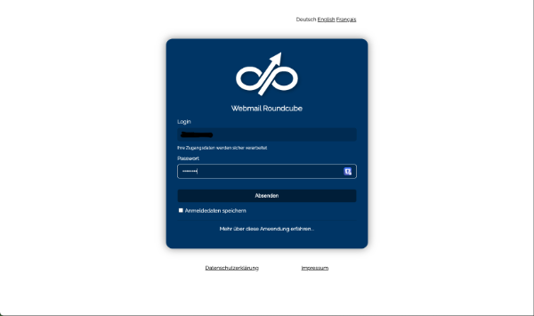
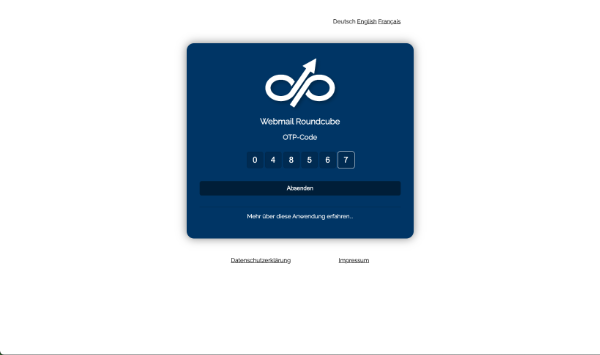

# Nauthilus

Nauthilus is a general purpose authentication service written in Go. It is designed to work as a central place where all kinds of 
authentication requests are handled. No matter if you need to authenticate users from a mail server or a web page. 
Services are connected to Nauthilus.

## Screenshots

This is an example of Nauthilus, how it is integrated in Dovecot and Roundcube.

### Login screen

### Entering TOTP code

## Official website

The documentation is found on [https://nauthilus.org](https://nauthilus.org).

The documentation itself is another project at [https://github.com/croessner/nauthilus-website](https://github.com/croessner/nauthilus-website).
Feel free to make it better! :-)

## License

This project is licensed under the GPLv3 License - see the [LICENSE](LICENSE) file for details.

> Note
> 
> The license has changed from AGPL-3 to GPL-3! This step is required to provide docker images.