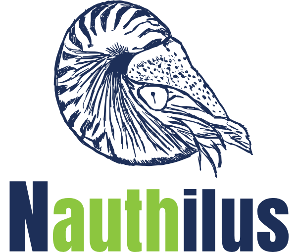

[](https://github.com/croessner/nauthilus/actions/workflows/build-stable.yaml)
[](https://github.com/croessner/nauthilus/actions/workflows/unit_tests.yaml)
[](https://github.com/croessner/nauthilus/actions/workflows/guardrails.yaml)
[](https://github.com/croessner/nauthilus/actions/workflows/lua_plugins_unit_tests.yaml)
[](https://github.com/croessner/nauthilus/actions/workflows/govulncheck-main.yaml)
[](https://github.com/croessner/nauthilus/actions/workflows/codeql.yml)
[](https://github.com/croessner/nauthilus/actions/workflows/docker-stable.yaml)
[](LICENSE)
[](https://go.dev/)



# Nauthilus

Nauthilus is an authentication and identity platform written in Go. It combines classic authentication for mail and web workloads with an integrated identity provider for OIDC and SAML, plus MFA, WebAuthn, LDAP, Lua-based policy logic, and Redis-backed state handling.

## Table of Contents

- [Overview](#overview)
- [Core Features](#core-features)
- [Architecture at a Glance](#architecture-at-a-glance)
- [Project Layout](#project-layout)
- [Build and Test](#build-and-test)
- [Documentation](#documentation)
- [Community](#community)
- [Commercial Support](#commercial-support)
- [License](#license)

## Overview

Nauthilus can be used as a central authentication service for infrastructure components such as mail servers, reverse proxies, and web applications. At the same time, it can act as a full identity provider with browser-based login and consent flows.

Typical use cases include:

- Central authentication for IMAP, SMTP, and HTTP-facing services
- LDAP-backed or Lua-driven authentication and authorization decisions
- OIDC and SAML identity provider flows for modern applications
- MFA enforcement with TOTP, WebAuthn, and recovery codes
- Token, session, and flow state management with Redis

## Core Features

- Integrated IdP with OIDC and SAML 2.0 support
- OIDC discovery, JWKS, userinfo, introspection, logout, device authorization, and consent flows
- SAML SSO and SLO support
- MFA with TOTP, WebAuthn, and recovery codes
- LDAP integration for identity and credential lookups
- Lua extensibility for custom backends, hooks, filters, and actions
- Redis-backed flow, session, and token storage
- Prometheus metrics and OpenTelemetry instrumentation
- Bundled test clients and contrib tooling for OIDC, SAML, IMAP, SMTP, LDAP, and Grafana

## Architecture at a Glance

- `server/` contains the main Nauthilus service
- `client/` contains a CSV-driven test and load client
- `contrib/oidctestclient/` and `contrib/saml2testclient/` provide protocol-specific test clients
- `server/lua-plugins.d/` contains reusable Lua modules and plugin entry points
- `IDP.md` documents the integrated identity provider in more detail

## Project Layout

```text
.
├── server/                 Main server
├── client/                 CSV-driven test/load client
├── contrib/                Additional tools, demos, and integrations
├── static/                 Static UI assets
├── testdata/               Test fixtures
├── IDP.md                  Integrated IdP documentation
├── Makefile                Common build and test targets
└── README.md               Project overview
```

## Build and Test

Requirement: Go 1.26

Build the main binaries:

```bash
make build
make build-client
```

Run tests:

```bash
GOEXPERIMENT=runtimesecret make test
GOEXPERIMENT=runtimesecret make race
```

Run the local guardrails:

```bash
make guardrails
```

## Documentation

- Project website: [https://nauthilus.org](https://nauthilus.org)
- Website/documentation repository: [https://github.com/croessner/nauthilus-website](https://github.com/croessner/nauthilus-website)
- Integrated IdP manual: [IDP.md](IDP.md)
- Test client documentation: [client/README.md](client/README.md)
- Lua plugin notes: [server/lua-plugins.d/README.md](server/lua-plugins.d/README.md)

## Community

Mailing lists are available at:

[https://lists.nauthilus.org](https://lists.nauthilus.org)

## Commercial Support

Commercial support for Nauthilus is available for integration, customization, and troubleshooting.

Further information is available at [https://nauthilus.org](https://nauthilus.org).

## License

This project is licensed under the GPLv3 License. See the [LICENSE](LICENSE) file for details.
