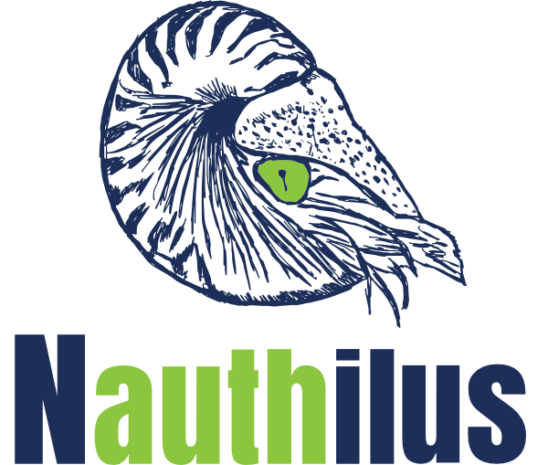

# Nauthilus

Nauthilus is a universal authentication and authorization platform written in Go, designed as a central hub to handle 
various authentication requests (e.g., from mail servers or websites). It appears to be aimed at both developers and 
users who are looking for a unified solution for authentication and authorization.

## Official website

The documentation is found on [https://nauthilus.org](https://nauthilus.org).

The documentation itself is another project at [https://github.com/croessner/nauthilus-website](https://github.com/croessner/nauthilus-website).
Feel free to make it better! :-)

## Community

You can subscribe to a mailing list. Available lists can be found here:

[https://lists.nauthilus.org](https://lists.nauthilus.org)

## Commercial support

If you are looking for professional and dedicated assistance with **Nauthilus**, commercial support is available.
This support ensures you have access to expert advice, guidance, and reliable solutions tailored to your specific
needs. Whether you require help with integration, troubleshooting, or customization, commercial support can provide
you with peace of mind by ensuring smooth operations.

If you are interested in purchasing commercial support for **Nauthilus**, please contact us for further details or
visit [https://nauthilus.org](https://nauthilus.org) for more information.
## License

This project is licensed under the GPLv3 License - see the [LICENSE](LICENSE) file for details.
