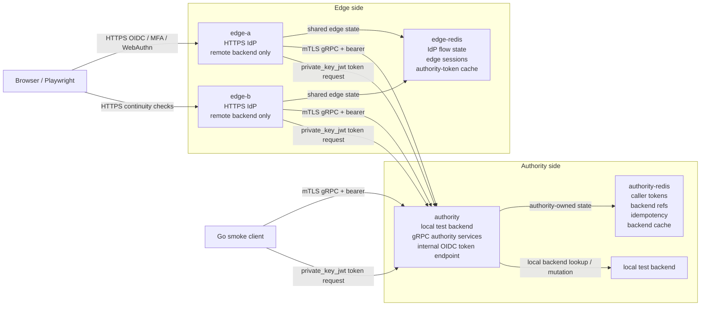
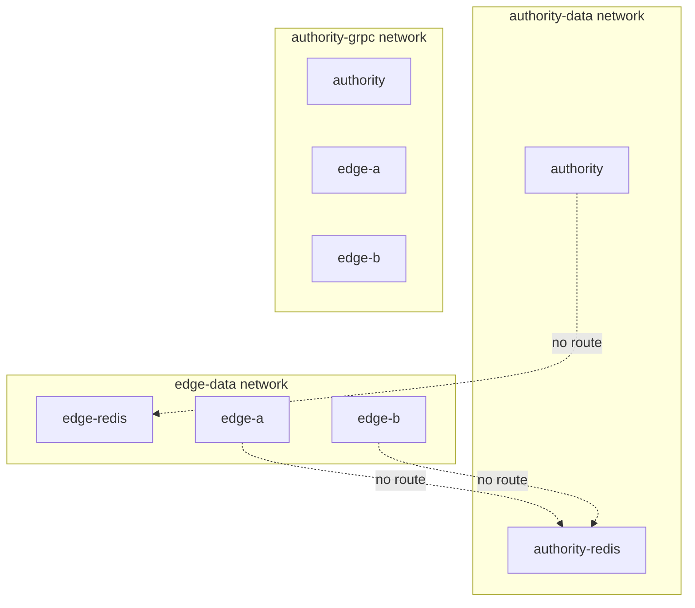
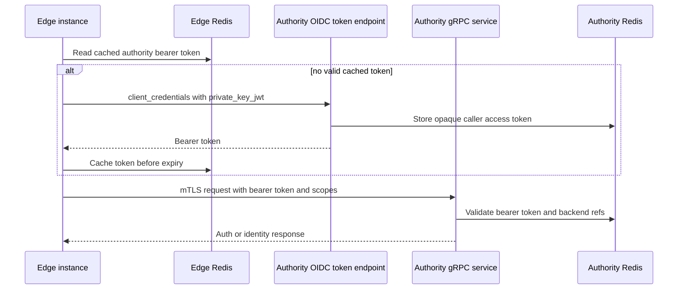
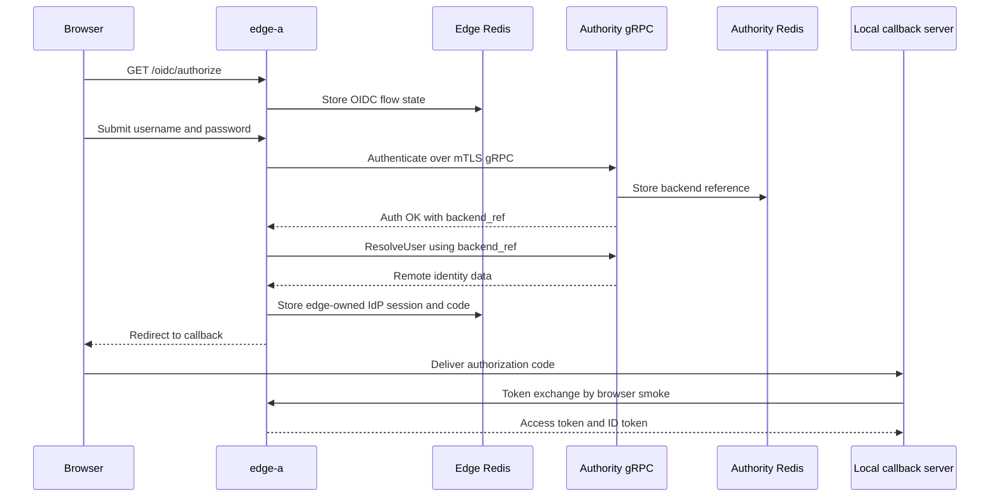
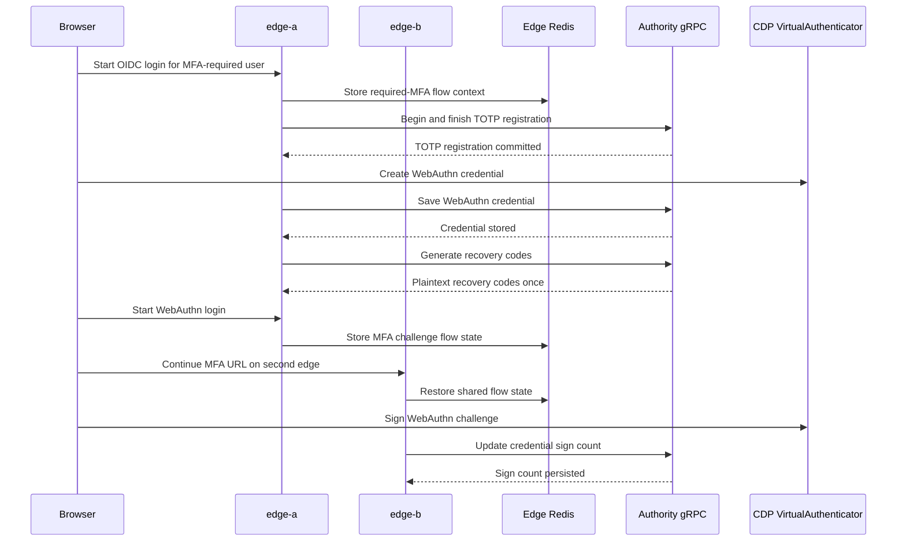

# Split Identity Proxy E2E

This directory contains an operator-facing smoke profile for a split Nauthilus deployment. It proves that public IdP traffic can terminate on edge instances while persistent identity, MFA, WebAuthn, backend references, caller tokens, idempotency outcomes, and backend cache state remain authority-owned.

The profile is intentionally local and repeatable. It uses Docker Compose, generated local certificates, generated local signing keys, a local `test` backend on the authority, two edge instances, and two separate Redis instances.

## What This Stack Proves

- The authority instance owns local identity backend access and exposes gRPC authority services.
- The edge instances are IdP frontends with `auth.backends.order: [remote]`.
- The edge instances contain no LDAP or Lua backend credentials.
- Authority Redis and edge Redis are separate services on separate Docker networks.
- Edge services cannot address authority Redis directly.
- The authority service cannot address edge Redis directly.
- Edge-to-authority gRPC uses mTLS, caller bearer tokens, operation scopes, backend references, and idempotency.
- OIDC authorization-code and device-code logins work through the edge with remote identity data.
- Required TOTP, recovery-code, and WebAuthn flows work through the edge and persist on the authority.
- WebAuthn browser automation uses a CDP virtual authenticator.
- WebAuthn sign-count updates are visible through authority-side state.
- A flow can start on `edge-a` and complete on `edge-b` through shared edge Redis.
- SAML SSO is wired as an optional browser scenario when an operator supplies a test SP URL.

## Topology



The Compose networks enforce the trust boundary:



## Communication Paths

### Authority Caller Token And gRPC



### OIDC Authorization Code Login



### Required MFA And WebAuthn



## Services And Ports

| Service | Role | Host port | Networks |
| --- | --- | --- | --- |
| `authority` | local backend owner, gRPC authority, caller-token issuer | `127.0.0.1:18081`, `127.0.0.1:19444` | `authority-data`, `authority-grpc` |
| `authority-redis` | authority-owned state | none | `authority-data` |
| `edge-a` | public edge IdP instance | `127.0.0.1:18080` | `edge-data`, `authority-grpc` |
| `edge-b` | second edge for continuity checks | `127.0.0.1:18082` | `edge-data`, `authority-grpc` |
| `edge-redis` | edge-owned flow/session/token-cache state | none | `edge-data` |

The browser smoke maps `split.example.test` and `authority.example.test` to `127.0.0.1` with Chromium host resolver rules. The WebAuthn RP ID is `split.example.test`, and the checked origins are `https://split.example.test:18080` and `https://split.example.test:18082`.

## Files

| Path | Purpose |
| --- | --- |
| `docker-compose.yml` | Defines the authority, two edges, two Redis instances, and Docker networks. |
| `config/authority.yml` | Authority profile with local `test` backend, gRPC authority listener, OIDC caller-token client, authority Redis. |
| `config/edge-a.yml` | First edge profile with remote-only backend, shared edge Redis, HTTPS IdP. |
| `config/edge-b.yml` | Second edge profile for continuity checks. |
| `cmd/smoke/main.go` | Go smoke client for direct gRPC checks, negative checks, idempotency, and post-browser WebAuthn sign-count readback. |
| `scripts/browser-e2e.js` | Playwright browser smoke for OIDC, device code, TOTP, recovery codes, WebAuthn, and multi-edge continuity. |
| `scripts/prepare-materials.sh` | Generates local CA, certificates, and signing keys into `.work/`. |
| `scripts/run.sh` | Operator command wrapper for preparing, starting, checking, smoking, and tearing down the stack. |
| `profile_test.go` | Fast structural tests for profile invariants. |
| `smoke-plan.yml` | Machine-readable list of positive, negative, topology, and continuity scenarios. |
| `package.json` | Local Playwright dependency and browser script entrypoint. |

## Prerequisites

- Docker with Compose support.
- Go toolchain compatible with the repository.
- Node.js and npm for the browser smoke.
- Chromium installed by Playwright for this local package.

Every Go validation command in this repository must use `GOEXPERIMENT=runtimesecret`.

## Quick Start

Install browser dependencies once:

```sh
npm --prefix contrib/identity-proxy-e2e install
npx --prefix contrib/identity-proxy-e2e playwright install chromium
```

Run the complete smoke:

```sh
GOEXPERIMENT=runtimesecret make identity-proxy-e2e
```

Clean up afterward:

```sh
contrib/identity-proxy-e2e/scripts/run.sh down
```

When the image has already been built and only the smoke should be repeated:

```sh
NAUTHILUS_E2E_SKIP_BUILD=1 contrib/identity-proxy-e2e/scripts/run.sh smoke
```

## Command Reference

| Command | Description |
| --- | --- |
| `contrib/identity-proxy-e2e/scripts/run.sh prepare` | Generate local certificates and signing keys under `.work/`. |
| `contrib/identity-proxy-e2e/scripts/run.sh profile-check` | Run fast structural Go checks against the checked-in configs and scripts. |
| `contrib/identity-proxy-e2e/scripts/run.sh build-image` | Build the current workspace image as `nauthilus:identity-proxy-e2e` unless overridden. |
| `contrib/identity-proxy-e2e/scripts/run.sh up` | Prepare material, build the image unless skipped, start the stack, and wait for readiness. |
| `contrib/identity-proxy-e2e/scripts/run.sh rpc` | Run pre-browser gRPC positive and negative checks. |
| `contrib/identity-proxy-e2e/scripts/run.sh redis-check` | Prove Redis network separation with cross-network `redis-cli` probes. |
| `contrib/identity-proxy-e2e/scripts/run.sh browser` | Run the Playwright IdP/MFA/WebAuthn smoke against an already running stack. |
| `contrib/identity-proxy-e2e/scripts/run.sh smoke` | Reset the stack, then run profile, startup, gRPC, Redis, browser, and post-browser checks. |
| `contrib/identity-proxy-e2e/scripts/run.sh down` | Stop and remove containers, networks, and volumes. |

## Smoke Flow

`run.sh smoke` executes these steps in order:

1. `profile-check`: verifies the static split-profile invariants.
2. `down -v`: removes any previous stack state for a clean run.
3. `up`: starts the authority, edges, and Redis services.
4. `rpc --mode pre-browser`: checks gRPC auth and negative cases before browser state exists.
5. `redis-check`: checks that authority Redis and edge Redis cannot reach each other.
6. `browser`: drives OIDC, device-code, TOTP, recovery-code, WebAuthn, and multi-edge flows.
7. `rpc --mode post-browser`: reads authority-side WebAuthn state and confirms sign-count advancement.

Expected successful output includes:

```text
ok grpc-authenticate
ok grpc-lookup-identity
ok grpc-list-accounts
ok grpc-resolve-user
ok recovery-code-generation-consumption
ok idempotency-replay
ok grpc-totp-registration
ok missing-caller-auth
ok missing-scope
ok expired-backend-ref
ok authority-unavailable
ok redis-network-separation-authority
ok redis-network-separation-edge
ok oidc-authorization-code-login
ok oidc-device-code-login
ok totp-registration
ok webauthn-registration
ok recovery-code-generation
ok webauthn-login
ok recovery-code-login
ok multi-edge-oidc-continuity
ok multi-edge-webauthn-continuity
ok authority-webauthn-sign-count
```

## SAML

The edge configs and smoke plan include SAML support, but this stack does not start a dedicated SAML SP. To include a browser SSO pass, start a compatible test SP separately and provide its login URL:

```sh
NAUTHILUS_E2E_SAML_URL=https://your-test-sp.example/login \
  contrib/identity-proxy-e2e/scripts/run.sh browser
```

When `NAUTHILUS_E2E_SAML_URL` is unset, the browser smoke prints a skip message. Set it to an empty string to suppress the SAML branch completely.

## Environment Variables

| Variable | Default | Description |
| --- | --- | --- |
| `NAUTHILUS_E2E_IMAGE` | `nauthilus:identity-proxy-e2e` | Image used by Docker Compose. |
| `NAUTHILUS_E2E_REDIS_IMAGE` | `redis:7-alpine` | Redis image used by Docker Compose. |
| `NAUTHILUS_E2E_SKIP_BUILD` | unset | Set to `1` to reuse the configured Nauthilus image. |
| `NAUTHILUS_E2E_FORCE` | unset | Set to `1` to regenerate `.work/` certificates and keys. |
| `NAUTHILUS_E2E_EDGE_A` | `https://split.example.test:18080` | Public browser URL for `edge-a`. |
| `NAUTHILUS_E2E_EDGE_B` | `https://split.example.test:18082` | Public browser URL for `edge-b`. |
| `NAUTHILUS_E2E_EDGE_A_API` | `https://127.0.0.1:18080` | Host API URL for token/device endpoints when browser DNS names are not needed. |
| `NAUTHILUS_E2E_CALLBACK_BIND_HOST` | `127.0.0.1` | Local bind address for the OIDC callback server used by the browser smoke. |
| `NAUTHILUS_E2E_CALLBACK_PUBLIC_HOST` | `split.example.test` | Hostname used in the OIDC redirect URI. |
| `NAUTHILUS_E2E_CALLBACK_PORT` | `19094` | Local callback HTTPS port. |
| `NAUTHILUS_E2E_CALLBACK_TIMEOUT_MS` | `90000` | Browser callback timeout. |
| `NAUTHILUS_E2E_CALLBACK_CERT` | `.work/certs/edge-http.crt` | Callback server certificate. |
| `NAUTHILUS_E2E_CALLBACK_KEY` | `.work/certs/edge-http.key` | Callback server private key. |
| `NAUTHILUS_E2E_USERNAME` | `split-user@example.test` | Base test username. |
| `NAUTHILUS_E2E_PASSWORD` | `split-password` | Test password used by the authority test backend. |
| `NAUTHILUS_E2E_STRICT_TLS` | unset | Set to `1` to keep Node TLS verification enabled. |
| `NAUTHILUS_E2E_HEADED` | unset | Set to `1` to run Chromium with a visible window. |
| `NAUTHILUS_E2E_TRACE` | unset | Set to `1` for extra browser smoke trace output. |
| `NAUTHILUS_E2E_SAML_URL` | unset | Optional SAML SP login URL. |

## Generated Material And Secrets

`scripts/prepare-materials.sh` writes generated local-only material to `contrib/identity-proxy-e2e/.work/`:

- local CA certificate and key;
- authority gRPC server certificate;
- edge HTTPS certificate;
- edge mTLS client certificate;
- authority OIDC signing key;
- edge service-principal private/public key pair.

`.work/` is ignored and should not be committed. The checked-in config files contain demo-only local secrets for repeatability; do not reuse them in a real deployment.

## Production Notes

This stack is a smoke profile, not a production deployment template. For production, replace all demo secrets, certificates, issuer values, token lifetimes, Redis credentials, network policies, and backend definitions. Keep the same security shape:

- edge IdP state belongs to edge Redis;
- authority backend state belongs to authority Redis;
- edge-to-authority traffic uses mTLS and authenticated caller tokens;
- remote backend operations are explicitly scoped;
- backend references are opaque authority-owned handles;
- public browser traffic terminates only on the intended edge endpoints.

## Troubleshooting

Docker access errors usually mean the local sandbox or user session cannot reach the Docker socket. Run the same command in a Docker-capable shell.

If Playwright is missing, install local dependencies:

```sh
npm --prefix contrib/identity-proxy-e2e install
npx --prefix contrib/identity-proxy-e2e playwright install chromium
```

If the stack reused stale key material, regenerate it:

```sh
NAUTHILUS_E2E_FORCE=1 contrib/identity-proxy-e2e/scripts/run.sh prepare
```

If a previous run left containers behind, reset the stack:

```sh
contrib/identity-proxy-e2e/scripts/run.sh down
contrib/identity-proxy-e2e/scripts/run.sh up
```

If local Go tests fail with a listener permission error such as `bind: operation not permitted`, rerun in an environment that allows local `httptest` listeners. This is an environment restriction, not an expected E2E profile failure.
