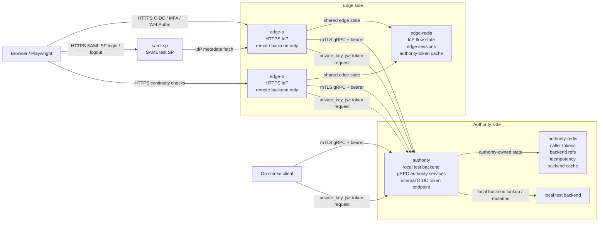
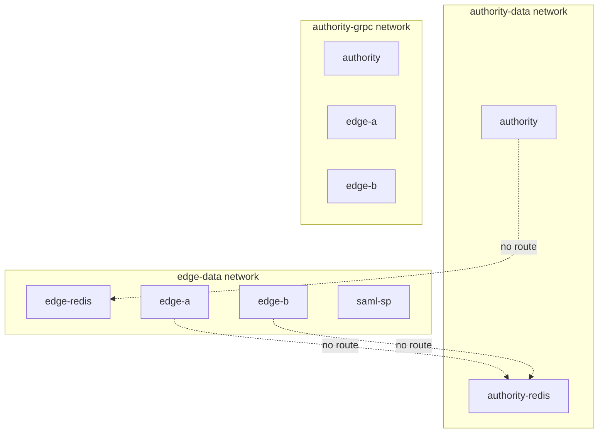
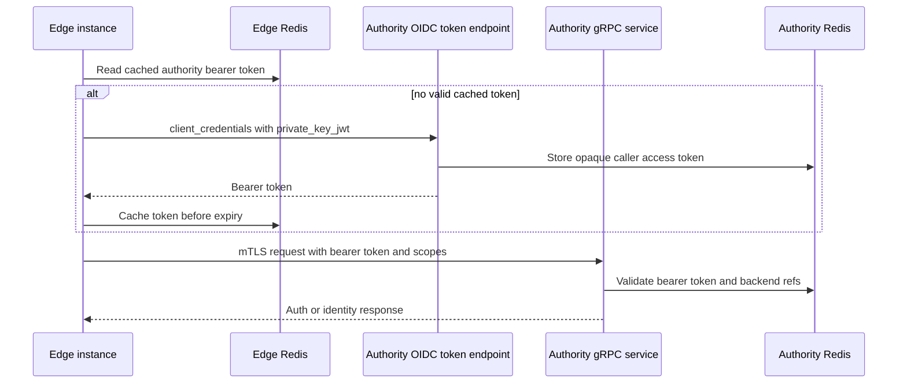
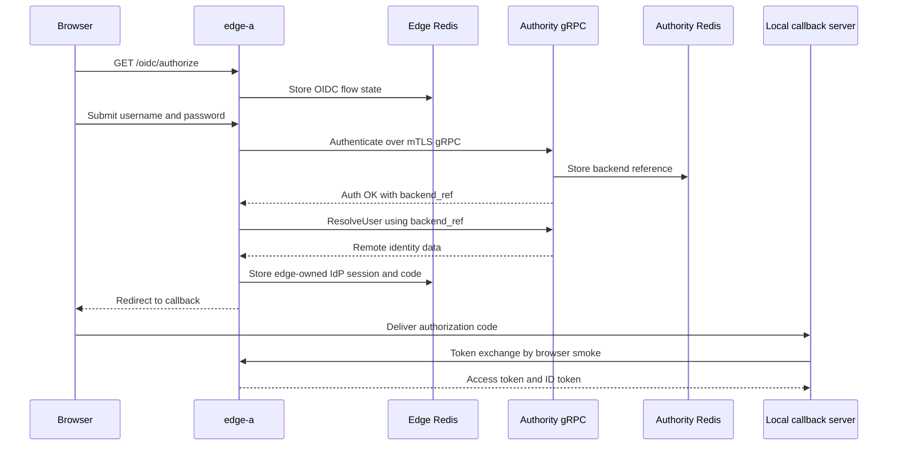
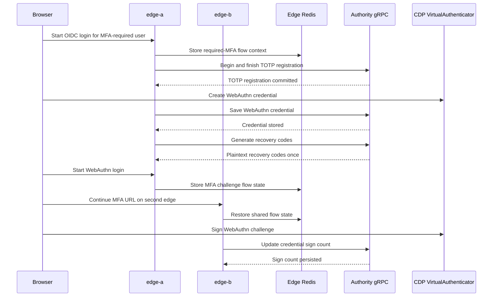

# Split Identity Proxy E2E

This directory contains an operator-facing smoke profile for a split Nauthilus deployment. It proves that public IdP traffic can terminate on edge instances while persistent identity, MFA, WebAuthn, backend references, caller tokens, idempotency outcomes, and backend cache state remain authority-owned.

The profile is intentionally local and repeatable. It uses Docker Compose, generated local certificates, generated local signing keys, a local `test` backend on the authority, two edge instances, and two separate Redis instances.

## What This Stack Proves

- The authority instance owns local identity backend access and exposes gRPC authority services.
- The edge instances are IdP frontends with `auth.backends.order: [remote]`.
- The edge instances contain no LDAP or Lua backend credentials.
- Authority Redis and edge Redis are separate services on separate Docker networks.
- Edge services cannot address authority Redis directly.
- The authority service cannot address edge Redis directly.
- Edge-to-authority gRPC uses mTLS, caller bearer tokens, operation scopes, backend references, and idempotency.
- OIDC authorization-code and device-code logins work through the edge with remote identity data.
- Negative IdP checks reject redirect smuggling, OAuth parameter pollution, bad client auth, PKCE misuse, refresh-token misuse, CSRF/session attacks, and device-code abuse.
- Required TOTP, recovery-code, and WebAuthn flows work through the edge and persist on the authority.
- Negative WebAuthn checks reject missing credentials, tampered assertions, wrong challenges/origins, unknown credentials, replayed assertions, and sign-count rollback.
- WebAuthn browser automation uses a CDP virtual authenticator.
- WebAuthn sign-count updates are visible through authority-side state.
- A flow can start on `edge-a` and complete on `edge-b` through shared edge Redis.
- SAML SSO and SP-initiated SLO work through a local test SP by default.
- SAML live negative checks reject malformed SSO input and bad SLO payload shape.

## Topology



The Compose networks enforce the trust boundary:



## Communication Paths

### Authority Caller Token And gRPC



### OIDC Authorization Code Login



### Required MFA And WebAuthn



## Services And Ports

| Service           | Role                                                     | Host port                            | Networks                           |
|-------------------|----------------------------------------------------------|--------------------------------------|------------------------------------|
| `authority`       | local backend owner, gRPC authority, caller-token issuer | `127.0.0.1:18081`, `127.0.0.1:19444` | `authority-data`, `authority-grpc` |
| `authority-redis` | authority-owned state                                    | none                                 | `authority-data`                   |
| `edge-a`          | public edge IdP instance                                 | `127.0.0.1:18080`                    | `edge-data`, `authority-grpc`      |
| `edge-b`          | second edge for continuity checks                        | `127.0.0.1:18082`                    | `edge-data`, `authority-grpc`      |
| `edge-redis`      | edge-owned flow/session/token-cache state                | none                                 | `edge-data`                        |

The browser smoke maps `split.example.test` and `authority.example.test` to `127.0.0.1` with Chromium host resolver rules. The WebAuthn RP ID is `split.example.test`, and the checked origins are `https://split.example.test:18080` and `https://split.example.test:18082`.

## Files

| Path                           | Purpose                                                                                                              |
|--------------------------------|----------------------------------------------------------------------------------------------------------------------|
| `docker-compose.yml`           | Defines the authority, two edges, two Redis instances, and Docker networks.                                          |
| `config/authority.yml`         | Authority profile with local `test` backend, gRPC authority listener, OIDC caller-token client, authority Redis.     |
| `config/edge-a.yml`            | First edge profile with remote-only backend, shared edge Redis, HTTPS IdP.                                           |
| `config/edge-b.yml`            | Second edge profile for continuity checks.                                                                           |
| `cmd/smoke/main.go`            | Go smoke client for direct gRPC checks, negative checks, idempotency, and post-browser WebAuthn sign-count readback. |
| `scripts/browser-e2e.js`       | Playwright browser smoke for OIDC, device code, TOTP, recovery codes, WebAuthn, and multi-edge continuity.           |
| `scripts/prepare-materials.sh` | Generates local CA, certificates, and signing keys into `.work/`.                                                    |
| `scripts/run.sh`               | Operator command wrapper for preparing, starting, checking, smoking, and tearing down the stack.                     |
| `profile_test.go`              | Fast structural tests for profile invariants.                                                                        |
| `smoke-plan.yml`               | Machine-readable list of positive, negative, topology, and continuity scenarios.                                     |
| `package.json`                 | Local Playwright dependency and browser script entrypoint.                                                           |

## Prerequisites

- Docker with Compose support.
- Go toolchain compatible with the repository.
- Node.js and npm for the browser smoke.
- Chromium installed by Playwright for this local package.

Every Go validation command in this repository must use `GOEXPERIMENT=runtimesecret`.

## Quick Start

Install browser dependencies once:

```sh
npm --prefix contrib/identity-proxy-e2e install
npx --prefix contrib/identity-proxy-e2e playwright install chromium
```

Run the complete smoke:

```sh
GOEXPERIMENT=runtimesecret make identity-proxy-e2e
```

Clean up afterward:

```sh
contrib/identity-proxy-e2e/scripts/run.sh down
```

When the image has already been built and only the smoke should be repeated:

```sh
NAUTHILUS_E2E_SKIP_BUILD=1 contrib/identity-proxy-e2e/scripts/run.sh smoke
```

## Command Reference

| Command                                                   | Description                                                                                |
|-----------------------------------------------------------|--------------------------------------------------------------------------------------------|
| `contrib/identity-proxy-e2e/scripts/run.sh prepare`       | Generate local certificates and signing keys under `.work/`.                               |
| `contrib/identity-proxy-e2e/scripts/run.sh profile-check` | Run fast structural Go checks against the checked-in configs and scripts.                  |
| `contrib/identity-proxy-e2e/scripts/run.sh build-image`   | Build the current workspace image as `nauthilus:identity-proxy-e2e` unless overridden.     |
| `contrib/identity-proxy-e2e/scripts/run.sh up`            | Prepare material, build the image unless skipped, start the stack, and wait for readiness. |
| `contrib/identity-proxy-e2e/scripts/run.sh rpc`           | Run pre-browser gRPC and generated OpenAPI management checks.                              |
| `contrib/identity-proxy-e2e/scripts/run.sh redis-check`   | Prove Redis network separation with cross-network `redis-cli` probes.                      |
| `contrib/identity-proxy-e2e/scripts/run.sh browser`       | Run the Playwright IdP/MFA/WebAuthn smoke against an already running stack.                |
| `contrib/identity-proxy-e2e/scripts/run.sh smoke`         | Reset the stack, then run profile, startup, gRPC, Redis, browser, and post-browser checks. |
| `contrib/identity-proxy-e2e/scripts/run.sh down`          | Stop and remove containers, networks, and volumes.                                         |

## Smoke Flow

`run.sh smoke` executes these steps in order:

1. `profile-check`: verifies the static split-profile invariants.
2. `down -v`: removes any previous stack state for a clean run.
3. `up`: starts the authority, edges, local SAML SP, and Redis services.
4. `rpc --mode pre-browser`: checks gRPC auth, generated OpenAPI management usage, and negative cases before browser state exists.
5. `redis-check`: checks that authority Redis and edge Redis cannot reach each other.
6. `browser`: drives positive and negative OIDC, device-code, TOTP, recovery-code, WebAuthn, SAML, and multi-edge flows.
7. `rpc --mode post-browser`: reads authority-side WebAuthn state and confirms sign-count advancement.

Expected successful output includes:

```text
ok grpc-authenticate
ok grpc-lookup-identity
ok grpc-list-accounts
ok grpc-resolve-user
ok recovery-code-generation-consumption
ok idempotency-replay
ok grpc-totp-registration
ok openapi-management-cache-flush-async-status
ok missing-caller-auth
ok missing-scope
ok expired-backend-ref
ok authority-unavailable
ok redis-network-separation-authority
ok redis-network-separation-edge
ok oidc-authorization-code-login
ok oidc-authorize-invalid-response-type
ok oidc-authorize-invalid-client
ok oidc-authorize-invalid-redirect-uri
ok oidc-authorize-protocol-relative-redirect-uri
ok oidc-authorize-encoded-redirect-smuggling-rejected
ok oidc-authorize-double-encoded-redirect-rejected
ok oidc-authorize-backslash-redirect-rejected
ok oidc-authorize-mixed-case-host-redirect-rejected
ok oidc-authorize-trailing-dot-host-redirect-rejected
ok oidc-authorize-userinfo-redirect-rejected
ok oidc-authorize-dot-segment-redirect-rejected
ok oidc-authorize-duplicate-redirect-uri-rejected
ok oidc-authorize-response-type-mix-rejected
ok oidc-authorize-response-type-none-rejected
ok oidc-authorize-response-type-id-token-rejected
ok oidc-authorize-pkce-plain-rejected
ok oidc-authorize-prompt-none-login-required
ok oidc-login-direct-access-rejected
ok oidc-login-invalid-password
ok oidc-consent-denied
ok oidc-login-csrf-missing-rejected
ok oidc-login-csrf-foreign-token-rejected
ok oidc-consent-csrf-missing-rejected
ok oidc-consent-csrf-foreign-token-rejected
ok oidc-session-tampered-cookie-rejected
ok oidc-session-fixation-cookie-ignored
ok oidc-flow-replay-after-callback-rejected
ok oidc-cross-edge-flow-replay-after-callback-rejected
ok oidc-token-invalid-client-secret
ok oidc-token-invalid-code
ok oidc-token-unsupported-grant
ok oidc-token-json-body-rejected
ok oidc-token-duplicate-client-id-rejected
ok oidc-token-duplicate-code-rejected
ok oidc-token-duplicate-redirect-uri-rejected
ok oidc-token-combined-client-auth-rejected
ok oidc-token-redirect-mismatch-rejected
ok oidc-token-pkce-missing-verifier-rejected
ok oidc-token-pkce-wrong-verifier-rejected
ok oidc-token-code-client-confusion-rejected
ok oidc-token-code-reuse-rejected
ok oidc-token-refresh-client-mismatch-rejected
ok oidc-token-refresh-reuse-rejected
ok oidc-token-refresh-after-logout-rejected
ok oidc-introspect-invalid-client-secret
ok oidc-introspect-alg-none-token-inactive
ok oidc-introspect-unknown-kid-token-inactive
ok oidc-revoke-endpoint-not-exposed
ok oidc-discovery-metadata-consistent
ok oidc-userinfo-missing-token
ok oidc-userinfo-invalid-token
ok oidc-device-missing-client
ok oidc-device-invalid-client
ok oidc-device-unsupported-client
ok oidc-device-token-authorization-pending
ok oidc-device-token-slow-down
ok oidc-device-token-expired-code
ok oidc-device-token-client-mismatch-rejected
ok oidc-device-invalid-user-code
ok oidc-device-unicode-user-code-rejected
ok oidc-device-user-code-bruteforce-rejected
ok oidc-device-token-consent-denied
ok oidc-device-consent-denied
ok oidc-device-code-login
ok oidc-device-token-reuse-rejected
ok totp-registration
ok webauthn-registration
ok recovery-code-generation
ok master-user-mfa-registration
ok oidc-webauthn-missing-credential
ok oidc-webauthn-tampered-assertion
ok oidc-webauthn-wrong-challenge
ok oidc-webauthn-wrong-origin
ok oidc-webauthn-unknown-credential
ok oidc-totp-invalid-code
ok oidc-recovery-invalid-code
ok oidc-totp-login
ok oidc-delayed-response-totp-login
ok oidc-delayed-response-totp-wrong-password-rejected
ok webauthn-login
ok oidc-delayed-response-webauthn-login
ok oidc-master-user-totp-login
ok oidc-delayed-response-master-user-totp-login
ok oidc-delayed-response-master-user-totp-wrong-password-rejected
ok oidc-master-user-without-mfa-login
ok oidc-delayed-response-master-user-without-mfa-login
ok oidc-master-user-webauthn-login
ok oidc-delayed-response-master-user-webauthn-login
ok oidc-webauthn-replay-assertion
ok oidc-webauthn-sign-count-rollback
ok recovery-code-login
ok oidc-recovery-code-reuse-rejected
ok multi-edge-oidc-continuity
ok multi-edge-webauthn-continuity
ok saml-sso-login
ok saml-sp-initiated-slo
ok saml-sso-malformed-request-rejected
ok saml-slo-missing-payload-rejected
ok saml-slo-ambiguous-payload-rejected
ok saml-slo-duplicate-request-rejected
ok authority-webauthn-sign-count
```

## Scenario Matrix

| Scenario                                              | Layer                         | Attack / risk                                                                                                                                                 | Expected behavior                                                                                                                                                                     |
|-------------------------------------------------------|-------------------------------|---------------------------------------------------------------------------------------------------------------------------------------------------------------|---------------------------------------------------------------------------------------------------------------------------------------------------------------------------------------|
| `profile-check`                                       | Static Go test                | Configuration drift could collapse the split trust model before runtime tests even start.                                                                     | The checked-in profiles keep authority and edge concerns separate, require remote-only edge backends, use mTLS/caller bearer scopes, and configure the virtual-authenticator harness. |
| `grpc-authenticate`                                   | Authority gRPC                | Positive baseline for the edge-to-authority authentication path.                                                                                              | A valid edge caller token can authenticate the smoke user through the authority-owned backend and receives an opaque backend reference.                                               |
| `grpc-lookup-identity`                                | Authority gRPC                | Positive baseline for scoped identity lookup without password verification.                                                                                   | A scoped caller can perform identity lookup without password verification and receives an authority-owned backend reference.                                                          |
| `grpc-list-accounts`                                  | Authority gRPC                | Positive baseline that account enumeration remains authority-owned.                                                                                           | A scoped caller can list accounts through the authority, proving account enumeration stays on the backend owner.                                                                      |
| `grpc-resolve-user`                                   | Authority gRPC                | Positive baseline that opaque backend references can be resolved only by the authority.                                                                       | A valid backend reference can be resolved into released identity attributes.                                                                                                          |
| `openapi-management-cache-flush-async-status`         | Authority management OpenAPI  | Drift between published OpenAPI management contracts and real external consumer code could leave the generated client usable only in compile-only tests.       | The Go smoke uses the supported generated OpenAPI client to enqueue an async cache flush and poll the returned job ID until `DONE`.                                                   |
| `recovery-code-generation-consumption`                | Authority gRPC MFA            | Positive baseline for authority-owned recovery-code lifecycle and one-time use.                                                                               | Recovery codes are generated by the authority and one code can be consumed exactly once.                                                                                              |
| `idempotency-replay`                                  | Authority gRPC MFA            | A caller replays a mutating MFA request with the same idempotency key to force duplicate side effects.                                                        | Reusing the same mutating idempotency key is rejected with `AlreadyExists`.                                                                                                           |
| `grpc-totp-registration`                              | Authority gRPC MFA            | Positive baseline for authority-owned TOTP registration state.                                                                                                | TOTP begin/finish works through authority-owned state.                                                                                                                                |
| `missing-caller-auth`                                 | Authority gRPC negative       | An unauthenticated caller tries to invoke authority services directly.                                                                                        | Requests without caller auth fail with `Unauthenticated`.                                                                                                                             |
| `missing-scope`                                       | Authority gRPC negative       | A valid caller token is used for an operation outside its allowed scopes.                                                                                     | Requests with a caller token that lacks the operation scope fail with `PermissionDenied`.                                                                                             |
| `expired-backend-ref`                                 | Authority gRPC negative       | A stale or fabricated backend reference is replayed after the authority no longer knows it.                                                                   | Unknown or expired backend references fail closed with `FailedPrecondition`.                                                                                                          |
| `authority-unavailable`                               | Authority gRPC negative       | The authority dependency is unavailable; the edge must not invent a success response.                                                                         | Calls to an unavailable authority endpoint fail with `Unavailable`.                                                                                                                   |
| `redis-network-separation-authority`                  | Compose topology              | Lateral movement from the authority network into edge-owned Redis state is attempted.                                                                         | Authority Redis cannot reach edge Redis across Compose networks.                                                                                                                      |
| `redis-network-separation-edge`                       | Compose topology              | Lateral movement from edge instances into authority-owned Redis state is attempted.                                                                           | Edge Redis cannot reach authority Redis across Compose networks.                                                                                                                      |
| `oidc-authorization-code-login`                       | Browser OIDC                  | Positive baseline for the normal authorization-code flow.                                                                                                     | A valid authorization-code login through `edge-a` returns an authorization code, access token, and ID token.                                                                          |
| `oidc-authorize-invalid-response-type`                | OIDC authorize negative       | A client requests an unsupported OAuth/OIDC flow shape to bypass the authorization-code-only policy.                                                          | Unsupported response types are rejected with HTTP 400 and no login flow is started.                                                                                                   |
| `oidc-authorize-invalid-client`                       | OIDC authorize negative       | An unknown client tries to start an IdP flow and receive a redirect.                                                                                          | Unknown `client_id` values are rejected with HTTP 400.                                                                                                                                |
| `oidc-authorize-invalid-redirect-uri`                 | OIDC authorize negative       | Open-redirect attempt with a callback outside the registered allow-list.                                                                                      | Redirect URIs outside the registered allow-list are rejected with HTTP 400.                                                                                                           |
| `oidc-authorize-protocol-relative-redirect-uri`       | OIDC authorize negative       | Protocol-relative URLs such as `//evil.example` try to let the browser supply the scheme and escape to another host.                                          | Protocol-relative redirect URIs are rejected with HTTP 400 before browser normalization can turn them into external redirects.                                                        |
| `oidc-authorize-encoded-redirect-smuggling-rejected`  | OIDC authorize negative       | Percent-encoded redirect payloads try to hide a protocol-relative or external host until a later decode step.                                                 | Encoded protocol-relative redirect attempts are rejected before a login flow is created.                                                                                              |
| `oidc-authorize-double-encoded-redirect-rejected`     | OIDC authorize negative       | Double-encoding tries to survive the first validation pass and become dangerous after a second decode.                                                        | Double-encoded redirect-smuggling payloads are rejected instead of being normalized into a trusted callback.                                                                          |
| `oidc-authorize-backslash-redirect-rejected`          | OIDC authorize negative       | Backslash URL confusion tries to exploit parser differences between server validation and browser navigation.                                                 | Backslash-based URL confusion payloads are rejected with HTTP 400.                                                                                                                    |
| `oidc-authorize-mixed-case-host-redirect-rejected`    | OIDC authorize negative       | A non-canonical host variant tries to widen exact redirect matching.                                                                                          | Host casing that does not exactly match the allow-list is rejected.                                                                                                                   |
| `oidc-authorize-trailing-dot-host-redirect-rejected`  | OIDC authorize negative       | A trailing-dot FQDN variant tries to bypass exact host allow-list checks.                                                                                     | Trailing-dot host variants are rejected and cannot bypass exact redirect matching.                                                                                                    |
| `oidc-authorize-userinfo-redirect-rejected`           | OIDC authorize negative       | A user-info URL such as `trusted.example@evil.example` tries to make the trusted name appear before the real host.                                            | User-info host confusion is rejected.                                                                                                                                                 |
| `oidc-authorize-dot-segment-redirect-rejected`        | OIDC authorize negative       | Path normalization with `.` or `..` segments tries to turn an unregistered path into a registered callback after validation.                                  | Dot-segment redirect paths are rejected when they are not exactly registered.                                                                                                         |
| `oidc-authorize-duplicate-redirect-uri-rejected`      | OIDC authorize negative       | OAuth parameter pollution sends multiple `redirect_uri` values and hopes different components pick different ones.                                            | Duplicate `redirect_uri` parameters are rejected instead of accepting the first or last value.                                                                                        |
| `oidc-authorize-response-type-mix-rejected`           | OIDC authorize negative       | Hybrid response types such as `code token` try to enable implicit-token issuance through the authorize endpoint.                                              | Hybrid response-type mixes are rejected; only authorization code is supported.                                                                                                        |
| `oidc-authorize-response-type-none-rejected`          | OIDC authorize negative       | `response_type=none` tries to create an authorization response without issuing a code.                                                                        | `response_type=none` is rejected with HTTP 400.                                                                                                                                       |
| `oidc-authorize-response-type-id-token-rejected`      | OIDC authorize negative       | Implicit-flow `id_token` requests try to bypass the code/token exchange and PKCE path.                                                                        | Implicit-flow style `id_token` authorization requests are rejected.                                                                                                                   |
| `oidc-authorize-pkce-plain-rejected`                  | OIDC authorize negative       | PKCE downgrade attack asks for `plain` so a stolen challenge can also be the verifier.                                                                        | PKCE `plain` is rejected; only S256 is accepted and advertised.                                                                                                                       |
| `oidc-authorize-prompt-none-login-required`           | Browser OIDC negative         | Silent-login probing tries to learn or create authentication state without user interaction.                                                                  | `prompt=none` without an existing session redirects to the client with `error=login_required` and preserves `state`.                                                                  |
| `oidc-login-direct-access-rejected`                   | Browser IdP negative          | Direct endpoint probing hits `/login` without a valid OIDC flow cookie or flow reference.                                                                     | Direct `/login` access without a valid IdP flow returns HTTP 400 and renders an invalid-request page.                                                                                 |
| `oidc-login-invalid-password`                         | Browser IdP negative          | Password guessing tries to advance the flow with bad credentials.                                                                                             | A bad password stays on the login flow and renders `Invalid login or password`; no authorization callback is reached.                                                                 |
| `oidc-consent-denied`                                 | Browser OIDC negative         | User denial must not be ignored or converted into a valid authorization code.                                                                                 | Denying consent returns HTTP 403 with `Consent denied`; no authorization code is issued.                                                                                              |
| `oidc-login-csrf-missing-rejected`                    | Browser CSRF negative         | A forged login POST omits the CSRF proof and relies on the victim's cookies.                                                                                  | Login form submission without the CSRF token returns HTTP 400.                                                                                                                        |
| `oidc-login-csrf-foreign-token-rejected`              | Browser CSRF negative         | A token copied from another browser session is replayed into the victim's login flow.                                                                         | A CSRF token copied from another browser session is rejected.                                                                                                                         |
| `oidc-consent-csrf-missing-rejected`                  | Browser CSRF negative         | A forged consent POST attempts to approve scopes without the consent form token.                                                                              | Consent submission without the CSRF token returns HTTP 400.                                                                                                                           |
| `oidc-consent-csrf-foreign-token-rejected`            | Browser CSRF negative         | A consent CSRF token from another session is replayed to approve the current flow.                                                                            | Consent submission with a CSRF token from another browser session is rejected.                                                                                                        |
| `oidc-session-tampered-cookie-rejected`               | Browser session negative      | A forged `secure_data` cookie tries to inject arbitrary session or flow state.                                                                                | The forged cookie is ignored and direct `/login` remains invalid.                                                                                                                     |
| `oidc-session-fixation-cookie-ignored`                | Browser session negative      | A pre-seeded attacker session cookie tries to steer the victim into attacker-controlled state.                                                                | The invalid fixed cookie cannot steer the login; the IdP creates fresh flow state and completes normally.                                                                             |
| `oidc-flow-replay-after-callback-rejected`            | Browser session negative      | A completed authorization flow is replayed on `edge-a` to attempt a second code or a login loop.                                                              | A completed authorization flow cannot be replayed through `/login` on `edge-a`.                                                                                                       |
| `oidc-cross-edge-flow-replay-after-callback-rejected` | Browser session negative      | A completed flow from one edge is replayed through the second edge to abuse shared edge state.                                                                | A completed authorization flow cannot be replayed through `/login` on `edge-b`.                                                                                                       |
| `oidc-token-invalid-client-secret`                    | OIDC token negative           | Client-secret guessing attempts to redeem codes or call token operations as a confidential client.                                                            | A wrong client secret returns HTTP 401 with `invalid_client`.                                                                                                                         |
| `oidc-token-invalid-code`                             | OIDC token negative           | A forged or unknown authorization code is submitted to the token endpoint.                                                                                    | A nonexistent authorization code returns HTTP 400 with `invalid_grant`.                                                                                                               |
| `oidc-token-unsupported-grant`                        | OIDC token negative           | Grant-confusion attempts ask the token endpoint to process an unsupported grant type.                                                                         | Unsupported grant types return HTTP 400 with `unsupported_grant_type`.                                                                                                                |
| `oidc-token-json-body-rejected`                       | OIDC token negative           | Content-type/body-parser confusion sends OAuth parameters as JSON instead of form data.                                                                       | JSON token requests are rejected because the endpoint only accepts form-encoded OAuth parameters.                                                                                     |
| `oidc-token-duplicate-client-id-rejected`             | OIDC token negative           | Parameter pollution sends multiple `client_id` values so auth and grant validation might disagree.                                                            | Duplicate `client_id` form parameters are rejected with `invalid_request`.                                                                                                            |
| `oidc-token-duplicate-code-rejected`                  | OIDC token negative           | Parameter pollution sends multiple authorization codes and hopes different handlers pick different values.                                                    | Duplicate authorization `code` form parameters are rejected with `invalid_request`.                                                                                                   |
| `oidc-token-duplicate-redirect-uri-rejected`          | OIDC token negative           | Parameter pollution sends multiple `redirect_uri` values to bypass code-to-redirect binding.                                                                  | Duplicate `redirect_uri` form parameters are rejected with `invalid_request`.                                                                                                         |
| `oidc-token-combined-client-auth-rejected`            | OIDC token negative           | Ambiguous client authentication supplies HTTP Basic and form credentials at the same time.                                                                    | Supplying both HTTP Basic and form client authentication is rejected with HTTP 401 and `invalid_client`.                                                                              |
| `oidc-token-redirect-mismatch-rejected`               | OIDC token negative           | A stolen valid code is redeemed with a different callback URI than the one used at authorization time.                                                        | The token endpoint returns HTTP 400 and `invalid_grant`.                                                                                                                              |
| `oidc-token-pkce-missing-verifier-rejected`           | OIDC token negative           | A PKCE-bound code is redeemed without proving possession of the verifier.                                                                                     | A PKCE-bound authorization code cannot be redeemed without a `code_verifier`.                                                                                                         |
| `oidc-token-pkce-wrong-verifier-rejected`             | OIDC token negative           | A PKCE-bound code is redeemed with a guessed or substituted verifier.                                                                                         | A PKCE-bound authorization code cannot be redeemed with a wrong verifier.                                                                                                             |
| `oidc-token-code-client-confusion-rejected`           | OIDC token negative           | A code issued to one client is redeemed by another valid client to steal authorization.                                                                       | The token endpoint returns HTTP 400 and `invalid_grant`.                                                                                                                              |
| `oidc-token-code-reuse-rejected`                      | OIDC token negative           | A captured authorization code is replayed after it has already been exchanged once.                                                                           | Reusing an authorization code after a successful exchange returns HTTP 400 and `invalid_grant`.                                                                                       |
| `oidc-token-refresh-client-mismatch-rejected`         | OIDC token negative           | A refresh token stolen from one client is presented by another client.                                                                                        | A refresh token issued to one client cannot be used by another client.                                                                                                                |
| `oidc-token-refresh-reuse-rejected`                   | OIDC token negative           | A rotated refresh token is replayed after the replacement token has been issued.                                                                              | A rotated refresh token cannot be reused.                                                                                                                                             |
| `oidc-token-refresh-after-logout-rejected`            | OIDC token negative           | A previously valid refresh token is replayed after logout and server-side revocation.                                                                         | Logout revokes the user's refresh tokens; later refresh attempts fail with `invalid_grant`.                                                                                           |
| `oidc-introspect-invalid-client-secret`               | OIDC introspection negative   | Unauthorized clients try to introspect tokens by guessing a confidential client's secret.                                                                     | Introspection with a wrong client secret returns HTTP 401 and `invalid_client`.                                                                                                       |
| `oidc-introspect-alg-none-token-inactive`             | OIDC introspection negative   | The classic unsigned JWT trick tries to make `alg=none` look like a valid token.                                                                              | Unsigned `alg=none` JWT-like tokens are treated as inactive.                                                                                                                          |
| `oidc-introspect-unknown-kid-token-inactive`          | OIDC introspection negative   | Key-confusion attempts use a fake `kid` so the verifier might choose the wrong or missing key.                                                                | JWT-like tokens with an unknown signing key ID are treated as inactive.                                                                                                               |
| `oidc-revoke-endpoint-not-exposed`                    | OIDC metadata negative        | Unexpected endpoint exposure would widen the public attack surface.                                                                                           | The smoke confirms that an unimplemented revocation endpoint is not accidentally exposed.                                                                                             |
| `oidc-discovery-metadata-consistent`                  | OIDC metadata                 | Metadata drift could advertise insecure client behavior or wrong public edge endpoints.                                                                       | Discovery points to the public edge issuer/endpoints and advertises S256 but not PKCE plain.                                                                                          |
| `oidc-userinfo-missing-token`                         | UserInfo negative             | A caller probes UserInfo without any bearer token.                                                                                                            | Requests without a bearer token return HTTP 401 with `missing_token`.                                                                                                                 |
| `oidc-userinfo-invalid-token`                         | UserInfo negative             | A forged bearer token is used to request profile claims.                                                                                                      | Requests with a forged bearer token return HTTP 401 with `invalid_token`.                                                                                                             |
| `oidc-device-missing-client`                          | Device authorization negative | Device authorization is requested without identifying the client.                                                                                             | A device authorization request without `client_id` returns HTTP 400 with `invalid_request`.                                                                                           |
| `oidc-device-invalid-client`                          | Device authorization negative | An unknown device-flow client tries to create a device code.                                                                                                  | Unknown device-flow clients return HTTP 401 with `invalid_client`.                                                                                                                    |
| `oidc-device-unsupported-client`                      | Device authorization negative | A valid client without the device-code grant tries to use device authorization anyway.                                                                        | Clients without the device-code grant return HTTP 400 with `unauthorized_client`.                                                                                                     |
| `oidc-device-token-authorization-pending`             | Device token negative         | A device polls before the user has approved, trying to obtain a token early.                                                                                  | Polling a fresh device code before user approval returns HTTP 400 with `authorization_pending`.                                                                                       |
| `oidc-device-token-slow-down`                         | Device token negative         | A device polls too quickly to bypass the polling interval or create load.                                                                                     | Polling the same pending code again before the interval returns HTTP 400 with `slow_down`.                                                                                            |
| `oidc-device-token-expired-code`                      | Device token negative         | An expired or invented device code is replayed at the token endpoint.                                                                                         | Unknown or expired device codes return HTTP 400 with `expired_token`.                                                                                                                 |
| `oidc-device-token-client-mismatch-rejected`          | Device token negative         | A device code issued to one client is polled by another valid device client.                                                                                  | A device code issued to one client cannot be polled by another device-code-capable client.                                                                                            |
| `oidc-device-invalid-user-code`                       | Browser device-flow negative  | User-code guessing tries to authorize an attacker's waiting device.                                                                                           | Submitting an invalid user code renders `Invalid or expired user code` and does not authorize the device.                                                                             |
| `oidc-device-unicode-user-code-rejected`              | Browser device-flow negative  | Unicode lookalikes try to bypass visual/code normalization checks.                                                                                            | Unicode lookalike user codes are rejected and do not authorize a device.                                                                                                              |
| `oidc-device-user-code-bruteforce-rejected`           | Browser device-flow negative  | Repeated bogus user-code guesses try to discover an active device code.                                                                                       | Repeated bogus user-code guesses keep failing closed.                                                                                                                                 |
| `oidc-device-token-consent-denied`                    | Device token negative         | A device polls after the browser user denied consent and tries to receive a token anyway.                                                                     | A denied device request later polls as `access_denied`.                                                                                                                               |
| `oidc-device-consent-denied`                          | Browser device-flow negative  | The browser denial path must terminate the device authorization cleanly.                                                                                      | Denying consent for a device request renders a terminal failed authorization page.                                                                                                    |
| `oidc-device-code-login`                              | Browser device flow           | Positive baseline for the normal device authorization flow.                                                                                                   | A valid device authorization can be approved in the browser and exchanged for an access token.                                                                                        |
| `oidc-device-token-reuse-rejected`                    | Device token negative         | A successfully redeemed device code is replayed to obtain a second token.                                                                                     | A successfully redeemed device code is deleted and cannot be reused.                                                                                                                  |
| `totp-registration`                                   | Browser MFA                   | Positive baseline for required TOTP enrollment through the edge.                                                                                              | Required TOTP registration completes through the edge while state is persisted on the authority.                                                                                      |
| `webauthn-registration`                               | Browser MFA                   | Positive baseline for deterministic WebAuthn enrollment without platform authenticators.                                                                      | WebAuthn registration completes through a CDP virtual authenticator.                                                                                                                  |
| `recovery-code-generation`                            | Browser MFA                   | Positive baseline for required recovery-code generation and flow resumption.                                                                                  | Required recovery-code registration generates plaintext codes once and resumes the OIDC flow.                                                                                         |
| `master-user-mfa-registration`                        | Browser MFA                   | A dedicated Master-User account enrolls its own MFA factors before impersonation is tested.                                                                    | The Master-User account can register TOTP, WebAuthn, and recovery codes through the edge.                                                                                             |
| `oidc-webauthn-missing-credential`                    | Browser MFA negative          | The browser/account has no matching credential, simulating a missing or removed authenticator.                                                                | WebAuthn login fails on the login page and never reaches the OIDC callback.                                                                                                           |
| `oidc-webauthn-tampered-assertion`                    | Browser MFA negative          | A valid assertion body is modified after signing, simulating payload or signature tampering.                                                                  | The server rejects the assertion with HTTP 400.                                                                                                                                       |
| `oidc-webauthn-wrong-challenge`                       | Browser MFA negative          | A signed assertion for another challenge is replayed into the current login ceremony.                                                                         | The server rejects the assertion with HTTP 400.                                                                                                                                       |
| `oidc-webauthn-wrong-origin`                          | Browser MFA negative          | A phishing-origin assertion claims an origin outside the configured RP origin set.                                                                            | The server rejects the assertion and does not advance the MFA flow.                                                                                                                   |
| `oidc-webauthn-unknown-credential`                    | Browser MFA negative          | An attacker supplies a credential ID that is not registered for the user.                                                                                     | The WebAuthn assertion with an unknown credential ID is rejected.                                                                                                                     |
| `oidc-totp-invalid-code`                              | Browser MFA negative          | TOTP guessing tries to pass MFA with a malformed or wrong OTP.                                                                                                | The user stays on the TOTP verification page and sees `Invalid OTP code`.                                                                                                             |
| `oidc-recovery-invalid-code`                          | Browser MFA negative          | Recovery-code guessing tries to bypass the second factor.                                                                                                     | The user stays on the recovery-code page and sees `Invalid recovery code`.                                                                                                            |
| `oidc-totp-login`                                     | Browser MFA                   | Positive baseline for a registered TOTP factor after enrollment.                                                                                              | A registered TOTP factor can complete an OIDC login.                                                                                                                                  |
| `oidc-delayed-response-totp-login`                    | Browser MFA                   | Positive baseline for TOTP when the client has `delayed_response` enabled.                                                                                    | A correct first factor and registered TOTP factor complete the OIDC flow with `delayed_response` enabled.                                                                             |
| `oidc-delayed-response-totp-wrong-password-rejected`  | Browser MFA negative          | A wrong password is hidden until after TOTP when `delayed_response` is enabled.                                                                                | Completing TOTP after a wrong first factor returns to the login page with a generic authentication error.                                                                              |
| `webauthn-login`                                      | Browser MFA                   | Positive baseline for a registered WebAuthn credential.                                                                                                       | A registered virtual WebAuthn credential can complete an OIDC login.                                                                                                                  |
| `oidc-delayed-response-webauthn-login`                | Browser MFA                   | Positive baseline for WebAuthn when the client has `delayed_response` enabled.                                                                                | A correct first factor and registered WebAuthn credential complete the OIDC flow with `delayed_response` enabled.                                                                     |
| `oidc-master-user-totp-login`                         | Browser MFA                   | A Master-User login completes TOTP MFA for a target account.                                                                                                  | The TOTP factor belongs to the Master-User, while the issued ID token contains the target account in `preferred_username`.                                                            |
| `oidc-delayed-response-master-user-totp-login`        | Browser MFA                   | A Master-User TOTP login works when the client has `delayed_response` enabled.                                                                                | The Master-User's TOTP factor completes the flow and the issued ID token contains the target account.                                                                                  |
| `oidc-delayed-response-master-user-totp-wrong-password-rejected` | Browser MFA negative | A wrong Master-User password is hidden until after the Master's TOTP factor when `delayed_response` is enabled.                                                 | Completing TOTP after a wrong Master-User first factor returns to the login page with a generic authentication error.                                                                  |
| `oidc-master-user-without-mfa-login`                  | Browser MFA                   | A Master-User account with no registered factors can still authenticate a target account.                                                                      | The flow completes without an MFA challenge and the issued ID token contains the target account, not the formatted Master-User login string.                                           |
| `oidc-delayed-response-master-user-without-mfa-login` | Browser MFA                   | A Master-User account with no registered factors works with `delayed_response` enabled.                                                                       | The flow completes without an MFA challenge and the issued ID token contains the target account.                                                                                       |
| `oidc-master-user-webauthn-login`                     | Browser MFA                   | A Master-User login completes WebAuthn MFA for a target account and then exchanges the authorization code.                                                     | The issued ID token contains the target account in `preferred_username`, not the formatted Master-User login string.                                                                  |
| `oidc-delayed-response-master-user-webauthn-login`    | Browser MFA                   | A Master-User WebAuthn login works when the client has `delayed_response` enabled.                                                                            | The WebAuthn factor belongs to the Master-User, while the issued ID token contains the target account.                                                                                 |
| `oidc-webauthn-replay-assertion`                      | Browser MFA negative          | A previously successful WebAuthn assertion is posted again to replay MFA.                                                                                     | Reposting the assertion is rejected.                                                                                                                                                  |
| `oidc-webauthn-sign-count-rollback`                   | Browser MFA negative          | A stale or cloned authenticator presents an older signature counter than the authority has stored.                                                            | The credential is rejected fail-closed.                                                                                                                                               |
| `recovery-code-login`                                 | Browser MFA                   | Positive baseline for recovery-code fallback.                                                                                                                 | A generated recovery code can complete an OIDC login.                                                                                                                                 |
| `oidc-recovery-code-reuse-rejected`                   | Browser MFA negative          | A consumed recovery code is replayed as a second factor.                                                                                                      | A consumed recovery code cannot be used a second time.                                                                                                                                |
| `multi-edge-oidc-continuity`                          | Browser continuity            | Positive baseline that shared edge state supports failover/continuation across edges.                                                                         | A flow started on `edge-a` can complete on `edge-b` through shared edge state.                                                                                                        |
| `multi-edge-webauthn-continuity`                      | Browser continuity            | Positive baseline that WebAuthn challenge state survives edge switching.                                                                                      | A WebAuthn MFA flow can start on `edge-a`, continue on `edge-b`, and still complete.                                                                                                  |
| `authority-webauthn-sign-count`                       | Authority gRPC post-check     | Persistence drift would leave the authority unaware of browser-side authenticator use.                                                                        | The authority observes a WebAuthn sign-count increment after the browser login.                                                                                                       |
| `saml-sso-login`                                      | Browser SAML                  | Positive baseline for the local SAML SP and edge IdP integration.                                                                                             | The default Compose `saml-sp` can complete SAML SSO through the edge and receive a successful assertion.                                                                               |
| `saml-sp-initiated-slo`                               | Browser SAML                  | Positive baseline for SP-initiated logout and IdP SLO response handling.                                                                                      | A logged-in SAML SP session can initiate logout, receive the IdP LogoutResponse, and return to the SP login page.                                                                     |
| `saml-sso-malformed-request-rejected`                 | SAML SSO negative             | A malformed `SAMLRequest` tries to enter the SSO parser without a valid AuthnRequest.                                                                         | The edge rejects the malformed SSO request with HTTP 400.                                                                                                                             |
| `saml-slo-missing-payload-rejected`                   | SAML SLO negative             | An attacker probes `/saml/slo` without either `SAMLRequest` or `SAMLResponse`.                                                                                | The SLO endpoint rejects the request with HTTP 400.                                                                                                                                   |
| `saml-slo-ambiguous-payload-rejected`                 | SAML SLO negative             | Payload parameter pollution sends both `SAMLRequest` and `SAMLResponse` in one SLO message.                                                                  | The SLO endpoint rejects the ambiguous payload with HTTP 400.                                                                                                                         |
| `saml-slo-duplicate-request-rejected`                 | SAML SLO negative             | Duplicate `SAMLRequest` parameters attempt to exploit parser disagreement.                                                                                    | The SLO endpoint rejects duplicated payload parameters with HTTP 400.                                                                                                                 |
| `saml-slo-negative-fixtures`                          | Go handler guardrail          | Deeper SAML logout attacks cover replayed request IDs, RelayState tampering, unsigned-message downgrade, and SHA-1 signature downgrade.                      | Handler tests reject replayed logout request IDs, tampered RelayState signatures, unsigned requests when signatures are required, and SHA-1 signatures.                               |

## SAML

The default Compose stack starts `saml-sp`, a local `contrib/saml2testclient` service on `https://localhost:19095`. The browser smoke uses that SP by default, completes SAML SSO, performs SP-initiated SLO, and then probes live SAML SSO/SLO negative cases.

To run the browser smoke against a different compatible test SP, provide its login URL:

```sh
NAUTHILUS_E2E_SAML_URL=https://your-test-sp.example/login \
  contrib/identity-proxy-e2e/scripts/run.sh browser
```

Set `NAUTHILUS_E2E_SAML_URL` to an empty string only when you intentionally want to suppress the SAML branch.

The browser smoke covers live malformed SSO and SLO payload-shape attacks. The Go handler guardrails still cover deeper SLO protocol and signature cases, including replayed logout request IDs, tampered RelayState signatures, unsigned logout requests when signatures are required, and SHA-1 signature rejection.

## Environment Variables

| Variable                             | Default                            | Description                                                                    |
|--------------------------------------|------------------------------------|--------------------------------------------------------------------------------|
| `NAUTHILUS_E2E_IMAGE`                | `nauthilus:identity-proxy-e2e`     | Image used by Docker Compose.                                                  |
| `NAUTHILUS_E2E_REDIS_IMAGE`          | `redis:7-alpine`                   | Redis image used by Docker Compose.                                            |
| `NAUTHILUS_E2E_SKIP_BUILD`           | unset                              | Set to `1` to reuse the configured Nauthilus image.                            |
| `NAUTHILUS_E2E_FORCE`                | unset                              | Set to `1` to regenerate `.work/` certificates and keys.                       |
| `NAUTHILUS_E2E_EDGE_A`               | `https://split.example.test:18080` | Public browser URL for `edge-a`.                                               |
| `NAUTHILUS_E2E_EDGE_B`               | `https://split.example.test:18082` | Public browser URL for `edge-b`.                                               |
| `NAUTHILUS_E2E_EDGE_A_API`           | `https://127.0.0.1:18080`          | Host API URL for token/device endpoints when browser DNS names are not needed. |
| `NAUTHILUS_E2E_CALLBACK_BIND_HOST`   | `127.0.0.1`                        | Local bind address for the OIDC callback server used by the browser smoke.     |
| `NAUTHILUS_E2E_CALLBACK_PUBLIC_HOST` | `split.example.test`               | Hostname used in the OIDC redirect URI.                                        |
| `NAUTHILUS_E2E_CALLBACK_PORT`        | `19094`                            | Local callback HTTPS port.                                                     |
| `NAUTHILUS_E2E_CALLBACK_TIMEOUT_MS`  | `90000`                            | Browser callback timeout.                                                      |
| `NAUTHILUS_E2E_CALLBACK_CERT`        | `.work/certs/edge-http.crt`        | Callback server certificate.                                                   |
| `NAUTHILUS_E2E_CALLBACK_KEY`         | `.work/certs/edge-http.key`        | Callback server private key.                                                   |
| `NAUTHILUS_E2E_USERNAME`             | `split-user@example.test`          | Base test username.                                                            |
| `NAUTHILUS_E2E_PASSWORD`             | `split-password`                   | Test password used by the authority test backend.                              |
| `NAUTHILUS_E2E_STRICT_TLS`           | unset                              | Set to `1` to keep Node TLS verification enabled.                              |
| `NAUTHILUS_E2E_HEADED`               | unset                              | Set to `1` to run Chromium with a visible window.                              |
| `NAUTHILUS_E2E_TRACE`                | unset                              | Set to `1` for extra browser smoke trace output.                               |
| `NAUTHILUS_E2E_SAML_URL`             | `https://localhost:19095/saml/login` | SAML SP login URL; set to an empty string to intentionally skip SAML.        |

## Generated Material And Secrets

`scripts/prepare-materials.sh` writes generated local-only material to `contrib/identity-proxy-e2e/.work/`:

- local CA certificate and key;
- authority gRPC server certificate;
- edge HTTPS certificate;
- edge mTLS client certificate;
- authority OIDC signing key;
- edge service-principal private/public key pair.

`.work/` is ignored and should not be committed. The checked-in config files contain demo-only local secrets for repeatability; do not reuse them in a real deployment.

## Production Notes

This stack is a smoke profile, not a production deployment template. For production, replace all demo secrets, certificates, issuer values, token lifetimes, Redis credentials, network policies, and backend definitions. Keep the same security shape:

- edge IdP state belongs to edge Redis;
- authority backend state belongs to authority Redis;
- edge-to-authority traffic uses mTLS and authenticated caller tokens;
- remote backend operations are explicitly scoped;
- backend references are opaque authority-owned handles;
- public browser traffic terminates only on the intended edge endpoints.

## Troubleshooting

Docker access errors usually mean the local sandbox or user session cannot reach the Docker socket. Run the same command in a Docker-capable shell.

If Playwright is missing, install local dependencies:

```sh
npm --prefix contrib/identity-proxy-e2e install
npx --prefix contrib/identity-proxy-e2e playwright install chromium
```

If the stack reused stale key material, regenerate it:

```sh
NAUTHILUS_E2E_FORCE=1 contrib/identity-proxy-e2e/scripts/run.sh prepare
```

If a previous run left containers behind, reset the stack:

```sh
contrib/identity-proxy-e2e/scripts/run.sh down
contrib/identity-proxy-e2e/scripts/run.sh up
```

If local Go tests fail with a listener permission error such as `bind: operation not permitted`, rerun in an environment that allows local `httptest` listeners. This is an environment restriction, not an expected E2E profile failure.
