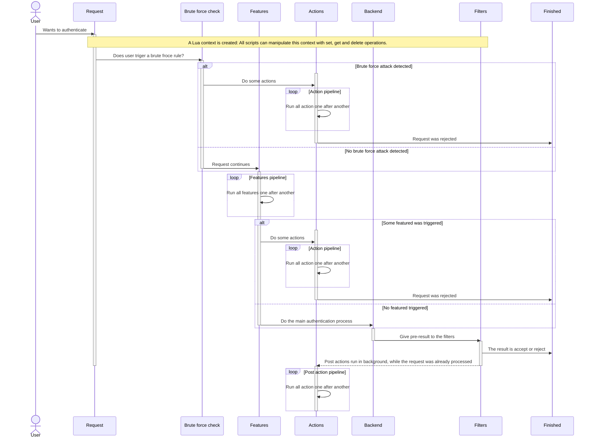

<!-- TOC -->
* [Lua Support](#lua-support)
  * [Authentication workflow](#authentication-workflow)
  * [Additional things to know](#additional-things-to-know)
  * [Configuration](#configuration)
  * [Lua components](#lua-components)
    * [Actions](#actions)
    * [Features](#features)
    * [Lua backend](#lua-backend)
    * [Filters](#filters)
    * [Post actions](#post-actions)
  * [Required functions and constants](#required-functions-and-constants)
    * [Features](#features-1)
      * [Constants for the returned result](#constants-for-the-returned-result)
      * [Request fields](#request-fields)
    * [Actions (including post)](#actions-including-post)
      * [Constants for the returned result](#constants-for-the-returned-result-1)
    * [Request fields](#request-fields-1)
<!-- TOC -->

# Lua Support

Since Version 2.5.x Nauthilus has Lua 5.1 support in all areas of the service. To understand the new interfaces, you must 
first get an idea of what happens with an incoming authentication request.

## Authentication workflow

An incoming authentication request first enters the **brute_force** check. After that it continues with the **features** 
pipeline. After that has past, it continues to process the request in a **password backend**. When the final result for the 
request was obtained, it passes **filters**. 

Filters may change the backend result in one or the other way (accepting a formely rejected message or vice versa). This 
is especially useful for other remote services that can influence the authentication process. 

After all this has finished, it is possible to do some **post actions**, which are run independent 
from all other steps in the whole pipeline and therefor can not influence the final result anymore. 

In the following sequence diagram you can see the processing of the request in more detail.


## Additional things to know

When an incoming authentication request is started, a Lua context is created.

All parts of a request share that common request context. Lua scripts can set arbitrary data in the context and read/delete
things from there. 

Lua scripts can modify the final log line by adding key-value pairs from each script.

## Configuration

For the configuration please have a look for the [Configuration-File.md](Configuration-File.md) document.

## Lua components

Each component does provide a set of global functions, constants, ... and requires a well defined response from each request.

Every Lua script that has been configured, is pre-compiled and kept in memory for future use.

### Actions

Whenever a brute froce attack is recognized, **action**s may be called. The request will wait until all requests have 
finished. Actions are processed by a central action worker. No results are returned to the regular request, so actions
in general do there own logging!

Also **features** may call actions, if they were triggered. The request is waiting to finish all actions by the worker 
process.

### Features

Besides the well known features geoip, rbl, tls_encryption and relay_domains, a new feature has been integrated: lua. This
feature is processed before all other features (in fact, you might replace all these features with pure Lua...). Lua
features are run one after another. As soon as a feature has triggered, the request will reject the authentication process.
Furthermore, Lua features can set a flag to bypass all built-in features.

### Lua backend

A new backend has been implemented. It can be used for all features that Nauthilus currently supports: Checking passwords,
running different modes (no-auth, list-accounts), adding TOTP...

The backend can accept a request or reject it. It has full access to all meta information that are delivered from the
incoming request.

### Filters

There may exist remote services that may be contacted after the main authentication proccess came to its first final 
result. Think of something like GeoIP service or some IP white/blacklisting. Even a request that might had authenticated
correctly may be rejected to a policy violation from such a service. Therefor filters have the power to override the
result from a backend.

### Post actions

Post actions are actions, which run after the request hast come to its final result. Its main purpose is to start some
automated things like doing statistics stuff, sending messages to operators or anything else that does not require fast
instant processing.

As an example have a look at the telegram script. Lua scripts in earlier stages of the process may provide some 
information by using the Lua context. The telegram script may pick up these information and decide to send out some 
notifications to an operator channel.

## Required functions and constants

Every Lua script must provide a pre-defined Lua function with a request parameter. Concerning the actual script, there is
a requried return statement.

Nauthilus will look for these functions and parses the results.

### Features

A Lua feature script must provide the following function:

```lua
function nauthilus_call_feature(request)
    return trigger, skip_flag, failure_info -- See details below
end
```

It must return three values: The trigger state, a flag that indicates, if other features shall be skipped and a third value
which is an indicator for errors that occurred in the script itself.

#### Constants for the returned result

| Constant                     | Meaning                                                         | Value | Category     |
|------------------------------|-----------------------------------------------------------------|-------|--------------|
| nauthilus.FEATURE_TRIGGER_NO  | The feature has not been triggered                              | 0     | trigger      |
| nauthilus.FEATURE_TRIGGER_YES | The feature has been triggered and the request must be rejected | 1     | trigger      |
| nauthilus.FEATURES_ABORT_NO   | Process other built-in features                                 | 0     | skip_flag    |
| nauthilus.FEATURES_ABORT_YES  | After finishing the script, skip all other built-in features    | 1     | skip_flag    |
| nauthilus.FEATURE_RESULT_OK   | The script finished without errors                              | 0     | failure_info |
| nauthilus.FEATURE_RESULT_FAIL | Something went wrong while executing the script                 | 1     | failure_info |

#### Request fields

The following request fields are supported

| Name                  | Type   | Precense | Additional info          |
|-----------------------|--------|----------|--------------------------|
| debug                 | bool   | always   | -                        |
| session               | string | always   | -                        |
| client_ip             | string | always   | -                        |
| client_port           | string | always   | -                        |
| username              | string | always   | -                        |
| password              | string | always   | -                        |
| protocol              | string | always   | -                        |
| client_id             | string | maybe    | -                        |
| local_ip              | string | always   | -                        |
| local_port            | string | always   | -                        |
| user_agent            | string | maybe    | -                        |
| ssl                   | string | maybe    | %[ssl_fc]                |
| ssl_session_id        | string | maybe    | %[ssl_fc_session_id,hex] |
| ssl_client_verify     | string | maybe    | %[ssl_c_verify]          |
| ssl_client_dn         | string | maybe    | %{+Q}[ssl_c_s_dn]        |
| ssl_client_cn         | string | maybe    | %{+Q}[ssl_c_s_dn(cn)]    |
| ssl_issuer            | string | maybe    | %{+Q}[ssl_c_i_dn]        |
| ssl_client_not_before | string | maybe    | %{+Q}[ssl_c_notbefore]   |
| ssl_client_not_after  | string | maybe    | %{+Q}[ssl_c_notafter]    |
| ssl_subject_dn        | string | maybe    | %{+Q}[ssl_c_s_dn]        |
| ssl_issuer_dn         | string | maybe    | %{+Q}[ssl_c_i_dn]        |
| ssl_client_subject_dn | string | maybe    | %{+Q}[ssl_c_s_dn]        |
| ssl_client_issuer_dn  | string | maybe    | %{+Q}[ssl_c_i_dn]        |
| ssl_protocol          | string | maybe    | %[ssl_fc_protocol]       |
| ssl_cipher            | string | maybe    | %[ssl_fc_cipher]         |

It is always a good idea to check the value of a request field, before trusting it.

### Actions (including post)

A Lua action script must provide the following function:

```lua
function nauthilus_call_action(request)
    return action_result -- See bleow for details
end
```

Actions must return the script status constant.

#### Constants for the returned result

| Constant                    | Meaning                            | Value | Category      |
|-----------------------------|------------------------------------|-------|---------------|
| nauthilus.ACTION_RESULT_OK   | The script finished without errors | 0     | action_result |
| nauthilus.ACTION_RESULT_FAIL | The script finished with errors    | 1     | action_result |

### Request fields

The following request fields are supported

| Name                | Type   | Precense | Additional info                                       |
|---------------------|--------|----------|-------------------------------------------------------|
| debug               | bool   | always   |                                                       |
| repeating           | bool   | maybe    | Brute force flag to indicate a repeating attack       |
| user_found          | bool   | maybe    | Post actions                                          |
| authenticated       | bool   | maybe    | Post actions                                          |
| no_auth             | bool   | always   |                                                       |
| brute_force_counter | uint   | maybe    | Bucket counter for a triggered brute froce rule       |
| session             | string | always   |                                                       |
| client_ip           | string | always   |                                                       |
| client_port         | string | always   |                                                       |
| client_net          | string | maybe    | IP network for a triggered brute force rule           |
| client_hostname     | string | maybe    | May exist, if DNS resolver option is turned on        |
| client_id           | string | maybe    |                                                       |
| local_ip            | string | always   |                                                       |
| local_port          | string | always   |                                                       |
| username            | string | always   |                                                       |
| account             | string | maybe    | Post actions and if no master user was used           |
| unique_user_id      | string | maybe    | Post actions with OIDC                                |
| display_name        | string | maybe    | Post actions with OIDC                                |
| password            | string | always   |                                                       |
| protocol            | string | always   |                                                       |
| brute_force_name    | string | maybe    | The name of a brute force bucket that matched         |
| feature_name        | string | maybe    | If a feature triggered, this value is set to its name |
