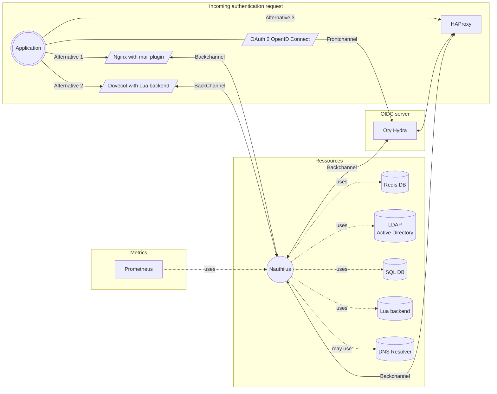

# This is the big picture

## Compontents

Nauthilus is part of a number of different services around it. To get an idea, how things work together and want you can
achieve with this software, the following picture is a detailed overview.

