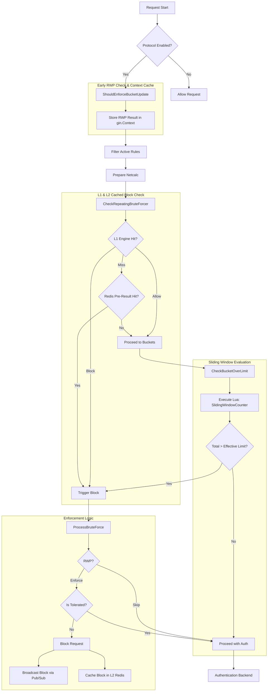
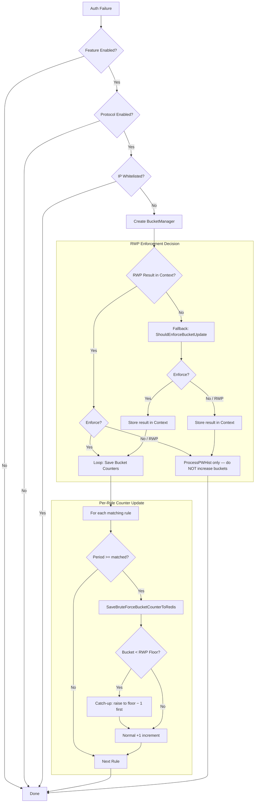
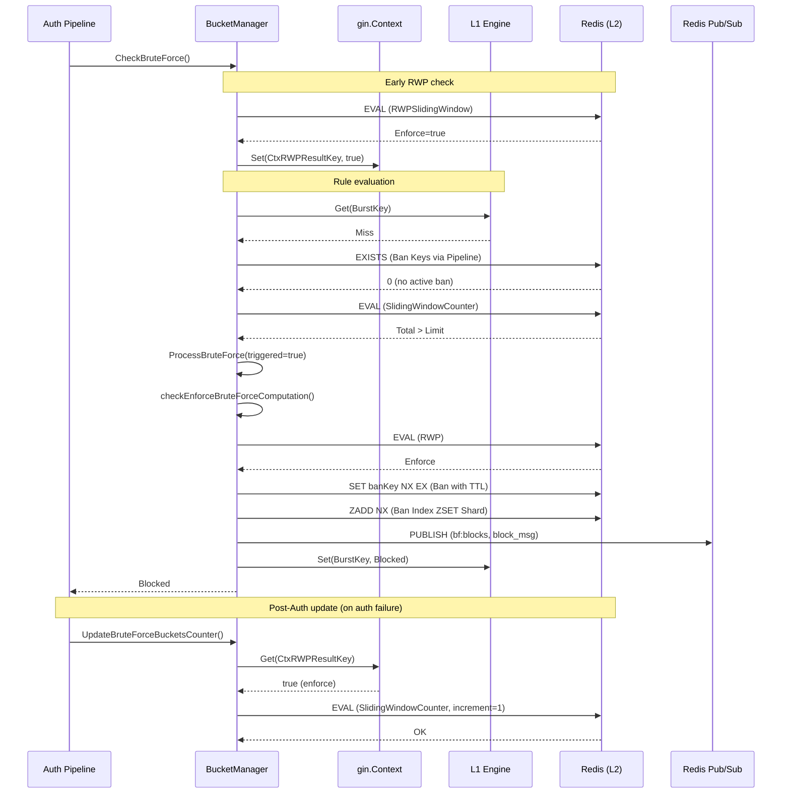

# Brute-Force Protection System: Developer Guide

This document provides a detailed overview of the brute-force protection system in Nauthilus. It is designed for
developers who need to understand, maintain, or extend the system.

## 1. High-Level Architecture

The Nauthilus brute-force protection system uses a multi-tier approach to ensure maximal performance and horizontal
scalability.

* **L1 Cache (In-Memory, Local):** A high-speed, thread-safe local cache (`server/bruteforce/l1`) that stores recent "
  Block" or "Allow" decisions. This allows for immediate rejection of known attackers without any network round-trip.
* **L2 Store (Redis, Distributed):** The source of truth. It stores sliding window counters, failed password hashes, and
  reputation data.
* **Global Synchronization (Redis Pub/Sub):** When an instance triggers a block, it broadcasts the event via Redis
  Pub/Sub. All other instances receive this and update their local L1 cache instantly.
* **Atomic Logic (Redis Lua):** All complex operations (rate limiting, reputation scaling, RWP detection) are
  implemented as Lua scripts to ensure atomicity and reduce latency.

## 2. The Authentication Pipeline Integration

Brute-force protection is integrated into the authentication pipeline at two main points:

1. **Pre-Authentication Check (`CheckBruteForce`):** Evaluates if the current request should be blocked before hitting
   any authentication backends.
2. **Post-Authentication Update (`UpdateBruteForceBucketsCounter`):** Updates counters and state after an authentication
   failure.

### 2.1 Processing Flow (Pre-Auth)

The following flowchart illustrates the decision process during `CheckBruteForce`:



### 2.2 Processing Flow (Post-Auth Update)

The following flowchart illustrates the decision process during `UpdateBruteForceBucketsCounter`, which is called
after an authentication failure to update the sliding window counters:



## 3. Core Components

### 3.1 BucketManager (`bruteforce.BucketManager`)

The `BucketManager` is the central engine of the system. It handles the evaluation of rules and interaction with Redis.

* `CheckRepeatingBruteForcer`: Checks L1 and L2 for existing block decisions.
* `CheckBucketOverLimit`: Executes the Sliding Window Lua script to evaluate rate limits.
* `ProcessBruteForce`: Decides whether to actually enforce a block based on secondary logic (RWP, Toleration).

### 3.2 L1 Cache Engine (`server/bruteforce/l1`)

The L1 engine uses two types of keys for internal caching:

* **Burst Key:** A hash of `(IP, Protocol, Account, OIDC_CID)`. Used to absorb immediate bursts for the exact same
  request.
* **Network Key:** The CIDR string (e.g., `192.168.1.0/24`). Used to store broader network-wide block decisions received
  via Pub/Sub.

### 3.3 Sliding Window Counter

Nauthilus uses a sliding window counter approximation for accurate rate limiting without the "cliff effect" of fixed
windows.

* **Logic:**
  `EstimatedCount = current_window_count + (previous_window_count * (1 - fraction_of_current_window_elapsed))`.
* **Lua Implementation:** Encapsulated in the `SlidingWindowCounter` script within `server/rediscli/lua_scripts.go`. It
  also handles **Adaptive Toleration** by scaling the `base_limit` based on the IP's reputation.

### 3.4 Repeating Wrong Password (RWP)

RWP detection prevents automated attacks that try common passwords across many accounts or the same password repeatedly.

* **Data Structure:** Redis Sorted Set `bf:rwp:allow:<scoped_ip>:<account>`.
* **Configuration:**
    * `brute_force.rwp_allowed_unique_hashes`: The number of distinct wrong password hashes tolerated within the
      window (default: 1).
    * `brute_force.rwp_window`: The sliding window duration (default: 15 minutes).
* **Logic:** Uses `RWPSlidingWindow` Lua script. It allows a certain number of unique failed password hashes within a
  sliding window. If a hash is repeated, its timestamp is updated, keeping it "fresh" and avoiding it being evicted
  from the window. If the number of unique hashes in the window exceeds the threshold, the request is no longer
  "allowed" under RWP grace and must undergo full brute-force enforcement.
* **RWP Catch-Up Floor:** When RWP protection ends and enforcement begins, the bucket counters are typically still at
  value 1 (from the very first request before RWP kicked in). To compensate, the `SlidingWindowCounter` Lua script
  accepts an optional `rwp_floor` parameter (ARGV[11]). If the current counter is below this floor, it is raised to
  `floor − 1` before the normal `+1` increment, so the bucket lands exactly at the RWP threshold. This ensures that
  `FailedRequests` reflects the true total number of failed attempts, not just those after RWP grace expired. The
  floor check is self-healing: once the counter reaches the floor, the condition `counter < floor` is false and the
  catch-up never fires again.

## 4. Sequence Diagram

This diagram shows the interaction between components during a blocked request.



## 5. Redis Key Reference

All keys are prefixed with the configured Redis prefix.

| Pattern                               | Type   | Description                                                                                                       |
|:--------------------------------------|:-------|:------------------------------------------------------------------------------------------------------------------|
| `bf:cnt:{rule}:{net}:win:{timestamp}` | String | Sliding window counter for a specific rule and network.                                                           |
| `bf:ban:{network}`                    | String | Per-network ban key. Value = bucket name. Has TTL = `ban_time` (default 8h). Written with `SET NX EX`.            |
| `bf:bans:X` (X = 0–F)                 | ZSet   | Sharded ban index (16 shards). Member = network, Score = Unix timestamp.                                          |
| `bf:rwp:allow:{scoped_ip}:{account}`  | ZSet   | Stores hashes of unique wrong passwords with timestamps for RWP detection.                                        |
| `bf:tr:{ip}`                          | Hash   | Reputation data (`positive` and `negative` counters).                                                             |
| `bf:tr:{ip}:P`                        | ZSet   | Time-series of positive authentication events.                                                                    |
| `bf:tr:{ip}:N`                        | ZSet   | Time-series of negative authentication events.                                                                    |
| `affected_accounts`                   | Set    | List of accounts affected by brute-force triggers. **No TTL** — cleared only via Flush API or admin intervention. |
| `pw_hist:{account}:{ip}`              | Set    | Failed password hashes for a specific account and IP.                                                             |
| `pw_hist_ips:{account}`               | Set    | List of IPs that have attempted logins for an account (used for cache flush).                                     |

## 6. Global Synchronization Service (`BruteForceSyncService`)

Located in `server/app/loopsfx/bruteforce_sync_service.go`, this service runs as a background loop.

1. Subscribes to `definitions.RedisBFBlocksChannel`.
2. On message, unmarshals `bruteforce.BlockMessage`.
3. Calls `l1.GetEngine().Set(key, decision, 0)` to update the local memory.
4. This ensures that if Node A triggers a block, Node B is aware of it within milliseconds.

## 7. Configuration: `ban_time`

Each brute force rule can optionally specify a `ban_time` duration. If not set, the default of **8 hours** is used.

```yaml
brute_force:
  buckets:
    - name: login_rule
      period: 10m
      ban_time: 4h        # Optional: how long a banned network stays blocked
      cidr: 24
      failed_requests: 5
```

## 8. Ban Lifecycle

1. **Trigger:** When `ProcessBruteForce` detects a threshold breach, it writes:
    - `SET bf:ban:{network} {bucket_name} NX EX {ban_time_seconds}` — only if no ban exists yet (`NX`).
   - `ZADD NX bf:bans:{shard} {unix_timestamp} {network}` — best-effort index update.
2. **Check:** `CheckRepeatingBruteForcer` and `IsIPAddressBlocked` pipeline `EXISTS bf:ban:{network}` per candidate.
3. **Expiry:** Redis TTL auto-expires the ban key. The ZSET index entry is lazily cleaned on next listing.
4. **Manual Flush:** The Flush API deletes the ban key (`DEL`) and removes the ZSET entry (`ZREM`).
5. **Listing:** The `/api/v1/bruteforce/list` endpoint pipelines `ZRANGE WITHSCORES` across all 16 ZSET shards,
   then pipelines `GET` + `TTL` on each ban key to build the response with `network`, `bucket`, `ban_time`, `ttl`,
   and `banned_at`.

## 9. CROSSSLOT & Cluster Considerations

- **Ban keys** (`bf:ban:{network}`) are individual String keys — no CROSSSLOT issues with `GET`/`SET`/`DEL`.
- **ZSET shards** (`bf:bans:0` to `bf:bans:F`) are distributed across cluster slots. Listing uses pipelining
  instead of multi-key Lua to avoid CROSSSLOT errors.
- **Affected accounts** (`affected_accounts`) is a single key — no CROSSSLOT concern.

## 10. Developer Tips

* **Lua Debugging:** Redis Lua scripts are hard to debug. Use `redis.log(redis.LOG_NOTICE, ...)` within scripts and
  check the Redis server logs.
* **L1 Visibility:** The L1 engine is completely local. If you suspect an issue with early rejection, check the
  instance-specific metrics `nauthilus_brute_force_cache_hits_total`.
* **Cache Flush:** If a user is blocked incorrectly, use the Admin API to flush the cache for that user. This will clean
  up most `bf:*` keys associated with their IPs via `prepareRedisUserKeys` in `server/core/rest.go`.
* **Affected Accounts:** The `affected_accounts` SET intentionally has no TTL. It preserves the signal path for
  accounts that were targeted by brute-force attacks. Clean up only via the Flush API or administrative intervention.
