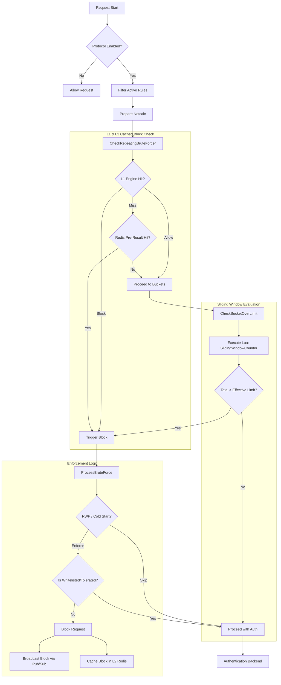
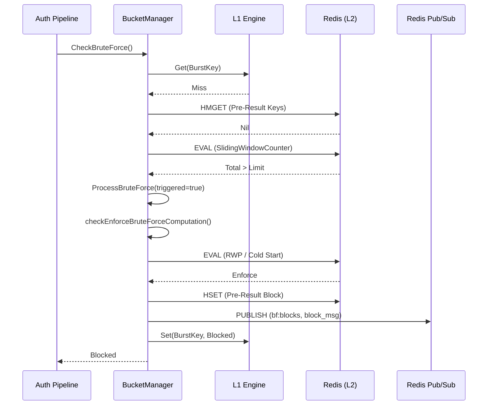

# Brute-Force Protection System: Developer Guide

This document provides a detailed overview of the brute-force protection system in Nauthilus. It is designed for
developers who need to understand, maintain, or extend the system.

## 1. High-Level Architecture

The Nauthilus brute-force protection system uses a multi-tier approach to ensure maximal performance and horizontal
scalability.

* **L1 Cache (In-Memory, Local):** A high-speed, thread-safe local cache (`server/bruteforce/l1`) that stores recent "
  Block" or "Allow" decisions. This allows for immediate rejection of known attackers without any network round-trip.
* **L2 Store (Redis, Distributed):** The source of truth. It stores sliding window counters, failed password hashes, and
  reputation data.
* **Global Synchronization (Redis Pub/Sub):** When an instance triggers a block, it broadcasts the event via Redis
  Pub/Sub. All other instances receive this and update their local L1 cache instantly.
* **Atomic Logic (Redis Lua):** All complex operations (rate limiting, reputation scaling, RWP detection) are
  implemented as Lua scripts to ensure atomicity and reduce latency.

## 2. The Authentication Pipeline Integration

Brute-force protection is integrated into the authentication pipeline at two main points:

1. **Pre-Authentication Check (`CheckBruteForce`):** Evaluates if the current request should be blocked before hitting
   any authentication backends.
2. **Post-Authentication Update (`UpdateBruteForceBucketsCounter`):** Updates counters and state after an authentication
   failure.

### 2.1 Processing Flow (Pre-Auth)

The following flowchart illustrates the decision process during `CheckBruteForce`:

## 3. Core Components

### 3.1 BucketManager (`bruteforce.BucketManager`)

The `BucketManager` is the central engine of the system. It handles the evaluation of rules and interaction with Redis.

* `CheckRepeatingBruteForcer`: Checks L1 and L2 for existing block decisions.
* `CheckBucketOverLimit`: Executes the Sliding Window Lua script to evaluate rate limits.
* `ProcessBruteForce`: Decides whether to actually enforce a block based on secondary logic (RWP, Cold Start,
  Reputation).

### 3.2 L1 Cache Engine (`server/bruteforce/l1`)

The L1 engine uses two types of keys for internal caching:

* **Burst Key:** A hash of `(IP, Protocol, Account, OIDC_CID)`. Used to absorb immediate bursts for the exact same
  request.
* **Network Key:** The CIDR string (e.g., `192.168.1.0/24`). Used to store broader network-wide block decisions received
  via Pub/Sub.

### 3.3 Sliding Window Counter

Nauthilus uses a sliding window counter approximation for accurate rate limiting without the "cliff effect" of fixed
windows.

* **Logic:**
  `EstimatedCount = current_window_count + (previous_window_count * (1 - fraction_of_current_window_elapsed))`.
* **Lua Implementation:** Encapsulated in the `SlidingWindowCounter` script within `server/rediscli/lua_scripts.go`. It
  also handles **Adaptive Toleration** by scaling the `base_limit` based on the IP's reputation.

### 3.4 Repeating Wrong Password (RWP)

RWP detection prevents automated attacks that try common passwords across many accounts or the same password repeatedly.

* **Data Structure:** Redis Set `bf:rwp:allow:<scoped_ip>:<account>`.
* **Threshold:** `BruteForce.AllowedUniqueWrongPWHashes`.
* **Logic:** Uses `RWPAllowSet` Lua script. It allows a certain number of unique failed password hashes within a window.
  If exceeded, the request is no longer "allowed" under RWP grace and must undergo full brute-force enforcement.

### 3.5 Cold Start Grace

Allows a one-time bypass for known accounts that have no previous negative history, preventing lockouts during service
restarts or configuration changes.

* **Logic:** Uses `ColdStartGraceSeed` Lua script. It seeds an "evidence" key in Redis. Subsequent attempts from the
  same IP/Account/Password combo will then enforce brute-force checks once the seed is present.

## 4. Sequence Diagram

This diagram shows the interaction between components during a blocked request.

## 5. Redis Key Reference

All keys are prefixed with the configured Redis prefix.

| Pattern                                   | Type   | Description                                                                   |
|:------------------------------------------|:-------|:------------------------------------------------------------------------------|
| `bf:cnt:{rule}:{net}:win:{timestamp}`     | String | Sliding window counter for a specific rule and network.                       |
| `bruteforce:{net}`                        | Hash   | Stores the "Pre-Result" (the name of the rule that triggered the block).      |
| `bf:rwp:allow:{scoped_ip}:{account}`      | Set    | Stores hashes of unique wrong passwords for RWP detection.                    |
| `bf:cold:{scoped_ip}`                     | String | Cold-start grace flag for an IP.                                              |
| `bf:seed:{scoped_ip}:{account}:{pw_hash}` | String | Evidence key for cold-start grace.                                            |
| `bf:tr:{ip}`                              | Hash   | Reputation data (`positive` and `negative` counters).                         |
| `bf:tr:{ip}:P`                            | ZSet   | Time-series of positive authentication events.                                |
| `bf:tr:{ip}:N`                            | ZSet   | Time-series of negative authentication events.                                |
| `affected_accounts`                       | Set    | List of accounts currently affected by brute-force triggers.                  |
| `pw_hist:{account}:{ip}`                  | Set    | Failed password hashes for a specific account and IP.                         |
| `pw_hist_ips:{account}`                   | Set    | List of IPs that have attempted logins for an account (used for cache flush). |

## 6. Global Synchronization Service (`BruteForceSyncService`)

Located in `server/app/loopsfx/bruteforce_sync_service.go`, this service runs as a background loop.

1. Subscribes to `definitions.RedisBFBlocksChannel`.
2. On message, unmarshals `bruteforce.BlockMessage`.
3. Calls `l1.GetEngine().Set(key, decision, 0)` to update the local memory.
4. This ensures that if Node A triggers a block, Node B is aware of it within milliseconds.

## 7. Developer Tips

* **Lua Debugging:** Redis Lua scripts are hard to debug. Use `redis.log(redis.LOG_NOTICE, ...)` within scripts and
  check the Redis server logs.
* **L1 Visibility:** The L1 engine is completely local. If you suspect an issue with early rejection, check the
  instance-specific metrics `nauthilus_brute_force_cache_hits_total`.
* **Cache Flush:** If a user is blocked incorrectly, use the Admin API to flush the cache for that user. This will clean
  up most `bf:*` keys associated with their IPs via `prepareRedisUserKeys` in `server/core/rest.go`.
