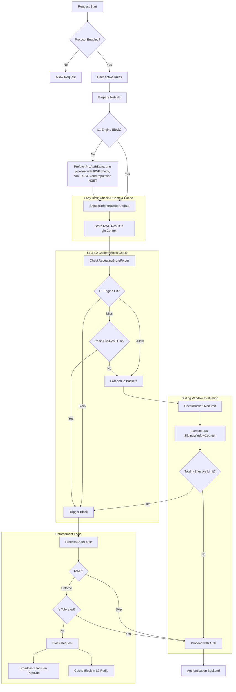
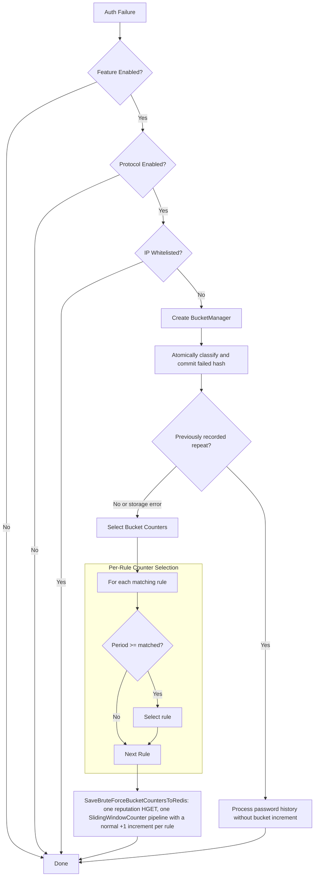
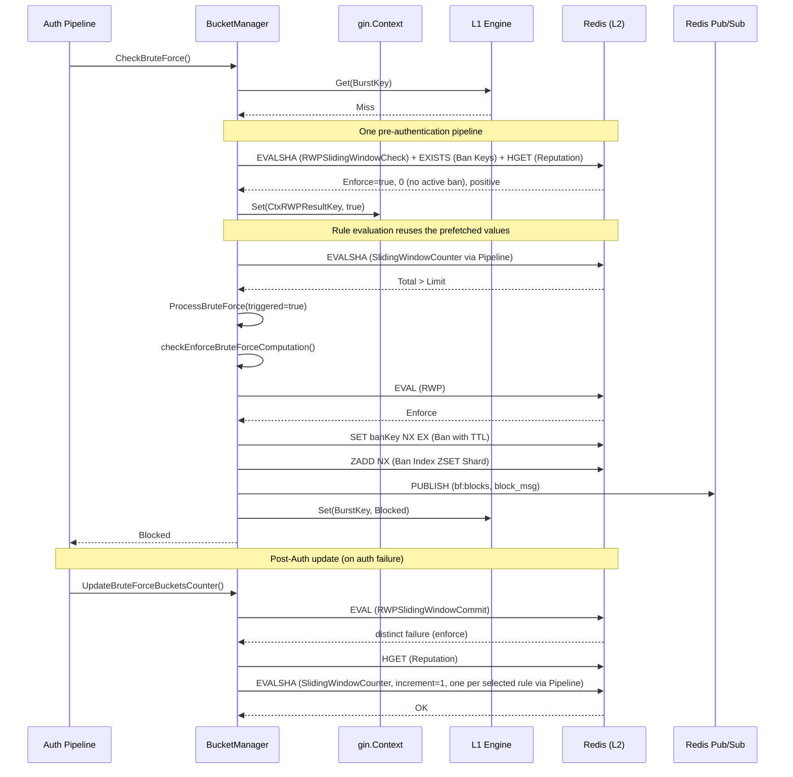

# Brute-Force Protection System: Developer Guide

This document provides a detailed overview of the brute-force protection system in Nauthilus. It is designed for
developers who need to understand, maintain, or extend the system.

## 1. High-Level Architecture

The Nauthilus brute-force protection system uses a multi-tier approach to ensure maximal performance and horizontal
scalability.

* **L1 Cache (In-Memory, Local):** A high-speed, thread-safe local cache (`server/bruteforce/l1`) that stores recent "
  Block" or "Allow" decisions. This allows for immediate rejection of known attackers without any network round-trip.
* **L2 Store (Redis, Distributed):** The source of truth. It stores sliding window counters, failed password hashes, and
  reputation data.
* **Global Synchronization (Redis Pub/Sub):** When an instance triggers a block, it broadcasts the event via Redis
  Pub/Sub. All other instances receive this and update their local L1 cache instantly.
* **Atomic Logic (Redis Lua):** All complex operations (rate limiting, reputation scaling, RWP detection) are
  implemented as Lua scripts to ensure atomicity and reduce latency.

## 2. The Authentication Pipeline Integration

Brute-force protection is integrated into the authentication pipeline at two main points:

1. **Pre-Authentication Check (`CheckBruteForce`):** Evaluates if the current request should be blocked before hitting
   any authentication backends.
2. **Post-Authentication Update (`UpdateBruteForceBucketsCounter`):** Updates counters and state after an authentication
   failure.

### 2.1 Processing Flow (Pre-Auth)

The following flowchart illustrates the decision process during `CheckBruteForce`:


```mermaid
flowchart TD
    A[Request Start] --> B{Protocol Enabled?}
    B -- No --> C[Allow Request]
    B -- Yes --> D[Filter Active Rules]
    D --> E[Prepare Netcalc]
    E --> PF{L1 Engine Block?}
    PF -- Yes --> RWP_EARLY
    PF -- No --> PF_PIPE[PrefetchPreAuthState: one pipeline with RWP check, ban EXISTS and reputation HGET]
    PF_PIPE --> RWP_EARLY[ShouldEnforceBucketUpdate]

    subgraph RWP_Cache [Early RWP Check & Context Cache]
        RWP_EARLY --> RWP_STORE[Store RWP Result in gin.Context]
    end

    RWP_STORE --> F[CheckRepeatingBruteForcer]
    
    subgraph L1_L2_Check [L1 & L2 Cached Block Check]
        F --> F1{L1 Engine Hit?}
        F1 -- Block --> F2[Trigger Block]
        F1 -- Allow --> F3[Proceed to Buckets]
        F1 -- Miss --> F4{Redis Pre-Result Hit?}
        F4 -- Yes --> F2
        F4 -- No --> F3
    end
    
    F3 --> G[CheckBucketOverLimit]
    
    subgraph Sliding_Window [Sliding Window Evaluation]
        G --> G1[Execute Lua: SlidingWindowCounter]
        G1 --> G2{Total > Effective Limit?}
        G2 -- Yes --> F2
        G2 -- No --> H[Proceed with Auth]
    end
    
    F2 --> I[ProcessBruteForce]
    
    subgraph Enforcement [Enforcement Logic]
        I --> I1{RWP?}
        I1 -- Skip --> H
        I1 -- Enforce --> I2{Is Tolerated?}
        I2 -- Yes --> H
        I2 -- No --> I3[Block Request]
        I3 --> I4[Broadcast Block via Pub/Sub]
        I3 --> I5[Cache Block in L2 Redis]
    end
    
    H --> J[Authentication Backend]
```

### 2.2 Processing Flow (Post-Auth Update)

The following flowchart illustrates the decision process during `UpdateBruteForceBucketsCounter`, which is called
after an authentication failure to update the sliding window counters:


```mermaid
flowchart TD
    U_START[Auth Failure] --> U_FEAT{Feature Enabled?}
    U_FEAT -- No --> U_DONE[Done]
    U_FEAT -- Yes --> U_PROTO{Protocol Enabled?}
    U_PROTO -- No --> U_DONE
    U_PROTO -- Yes --> U_WL{IP Whitelisted?}
    U_WL -- Yes --> U_DONE
    U_WL -- No --> U_BM[Create BucketManager]
    U_BM --> U_COMMIT[Atomically classify and commit failed hash]
    U_COMMIT --> U_REPEAT{Previously recorded repeat?}
    U_REPEAT -- Yes --> U_SKIP[Process password history without bucket increment]
    U_REPEAT -- No or storage error --> U_UPDATE

U_UPDATE[Select Bucket Counters]
U_UPDATE --> U_RULE_LOOP

subgraph Bucket_Update [Per-Rule Counter Selection]
U_RULE_LOOP[For each matching rule] --> U_PERIOD{Period >= matched?}
U_PERIOD -- Yes --> U_SELECT[Select rule]
U_PERIOD -- No --> U_NEXT[Next Rule]
U_SELECT --> U_NEXT
end

U_NEXT --> U_SAVE[SaveBruteForceBucketCountersToRedis: one reputation HGET, one SlidingWindowCounter pipeline with a normal +1 increment per rule]
U_SAVE --> U_DONE
U_SKIP --> U_DONE
```

## 3. Core Components

### 3.1 BucketManager (`bruteforce.BucketManager`)

The `BucketManager` is the central engine of the system. It handles the evaluation of rules and interaction with Redis.

* `CheckRepeatingBruteForcer`: Checks L1 and L2 for existing block decisions.
* `CheckBucketOverLimit`: Executes the Sliding Window Lua script to evaluate rate limits.
* `ProcessBruteForce`: Decides whether to actually enforce a block based on secondary logic (RWP, Toleration).

### 3.2 L1 Cache Engine (`server/bruteforce/l1`)

The L1 engine uses two types of keys for internal caching:

* **Burst Key:** A hash of `(IP, Protocol, Account, OIDC_CID)`. Used to absorb immediate bursts for the exact same
  request.
* **Network Key:** The CIDR string (e.g., `192.168.1.0/24`). Used to store broader network-wide block decisions received
  via Pub/Sub.

### 3.3 Sliding Window Counter

Nauthilus uses a sliding window counter approximation for accurate rate limiting without the "cliff effect" of fixed
windows.

* **Logic:**
  `EstimatedCount = current_window_count + (previous_window_count * (1 - fraction_of_current_window_elapsed))`.
* **Lua Implementation:** Encapsulated in the `SlidingWindowCounter` script within `server/rediscli/lua_scripts.go`. It
  also handles **Adaptive Toleration** by scaling the `base_limit` based on the IP's reputation.

### 3.4 Repeating Wrong Password (RWP)

RWP is an allowance that prevents a client repeatedly retrying the same stale password from inflating broader
brute-force buckets. It does not block by itself; password spraying and other distinct-password attacks continue
through normal brute-force enforcement.

* **Data Structure:** Redis Sorted Set `bf:rwp:allow:<scoped_ip>:<account>`.
* **Configuration:**
    * `brute_force.rwp_allowed_unique_hashes`: The maximum number of remembered wrong password hashes within the
      window (default: 3).
    * `brute_force.rwp_window`: The sliding window duration (default: 15 minutes).
* **Logic:** Uses two Lua scripts: `RWPSlidingWindowCheck` (read-only) and `RWPSlidingWindowCommit` (write).
  The check runs early in `CheckBruteForce` and produces an allowance candidate, but does **not** record the hash
  or yet know whether the password is wrong. Successful authentication clears that candidate. After a genuine
  authentication failure, `UpdateBruteForceBucketsCounter` logs the active allowance and commits the hash even when
  bucket increments are skipped. Environment-control rejections (e.g., RBL), where the password was never verified,
  do not commit unless `bruteforce.learning` explicitly includes the triggering control.
  Only a hash already recorded for this account and scoped IP qualifies as a repeat. Every newly encountered
  failed password increments the matching aggregate buckets, including the first failure for a known account.
  The commit atomically classifies the hash against current Redis state, then records it. A pre-authentication
  observation cannot exempt a distinct failure after another request changes that state. Repeated hashes refresh
  their timestamps; the configured hash count bounds retained history, not free password guesses.
  The former catch-up floor is disabled because distinct failures are counted from their first occurrence.
* **Unavailable protection:** Redis failures during the pre-authentication check produce a temporary authentication
  failure and the policy error fact. An unavailable repeat check never grants an allowance.

### 3.5 Redis Round Trips

Brute-force protection sits on the hot authentication path, so data-independent Redis commands share one pipeline
instead of running as sequential single-command round trips. Every pipeline increments
`bruteforce_redis_roundtrips_total` with its own `kind` label, and each command is evaluated on its own result
because a pipeline only reports its first error.

* **Password history (`pipeline_pw_hist_load`):** `SCARD` of the account-scoped set, `SISMEMBER` of the current full
  password hash in that set, and `SCARD` of the IP-scoped set run as one pipeline on the read handle. Account-less
  requests skip the account reads; a password-less request skips the membership read. The pipeline never carries
  Lua, so a cluster keeps routing it to read replicas.
* **Pre-authentication check (`pipeline_preauth_check`):** `PrefetchPreAuthState` queues the read-only
  `RWPSlidingWindowCheck` script, `EXISTS` of every candidate ban key and `HGET` of the reputation `positive`
  counter into one pipeline. With the RWP script the pipeline runs on the write handle, because `EVALSHA` is routed
  to masters anyway; account-less requests keep it on the read handle. The following checks consume these values,
  so a normal check needs this pipeline plus the bucket-counter pipeline (`pipeline_eval_bucket_counter`) instead
  of four sequential round trips. The reputation value is a request-scoped snapshot that later bucket evaluations of
  the same request reuse. An L1 block decision skips the prefetch; the RWP check then runs alone as before.
  A script that is missing on a node is re-uploaded and only the failed script calls run again
  (`rediscli.ScriptPipeline`).
* **Failed-login counters (`pipeline_eval_bucket_counter_save`):** after the RWP commit has classified a failure as
  counted, `SaveBruteForceBucketCountersToRedis` reads the reputation once and increments every selected rule with
  one `SlidingWindowCounter` pipeline on the write handle. A failed login therefore needs the RWP commit plus two
  round trips, independent of the number of rules. Each rule still logs and counts its own write and failure.
* **Blocked requests:** the matched rule's counter is reused from the same request's bucket evaluation instead of
  running `SlidingWindowCounter` again. The affected account is written with one `SADD` + `ZADD NX` pipeline
  (`pipeline_affected_account`) without a membership read; `ZADD NX` keeps the first-seen timestamp of an indexed
  account. The failed password hash is stored in the account-scoped and the IP-scoped history set with one
  `AddToSetAndExpireLimit` pipeline (`pipeline_pw_hist_save`). The burst gate stays a separate round trip because
  only the burst leader records the hash. The `SISMEMBER` before learning a `pw_hist_ips` entry also stays: it
  decides whether the set TTL is refreshed.

## 4. Sequence Diagram

This diagram shows the interaction between components during a blocked request.


```mermaid
sequenceDiagram
    participant C as Auth Pipeline
    participant BM as BucketManager
    participant Ctx as gin.Context
    participant L1 as L1 Engine
    participant R as Redis (L2)
    participant PS as Redis Pub/Sub

    C->>BM: CheckBruteForce()
    BM->>L1: Get(BurstKey)
    L1-->>BM: Miss
    Note over BM, R: One pre-authentication pipeline
    BM ->> R: EVALSHA (RWPSlidingWindowCheck) + EXISTS (Ban Keys) + HGET (Reputation)
    R -->> BM: Enforce=true, 0 (no active ban), positive
    BM ->> Ctx: Set(CtxRWPResultKey, true)
    Note over BM, R: Rule evaluation reuses the prefetched values
    BM->>R: EVALSHA (SlidingWindowCounter via Pipeline)
    R-->>BM: Total > Limit
    BM->>BM: ProcessBruteForce(triggered=true)
    BM->>BM: checkEnforceBruteForceComputation()
    BM ->> R: EVAL (RWP)
    R-->>BM: Enforce
    BM ->> R: SET banKey NX EX (Ban with TTL)
    BM ->> R: ZADD NX (Ban Index ZSET Shard)
    BM->>PS: PUBLISH (bf:blocks, block_msg)
    BM->>L1: Set(BurstKey, Blocked)
    BM-->>C: Blocked
    Note over C, R: Post-Auth update (on auth failure)
    C ->> BM: UpdateBruteForceBucketsCounter()
    BM ->> R: EVAL (RWPSlidingWindowCommit)
    R -->> BM: distinct failure (enforce)
    BM ->> R: HGET (Reputation)
    BM ->> R: EVALSHA (SlidingWindowCounter, increment=1, one per selected rule via Pipeline)
    R -->> BM: OK
```

## 5. Redis Key Reference

All keys are prefixed with the configured Redis prefix.

| Pattern                               | Type   | Description                                                                                                       |
|:--------------------------------------|:-------|:------------------------------------------------------------------------------------------------------------------|
| `bf:cnt:{rule}:{net}:win:{timestamp}` | String | Sliding window counter for a specific rule and network.                                                           |
| `bf:ban:{network}`                    | String | Per-network ban key. Value = bucket name. Has TTL = `ban_time` (default 8h). Written with `SET NX EX`.            |
| `bf:bans:X` (X = 0–F)                 | ZSet   | Sharded ban index (16 shards). Member = network, Score = Unix timestamp.                                          |
| `bf:rwp:allow:{scoped_ip}:{account}`  | ZSet   | Stores hashes of unique wrong passwords with timestamps for RWP detection.                                        |
| `bf:tr:{ip}`                          | Hash   | Reputation data (`positive` and `negative` counters).                                                             |
| `bf:tr:{ip}:P`                        | ZSet   | Time-series of positive authentication events.                                                                    |
| `bf:tr:{ip}:N`                        | ZSet   | Time-series of negative authentication events.                                                                    |
| `affected_accounts`                   | Set    | List of accounts affected by brute-force triggers. **No TTL** — cleared only via Flush API or admin intervention. |
| `pw_hist:{account}:{ip}`              | Set    | Failed password hashes for a specific account and IP.                                                             |
| `pw_hist_ips:{account}`               | Set    | List of IPs that have attempted logins for an account (used for cache flush).                                     |

## 6. Global Synchronization Service (`BruteForceSyncService`)

Located in `server/app/loopsfx/bruteforce_sync_service.go`, this service runs as a background loop.

1. Subscribes to `definitions.RedisBFBlocksChannel`.
2. On message, unmarshals `bruteforce.BlockMessage`.
3. Calls `l1.GetEngine().Set(key, decision, 0)` to update the local memory.
4. This ensures that if Node A triggers a block, Node B is aware of it within milliseconds.

## 7. Configuration: `ban_time`

Each brute force rule can optionally specify a `ban_time` duration. If not set, the default of **8 hours** is used.

```yaml
brute_force:
  buckets:
    - name: login_rule
      period: 10m
      ban_time: 4h        # Optional: how long a banned network stays blocked
      cidr: 24
      failed_requests: 5
```

## 8. Ban Lifecycle

1. **Trigger:** When `ProcessBruteForce` detects a threshold breach, it writes:
    - `SET bf:ban:{network} {bucket_name} NX EX {ban_time_seconds}` — only if no ban exists yet (`NX`).
   - `ZADD NX bf:bans:{shard} {unix_timestamp} {network}` — best-effort index update.
2. **Check:** `CheckRepeatingBruteForcer` and `IsIPAddressBlocked` pipeline `EXISTS bf:ban:{network}` per candidate.
3. **Expiry:** Redis TTL auto-expires the ban key. The ZSET index entry is lazily cleaned on next listing.
4. **Manual Flush:** The Flush API deletes the ban key (`DEL`) and removes the ZSET entry (`ZREM`).
5. **Listing:** The `/api/v1/bruteforce/list` endpoint pipelines `ZRANGE WITHSCORES` across all 16 ZSET shards,
   then pipelines `GET` + `TTL` on each ban key to build the response with `network`, `bucket`, `ban_time`, `ttl`,
   and `banned_at`.

## 9. CROSSSLOT & Cluster Considerations

- **Ban keys** (`bf:ban:{network}`) are individual String keys — no CROSSSLOT issues with `GET`/`SET`/`DEL`.
- **ZSET shards** (`bf:bans:0` to `bf:bans:F`) are distributed across cluster slots. Listing uses pipelining
  instead of multi-key Lua to avoid CROSSSLOT errors.
- **Affected accounts** (`affected_accounts`) is a single key — no CROSSSLOT concern.

## 10. Developer Tips

* **Lua Debugging:** Redis Lua scripts are hard to debug. Use `redis.log(redis.LOG_NOTICE, ...)` within scripts and
  check the Redis server logs.
* **L1 Visibility:** The L1 engine is completely local. If you suspect an issue with early rejection, check the
  instance-specific metrics `nauthilus_brute_force_cache_hits_total`.
* **Cache Flush:** If a user is blocked incorrectly, use the Admin API to flush the cache for that user. This will clean
  up most `bf:*` keys associated with their IPs via `prepareRedisUserKeys` in `server/core/rest.go`.
* **Affected Accounts:** The `affected_accounts` SET intentionally has no TTL. It preserves the signal path for
  accounts that were targeted by brute-force attacks. Clean up only via the Flush API or administrative intervention.

## Redis time precision

Bucket periods use whole seconds, rounded to the nearest second with a minimum of one second. Bucket keys,
window weighting and retention use this same effective period. Counter storage lasts for two effective windows,
including positive subsecond configuration values. RWP windows round retention up to whole seconds.
