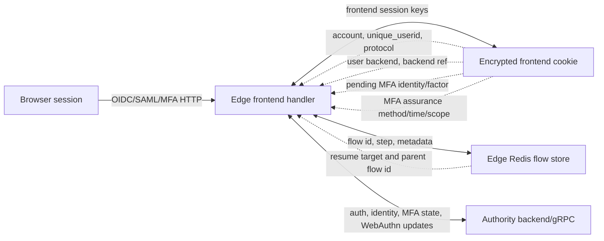
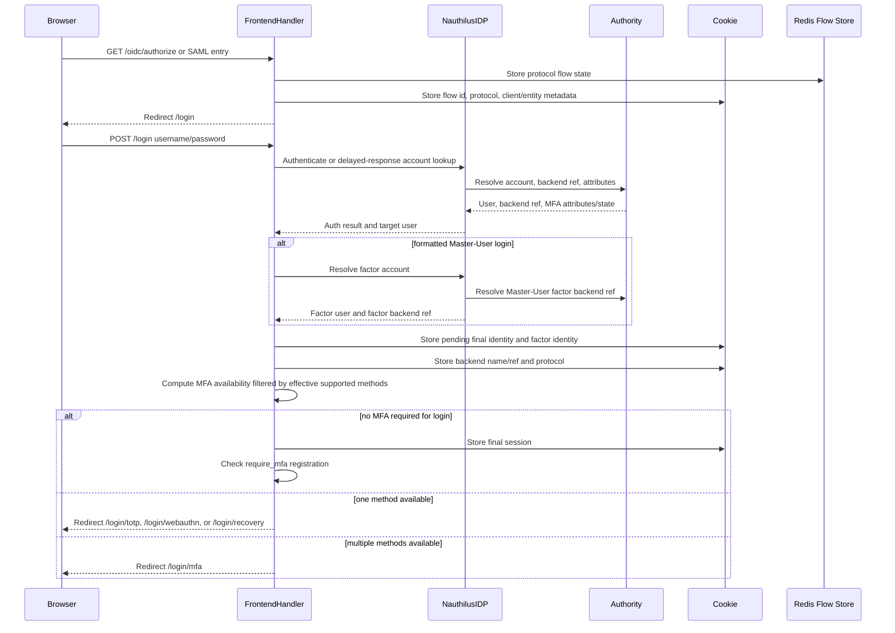
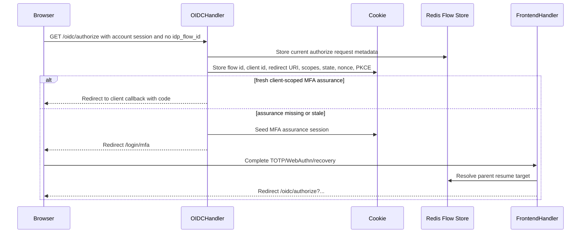
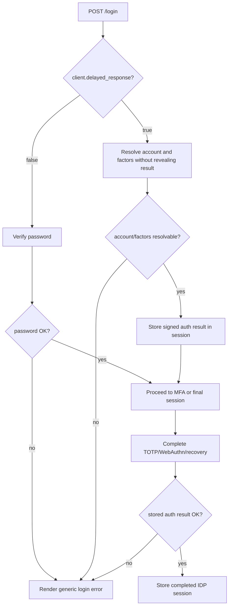
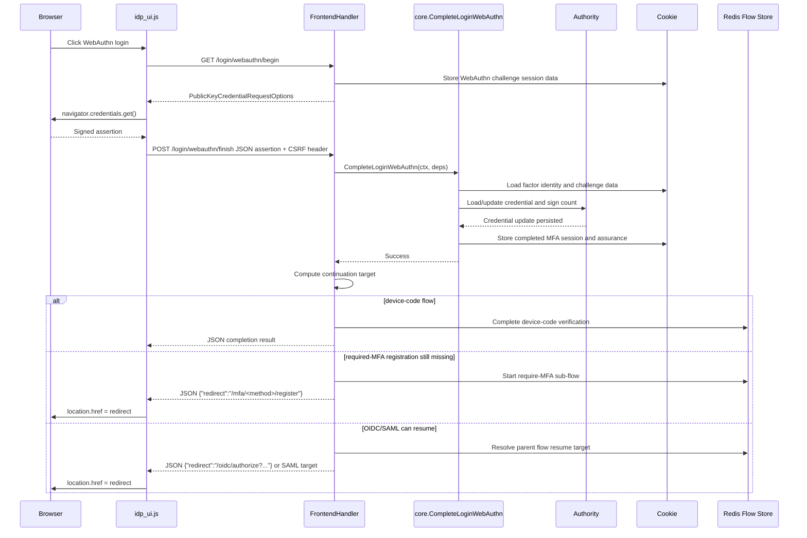
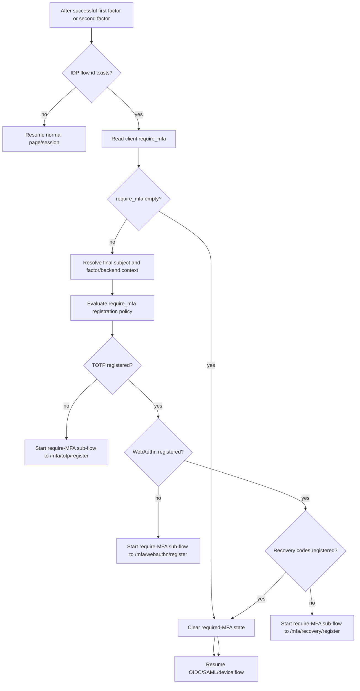
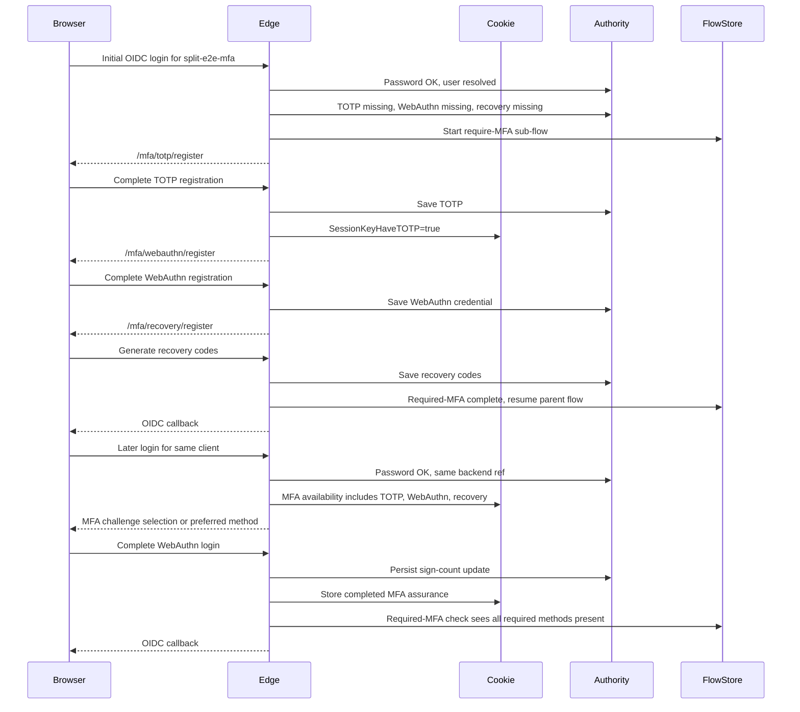

# IDP MFA Flow Developer Notes

This document describes the IDP first-factor, MFA, required-MFA registration,
and WebAuthn continuation paths as implemented by the frontend handlers. It is
intended as a debugging aid for regressions where the browser is sent back to
`/login`, `/login/webauthn`, or `/mfa/*/register` even though an OIDC/SAML flow
should resume.

## Configuration Inputs

The runtime path is not determined by the current URL alone. The IDP client and
session state must be considered together.

| Input | Meaning | Important effects |
| --- | --- | --- |
| `skip_consent` | OIDC client consent can be skipped. | A successful login can resume directly to the OIDC callback path after token/code handling. |
| `delayed_response` | The first-factor password result is hidden until after MFA. | A wrong password still enters MFA if the account/factors can be resolved; the failure is revealed after the second factor. |
| `require_mfa` | List of MFA methods that must be registered for this client. | After successful authentication, the flow may be diverted to `/mfa/<method>/register` before OIDC/SAML resumes. |
| `supported_mfa` | List of MFA methods the client allows during login/registration. | Methods not supported by the client must not be offered or counted as satisfying `require_mfa`. When unset and `require_mfa` is set, the effective login method set is narrowed to `require_mfa`. |
| OIDC flow state | Authorization request, client id, redirect URI, scopes, PKCE, prompt. | Stored in Redis and session cookie; must survive MFA and required-MFA sub-flows. |
| SAML flow state | Request, RelayState, entity id. | Same continuation model as OIDC, but protocol-specific resume target. |
| Device-code flow state | User code/device code and pending verification state. | WebAuthn completion may need to call device-code completion instead of returning a browser redirect. |
| Backend reference | Edge session reference to the authority-side backend result. | Must be preserved for follow-up MFA/backend-data lookups in split edge/authority deployments. |
| MFA factor identity | Account whose second factor is being verified. | Can differ from final subject for formatted Master-User logins. |
| Final subject identity | Account that receives the completed IDP session. | Must be restored after MFA before OIDC/SAML claim materialization. |

The `contrib/identity-proxy-e2e` profile has two relevant OIDC clients:

```yaml
client_id: split-e2e-mfa
skip_consent: true
require_mfa: [totp, webauthn, recovery_codes]
supported_mfa: [totp, webauthn, recovery_codes]

client_id: split-e2e-mfa-delayed
skip_consent: true
delayed_response: true
require_mfa: [totp, webauthn, recovery_codes]
supported_mfa: [totp, webauthn, recovery_codes]
```

## State Owners



## First-Factor And MFA Selection



Important invariant: once MFA availability has been computed from the password
step and authority backend state, the immediate MFA continuation should not make
a contradictory required-MFA decision because the WebAuthn finish request has a
different body shape.

## OIDC Reentry With Existing Sessions

OIDC relying parties may start a new authorization request immediately after a
successful token and userinfo exchange while the browser still has an
authenticated account session. This is a new Authorization-Code request, not a
continuation of the completed one. The handler must therefore persist a fresh
OIDC flow for the current request before consent, MFA assurance, required-MFA
registration, or code issuance is evaluated.



Completing the previous OIDC request may remove temporary flow keys, but it must
not make the next valid `/oidc/authorize` depend on the unauthenticated login
start path. Direct `/login` access without an active IDP flow remains rejected.

## Delayed Response



`delayed_response` means MFA handlers must validate the stored first-factor
result after the second factor succeeds. It does not mean required-MFA
registration should run against a different identity or backend reference.

## WebAuthn Login Finish

WebAuthn login is special because the browser sends a JSON assertion to
`/login/webauthn/finish`. That request body is consumed by WebAuthn validation.
Internal follow-up lookups must not treat the same JSON body as a Nauthilus auth
request.



Required invariant for this handler:

- The core WebAuthn verifier may consume the request body.
- Any later backend-data, cache-purge, or MFA-availability check must use an
  internal lookup context that does not decode the WebAuthn JSON assertion as a
  structured auth request.
- The completed-MFA session keeps enrollment snapshots for TOTP, WebAuthn, and
  recovery codes so `require_mfa` does not reinterpret a proven factor as
  missing after temporary MFA state is cleaned.
- The handler must not write a second response after an internal lookup already
  aborted the request.
- The continuation redirect must be derived server-side from flow state; the
  browser must only follow a safe relative redirect returned by the server.

## Required-MFA Registration

`require_mfa` is about factor enrollment, not about the current login method
alone. A client can require all of `totp`, `webauthn`, and `recovery_codes`, so
after a successful password or MFA step the flow must prove that every required
method is already registered.



Required invariant for split edge/authority deployments:

- The check must use the same final subject, factor identity, backend name, and
  backend reference that were selected during first-factor authentication.
- Explicit `supported_mfa` is the configured allow-list. If it is unset and
  `require_mfa` is set, `require_mfa` becomes the effective allow-list for login
  MFA challenge and method-offer decisions so the UI does not offer a method
  that final client assurance will reject. Required-MFA registration still
  follows `require_mfa` directly.
- A copied/internal lookup context is acceptable only if it preserves the
  encrypted cookie manager and session keys.
- The session enrollment snapshot may satisfy a method only when that method was
  already proven by MFA availability, registration, or a completed challenge; it
  must not be used to invent new factor enrollment state.
- A failed or incomplete lookup must fail closed for security, but it should be
  observable as a lookup failure, not silently downgraded to "factor missing"
  when the factor was proven earlier in the same flow.

## Expected Required-MFA Flow For `split-e2e-mfa`



If the last step redirects to `/mfa/totp/register`, the code has contradicted
state it had already established earlier in the same test profile. The likely
places to audit are:

- loss of `SessionKeyHaveTOTP`, `SessionKeyUserBackend`, or backend-ref session
  keys during MFA cleanup;
- using the WebAuthn JSON finish request as a structured auth request in an
  internal lookup;
- using final subject identity where factor identity is required, or the
  reverse, especially for Master-User logins;
- treating backend-data lookup failure as "factor missing" without logging the
  difference;
- `supported_mfa` filtering that removes a registered method before the
  `require_mfa` comparison.

For the split edge/authority E2E, the currently interesting failing transition
is:

```text
ok recovery-code-generation
ok master-user-mfa-registration
ok oidc-totp-login
ok oidc-delayed-response-totp-login
ok oidc-delayed-response-totp-wrong-password-rejected
WebAuthn finish redirects to /mfa/totp/register/en instead of the OIDC callback
```

That failure means WebAuthn verification itself succeeded, but the continuation
path decided that `totp` is still missing for `split-e2e-mfa`. The next code
audit should therefore focus on how TOTP availability is carried from the
first-factor/MFA-availability decision into the WebAuthn completion
`require_mfa` check, including `delayed_response` and remote backend references.

## Code Map

| Area | Current files |
| --- | --- |
| Route registration and browser handlers | `server/handler/frontend/idp/frontend.go` |
| Required-MFA flow decisions | `server/handler/frontend/idp/require_mfa.go` |
| OIDC/SAML flow state controller | `server/handler/frontend/idp/flow_controller_factory.go` |
| Backend-data/MFA state lookup | `server/handler/frontend/idp/backend_data.go` |
| WebAuthn core validation and sign-count persistence | `server/core/webauthn.go` |
| Completed MFA session storage | `server/core/idp_mfa.go` |
| Remote backend reference session keys | `server/core/remote_backend_session.go` |
| Browser E2E profile | `contrib/identity-proxy-e2e/scripts/browser-e2e.js` |
| Split edge/authority config | `contrib/identity-proxy-e2e/config/edge-a.yml` and `edge-b.yml` |
