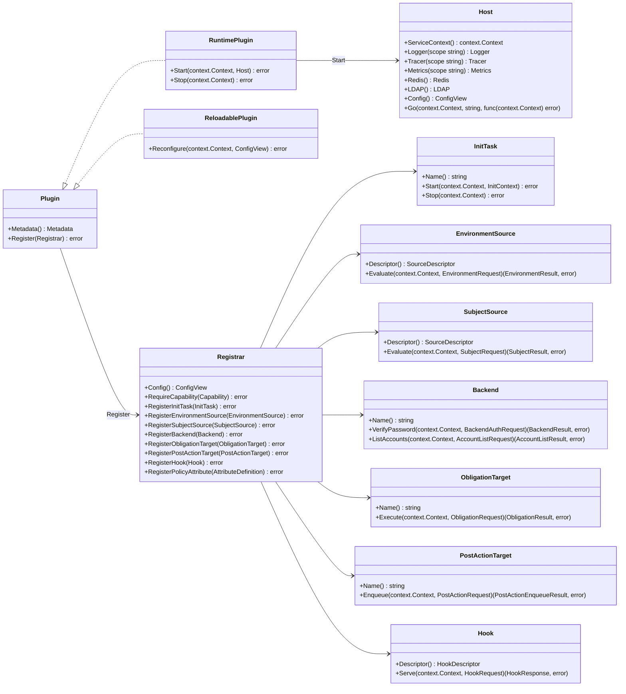
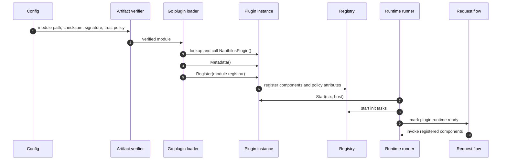
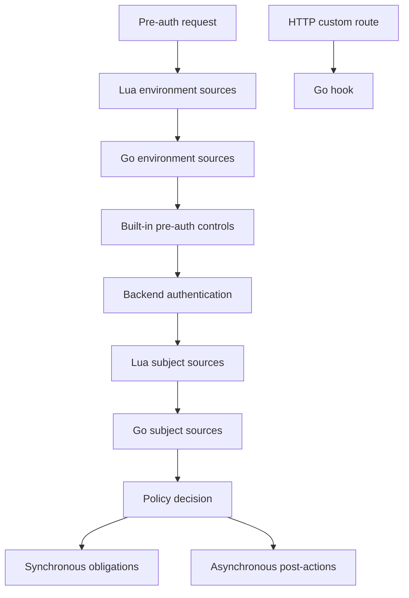

# Native Go Plugin Developer API

This document explains how to write native Go plugins for Nauthilus. It focuses on the developer contract exposed by
`github.com/croessner/nauthilus/pluginapi/v1`, the runtime behavior that plugin authors can rely on, and the current
implementation limits that matter when designing production plugins.

For operator-facing loader configuration, artifact verification, and deployment examples, see
[Native Go Plugins](go_plugins.md). For a complete reference implementation, see `contrib/plugins/geoip`.

## API Model

A native Go plugin is an in-process `.so` artifact loaded with Go's standard `plugin` package. It is trusted server code:
it runs in the Nauthilus process, shares process memory, and must be built with the same toolchain and dependency graph as
the Nauthilus binary.

Every plugin artifact exports one factory symbol:

```go
func NauthilusPlugin() (pluginapi.Plugin, error)
```

The factory returns a fresh `pluginapi.Plugin` instance. Nauthilus calls the factory once for each configured module
instance. A single `.so` file may therefore be configured multiple times with different module names and different
plugin-owned config subtrees.



## Names And Identity

The public API separates product identity from configured module identity:

- `Metadata().Name` is the plugin product name, for example `geoip`.
- `plugins.modules[].name` is the configured module instance name, for example `edge_geoip` or `customer_a_sql`.
- Component names are local to a module and become qualified as `<module>.<component>`.

Module and component names must match this grammar:

```text
[a-z0-9][a-z0-9_]{0,62}
```

Qualified component names use exactly one dot:

```text
<module>.<component>
```

Use qualified names in Nauthilus config surfaces such as plugin backend selectors:

```yaml
auth:
  backends:
    order:
      - plugin(customer_sql.passdb)
```

## Lifecycle

Nauthilus performs plugin setup before request-time plugin execution is enabled:



### Factory

The factory must be exported from a `main` package:

```go
package main

import pluginapi "github.com/croessner/nauthilus/pluginapi/v1"

func NauthilusPlugin() (pluginapi.Plugin, error) {
    return NewPlugin(), nil
}
```

Keep factory work minimal. Heavy validation, file reads, network setup, and worker startup belong in `Register`,
`Start`, or an `InitTask`.

### Metadata

`Metadata()` is called before registration. It must set `APIVersion` to `pluginapi.APIVersion` and provide a non-empty
name and version:

```go
func (p *Plugin) Metadata() pluginapi.Metadata {
    return pluginapi.Metadata{
        Name:       "customer_sql",
        Version:    "1.0.0",
        APIVersion: pluginapi.APIVersion,
        Description: "Customer SQL backend plugin.",
        DocsURL:    "https://example.invalid/customer-sql-plugin",
        Features: []pluginapi.Feature{
            "backend",
            "reconfigure",
        },
        Capabilities: []pluginapi.Capability{
            pluginapi.CapabilityCredentials,
        },
    }
}
```

`Capabilities` declares possible sensitive behavior. It does not grant the module permission by itself.

### Register

`Register(registrar)` declares the module's components. Registration is module-scoped: duplicate component names inside
one module are rejected, and the registry qualifies local component names with the configured module name.

```go
func (p *Plugin) Register(registrar pluginapi.Registrar) error {
    if registrar == nil {
        return fmt.Errorf("registrar is nil")
    }

    var cfg moduleConfig
    if err := registrar.Config().Decode(&cfg); err != nil {
        return err
    }

    if err := registrar.RequireCapability(pluginapi.CapabilityCredentials); err != nil {
        return err
    }

    if err := registrar.RegisterPolicyAttribute(pluginapi.AttributeDefinition{
        ID:          "plugin.backend.customer_sql.account_locked",
        Stage:       pluginapi.PolicyStageAuthBackend,
        Operations:  []pluginapi.PolicyOperation{pluginapi.PolicyOperationAuthenticate},
        Category:    pluginapi.AttributeCategorySubject,
        Type:        pluginapi.AttributeTypeBool,
        Description: "Reports whether the backend account is administratively locked.",
    }); err != nil {
        return err
    }

    return registrar.RegisterBackend(&backend{cfg: cfg})
}
```

Use `Registrar.Config()` for plugin-owned module config. Nauthilus passes the root `plugins.modules[].config` subtree as
a read-only `ConfigView`. `Decode` is strict and should be treated as part of plugin startup validation.

### Start And Stop

Implement `pluginapi.RuntimePlugin` when the plugin needs host services, request-time shared state, or long-lived
resources.

```go
func (p *Plugin) Start(ctx context.Context, host pluginapi.Host) error {
    if host == nil {
        return fmt.Errorf("plugin host is nil")
    }

    p.logger = host.Logger("customer_sql")
    p.tracer = host.Tracer("customer_sql")

    p.logger.Info(ctx, "customer SQL plugin started")
    return nil
}

func (p *Plugin) Stop(ctx context.Context) error {
    p.close()
    return nil
}
```

`Start` runs before request-time component invocation is marked ready. `Stop` runs when Nauthilus shuts down the plugin
runtime. Keep both methods bounded by the context passed by the host.

### Init Tasks

An `InitTask` is a named startup unit registered through `RegisterInitTask`. It receives an `InitContext` with the same
host facade and the module config view. Use init tasks for work that must complete before request-time plugin execution,
such as loading a local database.

```go
type databaseInitTask struct {
    plugin *Plugin
}

func (databaseInitTask) Name() string { return "database" }

func (t databaseInitTask) Start(ctx context.Context, init pluginapi.InitContext) error {
    return t.plugin.loadDatabase(ctx, init.Config)
}

func (t databaseInitTask) Stop(ctx context.Context) error {
    t.plugin.closeDatabase()
    return nil
}
```

### Reconfigure

Implement `pluginapi.ReloadablePlugin` only when plugin-owned config can be changed without replacing the `.so` artifact.
`Reconfigure` receives the new module `ConfigView`. Validate and prepare new state before publishing it. If
`Reconfigure` returns an error, Nauthilus keeps the previous working module config.

Changes outside `plugins.modules[].config` are restart-only. Module identity, artifact path, checksum, signature, signer,
optional flag, capability allowlist, and verification settings require a process restart.

## Host Facades

The `Host` interface hides Nauthilus internals behind narrow facades:

| Facade | Intended use |
| --- | --- |
| `Logger(scope)` | Structured plugin logs through the host logger. |
| `Tracer(scope)` | Child spans from plugin call contexts. |
| `Metrics(scope)` | Plugin-owned metric handles. See the implementation limits below before relying on export. |
| `ServiceContext()` | Process lifetime cancellation signal. |
| `Go(ctx, name, fn)` | Host-supervised worker launch with panic logging. |
| `Redis()` | Host-owned Redis command handles. |
| `LDAP()` | Host-owned queued LDAP operations. |
| `Config()` | Host-wide config view. |

Prefer request results for request-scoped facts and runtime changes. For example, return `PolicyFact` values from
`EnvironmentResult`, `SubjectResult`, `BackendResult`, or `ObligationResult` instead of trying to emit request facts
out-of-band.

Current production wiring does not supply every facade listed by the type model. See [Current Implementation Limits](#current-implementation-limits).

## Request Data And Secrets

Plugins receive immutable, redacted request metadata through `RequestSnapshot`. It includes protocol, service, username,
account, client metadata, selected TLS facts, request headers, and runtime flags. Sensitive headers such as authorization
and cookie values are redacted by the host.

Runtime values are exposed through a read-only `RuntimeContext`:

```go
value, ok := request.Runtime.Get("plugin.environment.geoip")
snapshot := request.Runtime.Snapshot()
```

Plugins mutate runtime context by returning a `RuntimeDelta`:

```go
return pluginapi.EnvironmentResult{
    RuntimeDelta: pluginapi.RuntimeDelta{
        Set: map[string]any{
            "plugin.environment.customer_risk": map[string]any{
                "score": 42,
            },
        },
    },
}, nil
```

Runtime values must be JSON-compatible scalar, map, or list values. Use stable namespaces, preferably
`plugin.<extension>.<module_or_feature>`.

Passwords are not present in the snapshot. Components that need request credentials must use the request-scoped
`CredentialProvider` and must require the `credentials` capability during registration:

```go
secret, ok := request.Credentials.Password(ctx)
if !ok || secret.IsZero() {
    return pluginapi.BackendResult{UserFound: true, Authenticated: false}, nil
}

err := secret.WithBytes(func(password []byte) error {
    return verifyPassword(password)
})
```

Never store the byte slice passed to `WithBytes`, never log it, and clear plugin-owned copies immediately after use.

## Extension Points



### Environment Sources

Environment sources run before backend authentication and emit pre-auth facts, runtime deltas, logs, status messages, and
optional trigger or abort signals.

```go
type riskSource struct{}

func (riskSource) Descriptor() pluginapi.SourceDescriptor {
    return pluginapi.SourceDescriptor{
        Name:        "risk",
        Timeout:     50 * time.Millisecond,
        AbortPolicy: pluginapi.AbortPolicyRequest,
    }
}

func (riskSource) Evaluate(ctx context.Context, request pluginapi.EnvironmentRequest) (pluginapi.EnvironmentResult, error) {
    risky := request.Snapshot.ClientIP == "203.0.113.10"

    return pluginapi.EnvironmentResult{
        Triggered: risky,
        Facts: []pluginapi.PolicyFact{
            {Attribute: "plugin.environment.customer_risk.triggered", Value: risky},
        },
        RuntimeDelta: pluginapi.RuntimeDelta{
            Set: map[string]any{
                "plugin.environment.customer_risk": map[string]any{"triggered": risky},
            },
        },
    }, nil
}
```

Register policy attributes for every fact you return. Unknown facts fail safely.

Dependency scheduling uses `SourceDescriptor.Requires` and `SourceDescriptor.After` within the registered Go source set.
The current implementation does not build one combined Lua and Go source graph.

### Subject Sources

Subject sources run after backend evaluation. They receive the mapped backend result and can enrich backend attributes,
select a backend reference, emit facts, set runtime values, or reject the subject.

```go
type subjectEnricher struct{}

func (subjectEnricher) Descriptor() pluginapi.SourceDescriptor {
    return pluginapi.SourceDescriptor{Name: "subject_enricher"}
}

func (subjectEnricher) Evaluate(ctx context.Context, request pluginapi.SubjectRequest) (pluginapi.SubjectResult, error) {
    if !request.BackendResult.Authenticated {
        return pluginapi.SubjectResult{}, nil
    }

    return pluginapi.SubjectResult{
        BackendAttributes: pluginapi.AttributePatch{
            Set: map[string][]string{
                "plugin_groups": []string{"trusted"},
            },
        },
        Facts: []pluginapi.PolicyFact{
            {Attribute: "plugin.subject.customer_sql.trusted", Value: true},
        },
    }, nil
}
```

Subject source results are merged deterministically per dependency level. A rejected subject maps to authentication
failure.

### Backends

A backend plugin implements password verification and account listing:

```go
type backend struct {
    cfg moduleConfig
}

func (b *backend) Name() string { return "passdb" }

func (b *backend) VerifyPassword(ctx context.Context, request pluginapi.BackendAuthRequest) (pluginapi.BackendResult, error) {
    secret, ok := request.Credentials.Password(ctx)
    if !ok {
        return pluginapi.BackendResult{UserFound: true, Authenticated: false}, nil
    }

    matched := false
    if err := secret.WithBytes(func(password []byte) error {
        matched = b.verify(request.Username, password)
        return nil
    }); err != nil {
        return pluginapi.BackendResult{}, err
    }

    return pluginapi.BackendResult{
        UserFound:     true,
        Authenticated: matched,
        Account:       request.Username,
        Attributes: map[string][]string{
            "account": []string{request.Username},
        },
        Facts: []pluginapi.PolicyFact{
            {Attribute: "plugin.backend.customer_sql.authenticated", Value: matched},
        },
    }, nil
}

func (b *backend) ListAccounts(ctx context.Context, request pluginapi.AccountListRequest) (pluginapi.AccountListResult, error) {
    accounts, err := b.listAccounts(ctx, request.Username)
    if err != nil {
        return pluginapi.AccountListResult{Status: &pluginapi.StatusMessage{Temporary: true}}, err
    }

    return pluginapi.AccountListResult{Accounts: accounts}, nil
}
```

Configure backend use with a qualified selector:

```yaml
auth:
  backends:
    order:
      - plugin(customer_sql.passdb)
```

Optional MFA interfaces are attached to the same backend component:

| Optional interface | Purpose |
| --- | --- |
| `TOTPBackend` | Backend-owned TOTP registration, verification, and deletion. |
| `RecoveryCodeBackend` | Backend-owned recovery code generation, use, and deletion. |
| `WebAuthnBackend` | Backend-owned WebAuthn credential list, save, update, and delete. |
| `PublicMFAStateBackend` | Public MFA metadata for identity edges. |

The host maps backend errors to secret-safe temporary failures. Do not return raw SQL statements, LDAP filters, tokens,
or password-derived details in errors.

### Obligation Targets

Obligations run synchronously when policy selects them. They should be fast, bounded, and deterministic because they sit
on the request path.

```go
type denylistObligation struct{}

func (denylistObligation) Name() string { return "denylist" }

func (denylistObligation) Execute(ctx context.Context, request pluginapi.ObligationRequest) (pluginapi.ObligationResult, error) {
    var args struct {
        Reason string `mapstructure:"reason"`
    }
    if err := request.Args.Decode(&args); err != nil {
        return pluginapi.ObligationResult{Temporary: true}, err
    }

    return pluginapi.ObligationResult{
        Applied: true,
        Facts: []pluginapi.PolicyFact{
            {Attribute: "plugin.resource.denylist.applied", Value: true},
        },
        Status: &pluginapi.StatusMessage{DefaultText: args.Reason},
    }, nil
}
```

### Post-Action Targets

Post-actions enqueue detached work after policy selection. Return as soon as work is accepted or skipped; use
`Host.Go` for bounded background work when you need host panic logging.

```go
type auditPostAction struct {
    host pluginapi.Host
}

func (auditPostAction) Name() string { return "audit" }

func (a auditPostAction) Enqueue(ctx context.Context, request pluginapi.PostActionRequest) (pluginapi.PostActionEnqueueResult, error) {
    a.host.Go(ctx, "customer_sql_audit", func(workerCtx context.Context) error {
        return writeAuditEvent(workerCtx, request.Snapshot.Username)
    })

    return pluginapi.PostActionEnqueueResult{Enqueued: true, QueuedID: request.Snapshot.Session}, nil
}
```

### HTTP Hooks

Hooks expose HTTP-facing plugin endpoints through the custom hook surface. A hook descriptor declares method, path, scope,
auth mode, alias, timeout, and maximum body size.

```go
type healthHook struct{}

func (healthHook) Descriptor() pluginapi.HookDescriptor {
    return pluginapi.HookDescriptor{
        Name:         "health",
        Method:       "GET",
        Path:         "/health",
        Scope:        pluginapi.HookScopeInternal,
        Auth:         pluginapi.HookAuthToken,
        Timeout:      100 * time.Millisecond,
        MaxBodyBytes: 4096,
    }
}

func (healthHook) Serve(ctx context.Context, request pluginapi.HookRequest) (pluginapi.HookResponse, error) {
    return pluginapi.HookResponse{
        StatusCode: http.StatusOK,
        Headers: map[string][]string{
            "Content-Type": {"application/json"},
        },
        Body: []byte(`{"status":"ok"}`),
    }, nil
}
```

Hook paths are mounted below the native custom hook route surface. Keep paths stable, narrow, and explicit. Avoid
overlapping canonical paths or aliases with other plugins until duplicate detection is enforced at startup.

## Policy Attributes And Facts

Plugins must register policy attributes before emitting facts for those attributes. Attribute IDs should be namespaced by
extension and module or feature:

```text
plugin.environment.<module>.<fact>
plugin.subject.<module>.<fact>
plugin.backend.<module>.<fact>
plugin.resource.<module>.<fact>
```

Register attributes during `Register`:

```go
func registerPolicyAttributes(registrar pluginapi.Registrar) error {
    return registrar.RegisterPolicyAttribute(pluginapi.AttributeDefinition{
        ID:          "plugin.environment.geoip.country_iso",
        Description: "ISO country code resolved from the request client IP.",
        Stage:       pluginapi.PolicyStagePreAuth,
        Operations:  []pluginapi.PolicyOperation{pluginapi.PolicyOperationAuthenticate},
        Category:    pluginapi.AttributeCategoryEnvironment,
        Type:        pluginapi.AttributeTypeString,
        ProducerCheck: "geoip.environment",
        ProducerTypes: []string{"plugin.environment"},
    })
}
```

Facts returned from environment, subject, backend password verification, and obligations are validated against the active
policy snapshot. Unknown attributes fail safely. Account-list facts are accepted by the API type but are not currently
propagated into account-provider policy state; see the current implementation limits.

## Configuration

Plugin loader configuration lives under root-level `plugins`:

```yaml
plugins:
  verification_policy: checksum_required
  allowed_dirs:
    - /usr/lib/nauthilus/plugins
  modules:
    - name: customer_sql
      type: go
      path: /usr/lib/nauthilus/plugins/customer_sql.so
      checksum: sha256:replace-with-artifact-sha256
      optional: false
      allow_capabilities:
        - credentials
      config:
        dsn_file: /etc/nauthilus/customer-sql.dsn
        query_timeout: 150ms
```

Guidelines for module config:

- Keep plugin-owned secrets out of inline config. Prefer files or an external secret source.
- Decode config into a small typed struct during `Register` and during `Reconfigure`.
- Validate absolute paths, timeouts, and enum values before publishing state.
- Treat missing optional config as explicit defaults in plugin code.

## Build And Compatibility

Build plugins with the same Go toolchain and module dependency versions as Nauthilus:

```sh
GOEXPERIMENT=runtimesecret go build -buildmode=plugin -o build/customer_sql.so ./path/to/plugin
```

Compatibility requirements:

- The plugin must import the same `pluginapi/v1` package path as the host binary.
- The plugin must set `Metadata().APIVersion` to `pluginapi.APIVersion`.
- The plugin artifact and host should be built from dependency-compatible module graphs.
- The artifact must be loaded from an allowlisted absolute `.so` path in production.

Go's plugin loader cannot unload or replace a plugin after `plugin.Open`. Replacing a `.so` artifact requires a process
restart.

## Testing Plugins

Write unit tests for plugin logic without loading `.so` artifacts when possible:

- Instantiate the plugin type directly.
- For in-repository tests, use `pluginregistry.NewConfigView` for module config. External plugin test suites can provide
  a small fake `pluginapi.ConfigView` instead.
- For in-repository tests, use `pluginruntime.NewHost` with test facades where host services are needed. External plugin
  test suites can provide a fake `pluginapi.Host`.
- Test credential handling with the public request types and short-lived secret helpers from the runtime tests.
- Keep request-time tests table-driven and deterministic.

Add at least one build/load smoke test for exported factory compatibility. The reference plugin uses a helper program
under `contrib/plugins/geoip/testdata/loadplugin` for this purpose.

Use the required project test environment for Go tests:

```sh
GOEXPERIMENT=runtimesecret GOCACHE=/tmp/nauthilus-go-cache go test ./contrib/plugins/geoip
```

## Observability

The runtime automatically emits bounded plugin call logs, spans, and metrics for request-time component calls. Automatic
metrics include:

```text
plugin_calls_total{module,component,extension_point,method,result}
plugin_call_duration_seconds{module,component,extension_point,method,result}
```

Plugin-created logs should use low-cardinality fields. Do not log usernames, passwords, bearer tokens, session IDs, SQL
queries containing values, LDAP filters containing values, or raw backend errors unless they are already redacted.

Plugin-created spans should follow the same rule: record low-cardinality operational facts, not personal data or secret
material.

## Security Rules For Plugin Authors

- Treat plugins as privileged in-process code, not sandboxed extensions.
- Keep secret access request-scoped and closure-scoped.
- Require `credentials` only when a component genuinely needs request passwords.
- Bound all network, file, and database calls with context-aware timeouts.
- Return secret-safe errors. The host maps backend failures, but plugin logs and status text remain your responsibility.
- Keep metric labels and span attributes low-cardinality.
- Avoid global mutable state unless it is protected and intentionally shared across module instances.
- Support multiple configured module instances from the same artifact by storing per-instance state on the plugin object.

## Current Implementation Notes

The following implementation notes are visible in the current codebase and should shape plugin design:

| Area | Current behavior | Developer guidance |
| --- | --- | --- |
| Host facades | Production host construction supplies config, Redis, LDAP, logging, tracing, metrics, and supervised workers. Policy data is not exposed through the process-scoped host. | Use `Registrar.RegisterPolicyAttribute` for declarations and extension result `Facts` for request-time policy data. |
| Plugin-defined metrics | `Host.Metrics()` validates definitions, exports Prometheus collectors under `nauthilus_plugin_<scope>_<name>`, and keeps local observation counts for diagnostics. | Declare bounded labels and avoid high-cardinality values. The host-owned `plugin_scope` label is reserved. |
| Module `stop_timeout` | `plugins.modules[].stop_timeout` is applied to each module `Stop` call inside the outer shutdown context. | Keep `Stop` idempotent and bounded by its context. |
| Host-supervised worker waiting | `Host.Go` launches supervised workers, logs panics, and `Runner.Stop` waits for workers after module stop until the shutdown context expires. | Start long-running plugin workers through `Host.Go` and exit promptly when the worker context is canceled. |
| Plugin account listing | `plugin(<module>.<backend>)` account-provider configuration dispatches to plugin `Backend.ListAccounts`. | Return stable account names and use `AccountListResult.Facts` for registered account-provider policy facts. |
| Account-list facts | `AccountListResult.Facts` are validated and emitted as `account_provider` policy attributes. | Register every account-provider fact before policy snapshots compile. |
| Hook path collisions | Duplicate native hook canonical method/path keys and duplicate alias keys are rejected while building the native hook index. | Choose globally unique hook paths and aliases; ambiguous bindings are not routable. |
| Mixed Lua and Go source scheduling | Lua sources and Go sources use the same scheduler semantics but are planned and executed as separate source sets. | Do not express cross-family `Requires` or `After` dependencies. Use runtime context facts when a Go source needs Lua output. |

## Developer Checklist

Before shipping a plugin:

- Export `NauthilusPlugin() (pluginapi.Plugin, error)` from a `main` package.
- Set `Metadata().APIVersion` to `pluginapi.APIVersion`.
- Validate module config during `Register` and `Reconfigure`.
- Register every component and policy attribute in `Register`.
- Require `credentials` only when needed and only access passwords through `CredentialProvider`.
- Keep `Start`, request callbacks, and `Stop` context-bounded.
- Return only registered policy facts.
- Use deterministic merge-friendly runtime keys.
- Test direct plugin behavior and at least one `.so` load path.
- Build with the same Go toolchain, module graph, and `GOEXPERIMENT=runtimesecret` setting as Nauthilus.
