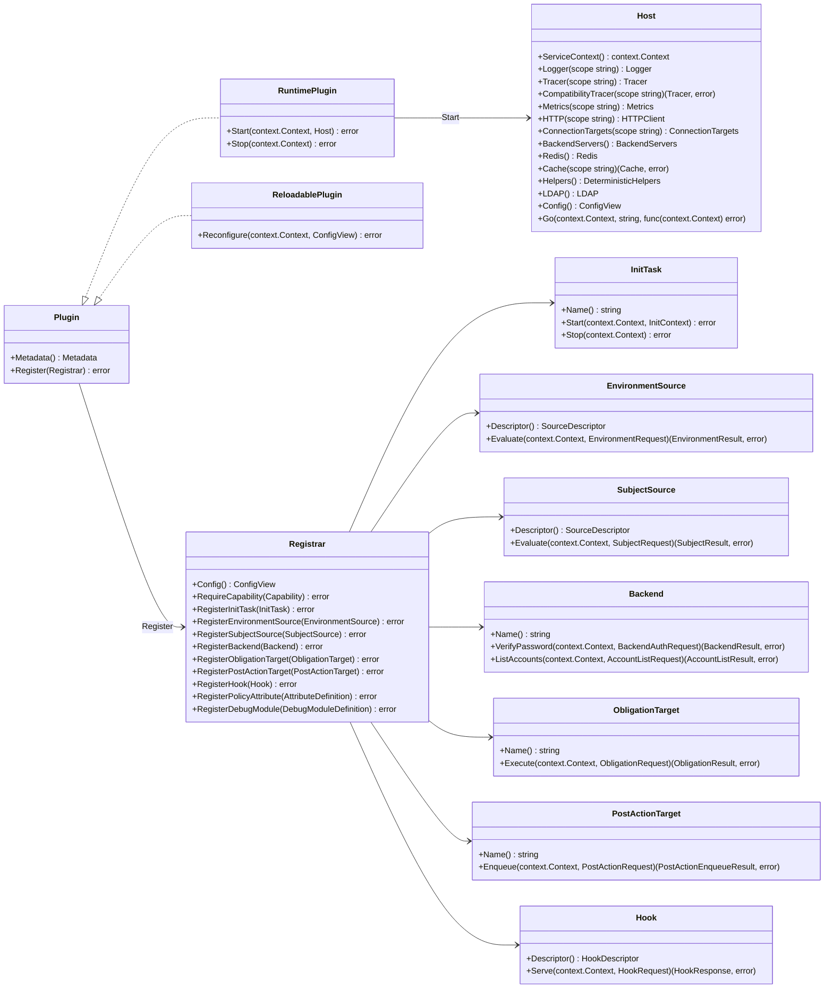
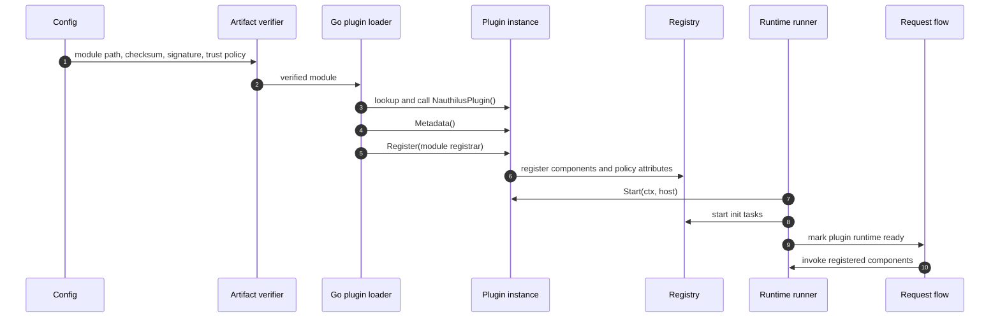
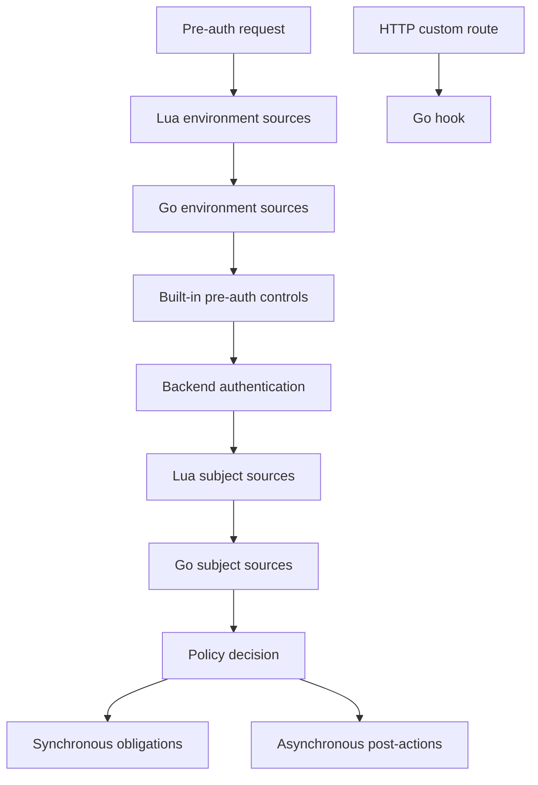

# Native Go Plugin Developer API

This document explains how to write native Go plugins for Nauthilus. It focuses on the developer contract exposed by
`github.com/croessner/nauthilus/v3/pluginapi/v1`, the runtime behavior that plugin authors can rely on, and the current
implementation limits that matter when designing production plugins.

For operator-facing loader configuration, artifact verification, and deployment examples, see
[Native Go Plugins](go_plugins.md). For a complete reference implementation, see `contrib/plugins/geoip`.

## API Model

A native Go plugin is an in-process `.so` artifact loaded with Go's standard `plugin` package. It is trusted server code:
it runs in the Nauthilus process, shares process memory, and must be built with the same toolchain and dependency graph as
the Nauthilus binary.

Every plugin artifact exports one factory symbol:

```go
func NauthilusPlugin() (pluginapi.Plugin, error)
```

The factory returns a fresh `pluginapi.Plugin` instance. Nauthilus calls the factory once for each configured module
instance. A single `.so` file may therefore be configured multiple times with different module names and different
plugin-owned config subtrees.



## Names And Identity

The public API separates product identity from configured module identity:

- `Metadata().Name` is the plugin product name, for example `geoip`.
- `plugins.modules[].name` is the configured module instance name, for example `edge_geoip` or `customer_a_sql`.
- Component names are local to a module and become qualified as `<module>.<component>`.

Module and component names must match this grammar:

```text
[a-z0-9][a-z0-9_]{0,62}
```

Qualified component names use exactly one dot:

```text
<module>.<component>
```

Use qualified names in Nauthilus config surfaces such as plugin backend selectors:

```yaml
auth:
  backends:
    order:
      - plugin(customer_sql.passdb)
```

## Lifecycle

Nauthilus performs plugin setup before request-time plugin execution is enabled:



### Factory

The factory must be exported from a `main` package:

```go
package main

import pluginapi "github.com/croessner/nauthilus/v3/pluginapi/v1"

func NauthilusPlugin() (pluginapi.Plugin, error) {
    return NewPlugin(), nil
}
```

Keep factory work minimal. Heavy validation, file reads, network setup, and worker startup belong in `Register`,
`Start`, or an `InitTask`.

### Metadata

`Metadata()` is called before registration. It must set `APIVersion` to `pluginapi.APIVersion` and provide a non-empty
name and version:

```go
func (p *Plugin) Metadata() pluginapi.Metadata {
    return pluginapi.Metadata{
        Name:       "customer_sql",
        Version:    "1.0.0",
        APIVersion: pluginapi.APIVersion,
        Description: "Customer SQL backend plugin.",
        DocsURL:    "https://example.invalid/customer-sql-plugin",
        Features: []pluginapi.Feature{
            "backend",
            "reconfigure",
        },
        Capabilities: []pluginapi.Capability{
            pluginapi.CapabilityCredentials,
        },
    }
}
```

`Capabilities` declares possible sensitive behavior. It does not grant the module permission by itself.

### Register

`Register(registrar)` declares the module's components. Registration is module-scoped: duplicate component names inside
one module are rejected, and the registry qualifies local component names with the configured module name.

```go
func (p *Plugin) Register(registrar pluginapi.Registrar) error {
    if registrar == nil {
        return fmt.Errorf("registrar is nil")
    }

    var cfg moduleConfig
    if err := registrar.Config().Decode(&cfg); err != nil {
        return err
    }

    if err := registrar.RequireCapability(pluginapi.CapabilityCredentials); err != nil {
        return err
    }

    if err := registrar.RegisterPolicyAttribute(pluginapi.AttributeDefinition{
        ID:          "plugin.backend.customer_sql.account_locked",
        Stage:       pluginapi.PolicyStageAuthBackend,
        Operations:  []pluginapi.PolicyOperation{pluginapi.PolicyOperationAuthenticate},
        ProducerTypes: []string{"backend.plugin"},
        Category:    pluginapi.AttributeCategorySubject,
        Type:        pluginapi.AttributeTypeBool,
        Description: "Reports whether the backend account is administratively locked.",
    }); err != nil {
        return err
    }

    return registrar.RegisterBackend(&backend{cfg: cfg})
}
```

Use `Registrar.Config()` for plugin-owned module config. Nauthilus passes the root `plugins.modules[].config` subtree as
a read-only `ConfigView`. `Decode` is strict and should be treated as part of plugin startup validation.

### Debug Modules

Every configured module automatically has an operator-facing debug selector named `plugin.<module>`, where `<module>` is
the configured `plugins.modules[].name`. Use `RegisterDebugModule` only for meaningful local debug surfaces that an
operator may want to enable independently:

```go
if err := registrar.RegisterDebugModule(pluginapi.DebugModuleDefinition{
    Name:        "lookup",
    Description: "External lookup diagnostics.",
}); err != nil {
    return err
}
```

The host publishes that declaration as `plugin.<module>.lookup`. Local debug names must match
`[a-z0-9][a-z0-9_]{0,62}` and cannot use built-in or control names such as `auth`, `policy`, `all`, `none`, or
`plugin`. Call `host.Logger("lookup").Debug(...)` normally; the host emits the record only when `server.log.level` is
`debug` and `server.log.debug_modules` contains `all`, `plugin`, `plugin.<module>`, or the exact registered local
selector. `Info`, `Warn`, and `Error` records are not gated by plugin debug selectors.

### Start And Stop

Implement `pluginapi.RuntimePlugin` when the plugin needs host services, request-time shared state, or long-lived
resources.

```go
func (p *Plugin) Start(ctx context.Context, host pluginapi.Host) error {
    if host == nil {
        return fmt.Errorf("plugin host is nil")
    }

    p.logger = host.Logger("customer_sql")
    p.tracer = host.Tracer("customer_sql")

    p.logger.Info(ctx, "customer SQL plugin started")
    return nil
}

func (p *Plugin) Stop(ctx context.Context) error {
    p.close()
    return nil
}
```

`Start` runs before request-time component invocation is marked ready. `Stop` runs when Nauthilus shuts down the plugin
runtime. Keep both methods bounded by the context passed by the host.

### Init Tasks

An `InitTask` is a named startup unit registered through `RegisterInitTask`. It receives an `InitContext` with the same
host facade and the module config view. Use init tasks for work that must complete before request-time plugin execution,
such as loading a local database.

```go
type databaseInitTask struct {
    plugin *Plugin
}

func (databaseInitTask) Name() string { return "database" }

func (t databaseInitTask) Start(ctx context.Context, init pluginapi.InitContext) error {
    return t.plugin.loadDatabase(ctx, init.Config)
}

func (t databaseInitTask) Stop(ctx context.Context) error {
    t.plugin.closeDatabase()
    return nil
}
```

### Reconfigure

Implement `pluginapi.ReloadablePlugin` only when plugin-owned config can be changed without replacing the `.so` artifact.
`Reconfigure` receives the new module `ConfigView`. Validate and prepare new state before publishing it. If
`Reconfigure` returns an error, Nauthilus keeps the previous working module config.

Changes outside `plugins.modules[].config` are restart-only. Module identity, artifact path, checksum, signature, signer,
optional flag, capability allowlist, hook authorization, and verification settings require a process restart.

## Host Facades

The `Host` interface hides Nauthilus internals behind narrow facades:

| Facade | Intended use |
| --- | --- |
| `Logger(scope)` | Structured plugin logs through the host logger; `Debug` is gated by registered plugin debug selectors. |
| `Tracer(scope)` | Child spans from plugin call contexts. |
| `CompatibilityTracer(scope)` | Exact operator-allowlisted instrumentation scope for a verified signed module. |
| `Metrics(scope)` | Plugin-owned metric handles with declared labels and duplicate-safe registration. |
| `HTTP(scope)` | Host-managed outbound HTTP with trace propagation, bounded metrics, timeouts, response body limits, and redacted operational logs. |
| `Mail(scope)` | Host-managed SMTP/LMTP sends through value-only mail requests and redacted operational logs. |
| `ConnectionTargets(scope)` | Registration for host-owned generic connection observability. |
| `ServiceContext()` | Process lifetime cancellation signal. |
| `Go(ctx, name, fn)` | Host-supervised worker launch with panic logging, trace/value preservation, and host-lifetime shutdown. |
| `Redis()` | Host-owned Redis command handles, key helpers, and named script registry. |
| `Cache(scope)` | Process-local cache isolated by plugin module scope. |
| `Helpers()` | Deterministic non-secret helpers shared with Lua-compatible behavior. |
| `LDAP()` | Host-owned queued LDAP operations and trace-safe configured endpoint metadata. |
| `Config()` | Host-wide config view. |

Prefer request results for request-scoped facts and runtime changes. For example, return `PolicyFact` values from
`EnvironmentResult`, `SubjectResult`, `BackendResult`, or `ObligationResult` instead of trying to emit request facts
out-of-band.

Current production wiring supplies the host-owned facades above. Some Lua library families remain plugin-owned by design;
see [Current Implementation Notes](#current-implementation-notes).

### HTTP, Mail, And Raw Network Calls

Use `Host.HTTP(scope).Do(ctx, request)` for outbound HTTP that should participate in host-managed trace propagation,
bounded plugin metrics, timeouts, response body limits, and redacted logs. The request is value-oriented: plugins pass a
method, URL, low-cardinality service label, headers, optional body, timeout, and response body limit. The host injects
trace headers from the active context and records `host_http_client_*` plugin metrics under the requested scope. HTTP
logs include service, method, result, status, and duration only; they do not include URLs, query strings, headers,
bodies, bearer tokens, or raw transport errors.

Direct caller-configured HTTP URLs remain supported for explicitly selected internal services such as ClickHouse.
Redirects are stricter: the host permits at most ten hops, requires credential-free HTTPS, and keeps every redirect on
the original HTTPS origin. Configure the final URL when a service redirects to a different host, port, or scheme.

### Trusted Observability Compatibility

Exact legacy observability is an operator-owned, restart-only exception for signed native modules. The module must name a
detached signature and trusted signer, and the loader must record that this signer actually verified the artifact.
Configuration alone does not grant compatibility access, and `verification_policy: off` is rejected for modules that
request the exception.

Set `MetricDefinition.Compatibility`, `Type`, exact `Name`, `Help`, ordered `Labels`, and `Buckets` only when the complete
definition appears in `plugins.modules[].compatibility.metrics`. The host registers the exact legacy collector and keeps
the normal `nauthilus_plugin_<scope>_<name>` collector as supplemental data. Each observation is published once to each
collector. When Lua initialization already registered the exact collector, the signed compatibility facade reuses that
collector only if its type, help, ordered labels, and histogram buckets are identical. This avoids a second registration
while Lua and native callers share the exact series. Any contract drift is rejected; the API never exposes a Prometheus
registerer.

Use `Host.CompatibilityTracer(scope)` only for an allowlisted plugin-owned domain span. `StartWithOptions` accepts the
value-only `SpanKind`; `Span.SetStatus` accepts the value-only `SpanStatus`. `RecordError` records the error but does not
imply status, so set error status explicitly when the operation failed.

Do not wrap `Host.HTTP`, `Host.LDAP`, `Host.Redis`, or `Host.Mail` calls in a compatibility client span. Those network
operations remain host-owned. In particular, `Host.HTTP` emits its single `plugin.http` client span; a second client span
would double-instrument the request. A compatibility span may describe the surrounding plugin domain operation, but it
must not claim the host-owned network call.

Use `Host.Mail(scope).Send(ctx, message)` for SMTP or LMTP sends that should use the host-owned mail transport and
redacted operational logs. Mail requests are value-only `pluginapi.MailMessage` values. A module that enables mail must
request `CapabilityMail`, and the operator must include `mail` in `allow_capabilities`. The plugin still owns
plugin-specific mail config, recipient selection, template parsing and rendering, low-cardinality mail metrics, and any
plugin spans. Do not expose usernames, passwords, recipients, rendered subjects, rendered bodies, server errors, or local
template paths in logs, metrics, traces, policy facts, or status text.

Raw TCP or dialer behavior is plugin-owned in v1, including HAProxy map update style sockets. A plugin that opens raw
network connections must own lifecycle, deadlines, retries, backoff, metrics, tracing, and secret-safe logging. Keep
addresses in module config, never in policy facts, and avoid logging raw commands, map values, request credentials, or
transport errors.

Use `Host.ConnectionTargets(scope).Register(ctx, target)` when plugin-owned network targets should be visible through
host generic connection observability. Targets are named, validated `host:port` values with `local` or `remote`
direction and bounded labels such as `service`, `protocol`, `component`, or `role`. Re-registering the same name,
address, and direction is idempotent; conflicting duplicates fail closed.

### Redis, Cache, And Deterministic Helpers

Use `Host.Redis().Keys()` for Redis keys that must preserve the configured Nauthilus prefix and Redis Cluster hash-tag
behavior:

```go
helpers := host.Helpers()
keys := host.Redis().Keys()

account := request.Snapshot.Account
tag := helpers.AccountTag(account)
locked := keys.SameSlot(keys.Keys("acct:"+tag+":lock", "acct:"+tag+":state"), tag)
```

`Key` and `Keys` apply the host Redis prefix without rewriting an existing hash tag. `SameSlot` preserves keys that
already share a tag and rewrites mismatched tags to the requested tag. For account-scoped keys, prefer
`host.Helpers().AccountTag(account)` so Lua and native components use the same deterministic tag format.

Use `Host.Redis().Scripts()` for host-managed Lua scripts that must be shared between init-time and request-time native
components:

```go
sha, err := host.Redis().Scripts().Upload(ctx, "account_protection.bump", source)
result, err := host.Redis().Scripts().Run(ctx, "account_protection.bump", locked, account)
```

Script names are deterministic and validated. Upload stores the source and SHA, `Run` executes by name, and a Redis
`NOSCRIPT` error triggers one host-managed reload and retry. Script operations respect the caller context and receive a
bounded default timeout when the caller has no deadline.

Named Redis pools are not host-managed in the native contract. A plugin that needs an additional Redis deployment should
read a module-owned config block, build and close its own client in `Start`, `Stop`, and `Reconfigure`, redact connection
details in logs/errors, and keep lifecycle ownership inside that plugin module.

Use `Host.Cache(scope)` for module-owned process-local cache state shared by a plugin module's init tasks and request-time
components. The host validates the scope, isolates cache contents per scope, and supports `Set` with TTL, `Get`, `Exists`,
`Delete`, list `Push`, `PopAll`, and `Clear`. Cache keys and values remain in process memory; avoid high-cardinality cache
metrics or logs.

Use `Host.Helpers()` or the dependency-light `pluginapi/v1/helpers` package for deterministic non-secret logic such as
account hash tags, country display names, scoped IPs, and routable IP checks. `CountryName` uses the same lookup and exact
`"Unknown"` fallback as `nauthilus_misc.get_country_name`; it does not read localization state, configuration, or
secrets. The runtime facade derives account-tag and IP-scoping options from the loaded Nauthilus configuration and
Lua-compatible environment knobs.

### LDAP

Keep the `Host` received by `Start` when request-time components need LDAP. Search and modify are explicit host calls:

```go
result, err := host.LDAP().Search(ctx, pluginapi.LDAPSearchRequest{
    PoolName:   "default",
    BaseDN:     "ou=people,dc=example,dc=test",
    Filter:     "(uid=sample)",
    Scope:      pluginapi.LDAPScopeSub,
    Attributes: []string{"mail", "memberOf"},
})
if err != nil {
    return pluginapi.SubjectResult{}, err
}

if len(result.Entries) == 0 {
    return pluginapi.SubjectResult{Rejected: true}, nil
}

err = host.LDAP().Modify(ctx, pluginapi.LDAPModifyRequest{
    PoolName:  "default",
    DN:        result.Entries[0].DN,
    Operation: pluginapi.LDAPModifyReplace,
    Attributes: map[string][]string{
        "description": {"sample-updated"},
    },
})
if err != nil {
    return pluginapi.SubjectResult{}, err
}
```

`Search` returns `LDAPSearchResult` and an error directly; `Modify` returns its error directly. The host never merges
the search result into `BackendResult`, `SubjectRequest.BackendResult`, or `BackendResultPatch`. After a successful
call, plugin code must deliberately return allowed attributes, facts, logs, status, rejection, or temporary failure.

`LDAPSearchResult.Entries` contains copied public `pluginapi.LDAPEntry` values converted from internal LDAP entries.
Their attribute maps and value slices do not expose raw internal entries, queues, connections, or shared mutable
storage.

Plugins that need configured endpoint attributes for domain spans can request trace-safe metadata without reading raw
LDAP configuration:

```go
endpoints, err := host.LDAP().Endpoints(ctx, "default")
if err != nil {
    return pluginapi.SubjectResult{}, err
}

if len(endpoints) > 0 {
    span.SetAttributes(
        pluginapi.TraceAttribute{Key: "server.address", Value: endpoints[0].Host},
        pluginapi.TraceAttribute{Key: "server.port", Value: endpoints[0].Port},
    )
}
```

Each `LDAPEndpoint` contains only `PoolName`, `Scheme`, `Host`, and `Port`. The host resolves it from the current config
snapshot and returns a detached slice. It never exposes the raw URI, URI userinfo, bind identity, password, search base,
query, fragment, or TLS file settings. The list describes configured failover endpoints in order; it does not prove
which endpoint served a particular queued LDAP operation. Do not use this metadata to bypass `Search` or `Modify` with
a plugin-owned connection.

## Representative Contract Examples

`pluginapi/v1/testdata/sampleplugin` is the compact compile-contract fixture for plugin authors. It deliberately uses
only public API types and exercises the final v1 surfaces that are easy to keep hermetic:

- request snapshots: backend and environment callbacks read safe listener, client-network, IDP/MFA, TLS, and
  `AuthLoginAttempt` values from `RequestSnapshot`;
- backend results: the sample backend returns `Account`, custom `AccountField`, synthetic identity field names and
  groups, attributes, authentication flags, and a registered backend policy fact;
- passwordless lookup: the sample returns the same synthetic identity result when `Runtime.NoAuth` is set and exits
  before credential access;
- typed MFA: the sample demonstrates discovery of the four independent optional backend interfaces, while MFA state
  remains on implementations of those typed interfaces and never enters `BackendResult`;
- subject sources: the sample subject source reads the current backend result, returns a value-only
  `BackendResultPatch`, logs a bounded field, and sets an allowed response header through `SubjectResult.Response`;
- effects: the sample obligation reads policy args/facts, returns a registered `auth_decision` fact, sets explicit logs
  and status, and uses synchronous response mutation;
- hooks: the sample registers GET and HEAD dynamic textmap-style hooks, uses standard `net/http` status constants, and
  returns only `HookResponse` values;
- host services: the sample `Start` method touches backend candidates, deterministic helpers, host-managed HTTP,
  connection-target registration, process cache, and Redis key construction without creating real network dependencies.

The GeoIP reference plugin in `contrib/plugins/geoip` remains the fuller lifecycle example: it registers policy
attributes, starts init work and supervised refresh workers, emits environment facts and runtime deltas, uses bounded
metrics/tracing, and supports config-only reload.

Its MaxMind loader reads each MMDB completely before constructing a reader with `maxminddb.FromBytes`, which keeps
request-time lookups independent of mmap demand paging. Dedicated child spans separate primary database, ASN routing,
ASN database, ASN registry, and privacy lookup time while sharing one bounded `geoip.lookup.result` vocabulary.

Its optional privacy-intelligence path also demonstrates the lifecycle/request boundary for untrusted list data.
Lifecycle code loads local files or calls `Host.HTTP("privacy")`, validates a complete bounded candidate, and atomically
publishes an immutable prefix index. Request-time `Evaluate` only reads that index and returns registered facts plus the
existing `plugin.exchange.geoip` map; it performs no HTTP, DNS, or file I/O. Every remote list kind shares the same
conditional-request, cache, backoff, concurrency, and last-known-good coordinator, while parsers remain small
format-specific responsibilities. Public logs expose only a separate allowlisted projection for evaluated or stale
results. This is the recommended shape for a plugin that refreshes external evidence without making external services
part of authentication latency or decision authority.

## Request Data And Secrets

Plugins receive immutable, redacted request metadata through `RequestSnapshot`. It includes protocol, service, username,
account, client transport metadata, identity fields, IDP/MFA policy inputs, selected TLS facts, request headers,
diagnostics, and runtime flags. Sensitive headers such as authorization and cookie values are redacted by the host.

Legacy Lua `ssl_*` metadata has a lossless native path under `RequestSnapshot.TLS.Legacy`, while normalized TLS values
remain on `RequestSnapshot.TLS` for common policy checks. `Runtime.LocalRequest` is kept for compatibility and mirrors
the explicit `Runtime.NoAuth` flag. `Runtime.Authorized` is a native request-outcome flag populated by the host; it has
no separate legacy Lua request key.

Runtime values are exposed through a read-only `RuntimeContext`:

```go
value, ok := request.Runtime.Get("plugin.exchange.geoip")
snapshot := request.Runtime.Snapshot()
```

Plugins mutate runtime context by returning a `RuntimeDelta`:

```go
return pluginapi.EnvironmentResult{
    RuntimeDelta: pluginapi.RuntimeDelta{
        Set: map[string]any{
            "plugin.environment.customer_risk": map[string]any{
                "score": 42,
            },
        },
    },
}, nil
```

Runtime values must be JSON-compatible scalar, map, or list values. Use stable namespaces. Cross-plugin analytics and
post-action handoff values must use the standard `plugin.exchange.*` keyspace from
`github.com/croessner/nauthilus/v3/pluginapi/v1/exchange`. Producer plugins should set only the exchange keys they own,
for example `plugin.exchange.geoip`, `plugin.exchange.haveibeenpwnd`, or `plugin.exchange.feature.<name>`.

`rt` is historical Lua runtime state. It may still appear in Lua scripts for Lua-only compatibility, but it is not the
native Go plugin exchange standard. Native Go plugins should not read or write `rt`; use `plugin.exchange.*`,
`RuntimeDelta`, and policy facts instead.

Passwords are not present in the snapshot. Components that need request credentials must use the request-scoped
`CredentialProvider` and must require the `credentials` capability during registration:

```go
secret, ok := request.Credentials.Password(ctx)
if !ok || secret.IsZero() {
    return pluginapi.BackendResult{UserFound: true, Authenticated: false}, nil
}

err := secret.WithBytes(func(password []byte) error {
    return verifyPassword(password)
})
```

Never store the byte slice passed to `WithBytes`, never log it, and clear plugin-owned copies immediately after use.
For Nauthilus-compatible password verification, import `github.com/croessner/nauthilus/v3/pluginapi/v1/password` and call
`password.CompareHash(hash, secret)`. The same package exposes `GenerateHash` and `GenerateHashString` for the
Redis-compatible short hash used by Lua `nauthilus_password.generate_password_hash`; server-side nonce and dev-mode
selection remain host-owned, so plugin-owned hashes must pass the same `password.HashOptions` when they need exact
server-context parity.

## Lua Surface Audit

The Lua compatibility audit below is evidence for follow-up API work. It maps the current Lua request table, helper
modules, backend operations, hooks, policy facts, and init behavior to the native Go plugin API as it exists today.
Treat public Go fields as exposed only when the runtime adapter actually populates them.

Status meanings:

| Status | Meaning |
| --- | --- |
| `exposed` | The native API has a public surface and current runtime wiring populates or applies it. |
| `credential-gated` | The value is intentionally absent from snapshots and available only through `CredentialProvider` or operation-scoped secret handling. |
| `helper-facade` | Lua behavior is replaced by a typed result, operation, or host facade instead of a direct request field. |
| `plugin-owned` | Native plugins must own the dependency, config, lifecycle, timeout, logging, and redaction behavior. |
| `intentionally excluded` | The native API deliberately does not expose the Lua surface. |
| `missing` | The Lua surface has no current native equivalent or the public type is not populated by the adapter. |

### CommonRequest Fields

Evidence sources: `server/lualib/request.go`, `server/definitions/const.go`, bundled scripts under
`server/lua-plugins.d`, `pluginapi/v1`, and `server/pluginruntime`.

| Lua field | Lua key | Native surface today | Status | Audit note |
| --- | --- | --- | --- | --- |
| `BackendServers` | none; `nauthilus_backend.get_backend_servers()` | `Host.BackendServers().List(ctx)` returns `BackendServerCandidate` values; `SubjectResult.SelectedBackend` returns the selected target. | `helper-facade` | Native plugins read defensive candidate copies from the same monitored core list used by Lua. |
| `TOTPRecoveryCodes` | `totp_recovery_codes` | Optional `RecoveryCodeBackend` operations. | `helper-facade` | Native API is operation-scoped and does not expose raw codes on `RequestSnapshot`. |
| `RequestedScopes` | `requested_scopes` | `RequestSnapshot.IDP.RequestedScopes`. | `exposed` | Populated by auth adapter from IDP session state and by hook metadata. |
| `UserGroups` | `user_groups` | `RequestSnapshot.IDP.UserGroups`. | `exposed` | Populated from resolved auth groups and by hook metadata. |
| `AllowedClientScopes` | `allowed_client_scopes` | `RequestSnapshot.IDP.AllowedClientScopes`. | `exposed` | Populated from the configured OIDC client and by hook metadata. |
| `AllowedClientGrantTypes` | `allowed_client_grant_types` | `RequestSnapshot.IDP.AllowedClientGrantTypes`. | `exposed` | Populated from the configured OIDC client and by hook metadata. |
| `Service` | `service` | `RequestSnapshot.Service`. | `exposed` | Populated by auth and hook adapters. |
| `Session` | `session` | `RequestSnapshot.Session`. | `exposed` | Populated from the request GUID or hook metadata. |
| `ExternalSessionID` | `external_session` | `RequestSnapshot.ExternalSessionID`. | `exposed` | Populated by auth and hook adapters. |
| `HealthCheck` | `health_check` | `RequestSnapshot.HealthCheck`. | `exposed` | Populated by auth adapter; hook requests do not currently set it. |
| `ClientIP` | `client_ip` | `RequestSnapshot.ClientIP`. | `exposed` | Populated by auth and hook adapters. |
| `ClientPort` | `client_port` | `RequestSnapshot.ClientPort`. | `exposed` | Populated from `XClientPort` or hook remote address metadata. |
| `ClientNet` | `client_net` | `RequestSnapshot.ClientNet`. | `exposed` | Populated from brute-force client-network state or hook metadata. |
| `ClientHost` | `client_hostname` | `RequestSnapshot.ClientHost`. | `exposed` | Native field name is `ClientHost`; Lua key is `client_hostname`. |
| `ClientID` | `client_id` | `RequestSnapshot.ClientID`. | `exposed` | Populated from structured/core request metadata and hook metadata. |
| `UserAgent` | `user_agent` | `RequestSnapshot.UserAgent`. | `exposed` | Populated by auth and hook adapters. |
| `LocalIP` | `local_ip` | `RequestSnapshot.LocalIP`. | `exposed` | Populated from structured/core request metadata and hook metadata. |
| `LocalPort` | `local_port` | `RequestSnapshot.LocalPort`. | `exposed` | Populated from structured/core request metadata and hook metadata. |
| `Username` | `username` | `RequestSnapshot.Username`; backend requests also carry `Username`. | `exposed` | Populated by auth and hook adapters where metadata exists. |
| `Account` | `account` | `RequestSnapshot.Account`; `BackendResult.Account`. | `exposed` | Populated by auth adapter and backend result mapping. |
| `AccountField` | `account_field` | `RequestSnapshot.AccountField`; `BackendResult.AccountField`; `SubjectRequest.BackendResult.AccountField`; `BackendResultPatch.AccountField`. | `exposed` | Backend results preserve custom account fields; an empty backend plugin account field defaults to `account`. |
| `UniqueUserID` | `unique_user_id` | `RequestSnapshot.UniqueUserID`. | `exposed` | Populated by auth adapter from resolved attributes and by hook metadata. |
| `DisplayName` | `display_name` | `RequestSnapshot.DisplayName`. | `exposed` | Populated by auth adapter from resolved attributes and by hook metadata. |
| `Password` | `password` | `CredentialProvider.Password(ctx)`. | `credential-gated` | Deliberately absent from `RequestSnapshot`. |
| `WebAuthnCredential` | `webauthn_credential` | Optional `WebAuthnBackend` operation requests. | `helper-facade` | Native API uses typed credentials instead of serialized JSON request fields. |
| `WebAuthnOldCredential` | `webauthn_old_credential` | `WebAuthnUpdateRequest.OldCredential`. | `helper-facade` | Native API uses typed credentials instead of serialized JSON request fields. |
| `Protocol` | `protocol` | `RequestSnapshot.Protocol`. | `exposed` | Populated by auth and hook adapters. |
| `Method` | `method` | `RequestSnapshot.Method`; `HookRequest.Method`. | `exposed` | Populated by auth and hook adapters. |
| `OIDCCID` | `oidc_cid` | `RequestSnapshot.OIDCCID`. | `exposed` | Populated by auth and hook adapters where metadata exists. |
| `SAMLEntityID` | `saml_entity_id` | `RequestSnapshot.SAMLEntityID`. | `exposed` | Populated by auth and hook adapters where metadata exists. |
| `AuthLoginAttempt` | `auth_login_attempt` | `RequestSnapshot.AuthLoginAttempt`; Lua `CommonRequest.AuthLoginAttempt`. | `exposed` | Populated from structured/core request metadata. |
| `GrantType` | `grant_type` | `RequestSnapshot.IDP.GrantType`. | `exposed` | Populated from IDP session state, grant-type context, or hook metadata. |
| `OIDCClientName` | `oidc_client_name` | `RequestSnapshot.IDP.ClientName`. | `exposed` | Populated from configured OIDC client metadata and hook metadata. |
| `RedirectURI` | `redirect_uri` | `RequestSnapshot.IDP.RedirectURI`. | `exposed` | Populated from IDP session state and hook metadata. |
| `MFAMethod` | `mfa_method` | `RequestSnapshot.IDP.MFAMethod`. | `exposed` | Populated from IDP session state and hook metadata. |
| `BruteForceName` | `brute_force_bucket` | `RequestSnapshot.Diagnostics.BruteForceName`. | `exposed` | Populated from auth brute-force state and hook metadata. |
| `EnvironmentName` | `environment` | `RequestSnapshot.Diagnostics.EnvironmentName`. | `exposed` | Populated from auth runtime state and hook metadata. |
| `XSSL` | `ssl` | `TLSInfo.Enabled`; `TLSInfo.Legacy.State`. | `exposed` | Native surface has normalized TLS state plus the original safe legacy value. |
| `XSSLSessionID` | `ssl_session_id` | `TLSInfo.Legacy.SessionID`. | `exposed` | Forwarding and logging use cases can read the compatibility value. |
| `XSSLClientVerify` | `ssl_client_verify` | `TLSInfo.Mutual` and `TLSInfo.VerifiedChains`. | `exposed` | Native adapter maps `SUCCESS` to verified state. |
| `XSSLClientDN` | `ssl_client_dn` | `TLSInfo.Legacy.ClientDN`. | `exposed` | Forwarding and logging use cases can read the compatibility value. |
| `XSSLClientCN` | `ssl_client_cn` | `TLSInfo.PeerCommonName`. | `exposed` | Populated by auth adapter. |
| `XSSLIssuer` | `ssl_issuer` | `TLSInfo.PeerIssuer`. | `exposed` | Populated by auth adapter. |
| `XSSLClientNotBefore` | `ssl_client_not_before` | `TLSInfo.Legacy.ClientNotBefore`. | `exposed` | Native API uses the defined Lua key shape; stale no-underscore Lua reads remain documented below. |
| `XSSLClientNotAfter` | `ssl_client_not_after` | `TLSInfo.Legacy.ClientNotAfter`. | `exposed` | Native API uses the defined Lua key shape; stale no-underscore Lua reads remain documented below. |
| `XSSLSubjectDN` | `ssl_subject_dn` | `TLSInfo.ServerName`. | `exposed` | Native name is normalized but currently populated from `XSSLSubjectDN`. |
| `XSSLIssuerDN` | `ssl_issuer_dn` | `TLSInfo.Legacy.IssuerDN`. | `exposed` | Forwarding and logging use cases can read the compatibility value. |
| `XSSLClientSubjectDN` | `ssl_client_subject_dn` | `TLSInfo.Legacy.ClientSubjectDN`. | `exposed` | Forwarding and logging use cases can read the compatibility value. |
| `XSSLClientIssuerDN` | `ssl_client_issuer_dn` | `TLSInfo.Legacy.ClientIssuerDN`. | `exposed` | Forwarding and logging use cases can read the compatibility value. |
| `XSSLProtocol` | `ssl_protocol` | `TLSInfo.Version`. | `exposed` | `actions/clickhouse.lua` also reads stale `xssl_protocol`. |
| `XSSLCipher` | `ssl_cipher` | `TLSInfo.CipherSuite`. | `exposed` | `actions/clickhouse.lua` also reads stale `xssl_cipher`. |
| `SSLSerial` | `ssl_serial` | `TLSInfo.Legacy.Serial`. | `exposed` | Forwarding and logging use cases can read the compatibility value. |
| `SSLFingerprint` | `ssl_fingerprint` | `TLSInfo.Legacy.Fingerprint`. | `exposed` | Forwarding and logging use cases can read the compatibility value. |
| `RedisPrefix` | `redis_prefix` | `Host.Redis().Keys()` applies the configured prefix. | `helper-facade` | Native snapshots do not carry the raw prefix; plugins build host-prefixed keys through the key helper. |
| `StatusMessage` | `status_message` | `RequestSnapshot.Diagnostics.StatusMessage`; request-time result `StatusMessage` types. | `exposed` | Snapshots expose current host status; request-time results remain the mutation path. |
| `UsedBackendAddr` | not written by `SetupRequest` | None as request input; selected backend can be returned. | `missing` | Native snapshots do not expose the already used backend address. |
| `UsedBackendPort` | not written by `SetupRequest` | None as request input; selected backend can be returned. | `missing` | Native snapshots do not expose the already used backend port. |
| `Latency` | `latency` | `RequestSnapshot.Diagnostics.LatencyMillis`. | `exposed` | Populated from request start time when available. |
| `BruteForceCounter` | `brute_force_counter` | `RequestSnapshot.Diagnostics.BruteForceCounter`. | `exposed` | Populated for the active brute-force bucket when available. |
| `HTTPStatus` | `http_status` | `RequestSnapshot.Diagnostics.HTTPStatus`. | `exposed` | Populated from auth outcome status codes and hook metadata. |
| `Debug` | `debug` | `RequestSnapshot.Runtime.Debug`. | `exposed` | Populated from effective log level and hook metadata. |
| `Repeating` | `repeating` | `RequestSnapshot.Runtime.Repeating`. | `exposed` | Populated from brute-force runtime state and hook metadata. |
| `RWP` | `rwp` | `RequestSnapshot.Runtime.RWP`. | `exposed` | Populated from repeating-wrong-password runtime state and hook metadata. |
| `UserFound` | `user_found` | `RequestSnapshot.Runtime.UserFound`; `BackendResult.UserFound`. | `exposed` | Populated from auth runtime/account state and hook metadata. |
| `Authenticated` | `authenticated` | `RequestSnapshot.Runtime.Authenticated`; `BackendResult.Authenticated`. | `exposed` | Populated by auth and hook adapters where metadata exists. |
| `NoAuth` | `no_auth` | `RequestSnapshot.Runtime.NoAuth`; `RequestSnapshot.Runtime.LocalRequest`. | `exposed` | `LocalRequest` is kept as a compatibility alias for `NoAuth`. |
| `EnvironmentRejected` | `environment_rejected` | `RequestSnapshot.Runtime.EnvironmentRejected`. | `exposed` | Populated from request context and hook metadata where known. |
| `EnvironmentStageExpected` | `environment_stage_expected` | `RequestSnapshot.Runtime.EnvironmentStageExpected`. | `exposed` | Populated from configured Lua environment sources and hook metadata. |
| `SubjectStageExpected` | `subject_stage_expected` | `RequestSnapshot.Runtime.SubjectStageExpected`. | `exposed` | Populated from configured Lua subject sources and hook metadata. |
| `MFACompleted` | `mfa_completed` | `RequestSnapshot.IDP.MFACompleted`. | `exposed` | Populated from IDP session state and hook metadata. |

### Helper Modules And Script Families

Evidence examples include `backend/proxy_backend.lua`, `subject/idp_policy.lua`, `subject/monitoring.lua`,
`subject/account_protection_mode.lua`, `actions/clickhouse.lua`, `actions/dynamic_response.lua`,
`hooks/dynamic-textmap-demo.lua`, `init/init.lua`, `share/nauthilus_policy_facts.lua`, and `policy/registry.lua`.

| Lua surface | Bundled evidence | Native surface today | Status | Audit note |
| --- | --- | --- | --- | --- |
| `nauthilus_context` | Policy facts bridge, account protection, dynamic response, clickhouse | `RuntimeContext` plus returned `RuntimeDelta`. | `helper-facade` | Native plugins return deltas instead of mutating request context directly. |
| `nauthilus_policy` and `nauthilus_policy_facts` | `share/nauthilus_policy_facts.lua`, `policy/registry.lua` | `Registrar.RegisterPolicyAttribute`, result `Facts`, and `pluginapi.PluginPolicyAttributeID`. | `helper-facade` | Attribute declaration and fact emission are exposed. Native facts use the `plugin.*` namespace; migrated Lua names may remain registered separately. |
| Public custom logs and status helper | `nauthilus_policy_facts.emit_public`, `status_message` | Result `Logs`, `StatusMessage`, and `pluginapi.PublicPolicyFactLogField`. | `helper-facade` | Public visibility is explicit through log fields or status messages; facts alone are private policy evidence. |
| `nauthilus_backend.get_backend_servers` | `subject/monitoring.lua` | `Host.BackendServers().List(ctx)`. | `helper-facade` | The host returns value-only `BackendServerCandidate` copies with protocol, address, port, HAProxy-v2, and liveness. |
| `nauthilus_backend.select_backend_server` | `subject/monitoring.lua` | `SubjectResult.SelectedBackend`. | `exposed` | Native subject sources can return a selected backend. |
| `nauthilus_backend.apply_backend_result` and `nauthilus_backend_result` | `subject/monitoring.lua` | `SubjectResult.BackendResultPatch`, `SubjectResult.BackendAttributes`, and `SubjectRequest.BackendResult`. | `helper-facade` | Native subject sources return an explicit value-only patch for account, account field, auth flags, selected backend, and string attributes. Full mutable backend-result replacement is unsupported. |
| `nauthilus_http_request` | `subject/monitoring.lua`, `hooks/dynamic-textmap-demo.lua` | `RequestSnapshot.Headers`, `HookRequest.Headers`, `HookRequest.Query`, `HookRequest.Body`, `HookRequest.Path`, `HookRequest.Method`. | `exposed` | Hook parity is close; subject/header access depends on snapshot headers. |
| `nauthilus_http_response` in hooks | `hooks/dynamic-textmap-demo.lua` | `HookResponse.Headers`, `Body`, and `StatusCode`. | `helper-facade` | Gin-style helpers are replaced by explicit response values. |
| `nauthilus_http_response` outside hooks | `subject/account_protection_mode.lua`, `actions/bruteforce_header.lua` | `SubjectResult.Response` and `ObligationResult.Response`. | `helper-facade` | Native plugins return value-oriented header mutations. Post-actions do not expose late response mutation. |
| `nauthilus_redis` command helpers | Monitoring, account protection, dynamic response, init | `Host.Redis()` read/write/pipeline handles plus `Keys()` and `Scripts()`. | `exposed` | Basic Redis access is exposed through go-redis command facades; host-owned helpers cover prefixing and named scripts. |
| Redis script upload and named execution | `init/init.lua`, account protection, dynamic response | `Host.Redis().Scripts().Upload` and `Run`. | `helper-facade` | Named scripts are validated, stored by source/SHA, context-bounded, and retried once after `NOSCRIPT`. |
| Named Redis pools | `init/init.lua` | None. | `plugin-owned` | Plugins must own extra pools, redaction, config, and lifecycle for now. |
| `nauthilus_cache` | Account protection, clickhouse | `Host.Cache(scope)`. | `helper-facade` | Native module caches are isolated by scope and support TTL, get/exists/delete, list push/pop-all, and clear. |
| Redis key prefix helpers | `nauthilus_util.get_redis_key` | `Host.Redis().Keys()`. | `helper-facade` | The key builder applies the host prefix and preserves or normalizes Redis Cluster hash tags. |
| Account hash-tag helpers | `nauthilus_keys` | `Host.Helpers().AccountTag` and `pluginapi/v1/helpers.AccountTag`. | `helper-facade` | Account tags share one deterministic helper implementation for Lua-compatible native ports. |
| Country display-name helper | `nauthilus_misc.get_country_name` | `Host.Helpers().CountryName` and `pluginapi/v1/helpers.CountryName`. | `helper-facade` | Native and Lua callers share one deterministic lookup and the exact `"Unknown"` fallback. |
| Scoped-IP and routable-IP helpers | `nauthilus_misc.scoped_ip`, `nauthilus_util.is_routable_ip` | `Host.Helpers().ScopedIP`, `IsRoutableIP`, and `pluginapi/v1/helpers`. | `helper-facade` | Deterministic utility helpers are public and dependency-light; the runtime facade supplies config-derived scoping. |
| Password helpers | `nauthilus_password.compare_passwords`, `generate_password_hash` | `pluginapi/v1/password` plus `CredentialProvider`. | `exposed` | Public helpers share the same compare, SSHA parsing, crypt verifier, prepared-byte, and short-hash implementation used by Lua/server utilities. |
| `nauthilus_prometheus` | Proxy backend, account protection, clickhouse, init | `Host.Metrics()`. | `exposed` | Plugin metrics are exported under the native plugin namespace; gauges support set and add semantics, histograms observe samples, and zero-valued counter series can be touched with `Add(ctx, 0, labels...)`. |
| `nauthilus_opentelemetry` | Proxy backend, account protection, dynamic response | `Host.Tracer()` and `Host.HTTP()`. | `helper-facade` | Span creation is exposed; host-managed HTTP injects trace headers and records bounded HTTP spans. Lua semantic helpers are not exact native APIs. |
| `nauthilus_psnet` | `init/init.lua` | `Host.ConnectionTargets(scope).Register(ctx, target)`. | `helper-facade` | Native plugins can register named connection targets for host generic connection observability. |
| `nauthilus_mail` | `actions/dynamic_response.lua`, `actions/haveibeenpwnd.lua` | `Host.Mail(scope)` with `pluginapi.MailMessage`. | `helper-facade` | Host-managed SMTP/LMTP sends are available for bounded mail notifications. Plugins still own message selection, templates, module config, and must request `CapabilityMail`. |
| Outbound HTTP libraries | Proxy backend, clickhouse, notifications | `Host.HTTP(scope).Do(ctx, request)`. | `helper-facade` | Use the host facade for traced, metered, bounded HTTP calls; plugin-owned clients remain possible when the facade is insufficient and must carry their own observability. |
| Raw TCP, SQL, Telegram, template, JSON, time, base64, crypto libraries | Actions and shared scripts | Standard Go or plugin dependencies. | `plugin-owned` | Native plugins own dependencies and observability unless the host exposes a specific facade. Raw TCP/dialer behavior remains plugin-owned. |
| `nauthilus_geoip_bridge` | Clickhouse, dynamic response | Runtime context produced by the GeoIP plugin. | `plugin-owned` | This is a Lua compatibility bridge over plugin-owned runtime facts. |

### Backend Operations

| Lua operation family | Lua evidence | Native surface today | Status | Audit note |
| --- | --- | --- | --- | --- |
| Password verification | `backend/proxy_backend.lua` | `Backend.VerifyPassword` with `BackendAuthRequest.Credentials`. | `credential-gated` | Password material stays outside the snapshot. |
| Account listing | Lua backend account providers | `Backend.ListAccounts` and `AccountListResult.Facts`. | `exposed` | Runtime validates and emits account-provider facts. |
| Backend result account field | `LuaBackendResult.AccountField` | `BackendResult.AccountField`; `SubjectRequest.BackendResult.AccountField`; `BackendResultPatch.AccountField`. | `exposed` | Runtime maps custom fields into `PassDBResult.AccountField` and keeps the account value under the selected backend attribute. |
| Backend result attributes | `nauthilus_backend_result` | `BackendResult.Attributes`, `SubjectResult.BackendAttributes`, `BackendResultPatch.Attributes`. | `exposed` | Direct string attribute set/delete is available; full backend-result pointer replacement is unsupported. |
| Backend result identity metadata | `LuaBackendResult` unique-ID, display-name, TOTP field-name, group, and group-DN fields | `BackendResult.Identity` with `BackendIdentityResult`; safe values are also populated on `SubjectRequest.BackendResult.Identity`. | `exposed` | Native forward mapping covers all six identity properties. Found-user groups are authoritative; subject readback clones mutable collections per request. |
| TOTP add/delete/verify flows | `backend/proxy_backend.lua`, backend examples | Optional `TOTPBackend`. | `helper-facade` | Native API uses begin/finish/verify/delete flows instead of raw Lua request fields. |
| Recovery-code add/use/delete flows | `backend/proxy_backend.lua` | Optional `RecoveryCodeBackend`. | `helper-facade` | Native API generates/uses/deletes codes; arbitrary code injection is not a direct request field. |
| WebAuthn list/save/update/delete | `backend/proxy_backend.lua` | Optional `WebAuthnBackend`. | `helper-facade` | Native API uses typed `WebAuthnCredential` values. |
| Public MFA state | Identity edge use cases | Optional `PublicMFAStateBackend`. | `exposed` | Native API has typed public MFA metadata. |

Native, remote, and Lua backends do not have identical result objects. Native Go uses the explicit
`BackendIdentityResult` value and typed optional MFA interfaces. Remote user snapshots currently populate account,
synthetic unique-ID and display-name fields, attributes, groups, group DNs, and backend reference; the remote password
response has its separate implemented field set. Lua retains a wider mutable backend result, including serialized
WebAuthn credential values. These are documented differences, not claims that remote or Lua runtime behavior changed.

### Init, Hooks, And Stale Lua Expectations

| Surface | Evidence | Native surface today | Status | Audit note |
| --- | --- | --- | --- | --- |
| Init task startup | `init/init.lua` | `InitTask.Start` and `InitTask.Stop`. | `exposed` | Native tasks can initialize module state and metrics. |
| Init-time metric creation | `init/init.lua` | `Host.Metrics()`. | `exposed` | Current host exports plugin metrics. |
| Init-time Redis script upload | `init/init.lua` | `Host.Redis().Scripts().Upload`. | `helper-facade` | Init tasks can upload named scripts for request-time native components to run by name. |
| Init-time connection targets | `init/init.lua` | `Host.ConnectionTargets(scope).Register(ctx, target)`. | `helper-facade` | Init tasks can register named targets for host generic connection observability. |
| Hook request read surface | `hooks/dynamic-textmap-demo.lua` | `HookRequest` headers, query, body, path, and method. | `exposed` | Follow-up tests should pin GET, HEAD, aliases, and body handling. |
| Hook response write surface | `hooks/dynamic-textmap-demo.lua` | `HookResponse` headers, body, and status code. | `exposed` | Gin helper names are not preserved. |
| `request.auth_login_attempt` | `backend/proxy_backend.lua` | `CommonRequest.AuthLoginAttempt`; `RequestSnapshot.AuthLoginAttempt`. | `exposed` | Populated from structured/core request metadata for Lua and native adapters. |
| `request.ssl_client_notbefore` and `request.ssl_client_notafter` | `backend/proxy_backend.lua` | Lua defines `ssl_client_not_before` and `ssl_client_not_after`. | `intentionally excluded` | Stale key names should be cleaned up separately from Go API work. |
| `request.xssl_protocol` and `request.xssl_cipher` | `actions/clickhouse.lua` | Lua defines `ssl_protocol` and `ssl_cipher`; native maps to `TLSInfo`. | `intentionally excluded` | Stale key names should be cleaned up separately from Go API work. |

## Extension Points



### Environment Sources

Environment sources run before backend authentication and emit pre-auth facts, runtime deltas, logs, status messages, and
optional trigger or abort signals.

```go
type riskSource struct{}

func (riskSource) Descriptor() pluginapi.SourceDescriptor {
    return pluginapi.SourceDescriptor{
        Name:        "risk",
        Timeout:     50 * time.Millisecond,
        AbortPolicy: pluginapi.AbortPolicyRequest,
    }
}

func (riskSource) Evaluate(ctx context.Context, request pluginapi.EnvironmentRequest) (pluginapi.EnvironmentResult, error) {
    risky := request.Snapshot.ClientIP == "203.0.113.10"

    return pluginapi.EnvironmentResult{
        Triggered: risky,
        Facts: []pluginapi.PolicyFact{
            {Attribute: "plugin.environment.customer_risk.triggered", Value: risky},
        },
        RuntimeDelta: pluginapi.RuntimeDelta{
            Set: map[string]any{
                "plugin.environment.customer_risk": map[string]any{"triggered": risky},
            },
        },
    }, nil
}
```

Register policy attributes for every fact you return. Unknown facts fail safely.

Dependency scheduling uses `SourceDescriptor.Requires` and `SourceDescriptor.After` within the registered Go source set.
The current implementation does not build one combined Lua and Go source graph.

### Subject Sources

Subject sources run after backend evaluation. They receive the mapped backend result and can enrich backend attributes,
select a backend reference, emit facts, set runtime values, or reject the subject.

```go
type subjectEnricher struct{}

func (subjectEnricher) Descriptor() pluginapi.SourceDescriptor {
    return pluginapi.SourceDescriptor{Name: "subject_enricher"}
}

func (subjectEnricher) Evaluate(ctx context.Context, request pluginapi.SubjectRequest) (pluginapi.SubjectResult, error) {
    if !request.BackendResult.Authenticated {
        return pluginapi.SubjectResult{}, nil
    }

    return pluginapi.SubjectResult{
        BackendAttributes: pluginapi.AttributePatch{
            Set: map[string][]string{
                "plugin_groups": []string{"trusted"},
            },
        },
        Facts: []pluginapi.PolicyFact{
            {Attribute: "plugin.subject.customer_sql.trusted", Value: true},
        },
    }, nil
}
```

Subject source results are merged deterministically per dependency level. A terminal subject rejection is explicit:
return `SubjectResult{Rejected: true}` and write policies against the generated native subject fact, for example
`auth.plugin.subject.example_auth.policy.rejected`. Returning an error is different: the host records the generated
`.error` fact and maps the check to a temporary failure. Backend temporary failures remain available through
`auth.backend.tempfail`. Do not treat a non-`none` reject reason as proof that a native subject source rejected the
subject.

Subject sources can patch safe backend-result values explicitly. This is the native replacement for Lua's mutable
backend-result object; plugins return values instead of receiving a pointer to internal host state:

```go
authenticated := true

return pluginapi.SubjectResult{
    BackendResultPatch: &pluginapi.BackendResultPatch{
        Account:       "alice@example.test",
        AccountField:  "mail",
        Authenticated: &authenticated,
        Attributes: pluginapi.AttributePatch{
            Set: map[string][]string{
                "mail": []string{"alice@example.test"},
            },
        },
    },
}, nil
```

The patch supports account, account field, user-found/authenticated flags, selected backend, and string backend
attributes. It cannot patch unique-ID or display-name field metadata, TOTP field names, groups, group DNs, status,
facts, or WebAuthn values. Full backend-result replacement and mutable backend result pointers remain unsupported.

`SubjectRequest.BackendResult` includes safe identity readback from the retained PassDB result. Every subject invocation,
including parallel siblings, receives independent copies of attributes, groups, and group DNs. Mutating those input
values does not mutate retained core state or another subject request. Forward backend mapping preserves plugin status
and validated facts internally, but reverse subject readback intentionally leaves `BackendResult.Status` and
`BackendResult.Facts` empty.

`BackendResult.BackendServer` identifies the authority returned by the backend call. `SubjectResult.SelectedBackend`
and `BackendResultPatch.SelectedBackend` are subject outputs that select a replacement for later processing; they do
not add a `SelectedBackend` field to `BackendResult`.

Subject sources that need monitored backend targets should keep the `Host` facade received by their runtime plugin
`Start` method and read candidates through `host.BackendServers().List(ctx)`. The host returns defensive value copies
from the same eligible backend-server list used by Lua `nauthilus_backend.get_backend_servers()`. Candidate fields are
limited to selection data: protocol, address, port, HAProxy-v2 mode, and liveness. `Name` and `Authority` are present in
the API but remain empty when the underlying backend-server monitor has no stable values for them.

```go
func (s *subjectRouter) Evaluate(ctx context.Context, request pluginapi.SubjectRequest) (pluginapi.SubjectResult, error) {
    for _, candidate := range s.host.BackendServers().List(ctx) {
        if candidate.Protocol != request.Snapshot.Protocol || !candidate.Alive {
            continue
        }

        ref := candidate.Ref()

        return pluginapi.SubjectResult{SelectedBackend: &ref}, nil
    }

    return pluginapi.SubjectResult{}, errNoBackendCandidate
}
```

Returning an error maps to a secret-safe temporary failure. Returning `Rejected: true` maps to authentication failure.
Use separate deny and tempfail policy rules when a subject source can both reject and fail temporarily. The host does not
auto-select a backend when the candidate list is empty.

### Response Mutations

Subject sources and synchronous obligations can return a value-oriented response mutation while the HTTP response is
still mutable:

```go
return pluginapi.SubjectResult{
    Response: pluginapi.ResponseMutation{
        Headers: pluginapi.ResponseHeaderMutation{
            Set: map[string][]string{
                "X-Nauthilus-Protection": {"stepup"},
            },
            Delete: []string{"X-Nauthilus-Protection-Reason"},
        },
    },
}, nil
```

This is the native path for bundled Lua patterns such as `subject/account_protection_mode.lua` and
`actions/bruteforce_header.lua`. The host canonicalizes header names, applies deletes before sets, and applies multiple
timely extension results in deterministic source/effect order. Later sets for the same canonical header replace earlier
values.

The response mutation surface intentionally supports headers only. It does not expose `http.ResponseWriter`, Gin
contexts, response bodies, cookies, streaming, or arbitrary HTTP status-code writes. A plugin that needs a full custom
HTTP response should use a native hook and return `HookResponse`.

The host filters unsafe headers instead of writing them. Forbidden names include `Set-Cookie`, `Cookie`, `Authorization`,
`Proxy-Authorization`, hop-by-hop headers, `Auth-Status`, and configured password-bearing request header names. To expose
a client-visible status text, return `Status` and set `Response.StatusHeader` when the current mutable HTTP response
should receive the selected `Auth-Status` value immediately. Normal auth responses still render the selected status at
the response boundary.

Post-actions run detached after the policy decision and have no response mutation field. For non-HTTP request paths or
responses that are already written, response mutations are deterministic no-ops.

### Backends

A backend plugin implements password verification and account listing:

```go
type backend struct {
    cfg moduleConfig
}

func (b *backend) Name() string { return "passdb" }

func (b *backend) VerifyPassword(ctx context.Context, request pluginapi.BackendAuthRequest) (pluginapi.BackendResult, error) {
    result := pluginapi.BackendResult{
        UserFound:    true,
        Account:      request.Username,
        AccountField: "uid",
        Attributes: map[string][]string{
            "uid":         {request.Username},
            "entryUUID":   {"sample-user-id"},
            "displayName": {"Sample User"},
        },
        Identity: pluginapi.BackendIdentityResult{
            UniqueUserIDField:       "entryUUID",
            DisplayNameField:        "displayName",
            TOTPSecretField:         "totpSecret",
            TOTPRecoveryField:       "totpRecovery",
            Groups:                  []string{"sample-users"},
            GroupDistinguishedNames: []string{"cn=sample-users,dc=example,dc=test"},
        },
    }

    if request.Snapshot.Runtime.NoAuth {
        return result, nil
    }

    secret, ok := request.Credentials.Password(ctx)
    if !ok {
        return result, nil
    }

    matched, err := password.CompareHash(b.lookupPasswordHash(request.Username), secret)
    if err != nil {
        return pluginapi.BackendResult{}, err
    }

    result.Authenticated = matched
    result.Facts = []pluginapi.PolicyFact{
        {Attribute: "plugin.backend.customer_sql.authenticated", Value: matched},
    }

    return result, nil
}

func (b *backend) ListAccounts(ctx context.Context, request pluginapi.AccountListRequest) (pluginapi.AccountListResult, error) {
    accounts, err := b.listAccounts(ctx, request.Username)
    if err != nil {
        return pluginapi.AccountListResult{Status: &pluginapi.StatusMessage{Temporary: true}}, err
    }

    return pluginapi.AccountListResult{Accounts: accounts}, nil
}
```

Configure backend use with a qualified selector:

```yaml
auth:
  backends:
    order:
      - plugin(customer_sql.passdb)
```

Non-empty identity field names use the same backend-attribute grammar as `AccountField`. The runtime copies backend
attributes, groups, and group DNs before retaining them. Empty identity field names preserve existing runtime field
state. For a found user, returned groups and group DNs are authoritative: empty slices deliberately clear previously
resolved values.

IdP username lookup sets `Runtime.NoAuth`. A native backend can return `UserFound`, account, attributes, and identity
metadata without reading `Credentials`; the compact sample and the example above branch before password access. TOTP
field names in `BackendIdentityResult` are field-name metadata only and do not carry secret or recovery-code values.

`BackendResult.BackendServer` remains the forward backend authority reference. Backend results do not have a subject
`SelectedBackend` property.

Optional MFA interfaces are attached to the same backend component:

| Optional interface | Purpose |
| --- | --- |
| `TOTPBackend` | Backend-owned TOTP registration, verification, and deletion. |
| `RecoveryCodeBackend` | Backend-owned recovery code generation, use, and deletion. |
| `WebAuthnBackend` | Backend-owned WebAuthn credential list, save, update, and delete. |
| `PublicMFAStateBackend` | Public MFA metadata for identity edges. |

Lua backend examples pass raw fields such as `totp_secret`, `totp_recovery_codes`, `webauthn_credential`, and
`webauthn_old_credential` through a serialized request table. Native plugins should not add those blobs to
`RequestSnapshot`; they use typed operation requests instead:

| Lua backend surface | Native typed request |
| --- | --- |
| Password verification with request metadata | `Backend.VerifyPassword(ctx, BackendAuthRequest)` with `CredentialProvider.Password(ctx)`. |
| Account listing | `Backend.ListAccounts(ctx, AccountListRequest)`. |
| `totp_secret` registration writes | `TOTPBackend.BeginTOTP` and `FinishTOTP` own setup state and verification. |
| TOTP verification | `TOTPBackend.VerifyTOTP`. |
| TOTP deletion | `TOTPBackend.DeleteTOTP`. |
| `totp_recovery_codes` creation | `RecoveryCodeBackend.GenerateRecoveryCodes`; arbitrary edge-provided code injection is not the native mutation path. |
| Recovery-code use | `RecoveryCodeBackend.UseRecoveryCode` or the core `ConsumeTOTPRecoveryCode` adapter path. |
| Recovery-code deletion | `RecoveryCodeBackend.DeleteRecoveryCodes`. |
| `webauthn_credential` list/save/delete | `WebAuthnListRequest`, `WebAuthnSaveRequest.Credential`, and `WebAuthnDeleteRequest.CredentialID`. |
| `webauthn_old_credential` plus replacement credential | `WebAuthnUpdateRequest.OldCredential` and `NewCredential`. |
| Public MFA metadata | `PublicMFAStateRequest` and `PublicMFAStateResult`. |

The four optional interfaces are authoritative for plugin-owned MFA state. If an interface is absent, the adapter
returns the established unknown-backend result. Plugin errors and panics become secret-safe temporary failures. Core
edge calls that supply a selected TOTP secret or selected recovery-code values remain rejected for plugin backends;
registration and generation must use the typed requests.

`BackendIdentityResult.TOTPSecretField` and `TOTPRecoveryField` are only a compatibility bridge for core-managed
attribute storage. Their presence does not enable edge-selected value writes and does not replace `TOTPBackend` or
`RecoveryCodeBackend`. WebAuthn credentials and ceremony data remain on `WebAuthnBackend` and public MFA state; no
WebAuthn field exists on `BackendResult`.

The host maps backend errors to secret-safe temporary failures. Do not return raw SQL statements, LDAP filters, tokens,
or password-derived details in errors.

### Obligation Targets

Obligations run synchronously when policy selects them. They should be fast, bounded, and deterministic because they sit
on the request path. The request `Args` view contains the policy-selected effect arguments, including stable built-in
metadata such as `action: brute_force` and `feature: brute_force` for Lua-action compatibility effects. The request
`Facts` slice contains currently collected Lua and native plugin policy facts from the active decision context.

```go
type denylistObligation struct{}

func (denylistObligation) Name() string { return "denylist" }

func (denylistObligation) Execute(ctx context.Context, request pluginapi.ObligationRequest) (pluginapi.ObligationResult, error) {
    var args struct {
        Reason string `mapstructure:"reason"`
    }
    if err := request.Args.Decode(&args); err != nil {
        return pluginapi.ObligationResult{Temporary: true}, err
    }

    return pluginapi.ObligationResult{
        Applied: true,
        Facts: []pluginapi.PolicyFact{
            {Attribute: "plugin.resource.denylist.applied", Value: true},
        },
        Logs: []pluginapi.LogField{
            {Key: "policy_fact_denylist_applied", Value: true},
        },
        Status: &pluginapi.StatusMessage{DefaultText: args.Reason},
    }, nil
}
```

Obligation result facts are validated against the active `auth_decision` registry before they are recorded. Unknown,
wrong-stage, or wrong-operation facts fail safely. A status message returned by a request-time obligation can update the
current client-visible status path; a log field is the explicit way to materialize public custom log values.

When `BackendResult.Account` is non-empty and `AccountField` is empty, the runtime defaults the field to `account`.
Custom account fields must be valid backend attribute names, for example `mail`, `uid`, or `Proxy-Host`, and the runtime
stores the account under that selected field in the internal `PassDBResult`.

### Post-Action Targets

Post-actions enqueue detached work after policy selection. Return as soon as work is accepted or skipped; use
`Host.Go` for bounded background work when you need host panic logging. `Host.Go` preserves context values such as the
OpenTelemetry trace context but does not inherit request cancellation; the worker context ends when the host service or
runtime lifetime shuts down. `PostActionRequest.Args` and
`PostActionRequest.Facts` use the same policy decision context as obligations. `PostActionRequest.Credentials` exposes
request credentials only when the module requested and was granted the `credentials` capability, and
`PostActionRequest.PasswordHash` carries the host-owned Lua-compatible short password hash when a password was present.
Post-action results report post-decision diagnostics only; they do not emit additional policy facts into the
already-selected decision and cannot mutate the client response.

Nauthilus collects policy-selected native and Lua post-actions into one detached plan and executes the plan steps in
final-obligation order. `PostActionEnqueueResult.RuntimeDelta` is host-validated and merged into the plan runtime so
later post-action steps can read safe request-local values from `PostActionRequest.Runtime`. Post-action deltas are
plan-local: they do not change the already-selected policy decision, response mutation state, client response, or live
request runtime after the plan finishes. Invalid deltas are rejected with bounded diagnostics. Returned post-action logs
and status values remain diagnostics and are not applied back into the selected request.

For HIBP and ClickHouse, order the HIBP post-action before ClickHouse when ClickHouse rows should include
`plugin.exchange.haveibeenpwnd.hash_info` as `pwnd_info`. If ClickHouse is ordered first, that field remains absent for
the row. The native exchange standard is `plugin.exchange.*`; `rt` is historical Lua runtime state and not a Go plugin
dependency. HIBP intentionally does not restore the legacy `rt.action_haveibeenpwnd` marker, and ClickHouse intentionally
does not write `rt.post_clickhouse` back to live request runtime.

Bundled action replacements use the same policy effect registry:

| Native effect ID | Replaces | Notes |
| --- | --- | --- |
| `clickhouse.post_action` | `server/lua-plugins.d/actions/clickhouse.lua` | Uses host HTTP, Redis, cache, metrics, tracing, and connection-target facades. It reads `plugin.exchange.haveibeenpwnd.hash_info` from plan runtime when HIBP is ordered before ClickHouse, derives `decision_sources` from `plugin.exchange.*` and policy facts, and does not write the Lua `rt.post_clickhouse = true` marker back to live request runtime. |
| `haveibeenpwnd.post_action` | `server/lua-plugins.d/actions/haveibeenpwnd.lua` | Requires the `credentials` capability and uses the request-scoped credential provider. When `mail.enabled: true`, it also requires `CapabilityMail` and sends SMTP/LMTP notifications through `Host.Mail("haveibeenpwnd")`. Positive hits publish `plugin.exchange.haveibeenpwnd` through plan runtime; the legacy `rt.action_haveibeenpwnd` marker remains intentionally omitted. |

When porting a Lua action, keep the policy selection model unchanged: register a post-action target, configure the module,
and reference `<module>.<component>` in policy obligations. Adding or removing the module, changing module identity, or
replacing the `.so` artifact requires a process restart; config-only swaps can be implemented through `Reconfigure`.
Capability acquisition happens during registration, so enabling a feature that was disabled at registration time may need
a restart even when the config keys themselves live under the plugin-owned `config` block.

```go
type auditPostAction struct {
    host pluginapi.Host
}

func (auditPostAction) Name() string { return "audit" }

func (a auditPostAction) Enqueue(ctx context.Context, request pluginapi.PostActionRequest) (pluginapi.PostActionEnqueueResult, error) {
    a.host.Go(ctx, "customer_sql_audit", func(workerCtx context.Context) error {
        return writeAuditEvent(workerCtx, request.Snapshot.Username)
    })

    return pluginapi.PostActionEnqueueResult{Enqueued: true, QueuedID: request.Snapshot.Session}, nil
}
```

### HTTP Hooks

Hooks expose HTTP-facing plugin endpoints through the custom hook surface. A hook descriptor declares method, path, scope,
auth mode, alias, timeout, and maximum body size. Plugins leave `RequiredScopes` empty because exact bearer scopes are
owned by the operator configuration.

```go
type healthHook struct{}

func (healthHook) Descriptor() pluginapi.HookDescriptor {
    return pluginapi.HookDescriptor{
        Name:         "health",
        Method:       "GET",
        Path:         "/health",
        Scope:        pluginapi.HookScopeInternal,
        Auth:         pluginapi.HookAuthToken,
        Timeout:      100 * time.Millisecond,
        MaxBodyBytes: 4096,
    }
}

func (healthHook) Serve(ctx context.Context, request pluginapi.HookRequest) (pluginapi.HookResponse, error) {
    return pluginapi.HookResponse{
        StatusCode: http.StatusOK,
        Headers: map[string][]string{
            "Content-Type": {"application/json"},
        },
        Body: []byte(`{"status":"ok"}`),
    }, nil
}
```

Hook paths are mounted below the native custom hook route surface. Keep paths stable, narrow, and explicit. Avoid
overlapping canonical paths or aliases with other plugins until duplicate detection is enforced at startup.

Operators may populate `plugins.modules[].hooks[]` with a registered hook name and an exact `required_scopes` list. The
host normalizes and copies those scopes into the effective descriptor during registration. A non-empty list requires an
internal or admin hook with `HookAuthToken`; plugin-provided scopes, public hooks, unmatched names, and other auth modes
fail registration. Authorization retains any-of semantics and runs before body reading, request construction, and
`Hook.Serve`. An omitted or empty list falls back to the coarse descriptor behavior. Discovery and the non-secret config
dump show effective scopes, but never bearer tokens.

Lua `nauthilus_http_request` helpers map to immutable `HookRequest` values: `request.Method`, `request.Path`,
`request.Query`, `request.Headers`, and `request.Body`. Header names are canonical Go HTTP names, repeated headers and
query parameters keep their ordered value slices, and the host redacts `Authorization`, cookies, proxy authorization, and
configured password-bearing request headers before invocation. The hook body is a bounded clone built after host-side
`MaxBodyBytes` enforcement; request snapshots still do not carry HTTP bodies.

Lua `nauthilus_http_response` helpers map to returning `pluginapi.HookResponse`. Use standard library constants such as
`http.StatusOK`, `http.StatusMethodNotAllowed`, and `http.StatusNoContent` for `StatusCode`; set response headers through
`HookResponse.Headers`; and return text, HTML, JSON, or binary content as `HookResponse.Body`. The host filters unsafe
response headers before writing them, including hop-by-hop headers, `Set-Cookie`, `Cookie`, `Authorization`,
`Proxy-Authorization`, `Auth-Status`, Nauthilus-owned transport/security headers, and configured password-bearing header
names. `Content-Length` is host-owned and should not be returned by plugins.

HEAD hooks are deterministic at the host boundary: status and allowed headers are written from `HookResponse`, but the
host does not write `HookResponse.Body` for a HEAD request. A plugin may return an empty body for clarity, but the host
still prevents accidental body leakage. To mirror Lua examples such as `dynamic-textmap-demo.lua`, register separate GET
and HEAD hook descriptors for the same path and share the implementation that builds cache headers such as
`Cache-Control`, `ETag`, and `Last-Modified`. The compile-only fixture in `pluginapi/v1/testdata/sampleplugin` includes a
dynamic textmap-style native hook using this pattern.

## Policy Attributes And Facts

Plugins must register policy attributes before emitting facts for those attributes. Attribute IDs should be namespaced by
extension and module or feature. Native plugins should prefer `plugin.*` names; existing Lua helpers may still produce
`lua.plugin.*` names during migration when those attributes are explicitly registered:

```text
plugin.environment.<module>.<fact>
plugin.subject.<module>.<fact>
plugin.backend.<module>.<fact>
plugin.resource.<module>.<fact>
```

Use `pluginapi.PluginPolicyAttributeID(extension, moduleOrFeature, fact)` when the three path components follow the
strict native plugin name grammar. This helper returns names such as `plugin.environment.geoip.matched`.

Register attributes during `Register`:

```go
func registerPolicyAttributes(registrar pluginapi.Registrar) error {
    return registrar.RegisterPolicyAttribute(pluginapi.AttributeDefinition{
        ID:          "plugin.environment.geoip.country_iso",
        Description: "ISO country code resolved from the request client IP.",
        Stage:       pluginapi.PolicyStagePreAuth,
        Operations:  []pluginapi.PolicyOperation{pluginapi.PolicyOperationAuthenticate},
        ProducerTypes: []string{"plugin.environment"},
        Category:    pluginapi.AttributeCategoryEnvironment,
        Type:        pluginapi.AttributeTypeString,
    })
}
```

Use `ProducerTypes` for plugin-owned facts that may be emitted by any active compatible producer type. This is the
normal path for native environment, subject, backend, and account-provider facts because plugin code can know the check
type contract without knowing the operator's local policy check names.

Use `ProducerCheck` only when the plugin and operator intentionally agree on one compiled policy check name. The value
must be the policy check name from `auth.policy.checks[].name`, such as `plugin_subject_example_auth_policy`; it is not
the plugin component ID (`geoip.environment`, `example_auth.policy`) and Nauthilus does not normalize component IDs into
check names.

Facts returned from environment, subject, backend password verification, account-list operations, and obligations are
validated against the active policy snapshot. Unknown attributes fail safely. Account-list facts are emitted as
`account_provider` policy attributes after validation. Facts are policy evidence, not public logs. To intentionally
expose a selected value in request logs, return `LogField` entries directly or use
`pluginapi.PublicPolicyFactLogField(namespace, key, value)`, which produces stable `policy_fact_<namespace>_<key>` log
keys.

## Configuration

Plugin loader configuration lives under root-level `plugins`:

```yaml
plugins:
  verification_policy: checksum_required
  allowed_dirs:
    - /usr/lib/nauthilus/plugins
  modules:
    - name: customer_sql
      type: go
      path: /usr/lib/nauthilus/plugins/customer_sql.so
      checksum: sha256:replace-with-artifact-sha256
      optional: false
      allow_capabilities:
        - credentials
      hooks:
        - name: health
          required_scopes:
            - nauthilus:admin
            - nauthilus:custom:health
      config:
        dsn_file: /etc/nauthilus/customer-sql.dsn
        query_timeout: 150ms
```

Guidelines for module config:

- Keep plugin-owned secrets out of inline config. Prefer files or an external secret source.
- Decode config into a small typed struct during `Register` and during `Reconfigure`.
- Validate absolute paths, timeouts, and enum values before publishing state.
- Treat missing optional config as explicit defaults in plugin code.
- Treat `hooks` as operator-owned host configuration; do not decode or duplicate it in plugin-owned `config`.

## Build And Compatibility

Build plugins with the same Go toolchain and module dependency versions as Nauthilus:

```sh
GOEXPERIMENT=runtimesecret go build -buildmode=plugin -o build/customer_sql.so ./path/to/plugin
```

Compatibility requirements:

- The plugin must import the same `pluginapi/v1` package path as the host binary.
- The plugin must set `Metadata().APIVersion` to `pluginapi.APIVersion`.
- The plugin artifact and host should be built from dependency-compatible module graphs.
- The artifact must be loaded from an allowlisted absolute `.so` path in production.

Go's plugin loader cannot unload or replace a plugin after `plugin.Open`. Replacing a `.so` artifact requires a process
restart.

## Testing Plugins

Write unit tests for plugin logic without loading `.so` artifacts when possible:

- Instantiate the plugin type directly.
- For in-repository tests, use `pluginregistry.NewConfigView` for module config. External plugin test suites can provide
  a small fake `pluginapi.ConfigView` instead.
- For in-repository tests, use `pluginruntime.NewHost` with test facades where host services are needed. External plugin
  test suites can provide a fake `pluginapi.Host`.
- Test credential handling with the public request types and short-lived secret helpers from the runtime tests.
- Keep request-time tests table-driven and deterministic.

Add at least one build/load smoke test for exported factory compatibility. The reference plugin uses a helper program
under `contrib/plugins/geoip/testdata/loadplugin` for this purpose.

Use the required project test environment for Go tests:

```sh
GOEXPERIMENT=runtimesecret GOCACHE=/tmp/nauthilus-go-cache go test ./contrib/plugins/geoip
```

## Observability

The runtime automatically emits bounded plugin call logs, spans, and metrics for request-time component calls. Automatic
metrics include:

```text
plugin_calls_total{module,component,extension_point,method,result}
plugin_call_duration_seconds{module,component,extension_point,method,result}
```

Plugin-created logs should use low-cardinality fields. Do not log usernames, passwords, bearer tokens, session IDs, SQL
queries containing values, LDAP filters containing values, or raw backend errors unless they are already redacted.

Plugin-created spans should follow the same rule: record low-cardinality operational facts, not personal data or secret
material.

## Security Rules For Plugin Authors

- Treat plugins as privileged in-process code, not sandboxed extensions.
- Keep secret access request-scoped and closure-scoped.
- Require `credentials` only when a component genuinely needs request passwords.
- Bound all network, file, and database calls with context-aware timeouts.
- Return secret-safe errors. The host maps backend failures, but plugin logs and status text remain your responsibility.
- Keep metric labels and span attributes low-cardinality.
- Avoid global mutable state unless it is protected and intentionally shared across module instances.
- Support multiple configured module instances from the same artifact by storing per-instance state on the plugin object.

## Current Implementation Notes

The following implementation notes are visible in the current codebase and should shape plugin design:

| Area | Current behavior | Developer guidance |
| --- | --- | --- |
| Host facades | Production host construction supplies config, Redis, LDAP, logging, tracing, metrics, host-managed HTTP, connection-target registration, and supervised workers. Policy data is not exposed through the process-scoped host. | Use `Registrar.RegisterPolicyAttribute` for declarations and extension result `Facts` for request-time policy data. |
| Request snapshots | Auth and hook adapters populate safe request identity, listener/client metadata, IDP/MFA policy inputs, legacy TLS compatibility values, diagnostics, and outcome flags. | Treat snapshots as immutable and redacted. Use `CredentialProvider` and typed backend operations for secrets and credential-shaped values. |
| Backend identity results | Native backends can return validated unique-ID, display-name, TOTP field-name, group, and group-DN metadata through `BackendIdentityResult`. Attributes and group slices are copied at runtime boundaries; found-user empty groups clear prior resolved values. | Return field names rather than secret values. Use `Runtime.NoAuth` for passwordless identity lookup and treat group slices as authoritative. |
| Subject identity readback | Subject requests receive safe identity metadata plus the backend authority reference with per-request clones. Status and facts are intentionally not reconstructed from internal forward storage. | Treat input as request-local. Use returned facts/status for new subject output and do not depend on reverse reconstruction. |
| Backend result patching | Subject sources can patch account, account field, auth flags, selected backend, and string attributes through `BackendResultPatch`. Identity metadata, groups, status, facts, and MFA values are outside the patch. | Return explicit value patches and keep plugin-owned state inside the module instance. |
| LDAP results | `Host.LDAP().Search` returns an explicit `LDAPSearchResult`; `Modify` returns its error. Entry values are copied public `LDAPEntry` values and are not attached to backend-result state. | Call LDAP explicitly, handle errors, then deliberately return allowed plugin outputs. |
| Response mutation | Subject sources and synchronous obligations can set or delete allowed response headers while the HTTP response is still mutable. Post-actions have no response mutation field. | Use result-bound `ResponseMutation`; do not expect async work, gRPC paths, already-written responses, or forbidden headers to mutate client output. |
| Effect requests | Native obligations and post-actions receive policy-selected `Args` and validated Lua/native plugin `Facts` from the active decision context. | Keep effects policy-selected; use explicit logs for public output and register every fact before emission. Use `clickhouse.post_action` and `haveibeenpwnd.post_action` for the bundled native action replacements. |
| Host-managed HTTP | `Host.HTTP(scope)` validates outbound requests, injects trace headers, applies context timeouts and response body limits, records `host_http_client_*` metrics, and logs only bounded fields. | Prefer this facade for Lua-style outbound HTTP migrations such as blocklist, GeoIP, HIBP, proxy backends, Telegram, and ClickHouse inserts when the value-oriented request shape is sufficient. |
| Redis keys and scripts | `Host.Redis()` exposes command handles, key construction, and a named script registry with `NOSCRIPT` recovery. | Use host key helpers for prefixed, cluster-safe keys and upload scripts before running them by deterministic name. |
| Redis named pools | Host-owned named Redis pools are intentionally not exposed. | Build module-owned clients only when the configured host Redis facade is insufficient; close and redact them yourself. |
| Process cache | `Host.Cache(scope)` returns an in-process cache isolated by validated scope. | Use it for bounded module-local coordination, TTL state, and list batches; do not treat it as durable storage. |
| Deterministic helpers | `Host.Helpers()` and `pluginapi/v1/helpers` expose account tags, country display names, scoped IPs, and routable IP checks. | Prefer these helpers over plugin-local copies when porting Lua logic. `CountryName` is non-localized and returns `"Unknown"` for unrecognized input. |
| Plugin-defined metrics | `Host.Metrics()` validates definitions, exports Prometheus collectors under `nauthilus_plugin_<scope>_<name>`, and keeps local observation counts for diagnostics. | Declare bounded labels and avoid high-cardinality values. The host-owned `plugin_scope` label is reserved. |
| Connection targets | `Host.ConnectionTargets(scope)` validates named `host:port` targets, local/remote direction, bounded labels, and idempotent duplicate registration before delegating to generic connection observability. | Use this from init tasks for psnet-style visibility. It is not a raw network dialer and does not manage plugin-owned sockets. |
| SMTP/LMTP mail | `Host.Mail(scope)` adapts `pluginapi.MailMessage` values to the host-owned SMTP/LMTP transport and logs only bounded result/protocol fields. | Request `CapabilityMail` when mail can be sent, keep mail config under the module config, parse templates before activation, and keep recipients, subjects, bodies, credentials, template paths, and raw transport errors out of logs and facts. |
| Raw TCP and dialers | No raw dialer facade is exposed in v1. | Plugins own lifecycle, TLS/deadline/retry policy, metrics, traces, and redaction for HAProxy map sockets, SQL drivers, and other raw network dependencies. |
| Module `stop_timeout` | `plugins.modules[].stop_timeout` is applied to each module `Stop` call inside the outer shutdown context. | Keep `Stop` idempotent and bounded by its context. |
| Host-supervised worker waiting | `Host.Go` launches supervised workers, logs panics, and `Runner.Stop` waits for workers after module stop until the shutdown context expires. | Start long-running plugin workers through `Host.Go` and exit promptly when the worker context is canceled. |
| Plugin account listing | `plugin(<module>.<backend>)` account-provider configuration dispatches to plugin `Backend.ListAccounts`. | Return stable account names and use `AccountListResult.Facts` for registered account-provider policy facts. |
| Account-list facts | `AccountListResult.Facts` are validated and emitted as `account_provider` policy attributes. | Register every account-provider fact before policy snapshots compile. |
| Native hooks | `HookRequest` carries redacted headers, query values, path, method, body, and snapshot values; `HookResponse` maps status, safe headers, and body. HEAD responses write no body. | Keep route ownership in Nauthilus and return only API-level values. Use standard `net/http` status constants. |
| Hook path collisions | Duplicate native hook canonical method/path keys and duplicate alias keys are rejected while building the native hook index. | Choose globally unique hook paths and aliases; ambiguous bindings are not routable. |
| Mixed Lua and Go source scheduling | Lua sources and Go sources use the same scheduler semantics but are planned and executed as separate source sets. | Do not express cross-family `Requires` or `After` dependencies. Use runtime context facts when a Go source needs Lua output. |
| Plugin-owned libraries | SQL drivers, Telegram clients, template engines, custom mail stacks beyond `Host.Mail`, raw sockets, extra Redis pools, and the Lua GeoIP bridge are outside the host-managed v1 facades. | Own config, lifecycle, deadlines, retries, metrics, traces, and redaction inside the plugin module; expose only safe facts, logs, and status values to Nauthilus. |

## Developer Checklist

Before shipping a plugin:

- Export `NauthilusPlugin() (pluginapi.Plugin, error)` from a `main` package.
- Set `Metadata().APIVersion` to `pluginapi.APIVersion`.
- Validate module config during `Register` and `Reconfigure`.
- Register every component and policy attribute in `Register`.
- Require `credentials` only when needed and only access passwords through `CredentialProvider`.
- Keep `Start`, request callbacks, and `Stop` context-bounded.
- Return only registered policy facts.
- Use deterministic merge-friendly runtime keys; use `plugin.exchange.*` for cross-plugin analytics and post-action
  handoff values.
- Test direct plugin behavior and at least one `.so` load path.
- Build with the same Go toolchain, module graph, and `GOEXPERIMENT=runtimesecret` setting as Nauthilus.
