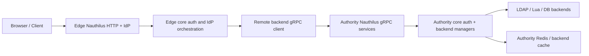
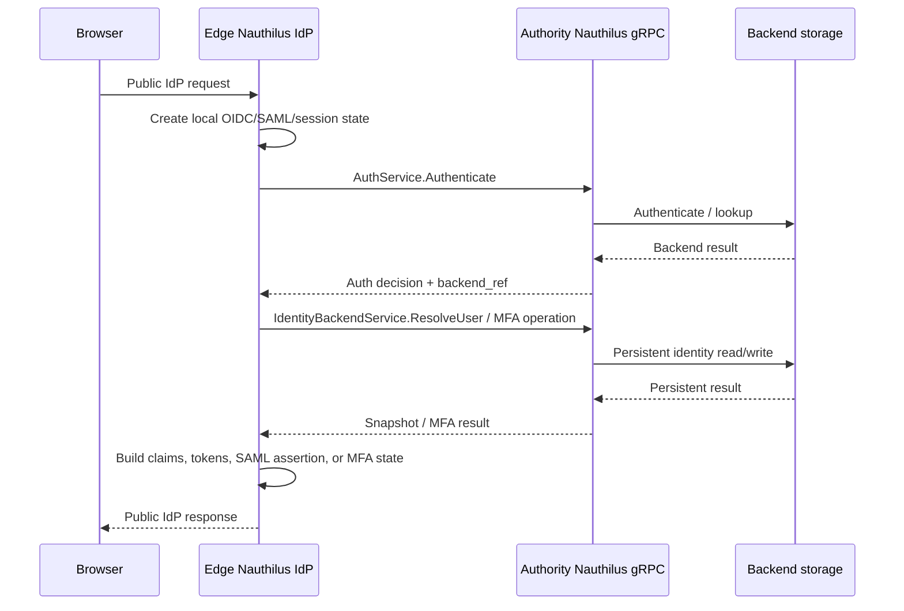

# gRPC Identity Proxy For Split Nauthilus Deployments

**Status:** Draft implementation specification v0.1
**Date:** 2026-05-08
**Scope:** Nauthilus-to-Nauthilus gRPC communication for auth, identity, IdP, TOTP, recovery-code, and WebAuthn data paths
**Out of scope:** implementation in this document revision

## 1. Executive Summary

Nauthilus already has a versioned gRPC AuthService for structured authentication operations. It currently covers the
transport-level auth use cases `Authenticate`, `LookupIdentity`, and `ListAccounts`. That is useful for external
callers, but it is not sufficient for a split Nauthilus deployment where one Internet-facing Nauthilus instance should
run the IdP frontend while delegating all real identity and MFA data access to a second Nauthilus instance closer to the
protected data zone.

The desired target architecture is:

1. an **edge Nauthilus** instance exposed to the Internet;
2. an **authority Nauthilus** instance reachable only over a hardened internal gRPC channel;
3. no LDAP, Lua database backend, or user-data database access from the edge instance;
4. full IdP support on the edge instance, including OIDC, SAML, TOTP, recovery codes, and WebAuthn;
5. type-safe, audited, policy-compatible Nauthilus-to-Nauthilus communication instead of a Lua HTTP proxy.

The hard part is the IdP data plane. Plain auth forwarding is not enough. The edge instance must be able to read and
mutate the same identity state that today's IdP handlers read and mutate locally:

- user identity snapshots;
- account fields, display names, groups, group DNs, and mapped attributes;
- TOTP presence and TOTP registration state;
- recovery-code generation, storage, verification, and consumption;
- WebAuthn credential lookup, registration, deletion, rename/update, sign-count update, and last-used update;
- requested backend-attribute release for OIDC and SAML claim materialization on the edge IdP.

IdP protocol ownership stays on the edge IdP permanently. OIDC/SAML protocol handling, token issuance, token signing,
refresh-token state, device-code state, browser-flow state, and IdP session Redis are not delegated by this design. The
gRPC delegation boundary is persistent identity/backend storage.

This specification therefore defines a remote identity backend model, not just a bigger auth RPC.

## 2. Deployment Model

### 2.1 Roles

**Edge Nauthilus**

The edge instance owns public HTTP endpoints:

- `/login` and other IdP frontend pages;
- OIDC discovery, authorization, token, introspection, userinfo, JWKS, logout, and device endpoints;
- SAML metadata, SSO, and SLO endpoints;
- optional mail-auth REST or CBOR endpoints when exposed by the operator.

The edge instance should not need direct LDAP, Lua database backend, SQL, or authority user-data Redis connectivity. It
does own its IdP Redis for sessions, CSRF/browser flow state, token state, refresh-token state, and device-code state.
Persistent identity data must come from the authority instance.

**Authority Nauthilus**

The authority instance owns trusted backend access:

- LDAP and Lua backend managers;
- account lookup;
- user attributes and groups;
- TOTP secrets and recovery codes;
- WebAuthn persistent credentials;
- policy evaluation that depends on backend-side facts.

The authority instance does not own the edge IdP's protocol state, signing keys, token storage, refresh tokens,
device-code state, or browser-flow state. It may run its own independent IdP if configured separately, but that is not
part of this split-deployment delegation contract.

The authority instance exposes only internal gRPC listeners and must treat the edge instance as an authenticated,
authorized service principal.

### 2.2 Recommended Network Shape



The edge-to-authority connection is a server-to-server trust boundary. It must not be reachable from browsers or normal
Internet clients.

## 3. Current-State Baseline

### 3.1 Existing gRPC Auth API

The existing source of truth is `server/grpcapi/auth/v1/auth.proto`.

Current RPCs:

- `Authenticate(AuthRequest) returns (AuthResponse)`
- `LookupIdentity(LookupIdentityRequest) returns (AuthResponse)`
- `ListAccounts(ListAccountsRequest) returns (ListAccountsResponse)`

The current handler in `server/handler/grpcauth` is intentionally a transport adapter. It maps protobuf messages to the
shared structured auth DTO and then into `core.AuthApplicationService`.

This is the correct pattern and must remain true:

- gRPC does not own auth FSM logic;
- gRPC does not own policy decisions;
- JSON, CBOR, and gRPC converge through shared structured auth input;
- auth completion and response rendering stay in core/application-service layers.

### 3.2 Existing Lua HTTP Proxy Backend

`server/lua-plugins.d/backend/proxy_backend.lua` already proves the operator use case, but it is not the target model.
It forwards:

- password verification to `/api/v1/auth/json`;
- list accounts through JSON mode;
- TOTP add/delete and recovery-code operations through `/mfa-backchannel`;
- WebAuthn credential CRUD through `/mfa-backchannel`.

Limitations:

1. The proxy is Lua and HTTP/JSON based, not a typed internal Nauthilus contract.
2. The proxy must manually mirror request fields and response fields.
3. The IdP still has local code paths that expect direct backend and Redis behavior.
4. Error semantics are HTTP-oriented and hard to make identical to core backend-manager semantics.
5. TOTP and WebAuthn operations are only approximated as backchannel HTTP handlers.
6. Policy, tracing, caller authorization, and retry semantics are not expressed as a first-class remote backend.

The Lua proxy should be treated as a historical bridge and an implementation reference, not as the future architecture.

### 3.3 Existing Backend Manager Contract

The current core backend boundary is `core.BackendManager`. It already names the operations the remote backend must
support:

- `PassDB`
- `AccountDB`
- `AddTOTPSecret`
- `DeleteTOTPSecret`
- `AddTOTPRecoveryCodes`
- `DeleteTOTPRecoveryCodes`
- `GetWebAuthnCredentials`
- `SaveWebAuthnCredential`
- `DeleteWebAuthnCredential`
- `UpdateWebAuthnCredential`

This is the most important existing implementation hook. A remote Nauthilus backend should be implemented as a normal
`BackendManager`, so the rest of core and IdP code does not need transport-specific branches.

### 3.4 Existing IdP Backend Data Flow

The IdP frontend currently calls `GetUserBackendData` to build the user's MFA and backend-data view. That path:

1. resolves the username from the session or bearer token;
2. creates an `AuthState`;
3. uses no-auth password handling to load attributes;
4. derives display name, unique user ID, TOTP presence, and recovery-code count;
5. tries to load WebAuthn credentials from Redis key `webauthn:user:<unique_user_id>`;
6. falls back to backend-manager `GetWebAuthnCredentials`;
7. may repopulate the Redis WebAuthn cache.

The target remote model must preserve this behavior while changing the source of truth:

- authority Nauthilus is the source of truth for identity and MFA data;
- edge Nauthilus may cache public WebAuthn credential material only as an optimization;
- edge Nauthilus must not treat its local cache as authoritative;
- mutating operations must go to the authority instance.

## 4. Goals

1. Allow an Internet-facing Nauthilus IdP instance to operate without direct user database connections.
2. Preserve the current auth and IdP user experience.
3. Implement the remote connection as a first-class backend manager, not as Lua glue.
4. Keep gRPC/protobuf as the wire contract for Nauthilus-to-Nauthilus communication.
5. Cover both authentication and IdP data paths.
6. Keep the existing `AuthService` semantics stable and add dedicated identity/MFA services where the domain requires
   separate operations.
7. Keep security fail-closed by default.
8. Preserve policy-layer compatibility and request-fact propagation.
9. Provide a phased implementation path with focused reproducer tests first.
10. Make all sensitive state ownership explicit.

## 5. Non-Goals

1. Do not turn Lua into the implementation vehicle for this feature.
2. Do not expose a browser-callable gRPC API.
3. Do not add unauthenticated remote calls.
4. Do not make edge-side local caches authoritative for identity or MFA state.
5. Do not require operators to duplicate LDAP or Lua backend configuration on the edge instance.
6. Do not invent a separate auth FSM for remote calls.
7. Do not move policy decisions into generated protobuf code.
8. Do not use remote arbitrary code execution as an extension mechanism.

## 6. Target Configuration Model

All new public configuration must stay under existing v2 roots. No new top-level root is allowed.

### 6.1 Proposed Client Configuration

The edge instance needs outbound gRPC client configuration. The recommended public home is under `runtime.clients.grpc`
because the target is a reusable runtime client, not a backend definition by itself.

```yaml
runtime:
  clients:
    grpc:
      nauthilus_authorities:
        dmz-primary:
          address: "authority.internal.example:9444"
          timeout: "5s"
          edge_cluster_id: "edge-prod"
          edge_instance_id: "edge-prod-a"
          tls:
            enabled: true
            server_name: "authority.internal.example"
            ca: "/etc/nauthilus/authority-ca.pem"
            cert: "/etc/nauthilus/edge-client.pem"
            key: "/etc/nauthilus/edge-client-key.pem"
            min_tls_version: "TLS1.3"
          caller_auth:
            basic_auth:
              enabled: false
            oidc_bearer:
              enabled: true
              mode: "client_credentials"
              token_endpoint: "https://authority.internal.example/oidc/token"
              client_id: "nauthilus-edge-prod"
              token_endpoint_auth_method: "private_key_jwt"
              client_private_key_file: "/etc/nauthilus/edge-authority-client.key"
              client_key_id: "edge-prod-2026-01"
              client_assertion_alg: "EdDSA"
              audience: "nauthilus-authority:dmz-primary"
              scopes:
                - nauthilus:authenticate
                - nauthilus:lookup_identity
                - nauthilus:mfa_read
                - nauthilus:mfa_verify
                - nauthilus:mfa_write
                - nauthilus:webauthn_read
                - nauthilus:webauthn_write
                - nauthilus:attribute_read
              token_cache:
                backend: "redis"
                key_prefix: "grpc:authority_tokens:"
                refresh_before_expiry: "30s"
                refresh_lock_ttl: "10s"
```

Rules:

1. Non-loopback authority targets require TLS.
2. Split-deployment authority targets require mTLS.
3. Caller auth is still required even when mTLS is enabled.
4. `TLS1.3` is the recommended minimum for this deployment role.
5. Secrets are redacted in config dumps by default.
6. `edge_cluster_id` is the stable logical edge identity shared by all edge instances in the same deployment.
7. `edge_instance_id` is only an observability value; authorization must bind to `edge_cluster_id` or the authenticated
   service principal, not to one process.
8. Static `token_file` bearer mode is acceptable for development and emergency operation only; the split-deployment
   target profile uses Authority-issued short-lived opaque `client_credentials` tokens.
9. Multi-instance edge deployments should cache authority bearer tokens in edge Redis so all edge nodes share renewal
   state and avoid token refresh stampedes.

### 6.2 Proposed Remote Backend Configuration

The remote backend must live under `auth.backends`.

```yaml
auth:
  backends:
    order:
      - remote

    remote:
      default:
        authority: "dmz-primary"
        mode: "nauthilus"
        allowed_operations:
          - auth
          - lookup_identity
          - list_accounts
          - mfa_read
          - mfa_verify
          - mfa_write
          - webauthn_read
          - webauthn_write
          - attribute_read
```

Rules:

1. `auth.backends.remote` is a backend source like LDAP or Lua, not a policy root.
2. `authority` references `runtime.clients.grpc.nauthilus_authorities`.
3. `allowed_operations` is local defense in depth. The authority instance must enforce scopes independently.
4. Named remote backends should be supported with the same naming behavior as LDAP and Lua named backends.

### 6.3 Authority-Side Listener Configuration

The authority instance should expose a role-oriented inbound gRPC listener. Because the gRPC surface is still in
development and not stable-released, the public server-side path should not be frozen as `runtime.servers.grpc.auth`.
That name is too narrow once the listener hosts both `AuthService` and `IdentityBackendService`.

Target path:

```text
runtime.servers.grpc.authority
```

Current pre-implementation state:

- The existing inbound gRPC `AuthService` listener already uses `runtime.servers.grpc.authority` for server-side
  configuration, default config dumps, validation errors, startup/TLS errors, tracing span names, and policy listener
  facts.
- The old `runtime.servers.grpc.auth` path is intentionally rejected. There is no compatibility alias because the gRPC
  config surface is not stable-released yet.
- The current protobuf contract remains `nauthilus.auth.v1.AuthService` for `Authenticate`, `LookupIdentity`, and
  `ListAccounts`. The future `common/v1` and `identity/v1` protobuf work is additive and belongs to the next
  implementation phases.
- The current Go package may still be `grpcauth` during pre-work. It must be renamed to `grpcauthority` before the full
  identity-backend authority feature ships.

```yaml
runtime:
  servers:
    grpc:
      authority:
        enabled: true
        address: "10.20.30.40:9444"
        tls:
          enabled: true
          cert: "/etc/nauthilus/grpc-server.pem"
          key: "/etc/nauthilus/grpc-server-key.pem"
          client_ca: "/etc/nauthilus/edge-ca.pem"
          require_client_cert: true
          min_tls_version: "TLS1.3"
        services:
          auth: true
          identity_backend: true
        backend_refs:
          enabled: true
          storage: "redis"
          key_prefix: "grpc:backend_ref:"
          ttl: "15m"
          idempotency_key_prefix: "grpc:idempotency:"
          idempotency_ttl: "15m"
          require_opaque_token_for_mutations: true
          bind_to_service_principal: true
          bind_to_edge_cluster: true
```

The existing hard rule remains:

- `runtime.servers.grpc.authority.enabled=true` requires `auth.backchannel.basic_auth` or
  `auth.backchannel.oidc_bearer`.

For split deployments the stronger profile should be:

- TLS enabled;
- client certificate required;
- caller auth enabled;
- OIDC bearer auth uses short-lived opaque access tokens stored in authority Redis;
- plaintext forbidden even on loopback unless developer mode explicitly permits it;
- backend references are authority-issued opaque Redis handles.

### 6.4 Authority Internal IdP Client For Caller Auth

The authority's existing internal IdP/OIDC token endpoint remains the issuer for Edge-to-Authority caller bearer tokens.
This does not move public IdP protocol ownership to the authority. It is only service-principal authentication for the
private gRPC authority channel.

Authority-side client configuration:

```yaml
identity:
  oidc:
    enabled: true
    issuer: "https://authority.internal.example"
    access_token_type: "opaque"
    default_access_token_lifetime: "5m"
    clients:
      - client_id: "nauthilus-edge-prod"
        grant_types:
          - client_credentials
        token_endpoint_auth_method: "private_key_jwt"
        client_public_key_file: "/etc/nauthilus/edge-authority-client.pub"
        client_public_key_algorithm: "EdDSA"
        access_token_type: "opaque"
        access_token_lifetime: "5m"
        scopes:
          - nauthilus:authenticate
          - nauthilus:lookup_identity
          - nauthilus:list_accounts
          - nauthilus:mfa_read
          - nauthilus:mfa_verify
          - nauthilus:mfa_write
          - nauthilus:webauthn_read
          - nauthilus:webauthn_write
          - nauthilus:attribute_read
```

Rules:

1. No new token issuer is added for the split-deployment channel.
2. The authority's internal IdP issues opaque access tokens for the edge service principal through `client_credentials`.
3. The authority stores and validates those opaque access tokens in authority Redis.
4. The token endpoint must be reachable only on the private edge-to-authority network path.
5. Public browser-facing OIDC/SAML authority endpoints remain out of scope for this split-deployment flow unless the
   operator deliberately runs a separate public IdP on the authority instance.
6. `private_key_jwt` is the target client authentication method for the edge service principal.
7. `client_secret_basic` or `client_secret_post` may be used for local development only.
8. JWT access tokens are not part of the split-deployment target profile for Edge-to-Authority caller auth.

### 6.5 Required Timing Defaults

The first implementation must use deterministic defaults so HA behavior and replay protection are testable:

| Setting | Default | Applies to | Notes |
| --- | --- | --- | --- |
| Authority RPC timeout | `5s` | Edge gRPC client | Per call deadline unless a narrower operation timeout is configured. |
| Authority bearer refresh skew | `30s` | Edge Redis token cache | Refresh before token expiry. |
| Authority bearer refresh lock TTL | `10s` | Edge Redis token cache | Prevents multi-instance refresh stampedes. |
| Backend reference TTL | `15m` | Authority Redis | Bounds user/flow backend selection handles. |
| Idempotency outcome TTL | `15m` | Authority Redis | Must cover normal browser retry windows. |
| WebAuthn public credential cache TTL | Existing positive cache TTL | Edge Redis | Cache is optimization only and never source of truth. |

Rules:

1. Shorter values may be configured per deployment.
2. Longer values require an explicit operator choice.
3. Tests must assert the defaults, not only custom values.

## 7. gRPC Service Model

### 7.1 Keep AuthService Focused

The current `nauthilus.auth.v1.AuthService` should remain the contract for structured auth operations:

- `Authenticate`
- `LookupIdentity`
- `ListAccounts`

It may be extended additively only when the method still belongs to auth. IdP/MFA backend mutations should not be folded
into `AuthService` just because they travel over the same listener.

The remote backend manager must not be forced to rely only on the current `AuthResponse`. The current response is
correct for auth callers, but it is not a complete IdP backend snapshot: it does not model groups, group DNs, MFA state,
claim release, or WebAuthn credentials as first-class domain data. Remote `PassDB` may reuse the same authority-side
auth application service internally, but the remote identity contract must return the richer `UserSnapshot` material
where the edge IdP needs it.

One additive `AuthResponse` extension is required for this architecture:

- `.nauthilus.common.v1.BackendRef backend_ref = 10`

This field identifies the authority-side backend that authenticated or found the user. It is auth-domain data because it
describes where the auth decision was made. It must not contain backend credentials. Rich identity data still belongs to
`IdentityBackendService`.

While touching `auth.proto`, the existing `AuthResponse.attributes = 7` field should also use
`.nauthilus.common.v1.AttributeValues` instead of an auth-local duplicate message. The field number stays unchanged.

Target auth response shape:

```proto
message AuthResponse {
  bool ok = 1;
  AuthDecision decision = 2;
  string session = 3;
  string account_field = 4;
  string totp_secret_field = 5;
  uint32 backend = 6;
  map<string, .nauthilus.common.v1.AttributeValues> attributes = 7;
  string status_message = 8;
  string error = 9;
  .nauthilus.common.v1.BackendRef backend_ref = 10;
}
```

### 7.2 Add Common Protobuf Package

Add a shared package for transport messages used by more than one gRPC API:

```text
server/grpcapi/common/v1/common.proto
package nauthilus.common.v1;
```

Required shared messages:

- `BackendRef`
- `OperationResult`
- `ErrorDetail`
- `OperationStatus`
- `AttributeValues`

Rules:

1. `auth/v1` imports `common/v1` for `AuthResponse.attributes` and `AuthResponse.backend_ref`.
2. `identity/v1` imports `common/v1` for operation status, backend references, and attribute-value maps.
3. Domain-specific messages such as `RequestContext`, `UserSnapshot`, `MFAState`, and `WebAuthnCredential` stay in
   `identity/v1`.
4. `common/v1` must remain small. Do not move IdP-, MFA-, or backend-specific domain snapshots into it.

### 7.3 Add IdentityBackendService

Add a new versioned service, proposed package:

```text
server/grpcapi/identity/v1/identity_backend.proto
package nauthilus.identity.v1;
```

Service:

```proto
service IdentityBackendService {
  rpc ResolveUser(ResolveUserRequest) returns (UserSnapshotResponse);
  rpc GetMFAState(GetMFAStateRequest) returns (MFAStateResponse);
  rpc BeginTOTPRegistration(BeginTOTPRegistrationRequest) returns (BeginTOTPRegistrationResponse);
  rpc FinishTOTPRegistration(FinishTOTPRegistrationRequest) returns (MFAWriteResponse);
  rpc VerifyTOTP(VerifyTOTPRequest) returns (VerifyTOTPResponse);
  rpc DeleteTOTP(DeleteTOTPRequest) returns (MFAWriteResponse);
  rpc GenerateRecoveryCodes(GenerateRecoveryCodesRequest) returns (GenerateRecoveryCodesResponse);
  rpc UseRecoveryCode(UseRecoveryCodeRequest) returns (UseRecoveryCodeResponse);
  rpc DeleteRecoveryCodes(DeleteRecoveryCodesRequest) returns (MFAWriteResponse);
  rpc GetWebAuthnCredentials(GetWebAuthnCredentialsRequest) returns (WebAuthnCredentialsResponse);
  rpc SaveWebAuthnCredential(SaveWebAuthnCredentialRequest) returns (MFAWriteResponse);
  rpc UpdateWebAuthnCredential(UpdateWebAuthnCredentialRequest) returns (MFAWriteResponse);
  rpc DeleteWebAuthnCredential(DeleteWebAuthnCredentialRequest) returns (MFAWriteResponse);
}
```

This service is intentionally close to the IdP and backend-manager data requirements, not to HTTP endpoint shapes.

### 7.4 No Remote IdPAuthorityService In This Design

This design explicitly does not add a remote IdP authority service for the edge IdP. The edge instance remains the IdP
for its public OIDC and SAML endpoints. It owns:

- signing keys;
- token issuance;
- token validation and revocation state;
- refresh-token state;
- device-code state;
- browser-flow state;
- IdP session Redis.

The authority instance is only the persistent identity/backend storage authority for the edge IdP. Adding a remote token
or flow authority would be a different architecture and is out of scope for this split-deployment contract.

## 8. Canonical Domain Messages

The message shapes in this section are the implementation contract draft. Field numbers are part of the contract once
the proto file is generated; future additions must be additive and must not reuse removed field numbers.

The shared transport types live in `nauthilus.common.v1`. Identity-specific request and snapshot types live in
`nauthilus.identity.v1` and import `common/v1`.

### 8.1 Common Transport Types

```proto
syntax = "proto3";

package nauthilus.common.v1;

option go_package = "github.com/croessner/nauthilus/v3/server/grpcapi/common/v1;commonv1";

enum OperationResult {
  OPERATION_RESULT_UNSPECIFIED = 0;
  OPERATION_RESULT_OK = 1;
  OPERATION_RESULT_FAIL = 2;
  OPERATION_RESULT_TEMPFAIL = 3;
  OPERATION_RESULT_DENIED = 4;
  OPERATION_RESULT_NOT_FOUND = 5;
  OPERATION_RESULT_CONFLICT = 6;
}

message ErrorDetail {
  string field = 1;
  string reason = 2;
}

message OperationStatus {
  OperationResult result = 1;
  string error_code = 2;
  string safe_message = 3;
  string edge_request_id = 4;
  string authority_request_id = 5;
  repeated ErrorDetail details = 6;
}

message AttributeValues {
  repeated string values = 1;
}

message BackendRef {
  string type = 1;
  string name = 2;
  string protocol = 3;
  string authority = 4;
  string opaque_token = 5;
}
```

Rules:

1. Domain auth failures are normally `OPERATION_RESULT_FAIL` in a successful gRPC response, not transport errors.
2. `OPERATION_RESULT_TEMPFAIL` represents backend or policy temporary failure that the edge can map to tempfail.
3. `safe_message` must be user/log safe and must not contain secrets.
4. `authority_request_id` is generated by the authority and logged with the edge request ID.

### 8.2 RequestContext

All remote identity calls must carry the same transport-neutral request context that auth already uses.

```proto
syntax = "proto3";

package nauthilus.identity.v1;

import "google/protobuf/timestamp.proto";
import "server/grpcapi/common/v1/common.proto";

option go_package = "github.com/croessner/nauthilus/v3/server/grpcapi/identity/v1;identityv1";

message RequestContext {
  string username = 1;
  string client_ip = 2;
  string client_port = 3;
  string client_hostname = 4;
  string client_id = 5;
  string external_session_id = 6;
  string user_agent = 7;
  string local_ip = 8;
  string local_port = 9;
  string protocol = 10;
  string method = 11;
  string ssl = 12;
  string ssl_session_id = 13;
  string ssl_client_verify = 14;
  string ssl_client_dn = 15;
  string ssl_client_cn = 16;
  string ssl_issuer = 17;
  string ssl_client_notbefore = 18;
  string ssl_client_notafter = 19;
  string ssl_subject_dn = 20;
  string ssl_issuer_dn = 21;
  string ssl_client_subject_dn = 22;
  string ssl_client_issuer_dn = 23;
  string ssl_protocol = 24;
  string ssl_cipher = 25;
  string ssl_serial = 26;
  string ssl_fingerprint = 27;
  string oidc_cid = 28;
  string saml_entity_id = 29;
  uint32 auth_login_attempt = 30;
  map<string, .nauthilus.common.v1.AttributeValues> metadata = 31;
  string edge_instance = 32;
  string edge_request_id = 33;
  string requested_language = 34;
}
```

Rules:

1. The original client IP remains `client_ip`; the authority must log the edge peer separately from this value.
2. `metadata` contains only explicitly allowed request metadata facts.
3. `edge_request_id` must be stable for all authority calls belonging to the same edge request or browser-flow step.
4. `requested_language` is optional and only supports response/debug localization; it does not affect backend state.

### 8.3 BackendRef

Remote responses that depend on the selected backend must return `.nauthilus.common.v1.BackendRef`.

The edge uses `BackendRef` for later MFA and WebAuthn writes. The authority must validate that the edge is allowed to
use that backend reference on subsequent calls.

Rules:

1. `type` is a backend family such as `ldap`, `lua`, `test`, or a future backend type.
2. `name` is `default` or the selected named backend.
3. `protocol` is the effective protocol used by backend search and MFA persistence rules.
4. `authority` matches the configured authority name used by the edge.
5. `opaque_token` is an authority-issued Redis-bound handle in the split-deployment target profile.

`opaque_token` is not a signed self-contained token. It is a random, non-guessable handle. The authority stores the
handle payload in authority Redis under `runtime.servers.grpc.authority.backend_refs.key_prefix`, encrypted with the
authority Redis security manager, and returns only the handle value to the edge.

The stored backend-reference payload must include at least:

- backend family, backend name, protocol, and authority name;
- username, account, unique user ID, and display name when known;
- authenticated service principal from caller bearer auth;
- authenticated mTLS client identity when mTLS is enabled;
- `edge_cluster_id` and creating `edge_instance_id`;
- allowed operation families for this reference;
- issue time, expiry time, and last-used time;
- edge request ID and authority request ID for audit correlation;
- schema version.

Rules:

1. Successful `Authenticate` and `LookupIdentity` responses must return an `opaque_token` whenever later IdP, MFA, or
   WebAuthn calls may reuse the selected backend.
2. Edge nodes may store the returned `BackendRef` in edge Redis-backed flow/session state so another edge instance can
   continue the same browser flow.
3. The authority validates the handle on every non-initial identity operation.
4. Mutating operations require a non-empty valid `opaque_token`.
5. Read operations may start with an empty `BackendRef` only when their purpose is to resolve a user and create a fresh
   reference.
6. The authority must bind the handle to the authenticated service principal and edge cluster, not to a single edge
   process, so multi-instance edge deployments work without sticky sessions.
7. The `edge_instance_id` inside `RequestContext` is observability metadata and must not be trusted as authorization
   input.

### 8.4 AttributeRequest And UserSnapshot

```proto
message AttributeRequest {
  repeated string names = 1;
  bool include_standard_identity = 2;
  bool include_groups = 3;
  bool include_group_dns = 4;
  bool report_missing = 5;
}

message UserSnapshot {
  string username = 1;
  string account = 2;
  string unique_user_id = 3;
  string display_name = 4;
  map<string, .nauthilus.common.v1.AttributeValues> attributes = 5;
  repeated string groups = 6;
  repeated string group_dns = 7;
  .nauthilus.common.v1.BackendRef backend = 8;
  MFAState mfa = 9;
}
```

Rules:

1. `unique_user_id` is required for WebAuthn.
2. `attributes` must be filtered by `AttributeRequest` and authority-side release policy.
3. `groups` and `group_dns` are first-class fields, not ordinary attributes.
4. TOTP secrets must not be included in `UserSnapshot`.
5. Recovery-code values must not be included in `UserSnapshot`.
6. `include_standard_identity=true` asks for account, unique user ID, and display name even when no custom attribute is
   requested.

### 8.5 MFAState

```proto
message MFAState {
  bool has_totp = 1;
  uint32 recovery_code_count = 2;
  bool has_webauthn = 3;
  repeated WebAuthnCredential webauthn_credentials = 4;
  string preferred_method = 5;
}
```

Rules:

1. `GetMFAState` may return public WebAuthn credential material required for assertion verification.
2. `GetMFAState` must not return TOTP secrets.
3. `GetMFAState` must not return recovery-code values.
4. Recovery-code values are returned only by `GenerateRecoveryCodes`, because that operation must show the newly created
   codes exactly once to the user.

### 8.6 WebAuthnCredential

The protobuf representation must preserve `mfa.PersistentCredential` without lossy conversion.

```proto
message WebAuthnCredential {
  bytes credential_id = 1;
  bytes public_key = 2;
  uint32 sign_count = 3;
  repeated string transports = 4;
  bool backup_eligible = 5;
  bool backup_state = 6;
  string attestation_type = 7;
  string name = 8;
  google.protobuf.Timestamp last_used = 9;
  string raw_json = 10;
}
```

The existing JSON compatibility behavior around top-level `signCount` must be preserved by explicit tests.

Rules:

1. `raw_json` is a compatibility escape hatch, not the primary contract.
2. Mapper tests must prove that stored credentials survive proto roundtrips without losing sign count or device name.
3. Authority compare-and-update must compare the old credential ID and sign count against persistent state before
   storing the new credential state.

### 8.7 RPC Request And Response Messages

```proto
message ResolveUserRequest {
  RequestContext context = 1;
  string username = 2;
  .nauthilus.common.v1.BackendRef backend = 3;
  AttributeRequest attributes = 4;
  bool include_mfa_state = 5;
  bool include_webauthn_credentials = 6;
}

message UserSnapshotResponse {
  .nauthilus.common.v1.OperationStatus status = 1;
  UserSnapshot user = 2;
  repeated string missing_attributes = 3;
  repeated string denied_attributes = 4;
}

message GetMFAStateRequest {
  RequestContext context = 1;
  string username = 2;
  .nauthilus.common.v1.BackendRef backend = 3;
  bool include_webauthn_credentials = 4;
}

message MFAStateResponse {
  .nauthilus.common.v1.OperationStatus status = 1;
  MFAState mfa = 2;
  .nauthilus.common.v1.BackendRef backend = 3;
}

message BeginTOTPRegistrationRequest {
  RequestContext context = 1;
  string username = 2;
  .nauthilus.common.v1.BackendRef backend = 3;
  string idempotency_key = 4;
}

message BeginTOTPRegistrationResponse {
  .nauthilus.common.v1.OperationStatus status = 1;
  string pending_registration_id = 2;
  string totp_secret = 3;
  string otpauth_url = 4;
  google.protobuf.Timestamp expires_at = 5;
  .nauthilus.common.v1.BackendRef backend = 6;
}

message FinishTOTPRegistrationRequest {
  RequestContext context = 1;
  string username = 2;
  .nauthilus.common.v1.BackendRef backend = 3;
  string pending_registration_id = 4;
  string code = 5;
  string idempotency_key = 6;
}

message VerifyTOTPRequest {
  RequestContext context = 1;
  string username = 2;
  .nauthilus.common.v1.BackendRef backend = 3;
  string code = 4;
}

message VerifyTOTPResponse {
  .nauthilus.common.v1.OperationStatus status = 1;
  bool valid = 2;
  .nauthilus.common.v1.BackendRef backend = 3;
}

message DeleteTOTPRequest {
  RequestContext context = 1;
  string username = 2;
  .nauthilus.common.v1.BackendRef backend = 3;
  string idempotency_key = 4;
}

message GenerateRecoveryCodesRequest {
  RequestContext context = 1;
  string username = 2;
  .nauthilus.common.v1.BackendRef backend = 3;
  uint32 count = 4;
  string idempotency_key = 5;
}

message GenerateRecoveryCodesResponse {
  .nauthilus.common.v1.OperationStatus status = 1;
  repeated string codes = 2;
  uint32 recovery_code_count = 3;
  .nauthilus.common.v1.BackendRef backend = 4;
}

message UseRecoveryCodeRequest {
  RequestContext context = 1;
  string username = 2;
  .nauthilus.common.v1.BackendRef backend = 3;
  string code = 4;
  string idempotency_key = 5;
}

message UseRecoveryCodeResponse {
  .nauthilus.common.v1.OperationStatus status = 1;
  bool valid = 2;
  uint32 remaining_recovery_code_count = 3;
  .nauthilus.common.v1.BackendRef backend = 4;
}

message DeleteRecoveryCodesRequest {
  RequestContext context = 1;
  string username = 2;
  .nauthilus.common.v1.BackendRef backend = 3;
  string idempotency_key = 4;
}

message GetWebAuthnCredentialsRequest {
  RequestContext context = 1;
  string username = 2;
  .nauthilus.common.v1.BackendRef backend = 3;
}

message WebAuthnCredentialsResponse {
  .nauthilus.common.v1.OperationStatus status = 1;
  repeated WebAuthnCredential credentials = 2;
  .nauthilus.common.v1.BackendRef backend = 3;
}

message SaveWebAuthnCredentialRequest {
  RequestContext context = 1;
  string username = 2;
  .nauthilus.common.v1.BackendRef backend = 3;
  WebAuthnCredential credential = 4;
  string idempotency_key = 5;
}

message UpdateWebAuthnCredentialRequest {
  RequestContext context = 1;
  string username = 2;
  .nauthilus.common.v1.BackendRef backend = 3;
  WebAuthnCredential old_credential = 4;
  WebAuthnCredential new_credential = 5;
  string idempotency_key = 6;
}

message DeleteWebAuthnCredentialRequest {
  RequestContext context = 1;
  string username = 2;
  .nauthilus.common.v1.BackendRef backend = 3;
  bytes credential_id = 4;
  string idempotency_key = 5;
}

message MFAWriteResponse {
  .nauthilus.common.v1.OperationStatus status = 1;
  bool changed = 2;
  MFAState mfa = 3;
  .nauthilus.common.v1.BackendRef backend = 4;
}
```

Rules:

1. Mutating requests must include `idempotency_key`.
2. Empty `BackendRef` means the authority may resolve the backend through normal configured order.
3. Non-empty `BackendRef` means the authority must validate the reference before executing the operation.
4. `GenerateRecoveryCodesResponse.codes` is the only response that may return plaintext recovery codes.
5. `BeginTOTPRegistrationResponse.totp_secret` is the only response that may return a TOTP setup secret.
6. `DeleteWebAuthnCredentialRequest` deletes by credential ID so the edge does not need to echo the full credential.

### 8.8 Attribute Release For Edge Claim Materialization

OIDC and SAML claim materialization remains an edge-IdP responsibility. The authority must not build final OIDC ID token
claims, OIDC access token claims, or SAML attributes for the edge IdP. Instead, the edge IdP asks the authority for the
backend attributes it needs for the active OIDC client or SAML service provider.

`ResolveUserRequest` must therefore support a requested attribute list:

- requested backend attribute names derived from edge-side OIDC/SAML claim mappings;
- requested standard identity fields such as account, display name, unique user ID, groups, and group DNs;
- request context and client/SP identifiers so the authority can apply its own release policy;
- an explicit flag for whether missing requested attributes should be reported in safe metadata.

Authority response rules:

1. return only attributes that were requested and allowed by authority policy;
2. always model `groups` and `group_dns` as first-class fields, not ordinary attributes;
3. do not return all raw backend attributes by default;
4. include optional safe metadata for denied or missing requested attributes when configured;
5. never return TOTP secrets, recovery-code values, private keys, bearer tokens, or client secrets as attributes.

This keeps IdP semantics on the edge while making the persistent backend data boundary explicit and least-privilege by
default.

## 9. IdP Semantics

### 9.1 First-Factor Login

For OIDC and SAML login, the edge instance should call the remote backend through the normal core path:

1. IdP frontend receives username and password.
2. Edge core builds `AuthState`.
3. Remote backend manager implements `PassDB` through gRPC.
4. Authority evaluates password, backend state, policy, and account mapping.
5. Authority returns an auth outcome plus `UserSnapshot`.
6. Edge stores only the minimum session data required to continue the browser flow.

Delayed-response behavior must remain unchanged:

- if current policy allows continuing to MFA for indistinguishability, the edge must preserve that behavior;
- the fail-latched first-factor outcome must be carried across MFA completion;
- a successful second factor must not turn a failed first factor into success.

### 9.2 No-Auth Identity Lookup

Current IdP code uses no-auth backend lookup to load identity data. In the remote model this becomes:

- `LookupIdentity` for auth-compatible lookup;
- or `ResolveUser` when the IdP needs full user snapshot plus MFA state.

The edge must not call `HandlePassword` with a local fake backend to reconstruct identity state. The remote backend
manager must supply the same domain data through `ResolveUser`.

### 9.3 TOTP Login Verification

The preferred target model is remote verification:

1. Edge keeps the browser challenge/session state.
2. User submits a TOTP code to the edge.
3. Edge calls authority `VerifyTOTP` or `UseRecoveryCode` through the identity service.
4. Authority reads the TOTP secret or recovery-code hashes from the real backend.
5. Authority returns success/failure plus any required recovery-code mutation result.
6. Edge completes or denies the IdP flow based on the first-factor latch and second-factor result.

This avoids sending existing TOTP secrets to the edge.

`VerifyTOTP` is a required operation for full IdP support. It must be separate from `UseRecoveryCode` because TOTP
verification reads a stable secret while recovery-code verification consumes one stored code atomically.

### 9.4 TOTP Registration

TOTP registration should be authority-owned:

1. Edge calls `BeginTOTPRegistration`.
2. Authority generates a secret and a pending registration token.
3. Edge displays the secret or QR URI to the user.
4. Edge sends the submitted code and pending token to `FinishTOTPRegistration`.
5. Authority validates the code and writes the secret to the real backend atomically.
6. Authority invalidates the pending token.

Rules:

- pending registration tokens must be short-lived;
- pending tokens must be bound to username, backend reference, edge instance, and edge request/session correlation;
- edge must not be allowed to commit an arbitrary TOTP secret;
- registration failure must not leave a committed secret.

### 9.5 Recovery Codes

Recovery codes have two different semantics:

1. Generate or replace codes: authority writes the codes and returns the plaintext values exactly once.
2. Use a code during login: authority verifies and consumes the code atomically.

The edge must not implement recovery-code matching locally unless explicitly configured to receive code hashes, which is
not the recommended mode.

Required operations:

- generate/replace recovery codes;
- delete recovery codes;
- verify and consume one recovery code;
- return recovery-code count for UI state.

### 9.6 WebAuthn Registration

WebAuthn browser ceremonies should stay edge-local because they depend on the browser session, origin, challenge, and
frontend endpoints.

Data ownership:

- edge owns challenge generation and browser ceremony state;
- authority owns stored persistent credentials;
- edge may read public credential material;
- edge writes the final persistent credential to the authority after successful verification.

Registration flow:

1. Edge starts WebAuthn registration and stores the challenge in its browser session state.
2. Browser returns the registration response.
3. Edge validates origin, challenge, RP ID, and attestation according to current WebAuthn code.
4. Edge builds `PersistentCredential`.
5. Edge calls `SaveWebAuthnCredential`.
6. Authority stores or upserts the credential in the real backend.
7. Edge updates local cache only after authority success.

### 9.7 WebAuthn Login

Login flow:

1. Edge resolves user and gets WebAuthn credentials from authority.
2. Edge starts WebAuthn assertion with those credentials.
3. Browser returns assertion.
4. Edge verifies assertion using the public credential.
5. Edge sends `UpdateWebAuthnCredential` with old and new credential state.
6. Authority performs compare-and-update for sign count and last-used metadata.
7. Edge completes MFA only after authority update succeeds.

Default policy must be strict:

- sign-count updates are part of successful WebAuthn login;
- update failure must fail closed.

### 9.8 WebAuthn Device Management

The 2FA management UI needs:

- list credentials;
- rename/update credential metadata;
- delete one credential;
- delete all credentials.

All mutations must go to the authority instance. The edge must purge its local WebAuthn cache after successful mutation.

### 9.9 Detailed End-To-End Flow Sequences

All sequences follow the same ownership rule:

- edge owns public HTTP, OIDC, SAML, browser session, challenge, token, consent, and flow state;
- authority owns persistent backend reads and writes;
- both sides log the same edge request ID, edge instance ID, external session ID, and authority request ID when present.



#### 9.9.1 First-Factor Login With IdP Backend Snapshot

1. Browser submits credentials to the edge IdP.
2. Edge builds the normal `AuthState` with protocol `idp`, client metadata, request metadata, and language preference.
3. Remote backend manager calls `AuthService.Authenticate` on the configured authority.
4. Authority authenticates through its local backend order and returns the auth decision plus `backend_ref`.
5. Edge stores only the auth result metadata required by the existing session model.
6. Edge derives the requested backend attributes from its own OIDC client or SAML SP claim mapping.
7. Edge calls `IdentityBackendService.ResolveUser` with `backend_ref` and the requested attribute list.
8. Authority returns a `UserSnapshot` containing only allowlisted requested attributes, group values, group DNs, and
   stable backend identity fields.
9. Edge calls `GetMFAState` only when the flow needs MFA UI or MFA enforcement data.
10. Edge continues the local IdP flow decision tree.

Important invariant: `ResolveUser` must use the `backend_ref` returned by the successful auth result when it is present.
If the reference is missing, expired, or denied by authority policy, the edge must fail the flow rather than silently
resolving against a different backend.

#### 9.9.2 OIDC Authorization-Code Flow

1. Edge receives `/oidc/authorize` and stores flow, nonce, PKCE, redirect, and consent state in edge-local IdP storage.
2. Edge performs first-factor login through the remote backend manager.
3. Edge performs required MFA checks through `GetMFAState`, `VerifyTOTP`, `UseRecoveryCode`, or WebAuthn operations.
4. Edge derives requested backend attributes from the OIDC client's configured claim mapping.
5. Edge calls `ResolveUser` for the final requested attribute set.
6. Edge builds ID-token and access-token claims locally.
7. Edge signs tokens with edge-local IdP keys and stores refresh-token or revocation state in edge-local IdP Redis when
   configured.
8. Authority never receives authorization codes, refresh tokens, token signing requests, consent decisions, or token
   revocation state.

#### 9.9.3 OIDC Device-Code Flow

1. Edge creates device-code and user-code state in edge-local IdP storage.
2. User completes browser verification against the edge IdP.
3. Edge authenticates and enforces MFA through authority-backed identity operations.
4. Edge marks the edge-local device-code transaction as approved.
5. The polling client exchanges the device code at the edge token endpoint.
6. Edge calls `ResolveUser` for the final requested attributes if the snapshot is not already fresh for that device
   transaction.
7. Edge issues and signs tokens locally.
8. Authority only sees backend identity, MFA, and attribute requests.

#### 9.9.4 SAML SSO Flow

1. Edge receives the SAML AuthnRequest and validates SP configuration, bindings, RelayState, and signature locally.
2. Edge authenticates the user through the remote backend manager.
3. Edge performs required MFA through authority-backed identity operations.
4. Edge derives requested backend attributes from the SAML SP attribute mapping.
5. Edge calls `ResolveUser` with the requested attribute set.
6. Edge builds the SAML assertion, NameID, attributes, conditions, and session index locally.
7. Edge signs the response or assertion with edge-local SAML keys.
8. Authority never receives the SAML AuthnRequest, SAML response, RelayState, or signing material.

#### 9.9.5 TOTP Registration

1. Edge requests `BeginTOTPRegistration` with username, `backend_ref`, edge session correlation, and idempotency key.
2. Authority creates a pending TOTP registration bound to user, backend, edge instance, and edge session/request.
3. Authority returns the setup secret and provisioning URI data exactly once.
4. Browser shows the QR/setup data from the edge.
5. User submits the first TOTP code to the edge.
6. Edge calls `FinishTOTPRegistration` with the pending registration token and verification code.
7. Authority verifies the code, commits the TOTP secret, invalidates the pending registration, and returns success.
8. Edge refreshes MFA state through `GetMFAState` or local session metadata.

Failure rule: an unfinished registration must not create a committed TOTP secret on the authority.

#### 9.9.6 TOTP Login Verification

1. Edge determines from `GetMFAState` that TOTP is required.
2. Browser submits the TOTP code to the edge.
3. Edge calls `VerifyTOTP` with username, `backend_ref`, request context, and the code.
4. Authority loads the TOTP secret locally, verifies the code, and applies any authority-local replay window handling.
5. Edge continues the IdP flow only when the authority response is successful.
6. A transport failure maps to the existing tempfail or IdP retry behavior for the current flow.

The TOTP secret must not be sent from authority to edge for login verification.

#### 9.9.7 Recovery-Code Generation And Consumption

Generation:

1. Edge requests `GenerateRecoveryCodes` with idempotency key, username, and `backend_ref`.
2. Authority replaces or creates recovery-code hashes atomically.
3. Authority returns plaintext recovery codes exactly once.
4. Edge displays the plaintext values and never persists them in edge Redis.

Consumption:

1. Browser submits one recovery code to the edge during MFA.
2. Edge calls `UseRecoveryCode`.
3. Authority verifies and consumes the code atomically.
4. Edge continues the flow only on successful authority response.
5. Edge refreshes recovery-code count for UI state if needed.

#### 9.9.8 WebAuthn Registration

1. Edge loads or resolves `UserSnapshot` and public WebAuthn user data.
2. Edge creates the WebAuthn registration challenge in edge browser session state.
3. Browser returns the credential creation response to the edge.
4. Edge validates challenge, origin, RP ID, attestation policy, and user binding.
5. Edge maps the verified credential to `PersistentCredential`.
6. Edge calls `SaveWebAuthnCredential` with idempotency key, username, `backend_ref`, credential, and display metadata.
7. Authority stores the credential in the persistent backend.
8. Edge purges local WebAuthn cache and then repopulates it from authority if the UI still needs it.

#### 9.9.9 WebAuthn Login And Sign-Count Update

1. Edge calls `GetWebAuthnCredentials` or `GetMFAState` to obtain public credential material.
2. Edge creates the WebAuthn assertion challenge in edge browser session state.
3. Browser returns the assertion response to the edge.
4. Edge verifies challenge, origin, RP ID, user presence or verification requirement, and assertion signature.
5. Edge builds old and new `PersistentCredential` states, including sign count and last-used metadata.
6. Edge calls `UpdateWebAuthnCredential`.
7. Authority compares the stored old state, applies the new state, and returns success.
8. Edge completes MFA only after authority success.

If the authority rejects the update because the stored credential changed or the sign count is stale, the edge fails the
login. The edge must also purge local WebAuthn cache after this failure.

#### 9.9.10 WebAuthn Device Management

1. Edge lists credentials through `GetWebAuthnCredentials`.
2. Edge renders device names, last-used timestamps, and credential IDs in the 2FA management UI.
3. Rename/update calls `UpdateWebAuthnCredential` with old and new metadata.
4. Delete calls `DeleteWebAuthnCredential` by credential ID.
5. Delete-all is implemented as repeated credential-ID deletes unless a future batch RPC is added.
6. Edge purges local WebAuthn cache after every successful mutation.

## 10. Remote Backend Manager Design

### 10.1 New Type

Add a focused backend manager implementation:

```text
server/core/remote_backend.go
```

or a package with clear boundaries:

```text
server/backend/remote/
```

The implementation must satisfy `core.BackendManager`.

Responsibilities:

1. map `AuthState` to protobuf request context;
2. call the configured authority client;
3. map protobuf responses back to `PassDBResult`, `AccountList`, `mfa.PersistentCredential`, and backend write results;
4. preserve status messages, i18n keys, response language, backend type, and policy metadata;
5. implement deadline, retry, idempotency, and tracing rules;
6. avoid duplicating field mapping already present in structured auth DTO mappers.

### 10.2 Local Core Integration

`AuthState.GetBackendManager` should be extended to return the remote manager when `definitions.BackendRemote` or the
chosen final backend enum is selected.

All existing callers should remain unaware of the transport:

- `HandlePassword`;
- `GetUserBackendData`;
- `MFAService`;
- WebAuthn registration and login;
- OIDC and SAML login;
- account listing.

If a caller must branch on remote behavior, that is a design smell and should trigger a review.

### 10.3 Caching

Edge caching rules:

1. Authentication decisions are not cached by the remote manager unless the existing positive/negative cache semantics
   explicitly apply.
2. WebAuthn public credential cache may be used for browser challenge construction.
3. WebAuthn cache is invalidated after any save, update, delete, or failed authority compare-and-update.
4. TOTP secrets and recovery-code values are never cached on the edge.
5. UserSnapshot caching requires explicit TTL and must respect authority-side invalidation limits.

Authority caching rules:

1. Existing account cache and Redis cache behavior remains authority-local.
2. Authority cache keys must include backend name where current backend semantics require it.
3. Remote edge identity must be visible in audit logs when cached data is served.

### 10.4 Code Integration Plan

This section names the expected code locations so implementation work can be split into small, reviewable changes.

| Area | Target paths | Required work |
| --- | --- | --- |
| Config schema | `server/config/schema_v2.go`, `server/config/file.go`, `server/config/types.go` | Add `runtime.clients.grpc.nauthilus_authorities`, `runtime.servers.grpc.authority`, and `auth.backends.remote`; validate authority references, TLS, mTLS, caller auth, timeouts, allowed operations, and operation scope names. |
| Config dump and schema tests | `server/config/dump.go`, `server/config/dump_test.go`, `server/config/schema_index.go`, `server/config/schema_index_test.go`, `server/config/mapstructure_tag_test.go` | Ensure every new key appears in dumps, schema index, env binding tests, and unknown-key validation. |
| Backend enum and parsing | `server/definitions`, `server/config/server.go`, `server/core/auth.go` | Add final backend name `remote`; `AuthState.GetBackendManager` must return the remote manager for `remote` and must preserve backend name semantics. |
| Existing gRPC auth contract | `server/grpcapi/auth/v1/auth.proto`, `server/grpcapi/auth/v1/request_mapper.go`, `server/handler/grpcauthority` | Import `common/v1`, switch `AuthResponse.attributes = 7` to `.nauthilus.common.v1.AttributeValues`, add additive `.nauthilus.common.v1.BackendRef backend_ref = 10`, keep `Authenticate`, `LookupIdentity`, and `ListAccounts` stable, and update mapper tests. |
| Shared proto messages | `server/grpcapi/common/v1/common.proto`, generated Go files, `README.md` | Define reusable `BackendRef`, `OperationResult`, `ErrorDetail`, `OperationStatus`, and `AttributeValues`. This package is mandatory for Phase 1. |
| Identity gRPC contract | `server/grpcapi/identity/v1/identity_backend.proto`, generated Go files, `README.md` | Add `IdentityBackendService`, domain messages, contract tests, mapper tests, and generator documentation. |
| gRPC server registration | `server/handler/grpcauthority/server.go`, `server/handler/grpcauthority/server_test.go` | Move the current `grpcauth` package to `grpcauthority` before the feature ships; register both `AuthService` and `IdentityBackendService`; keep auth, mTLS, logging, tracing, and recovery interceptors shared. |
| Authority identity handler | `server/handler/grpcauthority/identity_backend.go` | Implement RPC methods as transport adapters over existing core/backend services; enforce scopes before domain calls; map errors to stable status codes. |
| Authority internal IdP client | `server/config/idp.go`, `server/handler/frontend/idp/oidc_client_credentials.go`, `server/idp/nauthilus_idp.go` | Reuse existing `client_credentials` issuance; validate the split profile requires `access_token_type=opaque`, short lifetime, and non-public token endpoint exposure. |
| Authority caller-token source | `server/grpcclient/authority/token_source.go` | Implement client-credentials token acquisition, edge Redis token cache, distributed refresh lock, expiry skew, and static token-file fallback for development. |
| Authority backend-reference store | `server/handler/grpcauthority/backend_ref_store.go` | Store authority-issued backend-reference handles in authority Redis; validate handle binding, TTL, service principal, edge cluster, and allowed operation families. |
| Edge authority client | `server/grpcclient/authority/` | Own connection pooling, TLS, caller auth metadata, deadlines, retries, idempotency metadata, tracing propagation, token source integration, and safe client shutdown. |
| Remote backend manager | `server/backend/remote/` | Implement `core.BackendManager`; map `AuthState` to gRPC requests; convert responses to `PassDBResult`, `AccountList`, `mfa.PersistentCredential`, and MFA write outcomes. |
| Existing core integration | `server/core/auth.go`, `server/core/auth_application_service.go`, `server/core/types.go`, `server/core/mfa.go`, `server/core/totp.go`, `server/core/webauthn.go` | Keep callers transport-neutral; extend only narrow interfaces when required; avoid remote-specific branches outside manager construction and mapper code. |
| IdP backend data | `server/handler/frontend/idp/backend_data.go`, `server/handler/frontend/idp/require_mfa.go`, `server/idp/mfa.go` | Ensure edge-only IdP can resolve user, MFA state, recovery-code count, and WebAuthn credential data without local LDAP/Lua backend credentials. |
| WebAuthn cache | `server/backend/cache.go`, `server/core/webauthn.go`, `server/core/http_webauthn.go` | Treat edge cache as public-credential optimization only; purge on save, update, delete, stale update, and authority failure where local cache may be wrong. |
| Policy facts and observability | `server/core/policy_request_context_facts.go`, `server/core/policy_facts.go`, `server/monitoring`, `server/log` | Add remote authority, remote operation, caller identity, backend ref, retry, and correlation facts without leaking secrets. |
| Test helpers | `server/core/test_backend.go`, new grpc bufconn helpers near gRPC tests | Provide fake authority clients and authority test backend fixtures so phases can test edge-only behavior without external services. |
| Operator tooling | `contrib/auth-grpc-request.py`, optional `contrib/identity-grpc-request.py` | Extend or add a smoke client for identity operations, including TOTP and WebAuthn management-safe operations. |
| Documentation | `server/docs/grpc_identity_proxy_spec.md`, later website docs | Keep this implementation spec as the source until the feature is implemented; publish operator docs only after behavior exists. |

Package direction:

1. The stable target must use authority terminology for the inbound listener. The existing `grpcauth` package is a
   pre-stable implementation detail and must be renamed to `grpcauthority` before this feature ships.
2. The remote backend manager should live outside `server/core` if possible. `server/backend/remote/` keeps transport
   and mapper code away from the core auth state machine.
3. Common proto messages belong in `server/grpcapi/common/v1`; keep that package intentionally small.
4. The identity handler should call existing domain services or focused new services. It must not reimplement LDAP,
   Lua, TOTP, recovery-code, or WebAuthn storage logic inside the gRPC layer.

## 11. Security Model

### 11.1 Mandatory Authentication

Every authority RPC must require caller authentication:

- Basic auth through `auth.backchannel.basic_auth`; or
- OIDC bearer through `auth.backchannel.oidc_bearer`.

For split deployments, mTLS is mandatory in addition to caller auth.

Unauthenticated gRPC remains forbidden.

Required split-deployment caller-auth profile:

1. mTLS authenticates the edge node or workload at the transport layer.
2. The authority's internal IdP issues caller tokens through the existing OIDC `client_credentials` grant.
3. The edge service principal authenticates to the authority token endpoint with `private_key_jwt`.
4. The caller bearer token is an opaque access token stored and validated in authority Redis.
5. The edge caches the bearer token in edge Redis for multi-instance sharing and refresh coordination.
6. JWT bearer tokens are not part of the split-deployment target profile.
7. Static token files are development or emergency fallback, not the target HA profile.

Caller bearer auth and `BackendRef.opaque_token` are separate:

- caller bearer auth answers "which edge service principal is calling and which scopes does it have?";
- `BackendRef.opaque_token` answers "which authority-side backend selection was previously made for this user and flow?";
- every identity/MFA/WebAuthn call that carries a backend reference must pass both validations.

### 11.2 Authorization Scopes

Authority-side scope checks must be per operation.

Target scopes:

- `nauthilus:authenticate`
- `nauthilus:lookup_identity`
- `nauthilus:list_accounts`
- `nauthilus:mfa_read`
- `nauthilus:mfa_verify`
- `nauthilus:mfa_write`
- `nauthilus:webauthn_read`
- `nauthilus:webauthn_write`
- `nauthilus:attribute_read`

Existing `ListAccounts` already has a dedicated permission expectation. The same model should be generalized instead
of treating the edge instance as all-powerful.

Operation matrix:

| Service/RPC | Required scope | Edge `allowed_operations` | Notes |
| --- | --- | --- | --- |
| `AuthService.Authenticate` | `nauthilus:authenticate` | `auth` | Returns domain auth decision, not raw backend secrets. |
| `AuthService.LookupIdentity` | `nauthilus:lookup_identity` | `lookup_identity` | No password field; used for trusted identity lookup. |
| `AuthService.ListAccounts` | `nauthilus:list_accounts` | `list_accounts` | Must remain denied without the dedicated list-accounts permission. |
| `IdentityBackendService.ResolveUser` | `nauthilus:lookup_identity` | `lookup_identity` | Base user snapshot without custom attributes or MFA state. |
| `ResolveUser` with requested attributes | `nauthilus:lookup_identity`, `nauthilus:attribute_read` | `lookup_identity`, `attribute_read` | Authority returns only requested and allowed attributes. |
| `ResolveUser` with MFA state | `nauthilus:lookup_identity`, `nauthilus:mfa_read` | `lookup_identity`, `mfa_read` | Returns TOTP presence and recovery-code count, never secrets. |
| `ResolveUser` with WebAuthn credentials | `nauthilus:lookup_identity`, `nauthilus:webauthn_read` | `lookup_identity`, `webauthn_read` | Returns public credential material needed by edge ceremonies. |
| `GetMFAState` | `nauthilus:mfa_read` | `mfa_read` | Returns MFA presence and recovery-code count. |
| `GetMFAState` with WebAuthn credentials | `nauthilus:mfa_read`, `nauthilus:webauthn_read` | `mfa_read`, `webauthn_read` | Used by 2FA management and WebAuthn assertion setup. |
| `BeginTOTPRegistration` | `nauthilus:mfa_write` | `mfa_write` | Returns a new setup secret and pending registration ID. |
| `FinishTOTPRegistration` | `nauthilus:mfa_write` | `mfa_write` | Verifies code and persists secret atomically. |
| `VerifyTOTP` | `nauthilus:mfa_verify` | `mfa_verify` | Reads existing secret internally but never returns it. |
| `DeleteTOTP` | `nauthilus:mfa_write` | `mfa_write` | Deletes persistent TOTP state. |
| `GenerateRecoveryCodes` | `nauthilus:mfa_write` | `mfa_write` | May return plaintext codes exactly once. |
| `UseRecoveryCode` | `nauthilus:mfa_verify`, `nauthilus:mfa_write` | `mfa_verify`, `mfa_write` | Verifies and consumes one code atomically. |
| `DeleteRecoveryCodes` | `nauthilus:mfa_write` | `mfa_write` | Deletes persistent recovery-code state. |
| `GetWebAuthnCredentials` | `nauthilus:webauthn_read` | `webauthn_read` | Returns public credential material for ceremony setup. |
| `SaveWebAuthnCredential` | `nauthilus:webauthn_write` | `webauthn_write` | Persists a newly registered credential. |
| `UpdateWebAuthnCredential` | `nauthilus:webauthn_write` | `webauthn_write` | Compare-and-update for sign count and last-used metadata. |
| `DeleteWebAuthnCredential` | `nauthilus:webauthn_write` | `webauthn_write` | Deletes by credential ID. |

Rules:

1. Authority-side scopes are mandatory even when edge-side `allowed_operations` permits the operation.
2. Edge-side `allowed_operations` is a local blast-radius guard and must fail closed before the RPC is sent.
3. Composite calls require the union of all listed scopes.
4. Scope failures map to `PermissionDenied`; missing caller authentication maps to `Unauthenticated`.

### 11.3 Secret Handling

Rules:

1. Existing TOTP secrets must not leave the authority.
2. Recovery-code hashes or stored values must not leave the authority.
3. Newly generated recovery codes may be returned once to the edge for display.
4. Newly generated TOTP setup secrets may be returned during registration, because the user must scan or copy them.
5. WebAuthn public credential material may leave the authority because it is required for browser assertion verification.
6. IdP signing keys remain on the edge IdP and are not part of the backend delegation contract.
7. Logs must redact TOTP secrets, recovery codes, bearer tokens, client secrets, and WebAuthn raw attestation blobs
   unless explicitly debug-enabled and safe.

### 11.4 Replay And Idempotency

Mutating RPCs require an idempotency key:

- TOTP finish;
- recovery-code generation;
- recovery-code consumption;
- WebAuthn save;
- WebAuthn update;
- WebAuthn delete.

Authority should store short-lived idempotency outcomes for mutating operations so edge retries cannot duplicate writes.

### 11.5 Backend Reference Integrity

The edge may carry a `BackendRef` from first-factor authentication into later MFA writes. The authority must validate:

- the `opaque_token` exists in authority Redis;
- the stored payload decrypts and has the expected schema version;
- the caller is allowed to use it;
- the caller bearer `sub` or client ID matches the stored service principal;
- the mTLS client identity matches the stored client identity when mTLS is enabled;
- the edge cluster ID matches the stored edge cluster ID;
- the backend reference is compatible with the username and operation;
- the requested operation is included in the stored allowed operation families;
- the reference has not expired when bound to a flow.

The edge must not be allowed to select arbitrary backend names for write operations by editing request payloads.
For mutating MFA and WebAuthn operations, `type`, `name`, and `protocol` are advisory echoes; the Redis payload behind
`opaque_token` is authoritative.

### 11.6 Failure Modes

Default behavior:

- remote unavailable during first factor: tempfail;
- remote unavailable during required MFA read: tempfail;
- remote unavailable during TOTP verification: fail closed;
- remote unavailable during recovery-code consumption: fail closed;
- remote unavailable during WebAuthn sign-count update: fail closed;
- remote unavailable during optional UI status read: show unavailable state without implying MFA is absent.

No fail-open mode is part of this implementation spec. If a later compatibility requirement needs one, it must be a
separate, explicit design decision.

## 12. Policy And Observability

### 12.1 Policy Facts

The edge must add request facts that identify the remote call path:

- `request.listener = grpc.remote_backend` or equivalent;
- `request.remote_authority.name`;
- `request.remote_authority.peer`;
- `request.edge.instance`;
- `request.edge.session`;
- `request.external_session`.

The authority must evaluate its own policy using the original client facts from the edge plus its own peer facts. The
authority must not overwrite the original client IP with the edge IP. It should store the edge IP separately.

### 12.2 Logs

Both sides must log:

- operation name;
- edge instance;
- authority instance;
- original username;
- original client IP and port;
- edge request GUID;
- authority request GUID;
- external session ID when present;
- backend reference when selected;
- decision or mutation outcome;
- gRPC status code;
- duration.

Normal auth completion logs should remain shared with existing auth transports. Extra remote-backend completion details
belong behind the existing debug module conventions.

### 12.3 Metrics

Add metrics for:

- remote backend request duration by operation and authority;
- remote backend active requests;
- remote backend failures by operation, authority, and gRPC code;
- remote backend retries;
- idempotency replay hits;
- remote MFA mutation outcomes;
- remote WebAuthn update failures.

### 12.4 Tracing

The edge should start client spans with `kind=client`. The authority should start server spans. Trace context should be
propagated through gRPC metadata when configured.

## 13. Implementation Phases

### Phase 0: Baseline Reproducer And Contract Tests

Add focused tests before behavior changes:

1. current gRPC AuthService shape remains stable;
2. current IdP `GetUserBackendData` expectations are captured;
3. current TOTP registration, deletion, and recovery-code flows are captured at service level;
4. current WebAuthn credential save/update/delete behavior is captured;
5. current Lua proxy backend limitations are documented, not expanded.

Acceptance:

- `GOEXPERIMENT=runtimesecret go test ./server/grpcapi/auth/v1 ./server/core ./server/handler/frontend/idp ./server/idp`
  passes for the focused tests.

### Phase 1: Protobuf Contracts

Add:

- `server/grpcapi/common/v1/common.proto`;
- `server/grpcapi/identity/v1/identity_backend.proto`;
- additive `.nauthilus.common.v1.BackendRef AuthResponse.backend_ref = 10`;
- generated Go files;
- proto contract tests;
- README with generator versions and commands.

Acceptance:

- generated code is committed;
- additive service contracts have contract tests;
- existing `AuthService` callers remain source-compatible;
- auth-local `AttributeValues` duplication is removed in favor of `.nauthilus.common.v1.AttributeValues` while keeping
  `AuthResponse.attributes = 7`;
- `AuthResponse.backend_ref` is present for successful backend auth and absent or explicit-empty for decisions without
  backend ownership;
- field numbers are stable and documented;
- common message roundtrips cover `BackendRef`, `OperationStatus`, `ErrorDetail`, and `AttributeValues`;
- identity message roundtrips cover `RequestContext`, `UserSnapshot`, `MFAState`, and `WebAuthnCredential`;
- WebAuthn credential mapper tests preserve credential ID, public key, sign count, name, and last-used fields;
- no auth FSM or backend behavior changes yet.

### Phase 2: Authority Server Handler

Add authority-side gRPC handlers for identity backend operations.

Requirements:

- public config, logs, and metrics use `authority` terminology, not `auth server` terminology;
- move the existing gRPC server package from `server/handler/grpcauth` to `server/handler/grpcauthority`;
- reuse `core.AuthApplicationService` for auth-compatible calls;
- use existing `BackendManager` implementations for MFA/WebAuthn writes;
- apply caller auth and scope checks before handler execution;
- issue Redis-backed `BackendRef.opaque_token` handles after successful auth and lookup operations;
- validate Redis-backed backend references before identity, MFA, and WebAuthn operations;
- use authority-local config to restrict allowed remote operations;
- map domain errors to stable gRPC codes.

Acceptance:

- bufconn tests for each operation;
- unauthenticated and insufficient-scope tests;
- backend-reference handle tests for TTL expiry, wrong service principal, wrong edge cluster, wrong operation, and
  mutated payload echoes;
- mTLS config tests remain green.

### Phase 3: Edge Remote Backend Client

Add:

- outbound gRPC client config;
- client-credentials bearer token source;
- edge Redis-backed authority token cache;
- remote authority connection manager;
- remote backend manager implementing `core.BackendManager`;
- protobuf-to-domain mappers.

Requirements:

- no direct IdP UI changes yet;
- normal auth pipeline can use the remote backend through `auth.backends.order`;
- `PassDB`, `AccountDB`, and no-auth lookup work through the remote manager.
- remote `PassDB` must bind the returned `backend_ref` to the auth state so later MFA and WebAuthn operations use the
  same authority-side backend.
- the token source obtains opaque `client_credentials` tokens from the authority's internal IdP token endpoint.
- the token source authenticates with `private_key_jwt` in the target profile.
- authority bearer tokens are shared across edge instances through edge Redis and refreshed before expiry.

Acceptance:

- core tests using fake authority client;
- bufconn integration test with edge remote backend and authority test backend;
- token-source tests for Redis cache hit, refresh lock, expired token, private-key-JWT assertion, and static token-file
  fallback;
- authority token validation tests prove JWT caller tokens are rejected in split-deployment strict mode;
- missing authority or timeout returns tempfail where expected.

### Phase 4: Remote IdP Backend Data

Change IdP backend-data reads to work through the remote backend manager and identity service.

Requirements:

- `GetUserBackendData` can run with only a remote backend configured;
- TOTP presence and recovery-code count come from authority;
- WebAuthn credentials come from authority and may be cached locally after read;
- local WebAuthn Redis cache is no longer treated as source of truth on edge.

Acceptance:

- IdP frontend tests for `GetUserBackendData` with remote-only backend;
- no direct LDAP/Lua backend required on edge;
- cache invalidation tests for WebAuthn mutations.

### Phase 5: Remote TOTP And Recovery-Code Operations

Implement:

- begin TOTP registration;
- finish TOTP registration;
- verify TOTP login codes;
- delete TOTP;
- generate recovery codes;
- verify and consume recovery code;
- delete recovery codes;
- TOTP login verification through authority.

Requirements:

- existing TOTP secrets do not leave authority;
- recovery-code consumption is atomic;
- delayed-response first-factor latch is preserved.

Acceptance:

- TOTP register/login/delete tests with edge remote backend;
- recovery-code generate/use/delete tests with edge remote backend;
- negative tests for replayed idempotency keys and unavailable authority.

### Phase 6: Remote WebAuthn Operations

Implement:

- credential read for assertion;
- registration save;
- sign-count and last-used update;
- delete;
- rename/update metadata if supported by UI.

Requirements:

- edge owns browser challenge state;
- authority owns persistent credential state;
- sign-count update uses old and new credential data;
- update failures fail closed by default.

Acceptance:

- WebAuthn registration test with virtual authenticator;
- WebAuthn login test verifies authority sign-count update;
- delete and rename tests;
- edge cache invalidation tests.

### Phase 7: Requested Attribute Release

Implement requested backend-attribute release for edge-side OIDC and SAML claim materialization.

Requirements:

- edge derives the requested attribute list from its own OIDC/SAML claim mappings;
- authority returns only requested and allowed attributes;
- edge builds ID token claims, access token claims, and SAML attributes locally;
- group and group DN values remain first-class fields.

Acceptance:

- OIDC auth-code flow test with remote requested attributes;
- OIDC device-code flow test with remote requested attributes;
- SAML SSO test with remote requested attributes;
- denied/missing attribute reporting tests;
- no unrequested raw attribute leakage.

### Phase 8: Two-Instance E2E

Create an operator-facing smoke or E2E setup:

1. authority Nauthilus with test/LDAP/Lua backend and gRPC identity services;
2. dedicated authority Redis for authority IdP tokens, backend-reference handles, idempotency outcomes, and backend cache;
3. dedicated edge Redis for edge IdP flow/session state and edge authority-token cache;
4. edge Nauthilus with remote backend only;
5. OIDC client against edge;
6. SAML SP against edge;
7. TOTP and WebAuthn flows through edge;
8. authority receives all real backend reads and writes.

Acceptance:

- `Authenticate`, `LookupIdentity`, `ListAccounts`;
- OIDC authorization code login;
- OIDC device-code login;
- SAML SSO login;
- TOTP registration and login;
- recovery-code generation and consumption;
- WebAuthn registration and login;
- WebAuthn sign-count update visible on authority;
- edge has no LDAP/Lua backend credentials;
- edge cannot read authority Redis directly;
- authority cannot read edge Redis directly;
- an OIDC or WebAuthn flow can start on one edge instance and finish on another edge instance through edge Redis-backed
  flow state.

## 14. Error Mapping

Recommended gRPC status mapping:

| Domain condition | gRPC code | Notes |
| --- | --- | --- |
| Missing caller auth | `Unauthenticated` | Interceptor level |
| Missing scope | `PermissionDenied` | Include required scope in safe error detail |
| Invalid request field | `InvalidArgument` | Field name in error detail |
| Unknown user | `OK` with domain fail where indistinguishability requires it | Preserve auth semantics |
| Backend auth failure | `OK` with auth decision fail | Not a transport failure |
| Backend temporary failure | `OK` with auth decision tempfail or `Unavailable` for non-auth reads | Keep current auth response semantics |
| Authority unavailable | `Unavailable` | Edge maps to tempfail where appropriate |
| Deadline exceeded | `DeadlineExceeded` | Edge maps by operation |
| Idempotency conflict | `AlreadyExists` or `FailedPrecondition` | Must be deterministic |
| Invalid or expired backend reference | `FailedPrecondition` | Mutating operations fail closed |
| Backend reference principal mismatch | `PermissionDenied` | Caller auth valid, but not allowed to use this handle |
| WebAuthn stale sign count | `FailedPrecondition` | Fail closed |

Auth decisions should usually travel as successful gRPC responses with domain decisions. Transport errors are reserved
for transport, authorization, validation, or unavailable authority conditions.

## 15. Compatibility And Migration

1. Existing HTTP, JSON, CBOR, and gRPC auth APIs remain available.
2. Existing Lua proxy backend remains available during migration.
3. New remote backend is opt-in through `auth.backends.remote`.
4. Existing LDAP and Lua backend behavior must remain unchanged.
5. Existing IdP UI routes remain unchanged.
6. Website docs must describe this as a split-deployment mode, not as a replacement for normal single-instance setups.

Migration path for operators:

1. configure authority gRPC listener with mTLS and caller auth;
2. configure edge outbound authority client;
3. add `auth.backends.remote.default`;
4. set edge `auth.backends.order: [remote]`;
5. enable edge IdP HTTP routes;
6. run smoke tests;
7. remove direct edge LDAP/Lua backend credentials.

## 16. Test Strategy

All implementation phases must follow the project rule: focused reproducer tests first.

Required test layers:

1. proto shape tests;
2. mapper tests;
3. authority handler bufconn tests;
4. remote backend manager unit tests with fake clients;
5. core auth tests using remote backend;
6. IdP backend-data tests with remote-only backend;
7. TOTP and recovery-code service tests;
8. WebAuthn tests with virtual authenticator for browser-level flows;
9. operation-scope matrix tests for every RPC;
10. backend-reference Redis handle tests for TTL, binding, and tampering;
11. authority bearer token-source tests for edge Redis cache and refresh locking;
12. two-instance smoke tests with separate edge Redis and authority Redis;
13. two-edge-instance continuity tests for OIDC and WebAuthn flows;
14. config validation and dump tests.

Every Go test command must use:

```sh
GOEXPERIMENT=runtimesecret go test ...
```

Before publishing implementation changes:

```sh
GOEXPERIMENT=runtimesecret make guardrails
```

## 17. Resolved Design Decisions

### 17.1 Resolved: Token Signing Stays On The Edge IdP

Decision:

- the edge instance remains the IdP for its public OIDC and SAML endpoints;
- token signing, token issuance, token validation, refresh-token state, device-code state, and flow state stay on the
  edge IdP permanently;
- the authority instance only receives gRPC calls for persistent identity/backend storage operations.

Reason:

- this keeps all IdP protocol responsibility in one process boundary;
- the delegated problem is backend persistence, not IdP ownership;
- operators can still separate edge IdP Redis from authority Redis conceptually and operationally.

### 17.2 Resolved: The Edge IdP Keeps Its Own Redis

Decision:

- the edge IdP requires its own Redis when configured features need Redis-backed session, token, refresh-token,
  device-code, or flow state;
- the authority instance may use a separate Redis for backend, cache, or operational data that belongs to that authority
  deployment;
- no gRPC flow/token authority is part of this target model.

Reason:

- Redis separation is an operator deployment concern;
- keeping IdP Redis on the edge avoids splitting protocol state across two Nauthilus instances;
- only persistent identity/backend storage is delegated over gRPC.

### 17.3 Resolved: Attribute Release Is Requested And Allowlisted

Decision:

- the authority does not build final OIDC/SAML claims for the edge IdP;
- the edge IdP derives requested backend attributes from its client/SP claim mappings;
- the authority returns only requested attributes that are allowed by authority-side release policy;
- no default "send all raw attributes" mode exists.

Reason:

- claim materialization is IdP protocol behavior and stays on the edge;
- persistent backend data access is still least-privilege;
- group and group DN values remain first-class data for edge-side claim mapping.

### 17.4 Resolved: Remote Backend And Authority Listener Naming

Decision:

- public config path: `auth.backends.remote`;
- backend enum/name: `remote`;
- remote mode: `nauthilus`;
- outbound transport is configured by the referenced `runtime.clients.grpc.nauthilus_authorities` entry;
- inbound authority services live under `runtime.servers.grpc.authority`;
- the pre-stable `runtime.servers.grpc.auth` path is not kept as an alias.

Reason:

- the backend semantics are "remote Nauthilus authority";
- gRPC is the transport, not the backend domain;
- `runtime.servers.grpc.auth` is too narrow once the listener hosts both auth and identity-backend services;
- the gRPC config surface is still unreleased, so the server-side path can be corrected before it becomes stable.

### 17.5 Resolved: WebAuthn Ceremony On Edge, Credential State On Authority

Decision:

- edge verifies browser challenge, origin, RP ID, and assertion;
- authority stores credentials and performs compare-and-update of persistent credential state;
- WebAuthn login sends old and new credential state to the authority after successful edge assertion verification;
- sign-count and last-used persistence failures fail closed by default;
- fail-open behavior for metadata persistence is not part of this target model.

Reason:

- WebAuthn browser ceremonies are tied to the public origin and edge session;
- persistent credential ownership belongs to the authority;
- allowing login after a failed authority update would make edge-local verification more authoritative than the
  persistent backend state.

### 17.6 Resolved: Shared Common Proto Package

Decision:

- `server/grpcapi/common/v1/common.proto` is a mandatory Phase-1 artifact;
- `BackendRef`, `OperationResult`, `ErrorDetail`, `OperationStatus`, and `AttributeValues` live in
  `nauthilus.common.v1`;
- `auth/v1` imports `common/v1` for `AuthResponse.attributes` and `AuthResponse.backend_ref`;
- `identity/v1` imports `common/v1` for status, backend references, and attribute-value maps;
- identity-domain snapshots remain in `identity/v1`.

Reason:

- `BackendRef` is needed by both auth and identity contracts;
- operation status and generic attribute values should not be duplicated across proto packages;
- a small common package keeps versioning cleaner without turning `common/v1` into a domain dumping ground.

### 17.7 Resolved: Redis-Bound Service Auth And Backend References

Decision:

- `BackendRef.opaque_token` is a random authority-issued handle backed by authority Redis;
- mutating identity, MFA, and WebAuthn operations require a valid backend-reference handle;
- the handle is bound to service principal, mTLS identity when present, edge cluster, username, backend selection,
  operation family, and TTL;
- edge instances may store backend references in edge Redis-backed flow or session state for multi-instance continuity;
- the Edge-to-Authority bearer token is an opaque client-credentials access token stored and validated in
  authority Redis;
- edge instances cache authority bearer tokens in edge Redis with refresh coordination.

Reason:

- the caller bearer token and backend reference solve different security problems and must not be collapsed;
- Redis-backed handles give immediate expiry and revocation semantics without trusting edge-supplied backend names;
- binding to an edge cluster rather than one edge process allows HA edge deployments without sticky sessions.

### 17.8 Resolved: Timing Defaults, Package Naming, And E2E Topology

Decision:

- backend-reference TTL defaults to `15m`;
- idempotency outcome TTL defaults to `15m`;
- authority bearer tokens are refreshed `30s` before expiry;
- edge Redis refresh lock TTL defaults to `10s`;
- the stable implementation package is `server/handler/grpcauthority`;
- two-instance E2E requires separate edge Redis and authority Redis;
- HA E2E must prove that one edge instance can start an OIDC or WebAuthn flow and another edge instance can finish it.

Reason:

- fixed defaults make replay, expiry, and HA behavior testable;
- the public service role is authority, not auth-only;
- separate Redis instances are required to test the actual security boundary.

### 17.9 Resolved: Authority Internal IdP Issues Caller Tokens

Decision:

- no new dedicated gRPC token issuer is introduced;
- the authority's existing internal IdP/OIDC token endpoint issues Edge-to-Authority caller tokens;
- the grant type is `client_credentials`;
- the edge service principal authenticates with `private_key_jwt`;
- the access token type is `opaque`;
- the authority stores and validates caller access tokens in authority Redis;
- the edge caches caller access tokens in edge Redis for HA refresh coordination;
- JWT caller tokens are not part of the split-deployment target profile.

Reason:

- the existing IdP already owns client-credentials issuance and opaque Redis-backed access tokens;
- reusing it avoids inventing a second service-token authority;
- constraining the profile to opaque tokens keeps validation, expiry, and revocation authority-local;
- this does not delegate public OIDC/SAML browser-flow ownership to the authority.

## 18. Acceptance Criteria For The Full Feature

The feature is complete only when all of the following are true:

1. An edge instance can run IdP flows without LDAP or Lua backend database access.
2. The edge instance can authenticate through authority gRPC.
3. The edge instance can list accounts through authority gRPC when authorized.
4. OIDC authorization-code flow works through the edge with remote identity data.
5. OIDC device-code flow works through the edge with remote identity data.
6. SAML SSO works through the edge with remote identity data.
7. TOTP registration, verification, and deletion work through authority gRPC.
8. Recovery-code generation, display, consumption, and deletion work through authority gRPC.
9. WebAuthn registration, login, update, and deletion work through authority gRPC.
10. WebAuthn sign-count updates are persisted on the authority.
11. Existing TOTP secrets and stored recovery-code values do not leave the authority.
12. Edge-side OIDC and SAML claims are built from requested, allowlisted authority attributes.
13. The authority does not return unrequested raw backend attributes by default.
14. The authority enforces caller auth and per-operation scopes.
15. Backend references returned by successful auth are used for subsequent identity, MFA, and WebAuthn operations.
16. Backend references are authority Redis-bound handles and mutating operations reject missing, expired, or mismatched
    handles.
17. Multi-instance edge deployments can continue an IdP flow on another edge node through edge Redis-backed flow state.
18. Edge-to-authority bearer tokens are short-lived and Redis-backed in the required split-deployment profile.
19. Edge-to-authority bearer tokens are issued by the authority's internal IdP through `client_credentials`.
20. JWT caller tokens are rejected in split-deployment strict mode.
21. E2E uses separate edge Redis and authority Redis.
22. The stable server-side gRPC handler package is `server/handler/grpcauthority`.
23. Edge and authority logs can be correlated by edge request GUID, authority request GUID, and external session ID.
24. All generated protobuf code is committed and covered by contract tests.
25. `GOEXPERIMENT=runtimesecret make guardrails` passes.

## 19. Implementation Notes

1. Prefer adding narrow interfaces around the remote client before wiring it into core.
2. Keep protobuf mappers small and table-tested.
3. Reuse existing structured auth request mapping wherever possible.
4. Do not duplicate request-field mapping between auth, identity, and MFA services.
5. Treat WebAuthn credential conversion as a dedicated mapper with golden compatibility tests.
6. Keep comments and docs in English.
7. Keep the authority handler as a transport adapter; domain behavior stays in core, IdP, backend-manager, and policy
   packages.
8. If duplicated logic is found in existing IdP MFA/WebAuthn handlers during implementation, report it and consider a
   follow-up refactor before expanding remote support.
