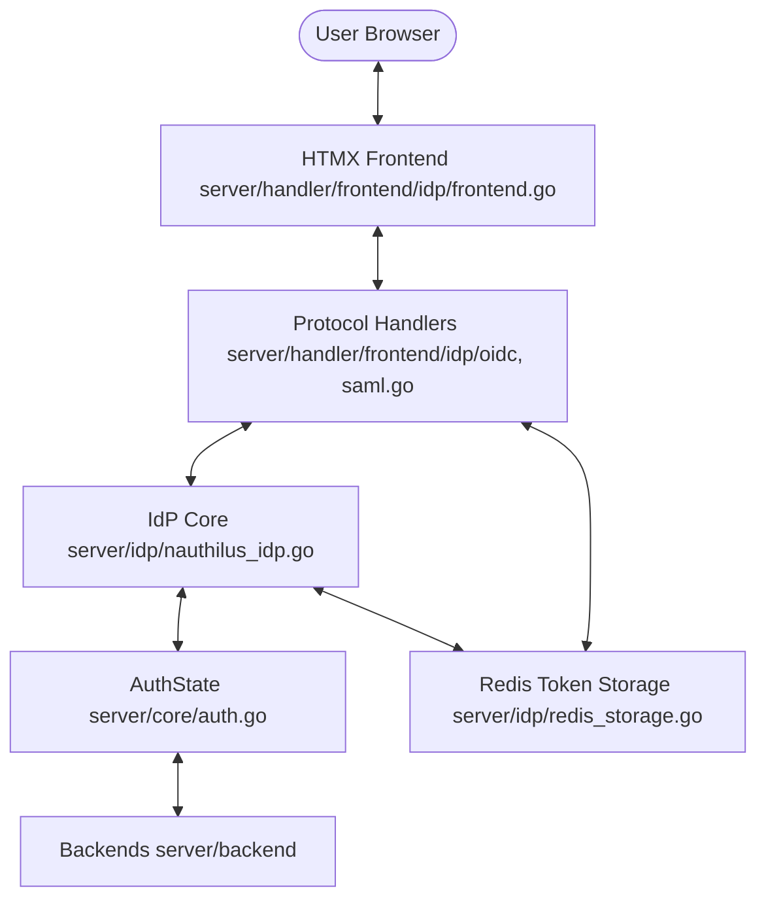
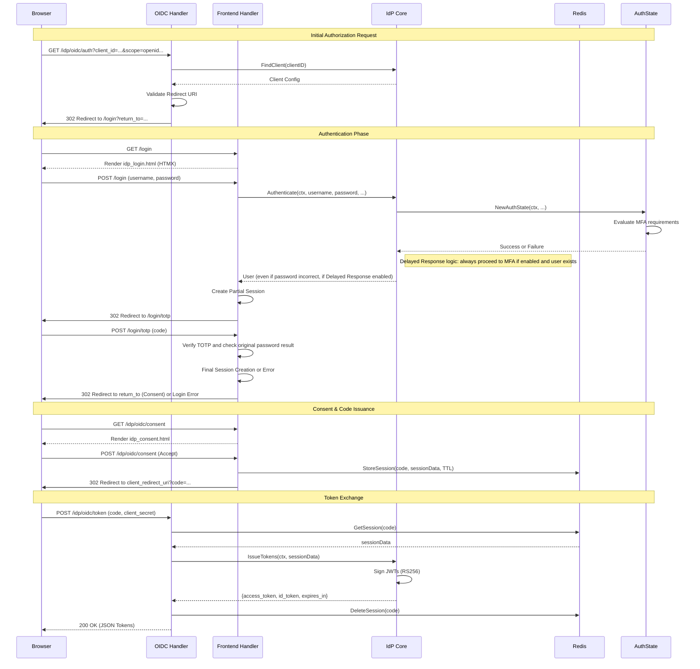
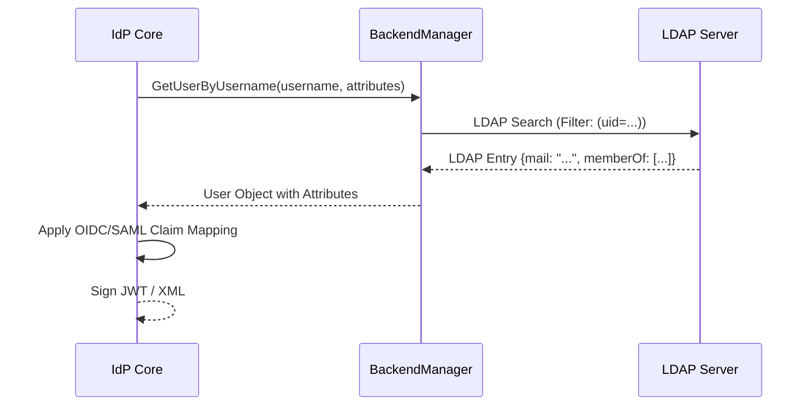

# Identity Provider (IdP): Developer Guide

This document provides a detailed technical overview of the integrated Identity Provider in Nauthilus, covering OIDC,
SAML2, and the modern HTMX-based frontend. It is intended for developers who want to understand the internal signal
flows, component interactions, and the overall design of the native IdP.

## 1. High-Level Architecture

The Nauthilus IdP is designed as a modular, lightweight, and built-in alternative to external identity providers. It is
fully integrated into the Nauthilus core, leveraging existing authentication and backend logic.

### Core Philosophy

- **Modular**: Protocol-specific logic (OIDC, SAML2) is separated from core identity management.
- **Backend-Agnostic**: Works with LDAP, Lua, or any future backend through the `BackendManager` interface.
- **Modern UI**: Uses a "no-build" frontend stack (HTMX, Tailwind CSS, DaisyUI) for a responsive and maintainable user
  experience.
- **GitOps-Ready**: Configuration is stored in the main `nauthilus.yaml`, allowing for declarative management of clients
  and service providers.

### Component Map

- **`server/idp/`**: The "Brain" of the IdP. Defines the `IdentityProvider` interface and implements the `NauthilusIdP`
  which orchestrates authentication and token issuance.
- **`server/handler/frontend/idp/`**: The "Face" and "Voice".
    - `oidc.go`: Implements the OpenID Connect 1.0 specification (Discovery, Authorize, Token, UserInfo, JWKS, Logout).
    - `saml.go`: Implements the SAML 2.0 Identity Provider logic (Metadata, SSO).
    - `frontend.go`: Manages the web-based flows (Login, Consent, 2FA Portal).
- **`server/idp/redis_storage.go`**: The "Short-term Memory". Handles volatile state like OIDC codes and session data in
  Redis.
- **`server/core/auth.go`**: The "Engine". Manages the complex multi-step authentication process (Password -> MFA ->
  Success).

## 2. Signal Flow Diagram

The following diagram shows how a request moves through the system:



## 3. Detailed Signal Flows

### 3.1 OIDC Authorization Code Flow

This is the primary flow for modern applications. It ensures that user credentials never touch the client application.



### 3.3 OIDC Logout (Front-channel and Back-channel)

Nauthilus supports both Front-channel and Back-channel logout to ensure that users are logged out from all Relying
Parties (RPs) when they end their session at the IdP.

#### Signal Flow

1. **Logout Initiation**: The user or an RP redirects the browser to `/idp/oidc/logout`.
2. **Validation**: If an `id_token_hint` and `post_logout_redirect_uri` are provided, the IdP validates them against the
   client configuration.
3. **Session Identification**: The IdP uses a session cookie (`oidc_clients`) to track which RPs the user has logged
   into during the current session.
4. **Back-channel Logout**: For all RPs that have a `backchannel_logout_uri` configured, the IdP asynchronously sends a
   POST request with a signed `logout_token` (JWT).
5. **Front-channel Logout**: If any RPs have a `frontchannel_logout_uri`, the IdP renders a page
   (`idp_logout_frames.html`) containing hidden iFrames for each RP. This allows the browser to trigger logout at the
   RPs directly.
6. **Local Logout**: The IdP clears the local user session.
7. **Redirection**: Finally, the user is redirected to the `post_logout_redirect_uri` or back to the login page.

### 3.4 SAML 2.0 SSO Flow (Redirect/POST Binding)

Nauthilus supports the Identity Provider initiated and Service Provider initiated SSO.

1. **Metadata**: The SP fetches `/saml/metadata` to obtain the IdP's entity ID and public signing certificate.
2. **SSO Request**: The SP redirects the user to `/saml/sso` with a `SAMLRequest`.
3. **Authentication**: If not already logged in, the user is sent to the `/login` page (shared with OIDC).
4. **SAML Response**: After authentication, the IdP generates a signed XML `SAMLResponse` and sends it back to the SP
   via the browser (usually a POST binding).

## 4. Core Components & Logic

### 4.1 IdP Core (`server/idp/`)

The `NauthilusIdP` struct is the central orchestrator. It holds references to:

- **Dependencies**: For accessing configuration and logging.
- **Signing Key**: An RSA private key used for signing JWTs and SAML assertions.
- **Token Storage**: The Redis interface for session management.

Key Methods:

- `Authenticate`: Wraps the core `AuthState` logic to provide a simplified interface for protocol handlers.
- `IssueTokens`: Generates ID tokens and Access tokens. It performs **Claim Mapping** by taking raw backend attributes
  and transforming them according to the client's configuration (e.g., mapping LDAP groups to the `groups` claim).
- `ValidateToken`: Decodes and verifies the signature of an access token.

### 4.2 Frontend & MFA Self-Service

The `FrontendHandler` uses **HTMX** to provide a single-page-application (SPA) feel while keeping logic on the server.

- **OIDC Authorization Code Flow**: The handler manages the login redirect, session establishment, and code generation.
  It now supports **Delayed Response** by hiding authentication failures until after the MFA step.
- **Multi-Factor Authentication (MFA)**:
    - **TOTP**: Uses the `otp` package for generation and validation. Secrets are stored in the backend (LDAP or Lua).
      Verification is integrated into the login flow (`/login/totp`).
    - **WebAuthn**: Implements the FIDO2 standard. Registration and authentication flows are handled via
      `/webauthn/register` and `/webauthn/login`.
- **Step-up Authentication**: For security-sensitive actions (like deleting a 2FA method), the handler verifies if the
  user has recently performed a full password authentication (`mfa_stepup` key in Redis).

### 4.3 Redis Storage & Key Schema

All IdP state is transient and stored in Redis.

| Key                                       | Format | TTL | Purpose                                   |
|:------------------------------------------|:-------|:----|:------------------------------------------|
| `{prefix}nauthilus:oidc:code:{code}`      | JSON   | 5m  | Stores OIDC session during code exchange. |
| `{prefix}nauthilus:webauthn:session:{id}` | Binary | 10m | WebAuthn challenge/state.                 |
| `{prefix}nauthilus:mfa:stepup:{session}`  | String | 15m | Step-up auth verification flag.           |

## 5. Observability & Debugging

### Metrics (Prometheus)

- `idp_logins_total`: Track success/failure of logins.
- `idp_tokens_issued_total`: Monitor how many tokens are issued per client.
- `idp_mfa_operations_total`: Track registration and deactivation of TOTP/WebAuthn.

### Tracing (OpenTelemetry)

Spans are created for:

- Protocol requests (OIDC Authorize/Token).
- Backend authentication calls.
- JWT signing operations.

### Debugging

Enable the `idp` debug module in the configuration to see detailed logs of the internal state transitions and protocol
interactions:

```yaml
server:
  debug:
    modules:
      - idp
```

## 6. Implementation Details: Claim Mapping

Nauthilus supports dynamic claim mapping. When an OIDC token is issued, the IdP looks at the client configuration:

```yaml
# nauthilus.yaml example
idp:
  oidc:
    clients:
      - id: my-app
        claims:
          email: "mail"         # Map LDAP 'mail' to OIDC 'email'
          groups: "memberOf"    # Map LDAP 'memberOf' to OIDC 'groups'
```

The mapping logic handles:

- **Direct mapping**: String attributes.
- **Slices**: Multi-valued attributes like groups.
- **Nested objects**: Future-proofing for complex claim structures.

## 7. Backend & LDAP Interaction

The IdP core interacts with user backends (LDAP or Lua) through the `BackendManager` interface. This abstraction ensures
that protocol handlers remain independent of the underlying storage technology.

### 7.1 Authentication Flow

1. **User Lookup**: The system performs an LDAP search using the configured `user_filter` to find the user's
   Distinguished Name (DN) and retrieve basic attributes (e.g., display name, unique ID).
2. **Credential Verification**:
    - **Password**: A second connection attempt (LDAP Bind) is performed using the user's DN and the provided password.
    - **MFA (TOTP)**: If password authentication succeeds and TOTP is enabled, the system retrieves the encrypted shared
      secret from the attribute defined in `totp_secret_field`.
    - **MFA (WebAuthn)**: If the user has WebAuthn credentials registered, the system performs a FIDO2 assertion (
      Login). Nauthilus supports multiple security keys.
3. **Delayed Response**: If enabled, the system will always proceed to the MFA step (TOTP or WebAuthn) even if the
   password was incorrect, to prevent username enumeration and credential validation by attackers.

### 7.2 MFA Storage in LDAP

Nauthilus stores second-factor metadata directly in the user's LDAP entry or in child entries, avoiding the need for a
separate database.

- **TOTP**: The shared secret is stored as a plain string in a single attribute (e.g., `nauthilusTotpSecret`).
- **WebAuthn (FIDO2)**: Nauthilus supports two modes of LDAP storage:
    1. **JSON Mode (Recommended)**: Multiple credentials are stored as serialized JSON strings in a multi-valued
       attribute (e.g., `nauthilusFido2Credential`). This is the most flexible approach and easily supports multiple
       devices per user.
        - During the login ceremony, Nauthilus verifies the signature and checks that the `SignCount` provided by the
          device is greater than the one stored in the backend.
        - After a successful login, Nauthilus automatically updates the `SignCount` in the backend (LDAP or Lua) to
          prevent replay attacks and ensure compliance with the WebAuthn specification.
    2. **Individual Attributes**: Credential details (ID, Public Key, Sign Count, etc.) are mapped to individual LDAP
       attributes.

### 7.3 Dynamic Claim Retrieval

During OIDC token issuance or SAML assertion generation, the IdP performs a "Profile Refresh" by querying the backend
for all attributes requested by the client mapping.



### 7.4 Configuration Example (LDAP)

To enable full IdP support with LDAP, ensure your `nauthilus.yaml` includes the relevant mappings. Below is an example
using the recommended JSON mode for WebAuthn:

```yaml
ldap:
  search:
    - protocol: [ "oidc", "saml" ]
      base_dn: "ou=users,dc=example,dc=com"
      filter:
        user: "(uid={{.Username}})"
      mapping:
        account_field: "uid"
        display_name_field: "cn"
        totp_secret_field: "nauthilusTotpSecret"
        # JSON mode: Use the field that stores all credentials
        credential_object: "nauthilusFido2Credential"
```

### 7.5 FIDO2 LDAP Schema & LDIF Examples

For a clean integration, Nauthilus provides a dedicated LDAP schema.

#### Adding the Schema (olc / cn=config)

Save the following as `nauthilus.ldif` and import it into your LDAP server:

```ldif
dn: cn=nauthilus,cn=schema,cn=config
objectClass: olcSchemaConfig
cn: nauthilus
olcAttributeTypes: ( 1.3.6.1.4.1.31612.1.5.1.1 NAME 'nauthilusFido2Credential'
  DESC 'Serialized WebAuthn credential (JSON)'
  EQUALITY caseIgnoreMatch
  SUBSTR caseIgnoreSubstringsMatch
  SYNTAX 1.3.6.1.4.1.1466.115.121.1.15 )
olcAttributeTypes: ( 1.3.6.1.4.1.31612.1.5.1.2 NAME 'nauthilusTotpRecoveryCode'
  DESC 'One-time use recovery codes for TOTP'
  EQUALITY caseIgnoreMatch
  SUBSTR caseIgnoreSubstringsMatch
  SYNTAX 1.3.6.1.4.1.1466.115.121.1.15 )
olcObjectClasses: ( 1.3.6.1.4.1.31612.1.5.2.1 NAME 'nauthilusFido2Account'
  DESC 'Auxiliary object class for FIDO2 WebAuthn credentials'
  SUP top
  AUXILIARY
  MAY ( nauthilusFido2Credential ) )
olcObjectClasses: ( 1.3.6.1.4.1.31612.1.5.2.2 NAME 'nauthilusMfaAccount'
  DESC 'Auxiliary object class for MFA settings'
  SUP top
  AUXILIARY
  MAY ( nauthilusTotpRecoveryCode ) )
```

#### Multi-Device Support in LDAP

To support multiple FIDO2 devices for a single user, simply add multiple values to the `nauthilusFido2Credential`
attribute. Each value contains a self-contained JSON representation of a device.

**Example user entry with two devices:**

```ldif
dn: uid=jdoe,ou=users,dc=example,dc=com
objectClass: inetOrgPerson
objectClass: nauthilusFido2Account
uid: jdoe
cn: John Doe
sn: Doe
nauthilusFido2Credential: {"credentialID":"abc...","publicKey":"def...","signCount":123,...}
nauthilusFido2Credential: {"credentialID":"xyz...","publicKey":"ghi...","signCount":456,...}
```

### 7.6 TOTP Backup / Recovery Codes

Nauthilus allows users to generate a set of one-time use recovery codes. These codes can be used instead of a standard
TOTP code during the 2FA phase.

- **Generation**: Users can generate a new set (default 10 codes) in the 2FA settings. Generating new codes invalidates
  all previous ones.
- **Storage**: Codes are stored as plain strings in a multi-valued LDAP attribute (e.g., `nauthilusTotpRecoveryCode`) or
  via the Lua backend.
- **Consumption**: When a recovery code is used, it is immediately and permanently removed from the backend.
- **Validation**: The validation logic (`server/core/totp.go`) checks the user's recovery codes before attempting
  standard TOTP verification.

**Configuration Example (LDAP):**

```yaml
ldap:
  search:
    - protocol: [ "oidc", "saml" ]
      mapping:
        totp_recovery_field: "nauthilusTotpRecoveryCode"
```
