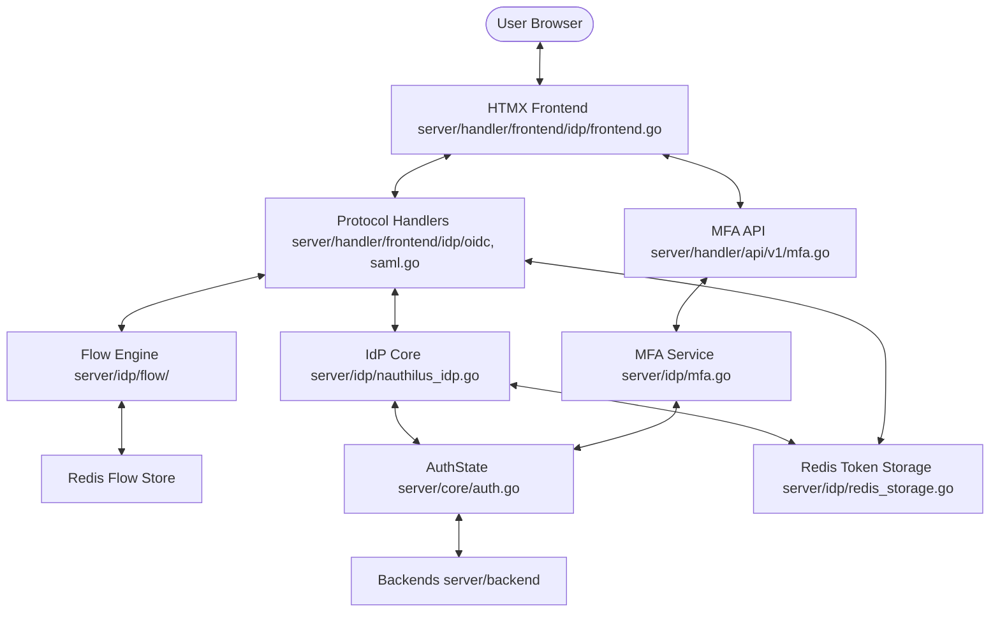
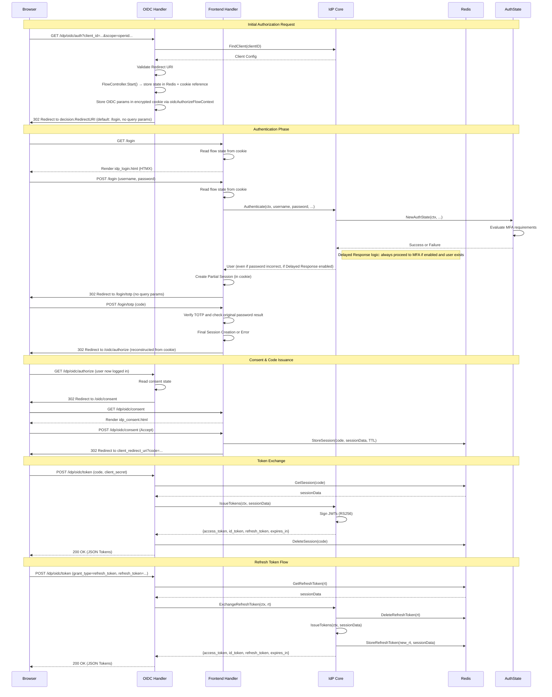
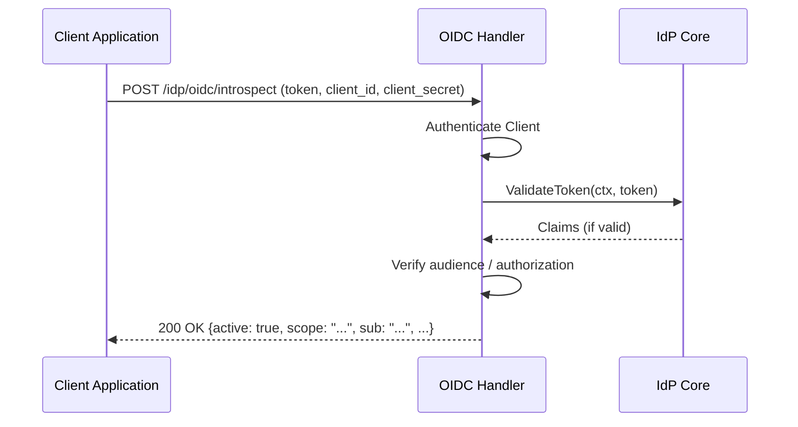
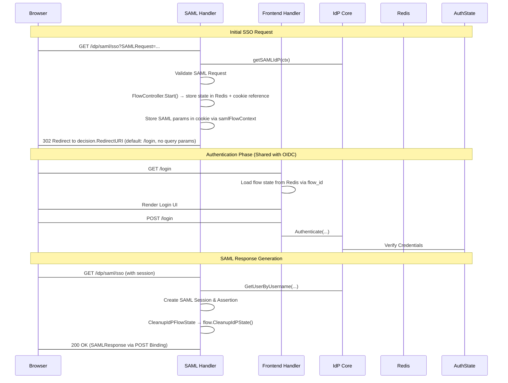
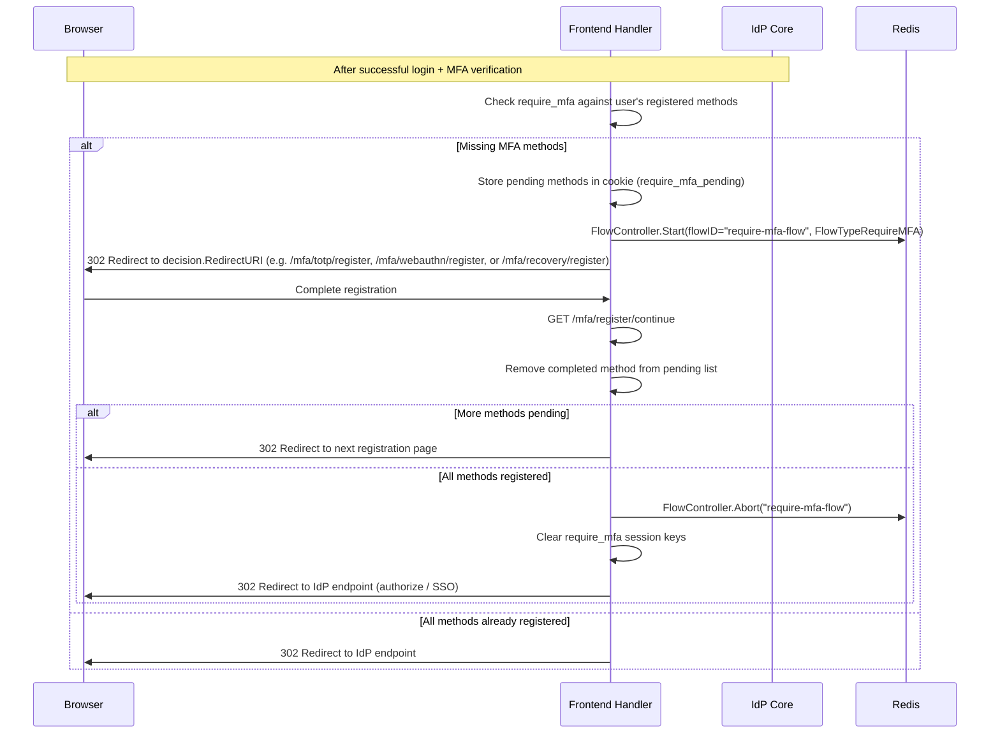
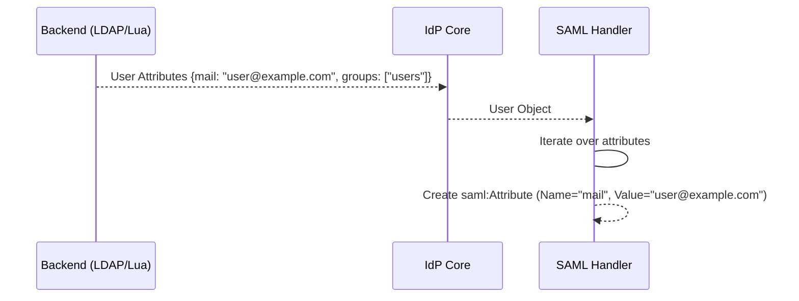
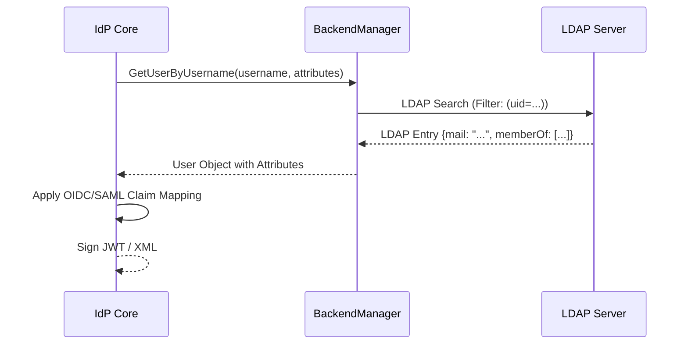
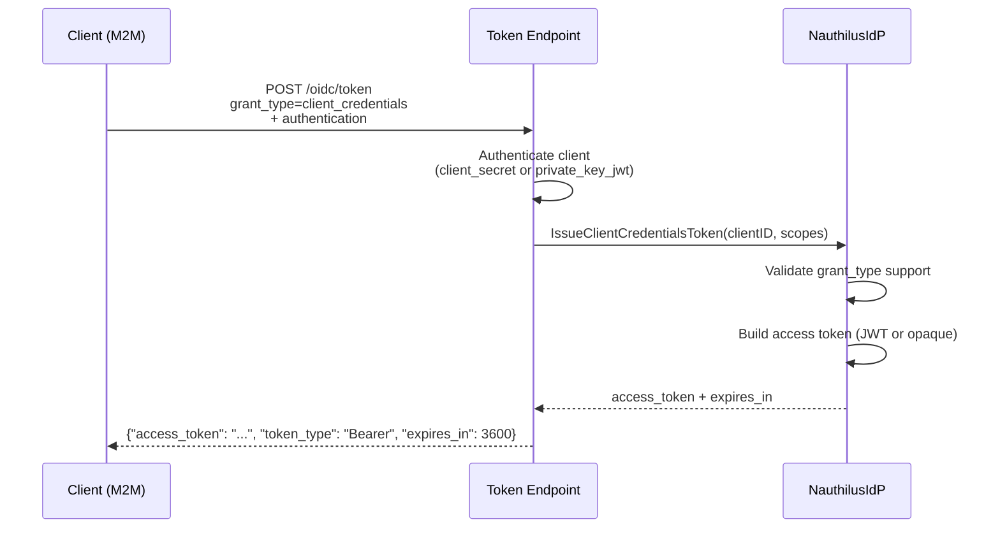
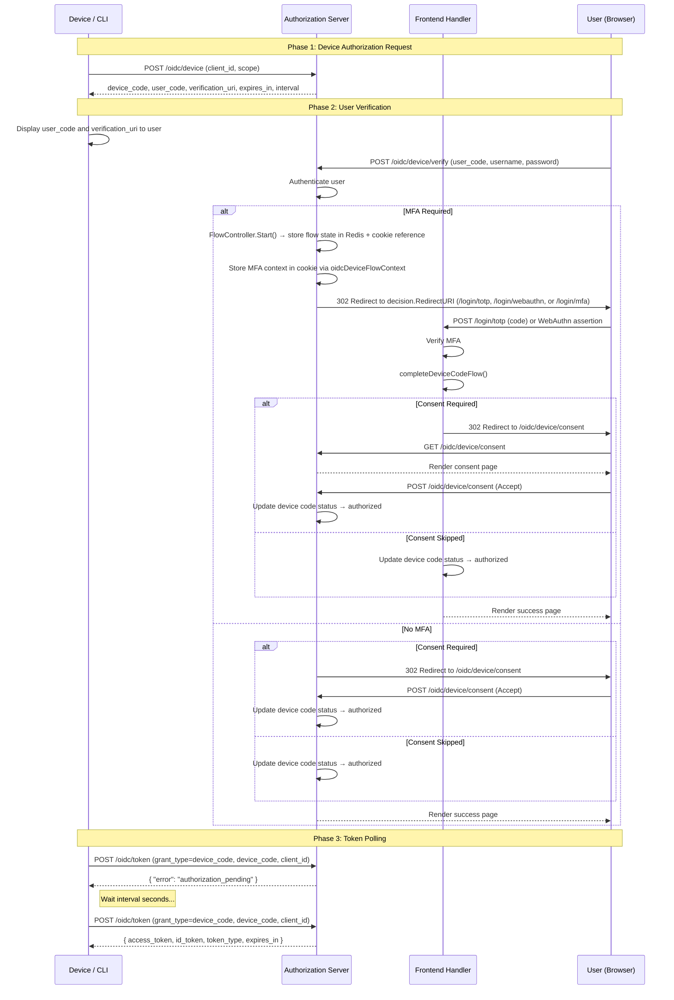

# Identity Provider (IdP): Developer Guide

This document provides a detailed technical overview of the integrated Identity Provider in Nauthilus, covering OIDC,
SAML2, and the modern HTMX-based frontend. It is intended for developers who want to understand the internal signal
flows, component interactions, and the overall design of the IdP.

Migration baseline artifacts:

1. `server/docs/idp_flow_adr.md`
2. `server/docs/idp_flow_matrix.md`
3. `server/docs/idp_flow_test_gap.md`

## 1. High-Level Architecture

The Nauthilus IdP is designed as a modular, lightweight, and built-in Identity Provider. It is
fully integrated into the Nauthilus core, leveraging existing authentication and backend logic.

### Core Philosophy

- **Modular**: Protocol-specific logic (OIDC, SAML2) is separated from core identity management.
- **Backend-Agnostic**: Works with LDAP, Lua, or any future backend through the `BackendManager` interface.
- **Modern UI**: Uses a "no-build" frontend stack (HTMX, Tailwind CSS, DaisyUI) for a responsive and maintainable user
  experience.
- **GitOps-Ready**: Configuration is stored in the main `nauthilus.yaml`, allowing for declarative management of clients
  and service providers.

### Component Map

- **`server/idp/`**: The "Brain" of the IdP. Defines the `IdentityProvider` interface and implements the `NauthilusIdP`
  which orchestrates authentication and token issuance.
- **`server/idp/flow/`**: The "Flow Engine". Central flow orchestration with `Controller`, `State`, `Store`
  (Redis/Hybrid), `URIBuilder`, and `Policy` / `TransitionGraph`. All flow lifecycle operations (Start, Advance,
  Back, Cancel, Complete, Resume, Abort, Recover) are routed through this package.
- **`server/handler/api/v1/`**: The "JSON Interface".
    - `mfa.go`: Provides a clean JSON API for managing TOTP, Recovery Codes, and WebAuthn credentials.
- **`server/handler/frontend/idp/`**: The "Face" and "Voice".
    - `oidc.go`: Core OIDC handler (Discovery, Token, Introspect, UserInfo, JWKS, Logout) and route registration.
      Also exposes `CleanupIdPFlowState` and `CleanupMFAState` which delegate to the flow package.
    - `oidc_authorization_code.go`: Implements the Authorization Code Grant (Authorize, Consent, token exchange,
      refresh token exchange).
    - `oidc_client_credentials.go`: Implements the Client Credentials Grant token exchange.
    - `oidc_device_code.go`: Implements the Device Authorization Grant (RFC 8628) including device authorization,
      user verification with MFA support, device consent, and token polling.
    - `oidc_flow_context.go`: Flow context objects (`oidcAuthorizeFlowContext`, `oidcDeviceFlowContext`) that
      encapsulate OIDC-specific cookie access (store/read request parameters, consent tracking).
    - `saml.go`: Implements the SAML 2.0 Identity Provider logic (Metadata, SSO).
    - `saml_flow_context.go`: Flow context object (`samlFlowContext`) that encapsulates SAML-specific cookie access.
    - `flow_controller_factory.go`: Factory function `newFlowController` that builds a `flow.Controller` with
      the appropriate store (HybridStore when Redis is available, FlowReferenceAdapter otherwise).
    - `frontend.go`: Manages the web-based flows (Login, MFA, 2FA Portal) and handles post-authentication
      redirection for all grant types including device code flow completion after MFA.
- **`server/idp/redis_storage.go`**: The "Short-term Memory". Handles volatile state like OIDC codes and session data in
  Redis.
- **`server/core/auth.go`**: The "Engine". Manages the complex multi-step authentication process (Password -> MFA ->
  Success).

## 2. Signal Flow Diagram

The following diagram shows how a request moves through the system:


```mermaid
graph TD
    User([User Browser]) <--> FE[HTMX Frontend server/handler/frontend/idp/frontend.go]
    FE <--> PH[Protocol Handlers server/handler/frontend/idp/oidc, saml.go]
    PH <--> FC[Flow Engine server/idp/flow/]
    FC <--> RFS[Redis Flow Store]
    PH <--> IC[IdP Core server/idp/nauthilus_idp.go]
    IC <--> AS[AuthState server/core/auth.go]
    AS <--> BE[Backends server/backend]
    IC <--> RTS[Redis Token Storage server/idp/redis_storage.go]
    PH <--> RTS
    FE <--> MFA[MFA API server/handler/api/v1/mfa.go]
    MFA <--> MS[MFA Service server/idp/mfa.go]
    MS <--> AS
```

## 3. Detailed Signal Flows

### 3.1 OIDC Authorization Code Flow

This is the primary flow for modern applications. It ensures that user credentials never touch the client application.

**Security Note:** The IdP uses a hybrid flow-state model.
The encrypted cookie (`nauthilus_secure_data`) stores only a minimal flow reference (for example `flow_id`).
The full flow state is persisted in Redis and resolved centrally through the flow layer.
No flow state (like `return_to`) is passed via URL parameters to prevent Open Redirect vulnerabilities.


```mermaid
sequenceDiagram
    participant B as Browser
    participant H as OIDC Handler
    participant F as Frontend Handler
    participant I as IdP Core
    participant R as Redis
    participant A as AuthState
    Note over B, A: Initial Authorization Request
    B ->> H: GET /idp/oidc/auth?client_id=...&scope=openid...
    H ->> I: FindClient(clientID)
    I -->> H: Client Config
    H ->> H: Validate Redirect URI
    H ->> H: FlowController.Start() → store state in Redis + cookie reference
    H ->> H: Store OIDC params in encrypted cookie via oidcAuthorizeFlowContext
    H ->> B: 302 Redirect to decision.RedirectURI (default: /login, no query params)
    Note over B, A: Authentication Phase
    B ->> F: GET /login
    F ->> F: Read flow state from cookie
    F -->> B: Render idp_login.html (HTMX)
    B ->> F: POST /login (username, password)
    F ->> F: Read flow state from cookie
    F ->> I: Authenticate(ctx, username, password, ...)
    I ->> A: NewAuthState(ctx, ...)
    A ->> A: Evaluate MFA requirements
    A -->> I: Success or Failure
    Note right of I: Delayed Response logic: always proceed to MFA if enabled and user exists
    I -->> F: User (even if password incorrect, if Delayed Response enabled)
    F ->> F: Create Partial Session (in cookie)
    F ->> B: 302 Redirect to /login/totp (no query params)
    B ->> F: POST /login/totp (code)
    F ->> F: Verify TOTP and check original password result
    F ->> F: Final Session Creation or Error
    F ->> B: 302 Redirect to /oidc/authorize (reconstructed from cookie)
    Note over B, A: Consent & Code Issuance
    B ->> H: GET /idp/oidc/authorize (user now logged in)
    H ->> H: Read consent state
    H ->> B: 302 Redirect to /oidc/consent
    B ->> F: GET /idp/oidc/consent
    F -->> B: Render idp_consent.html
    B ->> F: POST /idp/oidc/consent (Accept)
    F ->> R: StoreSession(code, sessionData, TTL)
    F ->> B: 302 Redirect to client_redirect_uri?code=...
    Note over B, A: Token Exchange
    B ->> H: POST /idp/oidc/token (code, client_secret)
    H ->> R: GetSession(code)
    R -->> H: sessionData
    H ->> I: IssueTokens(ctx, sessionData)
    I ->> I: Sign JWTs (RS256)
    I -->> H: {access_token, id_token, refresh_token, expires_in}
    H ->> R: DeleteSession(code)
    H -->> B: 200 OK (JSON Tokens)
    Note over B, A: Refresh Token Flow
    B ->> H: POST /idp/oidc/token (grant_type=refresh_token, refresh_token=...)
    H ->> R: GetRefreshToken(rt)
    R -->> H: sessionData
    H ->> I: ExchangeRefreshToken(ctx, rt)
    I ->> R: DeleteRefreshToken(rt)
    I ->> I: IssueTokens(ctx, sessionData)
    I ->> R: StoreRefreshToken(new_rt, sessionData)
    I -->> H: {access_token, id_token, refresh_token, expires_in}
    H -->> B: 200 OK (JSON Tokens)
```

### 3.1.1 Hybrid Flow State (Cookie Reference + Redis State)

The IdP stores only a minimal flow reference in the encrypted `nauthilus_secure_data` cookie.
The full flow state is persisted in Redis and resolved via the cookie reference (`flow_id`).

**Session Keys for IdP Flow:**

| Key                   | Description                                                                             |
|-----------------------|-----------------------------------------------------------------------------------------|
| `idp_flow_id`         | Opaque flow identifier referencing the full state in Redis                              |
| `idp_flow_type`       | Flow type: `oidc` or `saml`                                                             |
| `idp_client_id`       | OIDC client_id                                                                          |
| `idp_redirect_uri`    | Validated OIDC redirect_uri                                                             |
| `idp_scope`           | Requested OIDC scopes                                                                   |
| `idp_state`           | OIDC state parameter                                                                    |
| `idp_nonce`           | OIDC nonce parameter                                                                    |
| `idp_original_url`    | SAML original request URL                                                               |
| `oidc_grant_type`     | OIDC grant type (`authorization_code` or `device_code`) to distinguish flows            |
| `device_code`         | Device code string during the device code MFA flow                                      |
| `require_mfa_flow`    | Flow reference flag for the require_mfa flow (managed by `FlowController`)              |
| `require_mfa_pending` | Comma-separated list of MFA methods still requiring registration (e.g. `totp,webauthn`) |

**How it works:**

1. `/oidc/authorize` validates all parameters and calls `FlowController.Start()` which stores full flow state in Redis
2. The encrypted cookie stores only the flow reference (`flow_id`, `flow_type`, `require_mfa_flow`) via
   `FlowReferenceAdapter`
3. OIDC request parameters are stored separately in the cookie via `oidcAuthorizeFlowContext`
4. Redirects to `decision.RedirectURI` (resolved by `URIBuilder`, default `/login`) without query parameters
5. `/login` loads the flow via `flow_id` from Redis through the `HybridStore` and validates it centrally
6. After successful authentication, redirects back through centralized `FlowController` decisions
7. On completion/abort, `CleanupIdPFlowState` delegates to `flow.CleanupIdPState()` which removes all flow keys from the
   cookie

### 3.1.2 CSRF Protection

All IdP frontend pages use CSRF protection via a custom middleware (`server/middleware/csrf`). The CSRF token is:

- Generated server-side via `csrf.Token(ctx)` (double-submit cookie pattern with masked tokens)
- Passed to templates as `{{ .CSRFToken }}`
- Sent as `X-CSRF-Token` header for HTMX and fetch() requests
- Validated on unsafe methods (POST, PUT, DELETE, PATCH) by comparing the masked request token against the cookie token

**Protected endpoints:**

- Login pages (`/login`, `/login/:languageTag`)
- MFA pages (`/login/totp`, `/login/webauthn`, `/login/mfa`, `/login/recovery`)
- Consent pages (`/oidc/consent`, `/oidc/consent/:languageTag`)
- Device consent pages (`/oidc/device/consent`, `/oidc/device/consent/:languageTag`)
- Device verification pages (`/oidc/device/verify`, `/oidc/device/verify/:languageTag`)
- Registration pages (`/mfa/totp/register`, `/mfa/webauthn/register`)
- 2FA Home (`/mfa/register/home`)
- Forced MFA registration (`/mfa/register/continue`, `/mfa/register/cancel`)
- Device management (`/mfa/webauthn/devices`)

**HTMX requests:**

```html
<button hx-delete="/mfa/totp" 
        hx-headers='{"X-CSRF-Token": "{{ .CSRFToken }}"}'>
```

**JavaScript fetch() requests:**

```javascript
const response = await fetch("/mfa/webauthn/register/finish", {
    method: "POST",
    headers: {
        "Content-Type": "application/json",
        "X-CSRF-Token": "{{ .CSRFToken }}"
    },
    body: JSON.stringify(data)
});
```

### 3.1.3 Redirect URI Validation Rules

Nauthilus validates `idp.oidc.clients[].redirect_uris` with strict matching plus controlled wildcard and loopback rules:

- Exact string matching is the default.
- A trailing wildcard (`*`) is supported only at the end of the configured URI and only when the configured URI does
  not contain a query (`?`).
- For wildcard matches, query and fragment parts of the requested `redirect_uri` are ignored during prefix matching.
- A full wildcard (`*`) is accepted and matches any `http`/`https` redirect URI. This is strongly discouraged in
  production.
- For native app compatibility, `http` loopback redirect URIs (`127.0.0.1`, `localhost`, `::1`) allow dynamic ports.
  Example: configured `http://127.0.0.1/callback` matches request `http://127.0.0.1:51208/callback`.
- Dynamic loopback port matching is intentionally limited to `http` loopback redirects and does not apply to
  non-loopback
  hosts.

Security hardening notes:

- Wildcard matching is disabled when the incoming `redirect_uri` contains user-info (`user@host`) or unsafe path
  traversal segments (`/../`, including encoded variants).
- Prefer specific redirect URIs over broad wildcard patterns.
- `post_logout_redirect_uri` remains an exact-match check against `post_logout_redirect_uris`.

### 3.1.4 Frontend Security Headers & CSP Nonce

Frontend routes support strict configurable browser security headers via:

- `server.frontend.security_headers`

Default behavior:

- Headers are enabled when omitted.
- A per-request CSP nonce is generated.
- `{{nonce}}` in `content_security_policy` is replaced with the generated nonce.
- Templates use `nonce="{{ cspNonce . }}"` for inline scripts.

Example:

```yaml
server:
    frontend:
        security_headers:
            enabled: true
            # Legacy full-string form is still supported.
            # Recommended structured form:
            content_security_policy:
                connect-src:
                    - "'self'"
                    - "https://api.example.test"
                frame-src:
                    - "'self'"
                    - "https:"
                    - "https://widgets.example.test"
                form-action:
                    - "'self'"
                form_action_optional_uris:
                    - "https://idp.example.test"
                    - "http://localhost:8080"
            content_security_policy_report_only: false
            strict_transport_security:
                max_age: 31536000
                include_subdomains: true
                preload: false
            x_content_type_options: "nosniff"
            x_frame_options: "DENY"
            referrer_policy: "no-referrer"
            permissions_policy:
                features:
                    geolocation: "()"
                    microphone: "()"
                    camera: "()"
                    payment: "()"
                    usb: "()"
            cross_origin_opener_policy: "same-origin"
            cross_origin_resource_policy: "same-origin"
            cross_origin_embedder_policy: "unsafe-none"
            x_permitted_cross_domain_policies: "none"
            x_dns_prefetch_control: "off"
```

Type support and composition rules:

- `content_security_policy` accepts either a single `string` or an `object`.
- `permissions_policy` accepts either a single `string` or an `object`.
- `strict_transport_security` accepts either a single `string` or an `object`.
- In CSP object mode, `form_action_optional_uris` extends `form-action`.
- Other security headers in this section remain single-string settings.
- Legacy list syntax for these three headers (`[]string`) is still accepted for backward compatibility.

Merge and precedence behavior:

- If a header is configured as a single string, it is used as-is.
- If a header is configured as an object, Nauthilus composes the final header from secure defaults plus object
  overrides.
- For `content_security_policy` object entries, sources may be configured as one space-separated `string` or as
  `[]string`.
- `content_security_policy` supports the following object keys (complete list):
- `default-src`
- `script-src`
- `style-src`
- `img-src`
- `font-src`
- `connect-src`
- `frame-src`
- `object-src`
- `base-uri`
- `frame-ancestors`
- `form-action`
- `form_action_optional_uris` (appended, deduplicated, to `form-action`)
- `directives` (optional object containing any of the directive keys listed above)
- Missing CSP directives keep secure defaults.
- For `permissions_policy` object entries:
- `features` is a mapping (`feature: value`).
- Direct `feature: value` keys at object root are also supported.
- Missing features keep secure defaults.
- For `strict_transport_security` object entries:
- `max_age` overrides the default max-age.
- `include_subdomains` controls `includeSubDomains` (default remains `true`).
- `preload` toggles `preload`.
- `extra_tokens` appends custom tokens.
- If you need full manual control for any of these headers, use the single-string form.

Defaults and omitted partials:

- If a setting is omitted entirely, secure defaults are applied.
- If object mode is used and some entries are omitted, those entries fall back to secure defaults.

Validation and error handling:

- Invalid types (for example non-string directive sources) fail configuration loading.
- Unknown object keys in `content_security_policy` and `strict_transport_security` fail configuration loading.
- Unknown CSP directives fail configuration loading.
- Invalid `permissions_policy` feature values fail configuration loading.
- Errors are returned during config validation before serving requests.

Backward compatibility:

- Existing configurations that already use full header strings continue to work without changes.

Default `form-action` is `form-action 'self' https:` when no `form_action_optional_uris` are set.
If `form_action_optional_uris` is set, implicit default `https:` is removed and only explicit entries are appended.
If full control is required, set `form-action` directly.

The placeholder `{{nonce}}` is replaced per request. Inline script tags in templates are emitted with this nonce.

### 3.1.5 Central CORS (`server.cors`)

Cross-origin behavior is configured centrally under `server.cors` and is independent from frontend security headers.

```yaml
server:
    cors:
        enabled: true
        policies:
            - name: "oidc_discovery"
              enabled: true
              path_prefixes: ["/.well-known/"]
              allow_origins: ["https://oc.roessner.cloud"]
              allow_methods: ["GET", "OPTIONS"]
              allow_headers: ["Authorization", "Content-Type"]
              expose_headers: []
              allow_credentials: false
              max_age: 600
```

Policies are evaluated in order. The first active policy with a matching `path_prefixes` entry is used.
Use explicit origin lists in production.

## 4. MFA Management API (/api/v1/mfa)

The IdP provides a JSON API for managing Multi-Factor Authentication. This API is used internally by the HTMX frontend
and can be used by external clients.

### 4.1 TOTP Management

- **`GET /api/v1/mfa/totp/setup`**:
    - Starts the TOTP registration process.
    - Returns JSON: `{"secret": "...", "qr_code_url": "..."}`.
    - Stores the secret in the user's session for verification.
- **`POST /api/v1/mfa/totp/register`**:
    - Finalizes TOTP registration by verifying a code.
    - Request Body: `{"code": "123456"}`.
    - Returns 200 OK on success.
- **`DELETE /api/v1/mfa/totp`**:
    - Deletes the TOTP configuration for the user.
    - Returns 200 OK on success.

### 4.2 Recovery Codes

- **`POST /api/v1/mfa/recovery-codes/generate`**:
    - Generates and returns a new set of 10 recovery codes.
    - Replaces any existing recovery codes in the backend.
    - Returns JSON: `{"codes": ["...", "..."]}`.

### 4.3 WebAuthn Management

- **`GET /api/v1/mfa/webauthn/register/begin`**:
    - Initiates WebAuthn registration.
    - Returns `CredentialCreationOptions` as JSON (standard WebAuthn format).
- **`POST /api/v1/mfa/webauthn/register/finish`**:
    - Finalizes WebAuthn registration.
  - Request Body: Either the raw credential object from `navigator.credentials.create()` or an object containing a
    `name` and `credential` payload (e.g. `{"name": "Office YubiKey", "credential": { ... }}`) to store a
    user-friendly device name.
    - Returns 200 OK on success.
- **`DELETE /api/v1/mfa/webauthn/:credentialID`**:
    - Deletes a specific WebAuthn credential by its ID.
    - Returns 200 OK on success.

### 4.4 WebAuthn Devices Portal

The IdP includes a dedicated view for managing registered WebAuthn devices:

- **`GET /mfa/webauthn/devices`**:
    - Renders an overview of all registered security keys.
  - Displays the device name, device ID, and the "Last Used" timestamp.
  - Allows users to add new devices, rename, or delete specific ones.
- **`DELETE /mfa/webauthn/device/:id`**:
    - Deletes a specific device.
- **`POST /mfa/webauthn/device/:id/name`**:
    - Updates the device name for a specific device.

The "Last Used" timestamp is updated automatically upon every successful WebAuthn login and stored in the persistent
backend (LDAP or Lua).

## 5. Protocol-Specific Flows

RFC 7662 allows clients to query the IdP to determine the active state of an OAuth 2.0 token and to determine
meta-information about this token.


```mermaid
sequenceDiagram
    participant B as Client Application
    participant H as OIDC Handler
    participant I as IdP Core
    B ->> H: POST /idp/oidc/introspect (token, client_id, client_secret)
    H ->> H: Authenticate Client
    H ->> I: ValidateToken(ctx, token)
    I -->> H: Claims (if valid)
    H ->> H: Verify audience / authorization
    H -->> B: 200 OK {active: true, scope: "...", sub: "...", ...}
```

### 3.3 OIDC Logout (Front-channel and Back-channel)

Nauthilus supports both Front-channel and Back-channel logout to ensure that users are logged out from all Relying
Parties (RPs) when they end their session at the IdP.

#### Signal Flow

1. **Logout Initiation**: The user or an RP redirects the browser to `/idp/oidc/logout`.
2. **Validation**: If an `id_token_hint` and `post_logout_redirect_uri` are provided, the IdP validates them against the
   client configuration.
3. **Session Identification**: The IdP uses a session cookie (`oidc_clients`) to track which RPs the user has logged
   into during the current session.
4. **Back-channel Logout**: For all RPs that have a `backchannel_logout_uri` configured, the IdP asynchronously sends a
   POST request with a signed `logout_token` (JWT).
5. **Front-channel Logout**: If any RPs have a `frontchannel_logout_uri`, the IdP renders a page
   (`idp_logout_frames.html`) containing hidden iFrames for each RP. This allows the browser to trigger logout at the
   RPs directly.
6. **Local Logout**: The IdP clears the local user session.
7. **Redirection**: Finally, the user is redirected to the `post_logout_redirect_uri` or back to the login page.

### 3.4 SAML 2.0 SSO Flow (Redirect/POST Binding)

Nauthilus supports the Identity Provider initiated and Service Provider initiated SSO.


```mermaid
sequenceDiagram
    participant B as Browser
    participant H as SAML Handler
    participant F as Frontend Handler
    participant I as IdP Core
    participant R as Redis
    participant A as AuthState
    Note over B, A: Initial SSO Request
    B -> H: GET /idp/saml/sso?SAMLRequest=...
    H -> I: getSAMLIdP(ctx)
    H -> H: Validate SAML Request
    H -> H: FlowController.Start() → store state in Redis + cookie reference
    H -> H: Store SAML params in cookie via samlFlowContext
    H -> B: 302 Redirect to decision.RedirectURI (default: /login, no query params)
    Note over B, A: Authentication Phase (Shared with OIDC)
    B -> F: GET /login
    F -> F: Load flow state from Redis via flow_id
    F -> B: Render Login UI
    B -> F: POST /login
    F -> I: Authenticate(...)
    I -> A: Verify Credentials
    Note over B, A: SAML Response Generation
    B -> H: GET /idp/saml/sso (with session)
    H -> I: GetUserByUsername(...)
    H -> H: Create SAML Session & Assertion
    H -> H: CleanupIdPFlowState → flow.CleanupIdPState()
    H -> B: 200 OK (SAMLResponse via POST Binding)
```

1. **Metadata**: The SP fetches `/saml/metadata` to obtain the IdP's entity ID and public signing certificate.
2. **SSO Request**: The SP redirects the user to `/saml/sso` with a `SAMLRequest`.
3. **Flow Initialization**: The SAML handler calls `FlowController.Start()` which stores the full flow state in Redis
   and a minimal reference in the cookie. SAML-specific parameters (entity ID, original URL) are stored separately via
   `samlFlowContext`. The redirect target is determined by `URIBuilder`.
4. **Authentication**: If not already logged in, the user is sent to the `/login` page (shared with OIDC).
5. **SAML Response**: After authentication, the IdP generates a signed XML `SAMLResponse` and sends it back to the SP
   via the browser (usually a POST binding). Flow state is cleaned up via `CleanupIdPFlowState`.

### 3.5 SAML 2.0 SLO (Single Logout)

Nauthilus stellt einen protokollbewussten SAML-SLO-Endpunkt unter `/saml/slo` bereit, inklusive:

1. Eingangsrouting fuer `LogoutRequest` und `LogoutResponse` (Redirect/POST).
2. Signatur- und Protokollvalidierung vor jeder Statusaenderung.
3. Lokalem Cleanup plus orchestriertem Fanout (Front-Channel, optional Back-Channel).
4. Korrelation ueber Transaktions- und Request-IDs.

#### SLO-001 Domainmodell (Lifecycle + Korrelation)

Als Grundlage fuer die naechsten SLO-Schritte definiert Nauthilus ein dediziertes Domainmodell unter
`server/idp/slo`:

- `SLOTransaction`: End-to-end Logout-Transaktion.
- `SLOParticipant`: Ein betroffener Service Provider innerhalb einer Transaktion.
- `SLOStatus`: Lebenszyklusstatus der Transaktion.
- `SLOBinding`: Verwendetes SAML Binding (`redirect`, `post`).
- `SLODirection`: Richtung der Initiierung (`sp_initiated`, `idp_initiated`).

Die Request-Korrelation ist explizit festgelegt:

- `TransactionID`: Eindeutige interne ID pro Logout-Lauf.
- `RootRequestID`: Eingehende SAML LogoutRequest-ID, die die Transaktion startet.
- `SLOParticipant.RequestID`: Pro Teilnehmer eindeutige ausgehende Request-ID (innerhalb derselben Transaktion).

Der erlaubte Status-Lifecycle ist streng und wird durch Code und Tests erzwungen:

`received -> validated -> local_done -> fanout_running -> done | partial | failed`

#### SLO-002 Session/Participant-Registry fuer SAML

Um SLO-Fanout vorzubereiten, persistiert Nauthilus beim erfolgreichen SAML-SSO pro Account und SP eine
Teilnehmer-Session in Redis:

- `account`
- `sp_entity_id`
- `name_id`
- `session_index`
- `authn_instant`
- TTL auf Basis der SAML Session-Laufzeit (`default_expire_time` bzw. Assertion-Expire-Time)

Redis-Key-Schema:

- Prefix: `<redis_prefix>idp:saml:slo`
- Account-Index: `...:index:<url-escaped-account>`
- Teilnehmer-Sessions: `...:participant:<url-escaped-account>:<sha256(sp_entity_id)>`

Cleanup-Strategie:

- Bei SAML-Logout (`/saml/slo`) werden alle Teilnehmer-Sessions des Accounts aktiv entfernt.
- Bei Session-Ablauf erfolgt Cleanup automatisch ueber Redis-TTL (inkl. Index-Handling).

#### SLO-003 Eingangsrouter fuer SLO-Nachrichten

Der Endpunkt `/saml/slo` unterscheidet nun explizit zwischen SAML-`LogoutRequest` und SAML-`LogoutResponse`
anstatt nur einen lokalen Logout auszufuehren:

- `GET` wird als Redirect-Binding behandelt.
- `POST` wird als Form-POST-Binding behandelt.
- Der Handler dispatcht verbindlich auf `handleLogoutRequest` bzw. `handleLogoutResponse`.

Validierungsregeln fuer eingehende Parameter:

- Genau einer von `SAMLRequest` oder `SAMLResponse` muss vorhanden sein.
- Beide gleichzeitig werden als inkonsistent mit `400 Bad Request` abgewiesen.
- Fehlende Payloads werden mit `400 Bad Request` abgewiesen.
- Doppelte oder leere kritische Parameter (`SAMLRequest`, `SAMLResponse`, `RelayState`) werden mit `400 Bad Request`
  abgewiesen.

Der bisherige lokale Logout-Cleanup bleibt als Fallback in den Dispatch-Handlern erhalten, bis die naechsten
SLO-Schritte (`SLO-004+`) Signatur- und Protokollvalidierung sowie Response-Erzeugung aktivieren.

#### SLO-004 Signaturvalidierung fuer eingehende LogoutRequest(s)

Eingehende `LogoutRequest`-Nachrichten werden nun vor jedem lokalen Logout-Cleanup auf gueltige Signaturen
geprueft:

- Redirect-Binding:
    - Strikte Pruefung der signierten Query-Basis `SAMLRequest` + optional `RelayState` + `SigAlg`.
    - `Signature` und `SigAlg` muessen konsistent gemeinsam vorhanden sein.
    - Doppelte kritische Query-Parameter (`SAMLRequest`, `RelayState`, `SigAlg`, `Signature`) werden verworfen.
- POST-Binding:
    - XML-Signaturpruefung gegen vertrauenswuerdige SP-Zertifikate.
    - Zertifikate werden pro `Issuer` aus der SP-Konfiguration (`idp.saml2.service_providers[*].cert|cert_file`)
      geladen.
- SHA-1 bleibt auf beiden Pfaden blockiert:
    - Redirect: SHA-1 `SigAlg` wird als unsupported abgelehnt.
    - POST: SHA-1 XML SignatureMethod wird als unsupported abgelehnt.

Fehlschlaege in der Signaturvalidierung werden mit `400 Bad Request` beantwortet; ein lokaler Logout wird dann
nicht ausgefuehrt.

#### SLO-005 Protokollvalidierung fuer eingehende LogoutRequest(s)

Nach erfolgreicher Signaturvalidierung folgt nun eine verbindliche SAML-Protokollpruefung vor jedem Logout-Cleanup:

- Gepruefte Pflichtfelder:
    - `ID`
    - `Issuer`
    - `Destination`
    - `IssueInstant`
- Optional geprueft:
    - `NotOnOrAfter` (falls vorhanden)
- `NameID` ist fuer die Session-Korrelation erforderlich.

Validierungslogik:

- `Destination` muss exakt zur konfigurierten IdP-SLO-Endpoint-URL passen.
- `IssueInstant` darf nicht zu alt sein (`MaxIssueDelay`) und nicht unzulaessig in der Zukunft liegen
  (`MaxClockSkew`).
- `NotOnOrAfter` wird inklusive Clock-Skew-Toleranz auf Ablauf geprueft.
- `NameID` plus optionaler `SessionIndex` werden gegen die SAML-SLO-Participant-Registry in Redis korreliert:
    - `LookupParticipants(NameID)`
    - Match auf `sp_entity_id == Issuer`
    - Falls `SessionIndex` gesetzt ist, zusaetzlich exakter Match auf `session_index`.
- Replay-Schutz:
    - Jede verarbeitete `LogoutRequest.ID` wird per `SETNX` im Redis-Prefix
      `<redis_prefix>idp:saml:slo:replay:<sha256(request_id)>` gespeichert.
    - Bereits bekannte IDs werden als Replay mit `400 Bad Request` verworfen.

Fehlschlaege in der Protokollvalidierung werden mit `400 Bad Request` beantwortet; ein lokaler Logout wird dann
nicht ausgefuehrt.

#### SLO-009 Front-Channel Orchestrierung (Browser)

Fuer IdP-initiiertes Logout wurde die Browser-Orchestrierung fuer mehrere Front-Channel-Teilnehmer vervollstaendigt.

Umsetzung:

- OIDC Front-Channel-RPs und SAML-SLO-Fanout-Teilnehmer werden als einheitliche Logout-Tasks modelliert.
- SAML-Dispatches unterstuetzen beide Browserpfade:
    - Redirect-Binding (`GET` URL)
    - POST-Binding (HTML-Form-Payload, im versteckten iFrame ausgefuehrt)
- Die Logout-Seite (`idp_logout_frames.html`) fuehrt Tasks sequenziell aus und zeigt pro Teilnehmer den Laufstatus.
- Definierte Retry/Timeout-Policy:
    - Timeout pro Task: `4s`
    - Retries pro Task: `1` zusaetzlicher Versuch
- Ergebniserfassung pro Teilnehmer: `success`, `timeout`, `error` (zusaetzlich `skipped` fuer nicht ausfuehrbare Tasks).
- Klarer Abschlusszustand in der UI:
    - Fortschrittsanzeige (`x / n`)
    - Ergebnisliste pro Teilnehmer
    - Finales Summary (`done` oder `partial`)
    - anschliessender Redirect zum validierten Logout-Ziel.

#### SLO-012 Observability, Audit, Security-Hardening

Die SLO-Verarbeitung ist mit dedizierter Betriebsbeobachtung und Security-Haertung instrumentiert:

- Metriken:
    - `idp_saml_slo_requests_total{binding,message_type,outcome}`
    - `idp_saml_slo_validation_errors_total{binding,message_type,stage}`
    - `idp_saml_slo_terminal_status_total{direction,status}` (u. a. fuer Partial-Logout-Rate)
    - `idp_saml_slo_duration_seconds{binding,message_type,outcome}`
    - `idp_saml_slo_abuse_rejections_total{reason,binding}`
- Audit-Logs:
    - Einheitliche Audit-Events auf Info-Level mit Korrelationsfeldern:
      `transaction_id`, `request_id`, `sp_entity_id`.
    - Erfasst werden u. a. Validierungsfehler, Local-Cleanup, Fanout-Abschluss und Response-Verarbeitung.
- Security-Hardening:
    - Endpoint-spezifischer IP-Rate-Limiter fuer `/saml/slo` (zusatzlich zu globalen Guards).
    - Groessenlimits fuer `SAMLRequest`/`SAMLResponse` sowie POST-Body-Limit am Endpunkt.

#### SLO-013 Konfigurationsoberflaeche

Die SLO-Konfiguration ist unter `idp.saml2.slo` gebuendelt und steuert Endpunkt-Verhalten,
Front-/Back-Channel-Fanout sowie Schutzlimits:

```yaml
idp:
    saml2:
        slo:
            enabled: true
            front_channel_enabled: true
            back_channel_enabled: false
            request_timeout: 3s
            max_participants: 64
            back_channel_max_retries: 1
```

Defaults:

- `idp.saml2.slo.enabled`: `true`
- `idp.saml2.slo.front_channel_enabled`: `true`
- `idp.saml2.slo.back_channel_enabled`: `false`
- `idp.saml2.slo.request_timeout`: `3s`
- `idp.saml2.slo.max_participants`: `64`
- `idp.saml2.slo.back_channel_max_retries`: `1`

Validierungsregeln:

- `idp.saml2.slo.request_timeout >= 0` (`0` bedeutet: Default verwenden)
- `idp.saml2.slo.max_participants >= 0` (`0` bedeutet: Default verwenden)
- `idp.saml2.slo.back_channel_max_retries >= 0` (`0` bedeutet: Default verwenden)
- Wenn `idp.saml2.slo.enabled=false`, sind `front_channel_enabled` und `back_channel_enabled` wirkungslos.

Migrationshinweise (kompatible Alias-Felder, falls vorhanden):

| Alias-Feld                               | Bevorzugtes Feld                         |
|------------------------------------------|------------------------------------------|
| `idp.saml2.slo_enabled`                  | `idp.saml2.slo.enabled`                  |
| `idp.saml2.slo_front_channel_enabled`    | `idp.saml2.slo.front_channel_enabled`    |
| `idp.saml2.slo_back_channel_enabled`     | `idp.saml2.slo.back_channel_enabled`     |
| `idp.saml2.slo_back_channel_timeout`     | `idp.saml2.slo.request_timeout`          |
| `idp.saml2.slo_back_channel_max_retries` | `idp.saml2.slo.back_channel_max_retries` |

#### SLO-014 Teststrategie und Interop-Abnahme

Die Teststrategie fuer SAML-SLO ist nun als eigene Matrix dokumentiert:

- Dokument: `server/docs/saml_slo_test_strategy.md`
- Abgedeckte Ebenen:
    - Unit (`Parser`, `Validator`, `Replay`, `Fanout-StateMachine`)
    - Integration (`/saml/slo` End-to-End mit signierten Test-SP-Nachrichten)
    - Interop (reale SP-Abnahme-Szenarien fuer Zabbix und Nextcloud)

Ergaenzte automatische Nachweise in der Codebasis:

- Parser-/Decoder-Unit-Tests fuer Redirect/POST Payload-Decoding, Strict-Query-Parsing und Flate-Limits.
- Fanout-StateMachine-Unit-Tests fuer Guard-Conditions, Pre-Counts und Terminalstatus-Aggregation.
- Integrationsfall fuer eingehende `LogoutResponse` im POST-Binding (`/saml/slo`) inkl. Fanout-Korrelation.

Die Exit-Kriterien fuer SLO-014 sind in der Matrix als DoD verankert:

1. Unit-Matrix gruen.
2. Integrationsmatrix gruen.
3. Interop-Szenarien mit Evidenz dokumentiert (`passed`).

## 3.6 Forced MFA Registration Flow (`require_mfa`)

Nauthilus supports per-client enforcement of MFA registration. When an OIDC client or SAML2 service provider has a
`require_mfa` list configured, the IdP checks whether the user has all required MFA methods registered before
completing the authorization flow. If any methods are missing, the user is sent through a forced-registration flow.

### Configuration

The `require_mfa` field accepts a list of MFA method identifiers. Valid values are `totp`, `webauthn`, and
`recovery_codes`.

**OIDC client example:**

```yaml
idp:
    oidc:
        clients:
            -   client_id: "secure-app"
                require_mfa:
                    - totp
                    - webauthn
                    - recovery_codes
```

**SAML2 service provider example:**

```yaml
idp:
    saml2:
        service_providers:
            -   entity_id: "https://sp.example.com"
                authn_requests_signed: true
                logout_requests_signed: true
                logout_responses_signed: true
                require_mfa:
                    - totp
                    - recovery_codes
```

If `logout_requests_signed` or `logout_responses_signed` are omitted, both default to `false`.

### Signal Flow


```mermaid
sequenceDiagram
    participant B as Browser
    participant F as Frontend Handler
    participant I as IdP Core
    participant R as Redis
    Note over B, I: After successful login + MFA verification
    F ->> F: Check require_mfa against user's registered methods
    alt Missing MFA methods
        F ->> F: Store pending methods in cookie (require_mfa_pending)
        F ->> R: FlowController.Start(flowID="require-mfa-flow", FlowTypeRequireMFA)
        F ->> B: 302 Redirect to decision.RedirectURI (e.g. /mfa/totp/register, /mfa/webauthn/register, or /mfa/recovery/register)
        B ->> F: Complete registration
        F ->> F: GET /mfa/register/continue
        F ->> F: Remove completed method from pending list
        alt More methods pending
            F ->> B: 302 Redirect to next registration page
        else All methods registered
            F ->> R: FlowController.Abort("require-mfa-flow")
            F ->> F: Clear require_mfa session keys
            F ->> B: 302 Redirect to IdP endpoint (authorize / SSO)
        end
    else All methods already registered
        F ->> B: 302 Redirect to IdP endpoint
    end
```

### Endpoints

| Endpoint                              | Method | Description                                                      |
|---------------------------------------|--------|------------------------------------------------------------------|
| `/mfa/register/continue`              | GET    | Advances to the next required MFA registration or completes flow |
| `/mfa/register/continue/:languageTag` | GET    | Same, with language override                                     |
| `/mfa/register/cancel`                | GET    | Cancels the forced registration and logs the user out            |
| `/mfa/register/cancel/:languageTag`   | GET    | Same, with language override                                     |

### Behavior Details

- **Sequential registration**: If multiple methods are required (e.g., `totp`, `webauthn`, and `recovery_codes`), the
  user registers them one at a time. After each successful registration, `/mfa/register/continue` removes the completed
  method from the pending list and redirects to the next one. The registration targets are `/mfa/totp/register`,
  `/mfa/webauthn/register`, and `/mfa/recovery/register` respectively.
- **Cancel path**: The user can cancel at any point via `/mfa/register/cancel`, which safely clears the session and
  logs the user out.
- **UI indicators**: During the forced-registration flow, the registration pages display an informational banner
  explaining that the application requires the MFA method, along with a cancel button.
- **Recovery codes detection**: The flow uses a multi-layered check (`hasRecoveryCodesForRequireMFA`) to determine
  whether recovery codes are already registered: first checking the backend user data, then the
  `recovery_codes_saved` session flag (set after in-session generation), and finally re-fetching fresh backend data
  (with cache purge) to avoid false positives from stale authentication cache.
- **Template variables**: `RequireMFAFlow` (bool), `RequireMFAMessage` (string), and `Cancel` (cancel URL) are passed
  to the TOTP, WebAuthn, and recovery codes registration templates when the forced flow is active.
- **Session cleanup**: On completion, `FlowController.Abort()` removes the flow state from Redis and the cookie
  reference. The `require_mfa_pending` session key is removed separately. On overall IdP flow cleanup,
  `CleanupIdPFlowState` (which delegates to `flow.CleanupIdPState()`) removes all flow-related session keys.

### Configuration Field Reference

| Field         | Type       | Default | Description                                                                                  |
|---------------|------------|---------|----------------------------------------------------------------------------------------------|
| `require_mfa` | `[]string` | `[]`    | MFA methods the user must have registered (`totp`, `webauthn`, `recovery_codes`), per client |

## 4. Core Components & Logic

### 4.1 IdP Core (`server/idp/`)

The `NauthilusIdP` struct is the central orchestrator. It holds references to:

- **Dependencies**: For accessing configuration and logging.
- **Key Manager**: Handles OIDC signing keys, supporting both static configuration and automatic rotation.
- **Token Storage**: The Redis interface for session management.

Key Methods:

- `Authenticate`: Wraps the core `AuthState` logic to provide a simplified interface for protocol handlers.
- `IssueTokens`: Generates ID tokens and Access tokens. It performs **Claim Mapping** by taking raw backend attributes
  and transforming them according to the client's configuration (e.g., mapping LDAP groups to the `groups` claim).
- `ValidateToken`: Decodes and verifies the signature of an access token.

### 4.2 Frontend & MFA Self-Service

The `FrontendHandler` uses **HTMX** to provide a single-page-application (SPA) feel while keeping logic on the server.

- **OIDC Authorization Code Flow**: The handler manages the login redirect, session establishment, and code generation.
  It supports **Delayed Response** by hiding authentication failures until after the MFA step. If `/login` is called
  without a protocol-specific context, it redirects to the MFA portal after successful authentication.
- **Device Code Flow MFA**: When a device code verification detects that the user has MFA configured, it calls
  `FlowController.Start()` which stores the flow state in Redis and a minimal reference in the cookie. MFA context
  (username, device code, client ID, etc.) is stored via `oidcDeviceFlowContext`. The user is redirected to
  `decision.RedirectURI`. After successful MFA, `FrontendHandler.completeDeviceCodeFlow` authorizes the device code,
  optionally showing a consent page before completion.
- **Multi-Factor Authentication (MFA)**:
    - **TOTP**: Uses the `otp` package for generation and validation. Secrets are stored in the backend (LDAP or Lua).
      Verification is integrated into the login flow (`/login/totp`).
    - **WebAuthn**: Implements the FIDO2 standard. Registration and authentication flows are handled via
      `/webauthn/register` and `/webauthn/login`.
- **Step-up Authentication**: For security-sensitive actions (like deleting a 2FA method), the handler verifies if the
  user has recently performed a full password authentication (`mfa_stepup` key in Redis).

### 4.3 Redis Storage & Key Schema

All IdP state is transient and stored in Redis.

| Key                                            | Format | TTL | Purpose                                        |
|:-----------------------------------------------|:-------|:----|:-----------------------------------------------|
| `{prefix}:idp:flow:{flowID}`                   | JSON   | 10m | Full IdP flow state (managed by `RedisStore`). |
| `{prefix}nauthilus:oidc:code:{code}`           | JSON   | 5m  | Stores OIDC session during code exchange.      |
| `{prefix}nauthilus:oidc:refresh_token:{token}` | JSON   | var | Stores OIDC session for refresh tokens.        |
| `{prefix}nauthilus:webauthn:session:{id}`      | Binary | 10m | WebAuthn challenge/state.                      |
| `{prefix}nauthilus:mfa:stepup:{session}`       | String | 15m | Step-up auth verification flag.                |

## 5. Observability & Debugging

### Metrics (Prometheus)

- `idp_logins_total`: Track success/failure of logins.
- `idp_tokens_issued_total`: Monitor how many tokens are issued per client.
- `idp_mfa_operations_total`: Track registration and deactivation of TOTP/WebAuthn.

### Tracing (OpenTelemetry)

Spans are created for:

- Protocol requests (OIDC Authorize/Token).
- Backend authentication calls.
- JWT signing operations.

### Debugging

Enable the `idp` debug module in the configuration to see detailed logs of the internal state transitions and protocol
interactions:

```yaml
server:
  debug:
    modules:
      - idp
```

## 6. Implementation Details: Claim Mapping

Nauthilus supports dynamic claim mapping. ID token and access token claims are configured separately per client, using
the same mapping schema:

```yaml
# nauthilus.yaml example
idp:
  oidc:
    clients:
      - client_id: my-app
        id_token_claims:
            mappings:
                -   claim: "email"
                    attribute: "mail"         # Map LDAP 'mail' to OIDC 'email'
                    type: "string"
                -   claim: "groups"
                    from: "groups"                   # Use resolved groups from AuthState
                    type: "string_array"
        access_token_claims:
            mappings:
                -   claim: "billing.roles"
                    attribute: "roles"
                    type: "string_array"
```

The mapping logic handles:

- **Direct mapping**: String attributes (e.g., `email`, `name`, `preferred_username`).
- **Arrays**: Multi-valued attributes like `groups`.
- **Custom Claims**: Any claim name can be mapped from a backend attribute.
- **Complex Types**: Booleans (e.g., `email_verified`) and structured objects (e.g., `address`).
- **Default types**: If `type` is omitted, the claim's default type (standard or custom scope) is used when available.

Mapping source options:

- `attribute`: read claim values from backend attributes.
- `from`: read built-in runtime sources (`groups`, `group_dns`).

When groups are enabled in LDAP/Lua backends, Nauthilus stores memberships as dedicated AuthState fields (`groups`,
`group_dns`). Claim mappings can consume them via `from: "groups"` and `from: "group_dns"`.

Role claims are mapped from backend attributes directly (for example LDAP `roles`) using `attribute: "roles"`.

### 6.1 Scope-based Claim Filtering

The IdP automatically filters claims based on the scopes requested by the client. Standard OIDC scopes are supported:

- **`profile`**: Includes `name`, `family_name`, `given_name`, `middle_name`, `nickname`, `preferred_username`,
  `profile`, `picture`, `website`, `gender`, `birthdate`, `zoneinfo`, `locale`, and `updated_at`.
- **`email`**: Includes `email` and `email_verified`.
- **`address`**: Includes `address`.
- **`phone`**: Includes `phone_number` and `phone_number_verified`.
- **`groups`**: Includes `groups`.

If a client requests specific scopes, only the claims associated with those scopes (and any requested custom scopes)
will be included in the ID token and access token claim sets. If no specific scopes are requested (legacy behavior),
all configured mappings for the client are included.

### 6.2 Custom Scopes

The IdP supports custom scopes. These are defined globally and can group one or
more custom claims:

```yaml
idp:
  oidc:
    custom_scopes:
      - name: "nauthilus"
        description: "Special access scope"
        claims:
          - name: "custom_claim_1"
            type: "string"
          - name: "custom_claim_2"
            type: "string"
```

Clients can optionally define `custom_scopes` as an override layer:

```yaml
idp:
  oidc:
    clients:
      - client_id: "my-client"
        custom_scopes:
          - name: "nauthilus"
            description: "Client-specific nauthilus scope"
            claims:
              - name: "custom_claim_3"
                type: "string"
```

Merge behavior is deterministic:

- Global scopes from `idp.oidc.custom_scopes` are the base.
- Client scopes from `idp.oidc.clients[].custom_scopes` are applied on top.
- If a scope name matches, the client scope fully replaces the global scope definition.
- Client-only scope names are appended.
- OIDC Discovery (`scopes_supported`) remains global and is not customized per client.

To use these, the client must have a mapping for the claim names (in `id_token_claims` and/or `access_token_claims`):

```yaml
idp:
  oidc:
    clients:
      - client_id: "my-client"
        id_token_claims:
            mappings:
                -   claim: "custom_claim_1"
                    attribute: "someBackendAttribute"
                    type: "string"
                -   claim: "custom_claim_2"
                    attribute: "anotherBackendAttribute"
                    type: "string"
```

### 6.3 Token Lifetime Configuration

The lifetime of access tokens and refresh tokens can be configured per client:

```yaml
idp:
  oidc:
    revoke_refresh_token: true
    clients:
      - client_id: my-app
        access_token_lifetime: 1h
        refresh_token_lifetime: 30d
        revoke_refresh_token: false
```

- **`access_token_lifetime`**: Duration of validity for access tokens and ID tokens (default: 1h).
- **`refresh_token_lifetime`**: Duration of validity for refresh tokens (default: 30d). Refresh tokens are only issued
  if the `offline_access` scope is requested.
- **`revoke_refresh_token`**: Enables one-time-use refresh token rotation (default: `true`). When set to `false`,
  Nauthilus keeps the same refresh token valid across refresh requests and omits `refresh_token` from refresh responses,
  which is useful for clients that need stable refresh token reuse semantics.

### 6.4 Implied Scopes (Compatibility)

For compatibility scenarios, clients can define `implied_scopes`. These scopes are added to the effective scope set even
when they are not explicitly requested by the incoming authorization request.

```yaml
idp:
  oidc:
    clients:
      - client_id: "opencloud-desktop"
        scopes:
          - openid
          - profile
          - email
          - offline_access
          - roles
        implied_scopes:
          - offline_access
          - roles
```

Behavior:

- Requested scopes are filtered against the configured `scopes` allow list.
- `implied_scopes` are appended afterward in stable order and deduplicated.
- Implied scopes not present in the client's `scopes` allow list are ignored.
- The resulting effective scope set is used for consent evaluation, claim filtering, and token issuance.

### 6.5 SAML Attribute Mapping

Unlike OIDC, which uses a per-client mapping configuration, the SAML 2.0 implementation in Nauthilus currently includes
all attributes retrieved from the user backend directly into the SAML assertion.

The attributes included are determined by the backend configuration (e.g., the `ldap.search.mapping` section). Each
attribute from the backend becomes a `<saml:Attribute>` in the assertion, with the backend attribute name as the
`Name` and the first value as the `AttributeValue`.


```mermaid
sequenceDiagram
    participant B as Backend (LDAP/Lua)
    participant I as IdP Core
    participant S as SAML Handler
    B -->> I: User Attributes {mail: "user@example.com", groups: ["users"]}
    I -->> S: User Object
    S -> S: Iterate over attributes
    S -->> S: Create saml:Attribute (Name="mail", Value="user@example.com")
```

## 7. Backend & LDAP Interaction

The IdP core interacts with user backends (LDAP or Lua) through the `BackendManager` interface. This abstraction ensures
that protocol handlers remain independent of the underlying storage technology.

### 7.1 Authentication Flow

1. **User Lookup**: The system performs an LDAP search using the configured `user_filter` to find the user's
   Distinguished Name (DN) and retrieve basic attributes (e.g., display name, unique ID).
2. **Credential Verification**:
    - **Password**: A second connection attempt (LDAP Bind) is performed using the user's DN and the provided password.
    - **MFA (TOTP)**: If password authentication succeeds and TOTP is enabled, the system retrieves the encrypted shared
      secret from the attribute defined in `totp_secret_field`.
    - **MFA (WebAuthn)**: If the user has WebAuthn credentials registered, the system performs a FIDO2 assertion (
      Login). Nauthilus supports multiple security keys.
3. **Delayed Response**: If enabled, the system will always proceed to the MFA step (TOTP or WebAuthn) even if the
   password was incorrect, to prevent username enumeration and credential validation by attackers.

### 7.2 MFA Storage in LDAP

Nauthilus stores second-factor metadata directly in the user's LDAP entry or in child entries, avoiding the need for a
separate database.

- **TOTP**: The shared secret is stored as a plain string in a single attribute (e.g., `nauthilusTotpSecret`).
- **WebAuthn (FIDO2)**: Nauthilus supports two modes of LDAP storage:
    1. **JSON Mode (Recommended)**: Multiple credentials are stored as serialized JSON strings in a multi-valued
       attribute (e.g., `nauthilusFido2Credential`). This is the most flexible approach and easily supports multiple
       devices per user.
        - During the login ceremony, Nauthilus verifies the signature and checks that the `SignCount` provided by the
          device is greater than the one stored in the backend.
        - After a successful login, Nauthilus automatically updates the `SignCount` in the backend (LDAP or Lua) to
          prevent replay attacks and ensure compliance with the WebAuthn specification.
    2. **Individual Attributes**: Credential details (ID, Public Key, Sign Count, etc.) are mapped to individual LDAP
       attributes.

### 7.3 Dynamic Claim Retrieval

During OIDC token issuance or SAML assertion generation, the IdP performs a "Profile Refresh" by querying the backend
for all attributes requested by the client mapping.


```mermaid
sequenceDiagram
    participant I as IdP Core
    participant B as BackendManager
    participant L as LDAP Server
    I ->> B: GetUserByUsername(username, attributes)
    B ->> L: LDAP Search (Filter: (uid=...))
    L -->> B: LDAP Entry {mail: "...", memberOf: [...]}
    B -->> I: User Object with Attributes
    I ->> I: Apply OIDC/SAML Claim Mapping
    I -->> I: Sign JWT / XML
```

### 7.4 Configuration Example (LDAP)

To enable full IdP support with LDAP, ensure your `nauthilus.yaml` includes the relevant mappings. Below is an example
using the recommended JSON mode for WebAuthn. Optional `*_object_class` settings tell Nauthilus which `objectClass` to
auto-add for MFA/WebAuthn writes. If these settings are omitted, the object classes must already exist on the user
entries.

```yaml
ldap:
  search:
    - protocol: [ "oidc", "saml" ]
      base_dn: "ou=users,dc=example,dc=com"
      filter:
          user: "(uid=%{username})"
      mapping:
        account_field: "uid"
        display_name_field: "cn"
        totp_secret_field: "nauthilusTotpSecret"
        totp_object_class: "nauthilusMfaAccount"
        # JSON mode: Use the field that stores all credentials
        webauthn_credential_field: "nauthilusFido2Credential"
        webauthn_object_class: "nauthilusFido2Account"
      groups:
          # member_of | search | hybrid
          strategy: "hybrid"
          # Used by member_of and hybrid
          attribute: "memberOf"
          # Used by search and hybrid (defaults shown)
          base_dn: "ou=groups,dc=example,dc=com"
          scope: "sub"
          # Macros use Nauthilus syntax (LDAP-escaped automatically):
          # %{user_dn}, %{account}, %{username}, ...
          filter: "(|(member=%{user_dn})(uniqueMember=%{user_dn})(memberUid=%{account}))"
          name_attribute: "cn"
          recursive: true
          max_depth: 4
```

### 7.5 FIDO2 LDAP Schema & LDIF Examples

For a clean integration, Nauthilus provides a dedicated LDAP schema.

#### Adding the Schema (olc / cn=config)

Save the following as `nauthilus.ldif` and import it into your LDAP server:

```ldif
dn: cn=nauthilus,cn=schema,cn=config
objectClass: olcSchemaConfig
cn: nauthilus
olcAttributeTypes: ( 1.3.6.1.4.1.31612.1.5.1.1 NAME 'nauthilusFido2Credential'
  DESC 'Serialized WebAuthn credential (JSON)'
  EQUALITY caseIgnoreMatch
  SUBSTR caseIgnoreSubstringsMatch
  SYNTAX 1.3.6.1.4.1.1466.115.121.1.15 )
olcAttributeTypes: ( 1.3.6.1.4.1.31612.1.5.1.2 NAME 'nauthilusTotpRecoveryCode'
  DESC 'One-time use recovery codes for TOTP'
  EQUALITY caseIgnoreMatch
  SUBSTR caseIgnoreSubstringsMatch
  SYNTAX 1.3.6.1.4.1.1466.115.121.1.15 )
olcObjectClasses: ( 1.3.6.1.4.1.31612.1.5.2.1 NAME 'nauthilusFido2Account'
  DESC 'Auxiliary object class for FIDO2 WebAuthn credentials'
  SUP top
  AUXILIARY
  MAY ( nauthilusFido2Credential ) )
olcObjectClasses: ( 1.3.6.1.4.1.31612.1.5.2.2 NAME 'nauthilusMfaAccount'
  DESC 'Auxiliary object class for MFA settings'
  SUP top
  AUXILIARY
  MAY ( nauthilusTotpRecoveryCode ) )
```

#### Multi-Device Support in LDAP

To support multiple FIDO2 devices for a single user, simply add multiple values to the `nauthilusFido2Credential`
attribute. Each value contains a self-contained JSON representation of a device.

**Example user entry with two devices:**

```ldif
dn: uid=jdoe,ou=users,dc=example,dc=com
objectClass: inetOrgPerson
objectClass: nauthilusFido2Account
uid: jdoe
cn: John Doe
sn: Doe
nauthilusFido2Credential: {"credentialID":"abc...","publicKey":"def...","signCount":123,...}
nauthilusFido2Credential: {"credentialID":"xyz...","publicKey":"ghi...","signCount":456,...}
```

### 7.6 TOTP Backup / Recovery Codes

Nauthilus allows users to generate a set of one-time use recovery codes. These codes can be used instead of a standard
TOTP code during the 2FA phase.

- **Generation**: Users can generate a new set (default 10 codes) in the 2FA settings. Generating new codes invalidates
  all previous ones.
- **Storage**: Codes are stored as plain strings in a multi-valued LDAP attribute (e.g., `nauthilusTotpRecoveryCode`) or
  via the Lua backend.
- **Consumption**: When a recovery code is used, it is immediately and permanently removed from the backend.
- **Validation**: The validation logic (`server/core/totp.go`) checks the user's recovery codes before attempting
  standard TOTP verification.

**Configuration Example (LDAP):**

```yaml
ldap:
  search:
    - protocol: [ "oidc", "saml" ]
      mapping:
        totp_recovery_field: "nauthilusTotpRecoveryCode"
        totp_recovery_object_class: "nauthilusMfaAccount"
```

## 8. Client Credentials Grant (RFC 6749 §4.4)

The Client Credentials Grant allows machine-to-machine (M2M) authentication where the client itself is the resource
owner. Unlike the Authorization Code Grant, **no user interaction** is involved and **only an access token** is returned
(no ID token, no refresh token).

Nauthilus supports two authentication methods for the Client Credentials Grant:

1. **`client_secret`** — The client authenticates using a shared secret (via Basic Auth or POST body).
2. **`private_key_jwt`** (RFC 7523) — The client authenticates using a signed JWT assertion with its private key.

### 8.1 Architecture Overview


```mermaid
sequenceDiagram
    participant C as Client (M2M)
    participant T as Token Endpoint
    participant I as NauthilusIdP

    C ->> T: POST /oidc/token<br/>grant_type=client_credentials<br/>+ authentication
    T ->> T: Authenticate client<br/>(client_secret or private_key_jwt)
    T ->> I: IssueClientCredentialsToken(clientID, scopes)
    I ->> I: Validate grant_type support
    I ->> I: Build access token (JWT or opaque)
    I -->> T: access_token + expires_in
    T -->> C: {"access_token": "...", "token_type": "Bearer", "expires_in": 3600}
```

### 8.2 Signing Abstraction

Token signing uses an OOP abstraction (`server/idp/signing`) that supports multiple algorithms via the `Signer` and
`Verifier` interfaces. Both the Client Credentials Grant and the Authorization Code Grant share this abstraction.

**Supported algorithms:**

| Algorithm | Type    | Status    | Use Case                           |
|-----------|---------|-----------|------------------------------------|
| RS256     | RSA     | Mandatory | Server-side token signing, default |
| EdDSA     | Ed25519 | Optional  | Client assertion verification      |

**Key interfaces:**

```go
// Signer signs JWT tokens.
type Signer interface {
    Sign(claims jwt.MapClaims) (string, error)
    Algorithm() string
    KeyID() string
    PublicKey() crypto.PublicKey
}

// Verifier verifies JWT tokens.
type Verifier interface {
    Verify(tokenString string) (jwt.MapClaims, error)
    Algorithm() string
}
```

The `MultiVerifier` tries multiple verifiers in order, enabling key rotation and multi-algorithm support.

### 8.3 Client Authentication Methods

Client authentication is abstracted via the `ClientAuthenticator` interface (`server/idp/clientauth`):

```go
type ClientAuthenticator interface {
    Authenticate(request *AuthRequest) error
    Method() string
}
```

#### 8.3.1 client_secret_basic / client_secret_post

The client sends its `client_id` and `client_secret` either via HTTP Basic Authentication or as POST form parameters.

```bash
# Basic Auth
curl -X POST https://issuer.example.com/oidc/token \
  -u "my-client:my-secret" \
  -d "grant_type=client_credentials" \
  -d "scope=api.read api.write"

# POST body
curl -X POST https://issuer.example.com/oidc/token \
  -d "grant_type=client_credentials" \
  -d "client_id=my-client" \
  -d "client_secret=my-secret" \
  -d "scope=api.read api.write"
```

#### 8.3.2 private_key_jwt (RFC 7523)

The client signs a JWT assertion with its private key and sends it as `client_assertion`. The server verifies the
assertion using the client's pre-registered public key. This method does **not** use mTLS.

**JWT assertion requirements (per RFC 7523):**

| Claim | Value                                  |
|-------|----------------------------------------|
| `iss` | Must match the `client_id`             |
| `sub` | Must match the `client_id`             |
| `aud` | Must be the token endpoint URL         |
| `exp` | Expiration time (short-lived, e.g. 5m) |
| `jti` | Unique identifier (replay prevention)  |

```bash
curl -X POST https://issuer.example.com/oidc/token \
  -d "grant_type=client_credentials" \
  -d "client_id=my-client" \
  -d "client_assertion_type=urn:ietf:params:oauth:client-assertion-type:jwt-bearer" \
  -d "client_assertion=eyJhbGciOiJSUzI1NiIs..." \
  -d "scope=api.read"
```

### 8.4 Configuration

#### Client with client_secret authentication

```yaml
oidc:
  clients:
    - client_id: "m2m-service"
      client_secret: "super-secret-value"
      grant_types:
        - client_credentials
      scopes:
        - api.read
        - api.write
      access_token_lifetime: 1h
      token_endpoint_auth_method: client_secret_basic
```

#### Client with private_key_jwt authentication (RS256)

```yaml
oidc:
  clients:
    - client_id: "m2m-service-pki"
      grant_types:
        - client_credentials
      scopes:
        - api.read
      access_token_lifetime: 1h
      token_endpoint_auth_method: private_key_jwt
      client_public_key_algorithm: RS256
      client_public_key: |
        -----BEGIN PUBLIC KEY-----
        MIIBIjANBgkqhkiG9w0BAQEFAAOCAQ8A...
        -----END PUBLIC KEY-----
```

#### Client with private_key_jwt authentication (EdDSA / Ed25519)

```yaml
oidc:
  clients:
    - client_id: "m2m-service-eddsa"
      grant_types:
        - client_credentials
      scopes:
        - api.read
      access_token_lifetime: 1h
      token_endpoint_auth_method: private_key_jwt
      client_public_key_algorithm: EdDSA
      client_public_key_file: /etc/nauthilus/keys/client-ed25519.pub
```

#### Configuration fields reference

| Field                         | Type       | Default                | Description                                                               |
|-------------------------------|------------|------------------------|---------------------------------------------------------------------------|
| `grant_types`                 | `[]string` | `[authorization_code]` | Allowed grant types for this client                                       |
| `token_endpoint_auth_method`  | `string`   | (any secret method)    | `client_secret_basic`, `client_secret_post`, `private_key_jwt`, or `none` |
| `client_public_key`           | `string`   | —                      | PEM-encoded public key (inline) for `private_key_jwt`                     |
| `client_public_key_file`      | `string`   | —                      | Path to PEM file containing the public key                                |
| `client_public_key_algorithm` | `string`   | `RS256`                | Algorithm for the client's public key (`RS256` or `EdDSA`)                |

### 8.5 Token Response

The Client Credentials Grant returns only an access token (per RFC 6749 §4.4.3):

```json
{
  "access_token": "eyJhbGciOiJSUzI1NiIs...",
  "token_type": "Bearer",
  "expires_in": 3600
}
```

No `id_token` or `refresh_token` is included in the response.

### 8.6 Package Structure

```
server/idp/
├── signing/
│   ├── signer.go           # Signer/Verifier interfaces, RS256 + EdDSA implementations
│   └── signer_test.go      # Unit tests for all signing/verification paths
├── clientauth/
│   ├── authenticator.go    # ClientAuthenticator interface, ClientSecret + PrivateKeyJWT
│   └── authenticator_test.go # Unit tests for all authentication methods
└── nauthilus_idp.go         # IssueClientCredentialsToken method
```

## 9. Device Authorization Grant (RFC 8628)

The Device Authorization Grant (also known as "Device Code Flow") enables OAuth 2.0 authorization on input-constrained
devices that cannot use a browser directly — such as CLI tools, smart TVs, IoT devices, or headless servers.

### 9.1 Overview

The flow delegates user authentication to a separate device with a full browser. The input-constrained device displays a
short user code and a verification URL. The user opens that URL on another device (e.g., smartphone or laptop), enters
the code, and authenticates. Meanwhile, the original device polls the token endpoint until authorization is complete.

**Key benefits:**

- No credential entry on the constrained device itself
- MFA-compatible (authentication happens in a full browser)
- Ideal for CLI-based OAuth2 authentication (e.g., `nauthilus-client`)
- Enables XOAUTH2/OAUTHBEARER for mail clients without embedded browsers

### 9.2 Signal Flow


```mermaid
sequenceDiagram
    participant D as Device / CLI
    participant AS as Authorization Server
    participant F as Frontend Handler
    participant U as User (Browser)
    Note over D, U: Phase 1: Device Authorization Request
    D ->> AS: POST /oidc/device (client_id, scope)
    AS -->> D: device_code, user_code, verification_uri, expires_in, interval
    Note over D, U: Phase 2: User Verification
    D ->> D: Display user_code and verification_uri to user
    U ->> AS: POST /oidc/device/verify (user_code, username, password)
    AS ->> AS: Authenticate user
    alt MFA Required
        AS ->> AS: FlowController.Start() → store flow state in Redis + cookie reference
        AS ->> AS: Store MFA context in cookie via oidcDeviceFlowContext
        AS ->> U: 302 Redirect to decision.RedirectURI (/login/totp, /login/webauthn, or /login/mfa)
        U ->> F: POST /login/totp (code) or WebAuthn assertion
        F ->> F: Verify MFA
        F ->> F: completeDeviceCodeFlow()
        alt Consent Required
            F ->> U: 302 Redirect to /oidc/device/consent
            U ->> AS: GET /oidc/device/consent
            AS -->> U: Render consent page
            U ->> AS: POST /oidc/device/consent (Accept)
            AS ->> AS: Update device code status → authorized
        else Consent Skipped
            F ->> F: Update device code status → authorized
        end
        F -->> U: Render success page
    else No MFA
        alt Consent Required
            AS ->> U: 302 Redirect to /oidc/device/consent
            U ->> AS: POST /oidc/device/consent (Accept)
            AS ->> AS: Update device code status → authorized
        else Consent Skipped
            AS ->> AS: Update device code status → authorized
        end
        AS -->> U: Render success page
    end
    Note over D, U: Phase 3: Token Polling
    D ->> AS: POST /oidc/token (grant_type=device_code, device_code, client_id)
    AS -->> D: { "error": "authorization_pending" }
    Note right of D: Wait interval seconds...
    D ->> AS: POST /oidc/token (grant_type=device_code, device_code, client_id)
    AS -->> D: { access_token, id_token, token_type, expires_in }
```

### 9.3 Endpoints

#### 9.3.1 Device Authorization Endpoint

**`POST /oidc/device`**

The device initiates the flow by requesting a device code and user code.

**Request parameters:**

| Parameter   | Required | Description                    |
|-------------|----------|--------------------------------|
| `client_id` | Yes      | The registered client ID       |
| `scope`     | No       | Space-separated list of scopes |

**Response (200 OK):**

```json
{
    "device_code": "2jGkLr1YKz8mN4pQwXvB...",
    "user_code": "ABCD-EFGH",
    "verification_uri": "https://issuer.example.com/oidc/device/verify",
    "expires_in": 600,
    "interval": 5
}
```

**Error responses:**

| HTTP Status | Error Code            | Condition                                     |
|-------------|-----------------------|-----------------------------------------------|
| 400         | `invalid_request`     | Missing `client_id`                           |
| 401         | `invalid_client`      | Unknown client                                |
| 400         | `unauthorized_client` | Client does not have `device_code` grant type |

#### 9.3.2 Device Verification Endpoint

**`POST /oidc/device/verify`**

The user submits the user code along with their credentials to authorize the device.

**Request parameters:**

| Parameter   | Required | Description                           |
|-------------|----------|---------------------------------------|
| `user_code` | Yes      | The user code displayed by the device |
| `username`  | Yes      | The user's login name                 |
| `password`  | Yes      | The user's password                   |

**Behavior:**

After successful password authentication, the endpoint checks whether the user has MFA (TOTP or WebAuthn) configured:

- **No MFA**: If the client does not require consent (or the user has already consented), the device code is immediately
  authorized and a success page is rendered. Otherwise, the user is redirected to `/oidc/device/consent`.
- **MFA required**: The handler calls `FlowController.Start()` which stores the full flow state in Redis and a minimal
  reference in the cookie. MFA context (username, device code, client ID, etc.) is stored via `oidcDeviceFlowContext`.
  The user is redirected to `decision.RedirectURI` (the appropriate MFA page). After successful MFA verification, the
  shared `FrontendHandler` completes the device code flow, optionally showing a consent page.

**Error responses:**

| HTTP Status | Error Code        | Condition                    |
|-------------|-------------------|------------------------------|
| 400         | `invalid_request` | Missing required parameters  |
| 400         | `invalid_grant`   | Invalid or expired user code |
| 400         | `expired_token`   | Device code has expired      |
| 403         | `access_denied`   | Authentication failed        |

**Security note:** The user code is normalized (uppercased, hyphens/spaces removed) before lookup, so users can enter
it in any format (e.g., `abcd-efgh`, `ABCDEFGH`, or `ABCD EFGH`).

#### 9.3.3 Device Consent Endpoint

**`GET /oidc/device/consent`**

Renders the consent page for the device code flow. The page displays the client name and requested scopes, allowing
the user to accept or deny the authorization.

**`POST /oidc/device/consent`**

Processes the user's consent decision. On acceptance, the device code status is set to `authorized`. On denial, the
device code status is set to `denied`.

**Request parameters:**

| Parameter  | Required | Description                                    |
|------------|----------|------------------------------------------------|
| `decision` | Yes      | `accept` to authorize, any other value to deny |

Consent is tracked in the session cookie (`oidc_clients`), so subsequent authorizations for the same client within the
same session skip the consent page (unless `skip_consent` is configured on the client).

#### 9.3.4 Token Endpoint (Device Code Grant)

**`POST /oidc/token`**

`GET /oidc/token` is optional and disabled by default. Enable only when needed via:

```yaml
idp:
    oidc:
        token_endpoint_allow_get: true
```

The device polls this endpoint until the user completes authorization.

**Request parameters:**

| Parameter     | Required | Description                                            |
|---------------|----------|--------------------------------------------------------|
| `grant_type`  | Yes      | Must be `urn:ietf:params:oauth:grant-type:device_code` |
| `device_code` | Yes      | The device code from the authorization response        |
| `client_id`   | Yes      | The registered client ID                               |

**Polling responses (per RFC 8628 §3.5):**

| HTTP Status | Error Code              | Meaning                                  |
|-------------|-------------------------|------------------------------------------|
| 400         | `authorization_pending` | User has not yet completed authorization |
| 400         | `slow_down`             | Client is polling too frequently         |
| 400         | `expired_token`         | Device code has expired                  |
| 400         | `access_denied`         | User denied the authorization request    |

**Success response (200 OK):**

```json
{
    "access_token": "eyJhbGciOiJSUzI1NiIs...",
    "token_type": "Bearer",
    "expires_in": 3600,
    "id_token": "eyJhbGciOiJSUzI1NiIs...",
    "refresh_token": "na_rt_..."
}
```

The `id_token` is included when `openid` is in the requested scopes. The `refresh_token` is included when
`offline_access` is in the requested scopes. If `revoke_refresh_token` is disabled, refresh responses reuse the
existing refresh token and therefore do not return a new `refresh_token`.

### 9.4 Configuration

#### Client configuration for device code flow

```yaml
oidc:
    clients:
        -   client_id: "cli-tool"
            client_secret: "cli-secret"
            grant_types:
                - urn:ietf:params:oauth:grant-type:device_code
            scopes:
                - openid
                - email
                - offline_access
            redirect_uris: [ ]
            access_token_lifetime: 1h
```

#### Global device code settings

```yaml
oidc:
    device_code_expiry: 10m              # How long a device code remains valid (default: 10m)
    device_code_polling_interval: 5      # Minimum polling interval in seconds (default: 5)
    device_code_user_code_length: 8      # Length of the user code characters (default: 8)
```

#### Configuration fields reference

| Field                          | Type       | Default | Description                                     |
|--------------------------------|------------|---------|-------------------------------------------------|
| `device_code_expiry`           | `duration` | `10m`   | TTL for device codes in Redis                   |
| `device_code_polling_interval` | `int`      | `5`     | Minimum seconds between client polling attempts |
| `device_code_user_code_length` | `int`      | `8`     | Number of characters in the generated user code |

### 9.5 Discovery

The device authorization endpoint is advertised in the OpenID Connect Discovery document:

```json
{
    "device_authorization_endpoint": "https://issuer.example.com/oidc/device",
    "response_types_supported": ["code"],
    "grant_types_supported": [
        "authorization_code",
        "refresh_token",
        "client_credentials",
        "urn:ietf:params:oauth:grant-type:device_code"
    ]
}
```

### 9.6 Security Considerations

- **User code charset:** Uses uppercase letters excluding visually ambiguous characters (O, I, L) and digits (0, 1) to
  reduce user input errors.
- **Polling rate limiting:** The `slow_down` error is returned when a client polls faster than the configured interval,
  per RFC 8628 §3.5.
- **One-time use:** Device codes are deleted from Redis after successful token issuance or denial.
- **Encryption at rest:** Device code data in Redis is encrypted using the configured Redis security manager
  (ChaCha20-Poly1305 when an encryption secret is set).
- **Expiration:** Device codes automatically expire in Redis after the configured TTL.
- **Authentication on verification:** The user must provide valid credentials during the verification step. Failed
  authentication immediately marks the device code as denied.
- **MFA enforcement:** When a user has MFA configured (TOTP or WebAuthn), the device code verification endpoint enforces
  MFA before authorizing the device. The MFA flow reuses the shared login infrastructure, ensuring consistent security
  policies across all grant types.
- **Consent enforcement:** The device code flow enforces user consent unless the client has `skip_consent` configured.
  Consent decisions are tracked per session to avoid repeated prompts.

### 9.7 Package Structure

```
server/idp/
├── device_code.go              # DeviceCodeStore interface, RedisDeviceCodeStore, UserCodeGenerator
├── device_code_test.go         # Unit tests for storage and code generation
server/idp/flow/
├── types.go                    # FlowType, FlowStep, FlowProtocol, FlowAction enums with validation
├── state.go                    # State domain object (FlowID, FlowType, Protocol, CurrentStep, etc.)
├── state_test.go               # Unit tests for state validation and normalization
├── decision.go                 # Decision type (Render, Redirect, Error) returned by Controller
├── errors.go                   # Sentinel errors (ErrEmptyFlowID, ErrInvalidFlowType, etc.)
├── store.go                    # Store interface (Load, Save, Delete, TouchTTL)
├── redis_store.go              # RedisStore: full state persistence in Redis with TTL
├── reference_adapter.go        # FlowReferenceAdapter: minimal flow reference in session cookie
├── hybrid_store.go             # HybridStore: composes FlowReferenceAdapter + RedisStore
├── hybrid_store_test.go        # Unit tests for hybrid store behavior
├── store_metrics.go            # Prometheus metrics for store operations (read/write/ttl/orphan)
├── controller.go               # Controller: Start, Advance, Back, Cancel, Complete, Resume, Abort, Recover
├── controller_test.go          # Unit tests for controller lifecycle operations
├── policy.go                   # Policy interface + static policies per flow type (transition rules)
├── policy_test.go              # Unit tests for policy rules and transitions
├── uri_builder.go              # URIBuilder: resolves redirect targets per (FlowType, Step, Action)
├── uri_builder_test.go         # Unit tests for URI resolution
├── transition_audit.go         # Audit logging for flow transitions
├── cleanup.go                  # CleanupIdPState, CleanupMFAState: centralized session key removal
server/handler/frontend/idp/
├── oidc.go                     # OIDCHandler struct, route registration, Discovery, Token, JWKS, Logout,
│                               # CleanupIdPFlowState (delegates to flow.CleanupIdPState),
│                               # CleanupMFAState (delegates to flow.CleanupMFAState)
├── oidc_authorization_code.go  # Authorize, ConsentGET/POST, authorization code & refresh token exchange
├── oidc_client_credentials.go  # Client credentials token exchange
├── oidc_device_code.go         # DeviceAuthorization, DeviceVerify (with MFA), DeviceConsentGET/POST,
│                               # handleDeviceCodeTokenExchange, issueDeviceCodeTokens
├── oidc_flow_context.go        # oidcAuthorizeFlowContext (consent, request storage),
│                               # oidcDeviceFlowContext (MFA context, device code access)
├── saml_flow_context.go        # samlFlowContext (entity ID, original URL storage)
├── flow_controller_factory.go  # newFlowController: builds Controller with HybridStore or FlowReferenceAdapter
├── frontend.go                 # FrontendHandler: Login, MFA flows, completeDeviceCodeFlow (post-MFA)
├── require_mfa.go              # Forced MFA registration: getRequiredMFAMethods,
│                               # checkRequireMFARegistrationAndRedirect,
│                               # nextRequiredMFARegistrationTarget,
│                               # redirectToNextRequiredMFARegistration,
│                               # removeFromMFAPendingList,
│                               # ContinueRequiredMFARegistration, CancelRequiredMFARegistration
server/definitions/
├── const.go                    # OIDCFlowAuthorizationCode, OIDCFlowDeviceCode, SessionKeyDeviceCode,
│                               # SessionKeyOIDCGrantType, SessionKeyIdPFlowID, SessionKeyIdPFlowType,
│                               # default interval/expiry/length constants
server/config/
├── idp.go                      # DeviceCodeExpiry, DeviceCodePollingInterval, DeviceCodeUserCodeLength fields,
│                               # RequireMFA on OIDCClient and SAML2ServiceProvider
```
