# Identity Provider (IdP): Developer Guide

This document provides a detailed technical overview of the integrated Identity Provider in Nauthilus, covering OIDC,
SAML2, and the modern HTMX-based frontend. It is intended for developers who want to understand the internal signal
flows, component interactions, and the overall design of the IdP.

Migration baseline artifacts:

1. `server/docs/idp_flow_adr.md`
2. `server/docs/idp_flow_matrix.md`
3. `server/docs/idp_flow_test_gap.md`

## 1. High-Level Architecture

The Nauthilus IdP is designed as a modular, lightweight, and built-in Identity Provider. It is
fully integrated into the Nauthilus core, leveraging existing authentication and backend logic.

### Core Philosophy

- **Modular**: Protocol-specific logic (OIDC, SAML2) is separated from core identity management.
- **Backend-Agnostic**: Works with LDAP, Lua, or any future backend through the `BackendManager` interface.
- **Modern UI**: Uses a "no-build" frontend stack (HTMX, Tailwind CSS, DaisyUI) for a responsive and maintainable user
  experience.
- **GitOps-Ready**: Configuration is stored in the main `nauthilus.yaml`, allowing for declarative management of clients
  and service providers.

### Component Map

- **`server/core/cookie/`**: The canonical browser-session boundary. It validates or creates the opaque v1 envelope,
  loads the typed `SessionAnchor`, rotates session handles after authentication, and performs tombstone-first
  revocation.
- **`server/sessionstate/`**: The only browser-flow persistence authority. It provides typed, revision-bound Redis
  repositories for anchors, OIDC and SAML flows, enrollment, step-up, WebAuthn ceremonies, recovery, consent grants,
  and logout indexes.
- **`server/idp/flow/`**: The protocol flow engine. `Controller`, `TypedStore`, `State`, and the transition policy move
  typed OIDC and SAML records through their allowed steps. There is no browser-cookie fallback store.
- **`server/idp/`**: The protocol and identity core. It resolves clients and service providers, performs backend-bound
  user lookup, maps claims, issues tokens, and owns the cookie-free token and device-code stores.
- **`server/handler/frontend/idp/`**: The browser-facing composition layer. Its sole route registrars install canonical
  checkpoints and dispatch to canonical login, MFA, OIDC, SAML, device, consent, and logout handlers.
- **`server/handler/mfa_backchannel/`**: The separately authenticated machine MFA API under
  `/api/v1/mfa-backchannel/*`. It does not use browser session state.
- **`server/idp/redis_storage.go`**: Volatile protocol storage for authorization codes, refresh-token families, and
  other cookie-free token operations.
- **`server/core/auth.go`**: The "Engine". Manages the complex multi-step authentication process (Password -> MFA ->
  Success).

### Canonical Browser Session Model

The browser carries only an authenticated, opaque v1 envelope. It does not carry identity data, client IDs, scopes,
redirect URIs, MFA decisions, consent state, or protocol payloads. The envelope selects one server-side
`SessionAnchor`; every child object is a typed Redis record owned by that anchor or by an explicitly documented
long-lived identity binding.

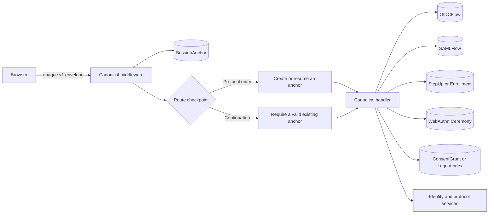
```mermaid
flowchart LR
    B[Browser] -->|opaque v1 envelope| M[Canonical middleware]
    M --> A[(SessionAnchor)]
    M --> C{Route checkpoint}
    C -->|Protocol entry| N[Create or resume an anchor]
    C -->|Continuation| V[Require a valid existing anchor]
    N --> H[Canonical handler]
    V --> H
    H --> O[(OIDCFlow)]
    H --> S[(SAMLFlow)]
    H --> U[(StepUp or Enrollment)]
    H --> W[(WebAuthn Ceremony)]
    H --> G[(ConsentGrant or LogoutIndex)]
    H --> I[Identity and protocol services]
```

`Protocol entry` is used only where a new browser journey may legitimately begin, for example OIDC authorization,
device verification, SAML SSO, or an inbound SAML LogoutRequest. `Continuation` is used where an existing bound
session and flow must already exist. A missing, malformed, or legacy browser representation is rejected and purged
before the endpoint handler runs.

### Hard Cutover and Legacy Retirement

There is one executable browser-session architecture. The production composition root registers only the canonical
Frontend, OIDC, and SAML route families. Old browser cookies and old Redis keys are inert residue: runtime code must
never read, adopt, translate, refresh, or delete them.

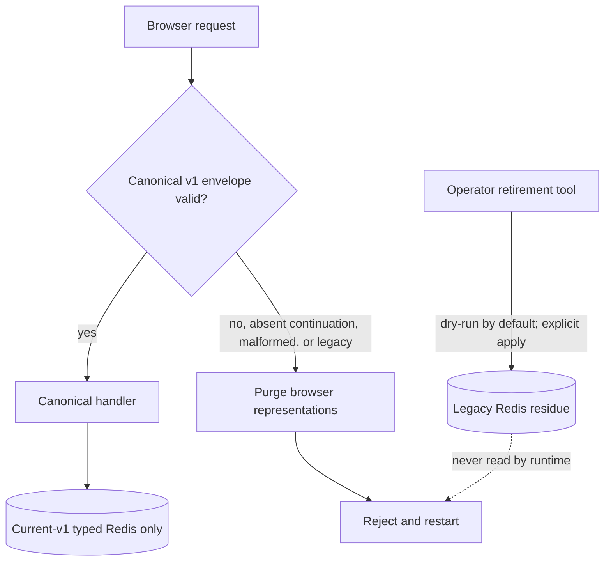
```mermaid
flowchart TD
    R[Browser request] --> E{Canonical v1 envelope valid?}
    E -->|yes| H[Canonical handler]
    E -->|no, absent continuation, malformed, or legacy| P[Purge browser representations]
    P --> X[Reject and restart]
    H --> V[(Current-v1 typed Redis only)]
    L[(Legacy Redis residue)] -. never read by runtime .-> X
    O[Operator retirement tool] -->|dry-run by default; explicit apply| L
```

The fixed-allowlist operator tool under `contrib/session-keyspace-retirement` is the only permitted legacy-key
retirement path. It is not imported by the server and does not turn legacy records into current-v1 sessions.

## 2. Signal Flow Diagram

The following diagram shows one browser request moving through the active architecture:

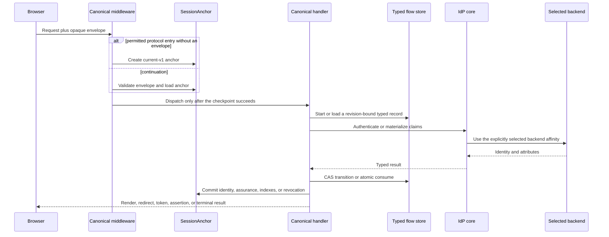
```mermaid
sequenceDiagram
    participant B as Browser
    participant M as Canonical middleware
    participant A as SessionAnchor
    participant H as Canonical handler
    participant F as Typed flow store
    participant I as IdP core
    participant E as Selected backend
    B->>M: Request plus opaque envelope
    alt permitted protocol entry without an envelope
        M->>A: Create current-v1 anchor
    else continuation
        M->>A: Validate envelope and load anchor
    end
    M->>H: Dispatch only after the checkpoint succeeds
    H->>F: Start or load a revision-bound typed record
    H->>I: Authenticate or materialize claims
    I->>E: Use the explicitly selected backend affinity
    E-->>I: Identity and attributes
    I-->>H: Typed result
    H->>F: CAS transition or atomic consume
    H->>A: Commit identity, assurance, indexes, or revocation
    H-->>B: Render, redirect, token, assertion, or terminal result
```

## 3. Detailed Signal Flows

### 3.1 OIDC Authorization Code Flow

This is the primary flow for modern applications. It ensures that user credentials never touch the client application.

**Security Note:** The authorization request is stored only in typed Redis state. The browser receives an opaque flow
ticket in local continuation URLs, but the ticket has no authority without the matching canonical envelope,
`SessionAnchor`, record ownership, revision, and request bindings. Validated client redirect targets are never accepted
from an untrusted continuation parameter.

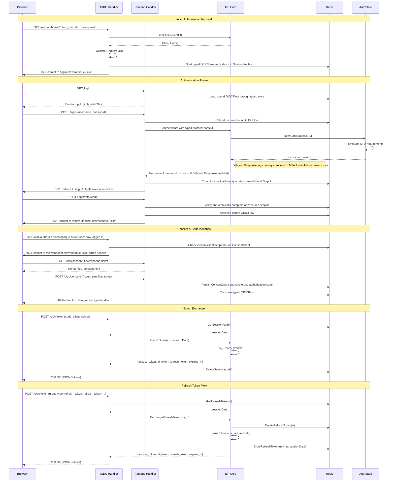
```mermaid
sequenceDiagram
    participant B as Browser
    participant H as OIDC Handler
    participant F as Frontend Handler
    participant I as IdP Core
    participant R as Redis
    participant A as AuthState
    Note over B, A: Initial Authorization Request
    B ->> H: GET /oidc/authorize?client_id=...&scope=openid...
    H ->> I: FindClient(clientID)
    I -->> H: Client Config
    H ->> H: Validate Redirect URI
    H ->> R: Start typed OIDCFlow and index it in SessionAnchor
    H ->> B: 302 Redirect to /login?flow=opaque-ticket
    Note over B, A: Authentication Phase
    B ->> F: GET /login
    F ->> R: Load bound OIDCFlow through typed store
    F -->> B: Render idp_login.html (HTMX)
    B ->> F: POST /login (username, password)
    F ->> R: Reload revision-bound OIDCFlow
    F ->> I: Authenticate with typed protocol context
    I ->> A: NewAuthState(ctx, ...)
    A ->> A: Evaluate MFA requirements
    A -->> I: Success or Failure
    Note right of I: Delayed Response logic: always proceed to MFA if enabled and user exists
    I -->> F: User (even if password incorrect, if Delayed Response enabled)
    F ->> R: Commit canonical identity or start parent-bound StepUp
    F ->> B: 302 Redirect to /login/totp?flow=opaque-ticket
    B ->> F: POST /login/totp (code)
    F ->> R: Verify and atomically complete or consume StepUp
    F ->> R: Advance parent OIDCFlow
    F ->> B: 302 Redirect to /oidc/authorize?flow=opaque-ticket
    Note over B, A: Consent & Code Issuance
    B ->> H: GET /oidc/authorize?flow=opaque-ticket (user now logged in)
    H ->> R: Check identity-client-scope-bound ConsentGrant
    H ->> B: 302 Redirect to /oidc/consent?flow=opaque-ticket when needed
    B ->> F: GET /oidc/consent?flow=opaque-ticket
    F -->> B: Render idp_consent.html
    B ->> F: POST /oidc/consent (Accept plus flow ticket)
    F ->> R: Persist ConsentGrant and single-use authorization code
    F ->> R: Consume typed OIDCFlow
    F ->> B: 302 Redirect to client_redirect_uri?code=...
    Note over B, A: Token Exchange
    B ->> H: POST /oidc/token (code, client_secret)
    H ->> R: GetSession(code)
    R -->> H: sessionData
    H ->> I: IssueTokens(ctx, sessionData)
    I ->> I: Sign JWTs (RS256)
    I -->> H: {access_token, id_token, refresh_token, expires_in}
    H ->> R: DeleteSession(code)
    H -->> B: 200 OK (JSON Tokens)
    Note over B, A: Refresh Token Flow
    B ->> H: POST /oidc/token (grant_type=refresh_token, refresh_token=...)
    H ->> R: GetRefreshToken(rt)
    R -->> H: sessionData
    H ->> I: ExchangeRefreshToken(ctx, rt)
    I ->> R: DeleteRefreshToken(rt)
    I ->> I: IssueTokens(ctx, sessionData)
    I ->> R: StoreRefreshToken(new_rt, sessionData)
    I -->> H: {access_token, id_token, refresh_token, expires_in}
    H -->> B: 200 OK (JSON Tokens)
```

### 3.1.1 Canonical Envelope and Typed Redis State

The browser envelope and the server-side flow ticket solve different problems:

| Object | Location | Purpose | Contains business state |
| --- | --- | --- | --- |
| Canonical v1 envelope | Browser cookie | Authenticated reference to one browser session and key epoch | No |
| `SessionAnchor` | Redis | Identity, backend affinity, assurance, expiry, and bounded child indexes | Yes |
| Flow ticket | Local URL parameter | Opaque selector for one child record | No |
| Typed child record | Redis | OIDC/SAML request binding, step-up, enrollment, ceremony, or recovery state | Yes |
| `ConsentGrant` | Redis | Identity-client-scope-bound remembered consent | Yes |
| `LogoutIndex` | Redis | Bounded set of issued OIDC client sessions for this browser session | Yes |

Every mutation is revision-bound. Terminal operations atomically consume a record and remove its anchor index where
required, so a replay cannot issue a second code, assertion, device authorization, or MFA completion. No active browser
path reads `cookie.Manager`, legacy session keys, `ReferenceAdapter`, or `HybridStore`.

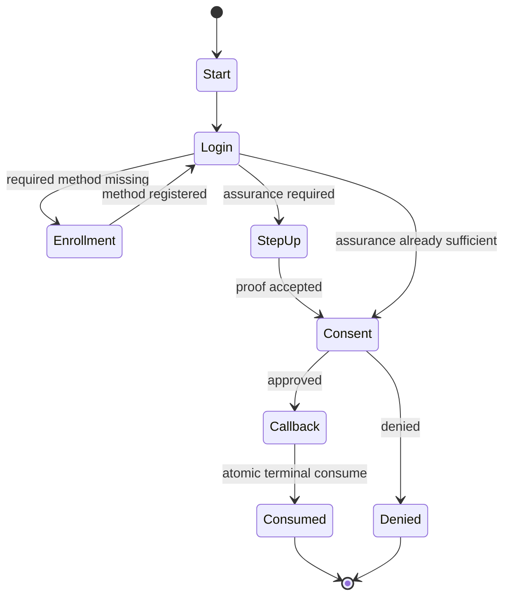
```mermaid
stateDiagram-v2
    [*] --> Start
    Start --> Login
    Login --> Enrollment: required method missing
    Enrollment --> Login: method registered
    Login --> StepUp: assurance required
    StepUp --> Consent: proof accepted
    Login --> Consent: assurance already sufficient
    Consent --> Callback: approved
    Consent --> Denied: denied
    Callback --> Consumed: atomic terminal consume
    Consumed --> [*]
    Denied --> [*]
```

### 3.1.2 CSRF Protection

All IdP frontend pages use CSRF protection via a custom middleware (`server/middleware/csrf`). The CSRF token is:

- Generated server-side via `csrf.Token(ctx)` (double-submit cookie pattern with masked tokens)
- Passed to templates as `{{ .CSRFToken }}`
- Sent as `X-CSRF-Token` header for HTMX and fetch() requests
- Validated on unsafe methods (POST, PUT, DELETE, PATCH) by comparing the masked request token against the cookie token

**Protected endpoints:**

- Login pages (`/login`, `/login/:languageTag`)
- MFA pages (`/login/totp`, `/login/webauthn`, `/login/mfa`, `/login/recovery`)
- Consent pages (`/oidc/consent`, `/oidc/consent/:languageTag`)
- Device consent pages (`/oidc/device/consent`, `/oidc/device/consent/:languageTag`)
- Device verification pages (`/oidc/device/verify`, `/oidc/device/verify/:languageTag`)
- Registration pages (`/mfa/totp/register`, `/mfa/webauthn/register`)
- 2FA Home (`/mfa/register/home`)
- Forced MFA registration (`/mfa/register/continue`, `/mfa/register/cancel`)
- Device management (`/mfa/webauthn/devices`)

**HTMX requests:**

```html
<button hx-delete="/mfa/totp" 
        hx-headers='{"X-CSRF-Token": "{{ .CSRFToken }}"}'>
```

**JavaScript fetch() requests:**

```javascript
const response = await fetch("/mfa/webauthn/register/finish", {
    method: "POST",
    headers: {
        "Content-Type": "application/json",
        "X-CSRF-Token": "{{ .CSRFToken }}"
    },
    body: JSON.stringify(data)
});
```

### 3.1.3 Redirect URI Validation Rules

Nauthilus validates `identity.oidc.clients[].redirect_uris` with strict matching plus controlled wildcard and loopback rules:

- Exact string matching is the default.
- A trailing wildcard (`*`) is supported only at the end of the configured URI and only when the configured URI does
  not contain a query (`?`).
- For wildcard matches, query and fragment parts of the requested `redirect_uri` are ignored during prefix matching.
- A full wildcard (`*`) is accepted and matches any `http`/`https` redirect URI. This is strongly discouraged in
  production.
- For native app compatibility, `http` loopback redirect URIs (`127.0.0.1`, `localhost`, `::1`) allow dynamic ports.
  Example: configured `http://127.0.0.1/callback` matches request `http://127.0.0.1:51208/callback`.
- Dynamic loopback port matching is intentionally limited to `http` loopback redirects and does not apply to
  non-loopback
  hosts.

Security hardening notes:

- Wildcard matching is disabled when the incoming `redirect_uri` contains user-info (`user@host`) or unsafe path
  traversal segments (`/../`, including encoded variants).
- Prefer specific redirect URIs over broad wildcard patterns.
- `post_logout_redirect_uri` remains an exact-match check against `post_logout_redirect_uris`.

### 3.1.4 Frontend Security Headers & CSP Nonce

Frontend routes support strict configurable browser security headers via:

- `identity.frontend.security_headers`

Default behavior:

- Headers are enabled when omitted.
- A per-request CSP nonce is generated.
- `{{nonce}}` in `content_security_policy` is replaced with the generated nonce.
- Templates use `nonce="{{ cspNonce . }}"` for inline scripts.

Example:

```yaml
identity:
    frontend:
        security_headers:
            enabled: true
            # Legacy full-string form is still supported.
            # Recommended structured form:
            content_security_policy:
                connect-src:
                    - "'self'"
                    - "https://api.example.test"
                frame-src:
                    - "'self'"
                    - "https:"
                    - "https://widgets.example.test"
                form-action:
                    - "'self'"
                form_action_optional_uris:
                    - "https://idp.example.test"
                    - "http://localhost:8080"
            content_security_policy_report_only: false
            strict_transport_security:
                max_age: 31536000
                include_subdomains: true
                preload: false
            x_content_type_options: "nosniff"
            x_frame_options: "DENY"
            referrer_policy: "no-referrer"
            permissions_policy:
                features:
                    geolocation: "()"
                    microphone: "()"
                    camera: "()"
                    payment: "()"
                    usb: "()"
            cross_origin_opener_policy: "same-origin"
            cross_origin_resource_policy: "same-origin"
            cross_origin_embedder_policy: "unsafe-none"
            x_permitted_cross_domain_policies: "none"
            x_dns_prefetch_control: "off"
```

Type support and composition rules:

- `content_security_policy` accepts either a single `string` or an `object`.
- `permissions_policy` accepts either a single `string` or an `object`.
- `strict_transport_security` accepts either a single `string` or an `object`.
- In CSP object mode, `form_action_optional_uris` extends `form-action`.
- Other security headers in this section remain single-string settings.
- Legacy list syntax for these three headers (`[]string`) is still accepted for backward compatibility.

Merge and precedence behavior:

- If a header is configured as a single string, it is used as-is.
- If a header is configured as an object, Nauthilus composes the final header from secure defaults plus object
  overrides.
- For `content_security_policy` object entries, sources may be configured as one space-separated `string` or as
  `[]string`.
- `content_security_policy` supports the following object keys (complete list):
- `default-src`
- `script-src`
- `style-src`
- `img-src`
- `font-src`
- `connect-src`
- `frame-src`
- `object-src`
- `base-uri`
- `frame-ancestors`
- `form-action`
- `form_action_optional_uris` (appended, deduplicated, to `form-action`)
- `directives` (optional object containing any of the directive keys listed above)
- Missing CSP directives keep secure defaults.
- For `permissions_policy` object entries:
- `features` is a mapping (`feature: value`).
- Direct `feature: value` keys at object root are also supported.
- Missing features keep secure defaults.
- For `strict_transport_security` object entries:
- `max_age` overrides the default max-age.
- `include_subdomains` controls `includeSubDomains` (default remains `true`).
- `preload` toggles `preload`.
- `extra_tokens` appends custom tokens.
- If you need full manual control for any of these headers, use the single-string form.

Defaults and omitted partials:

- If a setting is omitted entirely, secure defaults are applied.
- If object mode is used and some entries are omitted, those entries fall back to secure defaults.

Validation and error handling:

- Invalid types (for example non-string directive sources) fail configuration loading.
- Unknown object keys in `content_security_policy` and `strict_transport_security` fail configuration loading.
- Unknown CSP directives fail configuration loading.
- Invalid `permissions_policy` feature values fail configuration loading.
- Errors are returned during config validation before serving requests.

Backward compatibility:

- Existing configurations that already use full header strings continue to work without changes.

Default `form-action` is `form-action 'self' https:` when no `form_action_optional_uris` are set.
If `form_action_optional_uris` is set, implicit default `https:` is removed and only explicit entries are appended.
If full control is required, set `form-action` directly.

The placeholder `{{nonce}}` is replaced per request. Inline script tags in templates are emitted with this nonce.

### 3.1.5 Central CORS (`runtime.servers.http.cors`)

Cross-origin behavior is configured centrally under `runtime.servers.http.cors` and is independent from frontend security headers.

```yaml
runtime:
    servers:
        http:
            cors:
                enabled: true
                policies:
                    - name: "oidc_discovery"
                      enabled: true
                      path_prefixes: ["/.well-known/"]
                      allow_origins: ["https://app.example.com"]
                      allow_methods: ["GET", "OPTIONS"]
                      allow_headers: ["Authorization", "Content-Type"]
                      expose_headers: []
                      allow_credentials: false
                      max_age: 600
```

Policies are evaluated in order. The first active policy with a matching `path_prefixes` entry is used.
Use explicit origin lists in production.

## 4. MFA Interfaces

Browser MFA enrollment and management use the canonical `/mfa/*` HTML flows.
They are bound to the canonical browser envelope and typed Redis state. The old
session-cookie JSON routes below `/api/v1/mfa/*` are retired and are not a
compatibility surface.

Machine-to-machine MFA operations use the scoped
`/api/v1/mfa-backchannel/*` API with Basic or Bearer authentication. They never
consume browser-session state.

### 4.1 WebAuthn Devices Portal

The IdP includes a dedicated view for managing registered WebAuthn devices:

- **`GET /mfa/webauthn/devices`**:
    - Renders an overview of all registered security keys.
  - Displays the device name, device ID, and the "Last Used" timestamp.
  - Allows users to add new devices, rename, or delete specific ones.
- **`DELETE /mfa/webauthn/device/:id`**:
    - Deletes a specific device.
- **`POST /mfa/webauthn/device/:id/name`**:
    - Updates the device name for a specific device.

The "Last Used" timestamp is updated automatically upon every successful WebAuthn login and stored in the persistent
backend (LDAP or Lua).

## 5. Protocol-Specific Flows

RFC 7662 allows clients to query the IdP to determine the active state of an OAuth 2.0 token and to determine
meta-information about this token.

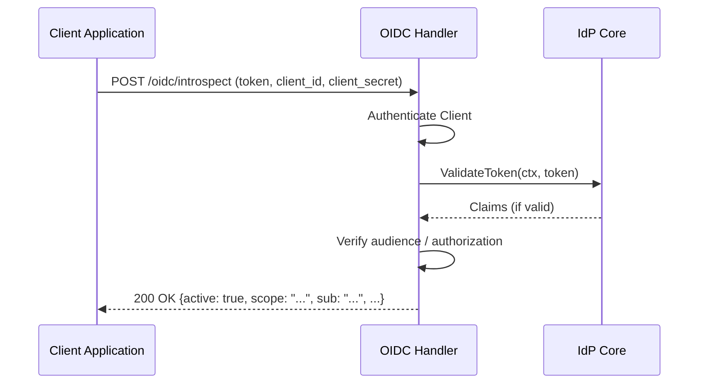
```mermaid
sequenceDiagram
    participant B as Client Application
    participant H as OIDC Handler
    participant I as IdP Core
    B ->> H: POST /oidc/introspect (token, client_id, client_secret)
    H ->> H: Authenticate Client
    H ->> I: ValidateToken(ctx, token)
    I -->> H: Claims (if valid)
    H ->> H: Verify audience / authorization
    H -->> B: 200 OK {active: true, scope: "...", sub: "...", ...}
```

### 3.2 Restricted Native Dynamic Client Registration

When `identity.oidc.dynamic_client_registration.enabled` is true, the OIDC handler exposes `POST /oidc/register` and
adds `registration_endpoint` to discovery. The implementation accepts only the `mail-client-v1` public-native profile:
literal IPv4 or IPv6 loopback redirects, Authorization Code, PKCE S256, no client authentication, RS256 ID tokens, and
opaque access tokens of at most 15 minutes.

The registration handler delegates decoding and policy enforcement to `server/idp/dcr`. Unrecognized RFC 7591
metadata is ignored, while understood metadata outside the profile is rejected. Redis creation atomically enforces
source/global rate limits and the active-client quota. Dynamic-client resolution always uses the authoritative Redis
write handle; unavailable or corrupt state fails closed. Every dynamic authorization requires interaction and consent.

Refresh support is opt-in per registration and requires both `grant_types` containing `refresh_token` and `scope`
containing `offline_access`. Refresh families rotate with an atomic Redis consume-and-issue transition. Reuse of a
consumed ancestor revokes the active family descendant.

This profile covers the RFC 8252 loopback behavior in sections 7.3, 8.3, and 8.4. It does not implement claimed HTTPS
redirects, private-use URI schemes, RFC 7592 management credentials, or a general-purpose public registration service.

### 3.3 OIDC Logout (Front-channel and Back-channel)

Nauthilus supports both Front-channel and Back-channel logout to ensure that users are logged out from all Relying
Parties (RPs) when they end their session at the IdP.

#### Signal Flow

1. **Logout Initiation**: The user or an RP redirects the browser to `/oidc/logout`.
2. **Validation**: If an `id_token_hint` and `post_logout_redirect_uri` are provided, the IdP validates them against the
   client configuration.
3. **Session Identification**: The current-v1 `LogoutIndex` stores a bounded, identity-bound list of OIDC clients in
   Redis. The canonical envelope contains no RP list.
4. **Back-channel Logout**: For all RPs that have a `backchannel_logout_uri` configured, the IdP asynchronously sends a
   POST request with a signed `logout_token` (JWT).
5. **Front-channel Logout**: If any RPs have a `frontchannel_logout_uri`, the IdP renders a page
   (`idp_logout_frames.html`) containing hidden iFrames for each RP. This allows the browser to trigger logout at the
   RPs directly.
6. **Local Logout**: The IdP first tombstones the `SessionAnchor`, then removes its indexed current-v1 children and
   purges both browser representations. Revocation failure is terminal and cannot fall back to legacy state.
7. **Redirection**: Finally, the user is redirected to the `post_logout_redirect_uri` or back to the login page.

### 3.4 SAML 2.0 SSO Flow (Redirect/POST Binding)

Nauthilus supports the Identity Provider initiated and Service Provider initiated SSO.

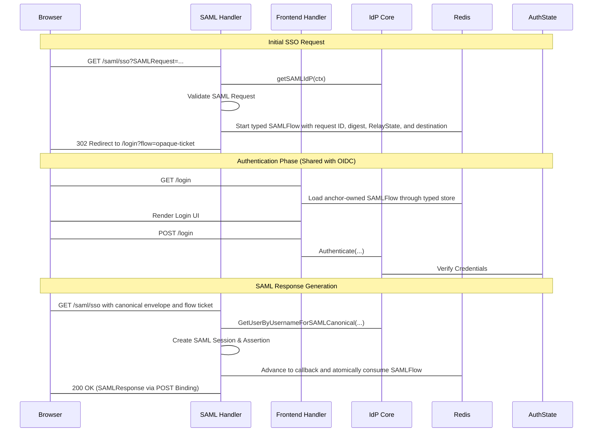
```mermaid
sequenceDiagram
    participant B as Browser
    participant H as SAML Handler
    participant F as Frontend Handler
    participant I as IdP Core
    participant R as Redis
    participant A as AuthState
    Note over B, A: Initial SSO Request
    B -> H: GET /saml/sso?SAMLRequest=...
    H -> I: getSAMLIdP(ctx)
    H -> H: Validate SAML Request
    H -> R: Start typed SAMLFlow with request ID, digest, RelayState, and destination
    H -> B: 302 Redirect to /login?flow=opaque-ticket
    Note over B, A: Authentication Phase (Shared with OIDC)
    B -> F: GET /login
    F -> R: Load anchor-owned SAMLFlow through typed store
    F -> B: Render Login UI
    B -> F: POST /login
    F -> I: Authenticate(...)
    I -> A: Verify Credentials
    Note over B, A: SAML Response Generation
    B -> H: GET /saml/sso with canonical envelope and flow ticket
    H -> I: GetUserByUsernameForSAMLCanonical(...)
    H -> H: Create SAML Session & Assertion
    H -> R: Advance to callback and atomically consume SAMLFlow
    H -> B: 200 OK (SAMLResponse via POST Binding)
```

1. **Metadata**: The SP fetches `/saml/metadata` to obtain the IdP's entity ID and public signing certificate.
2. **SSO Request**: The SP redirects the user to `/saml/sso` with a `SAMLRequest`.
3. **Flow Initialization**: The SAML handler validates the request and signature, hashes the validated XML, and stores
   entity ID, request ID, digest, RelayState, destination, and original URL in one typed `SAMLFlow`. The browser sees
   only the canonical envelope and an opaque local flow ticket.
4. **Authentication**: If not already logged in, the user is sent to the `/login` page (shared with OIDC).
5. **SAML Response**: After authentication and any required assurance, the IdP generates the signed assertion,
   prepares the POST binding, advances the flow to callback, atomically consumes it, persists the SLO participant, and
   only then renders the response. Replay cannot publish a second assertion.

### 3.5 SAML 2.0 SLO (Single Logout)

Nauthilus stellt einen protokollbewussten SAML-SLO-Endpunkt unter `/saml/slo` bereit, inklusive:

1. Eingangsrouting fuer `LogoutRequest` und `LogoutResponse` (Redirect/POST).
2. Signatur- und Protokollvalidierung vor jeder Statusaenderung.
3. Lokalem Cleanup plus orchestriertem Fanout (Front-Channel, optional Back-Channel).
4. Korrelation ueber Transaktions- und Request-IDs.

#### SLO-001 Domainmodell (Lifecycle + Korrelation)

Als Grundlage fuer die naechsten SLO-Schritte definiert Nauthilus ein dediziertes Domainmodell unter
`server/idp/slo`:

- `SLOTransaction`: End-to-end Logout-Transaktion.
- `SLOParticipant`: Ein betroffener Service Provider innerhalb einer Transaktion.
- `SLOStatus`: Lebenszyklusstatus der Transaktion.
- `SLOBinding`: Verwendetes SAML Binding (`redirect`, `post`).
- `SLODirection`: Richtung der Initiierung (`sp_initiated`, `idp_initiated`).

Die Request-Korrelation ist explizit festgelegt:

- `TransactionID`: Eindeutige interne ID pro Logout-Lauf.
- `RootRequestID`: Eingehende SAML LogoutRequest-ID, die die Transaktion startet.
- `SLOParticipant.RequestID`: Pro Teilnehmer eindeutige ausgehende Request-ID (innerhalb derselben Transaktion).

Der erlaubte Status-Lifecycle ist streng und wird durch Code und Tests erzwungen:

`received -> validated -> local_done -> fanout_running -> done | partial | failed`

#### SLO-002 Session/Participant-Registry fuer SAML

Um SLO-Fanout vorzubereiten, persistiert Nauthilus beim erfolgreichen SAML-SSO pro Account und SP eine
Teilnehmer-Session in Redis:

- `account`
- `sp_entity_id`
- `name_id`
- `session_index`
- `authn_instant`
- TTL auf Basis der SAML Session-Laufzeit (`default_expire_time` bzw. Assertion-Expire-Time)

Redis-Key-Schema:

- Prefix: `<redis_prefix>idp:saml:slo`
- Account-Index: `...:index:<url-escaped-account>`
- Teilnehmer-Sessions: `...:participant:<url-escaped-account>:<sha256(sp_entity_id)>`

Cleanup-Strategie:

- Bei SAML-Logout (`/saml/slo`) werden alle Teilnehmer-Sessions des Accounts aktiv entfernt.
- Bei Session-Ablauf erfolgt Cleanup automatisch ueber Redis-TTL (inkl. Index-Handling).

#### SLO-003 Eingangsrouter fuer SLO-Nachrichten

Der Endpunkt `/saml/slo` unterscheidet nun explizit zwischen SAML-`LogoutRequest` und SAML-`LogoutResponse`
anstatt nur einen lokalen Logout auszufuehren:

- `GET` wird als Redirect-Binding behandelt.
- `POST` wird als Form-POST-Binding behandelt.
- Der Handler dispatcht verbindlich auf `handleLogoutRequest` bzw. `handleLogoutResponse`.

Validierungsregeln fuer eingehende Parameter:

- Genau einer von `SAMLRequest` oder `SAMLResponse` muss vorhanden sein.
- Beide gleichzeitig werden als inkonsistent mit `400 Bad Request` abgewiesen.
- Fehlende Payloads werden mit `400 Bad Request` abgewiesen.
- Doppelte oder leere kritische Parameter (`SAMLRequest`, `SAMLResponse`, `RelayState`) werden mit `400 Bad Request`
  abgewiesen.

Der bisherige lokale Logout-Cleanup bleibt als Fallback in den Dispatch-Handlern erhalten, bis die naechsten
SLO-Schritte (`SLO-004+`) Signatur- und Protokollvalidierung sowie Response-Erzeugung aktivieren.

#### SLO-004 Signaturvalidierung fuer eingehende LogoutRequest(s)

Eingehende `LogoutRequest`-Nachrichten werden nun vor jedem lokalen Logout-Cleanup auf gueltige Signaturen
geprueft:

- Redirect-Binding:
    - Strikte Pruefung der signierten Query-Basis `SAMLRequest` + optional `RelayState` + `SigAlg`.
    - `Signature` und `SigAlg` muessen konsistent gemeinsam vorhanden sein.
    - Doppelte kritische Query-Parameter (`SAMLRequest`, `RelayState`, `SigAlg`, `Signature`) werden verworfen.
- POST-Binding:
    - XML-Signaturpruefung gegen vertrauenswuerdige SP-Zertifikate.
    - Zertifikate werden pro `Issuer` aus der SP-Konfiguration (`identity.saml.service_providers[*].cert|cert_file`)
      geladen.
- SHA-1 bleibt auf beiden Pfaden blockiert:
    - Redirect: SHA-1 `SigAlg` wird als unsupported abgelehnt.
    - POST: SHA-1 XML SignatureMethod wird als unsupported abgelehnt.

Fehlschlaege in der Signaturvalidierung werden mit `400 Bad Request` beantwortet; ein lokaler Logout wird dann
nicht ausgefuehrt.

#### SLO-005 Protokollvalidierung fuer eingehende LogoutRequest(s)

Nach erfolgreicher Signaturvalidierung folgt nun eine verbindliche SAML-Protokollpruefung vor jedem Logout-Cleanup:

- Gepruefte Pflichtfelder:
    - `ID`
    - `Issuer`
    - `Destination`
    - `IssueInstant`
- Optional geprueft:
    - `NotOnOrAfter` (falls vorhanden)
- `NameID` ist fuer die Session-Korrelation erforderlich.

Validierungslogik:

- `Destination` muss exakt zur konfigurierten IdP-SLO-Endpoint-URL passen.
- `IssueInstant` darf nicht zu alt sein (`MaxIssueDelay`) und nicht unzulaessig in der Zukunft liegen
  (`MaxClockSkew`).
- `NotOnOrAfter` wird inklusive Clock-Skew-Toleranz auf Ablauf geprueft.
- `NameID` plus optionaler `SessionIndex` werden gegen die SAML-SLO-Participant-Registry in Redis korreliert:
    - `LookupParticipants(NameID)`
    - Match auf `sp_entity_id == Issuer`
    - Falls `SessionIndex` gesetzt ist, zusaetzlich exakter Match auf `session_index`.
- Replay-Schutz:
    - Jede verarbeitete `LogoutRequest.ID` wird per `SETNX` im Redis-Prefix
      `<redis_prefix>idp:saml:slo:replay:<sha256(request_id)>` gespeichert.
    - Bereits bekannte IDs werden als Replay mit `400 Bad Request` verworfen.

Fehlschlaege in der Protokollvalidierung werden mit `400 Bad Request` beantwortet; ein lokaler Logout wird dann
nicht ausgefuehrt.

#### SLO-009 Front-Channel Orchestrierung (Browser)

Fuer IdP-initiiertes Logout wurde die Browser-Orchestrierung fuer mehrere Front-Channel-Teilnehmer vervollstaendigt.

Umsetzung:

- OIDC Front-Channel-RPs und SAML-SLO-Fanout-Teilnehmer werden als einheitliche Logout-Tasks modelliert.
- SAML-Dispatches unterstuetzen beide Browserpfade:
    - Redirect-Binding (`GET` URL)
    - POST-Binding (HTML-Form-Payload, im versteckten iFrame ausgefuehrt)
- Die Logout-Seite (`idp_logout_frames.html`) fuehrt Tasks sequenziell aus und zeigt pro Teilnehmer den Laufstatus.
- Definierte Retry/Timeout-Policy:
    - Timeout pro Task: `4s`
    - Retries pro Task: `1` zusaetzlicher Versuch
- Ergebniserfassung pro Teilnehmer: `success`, `timeout`, `error` (zusaetzlich `skipped` fuer nicht ausfuehrbare Tasks).
- Klarer Abschlusszustand in der UI:
    - Fortschrittsanzeige (`x / n`)
    - Ergebnisliste pro Teilnehmer
    - Finales Summary (`done` oder `partial`)
    - anschliessender Redirect zum validierten Logout-Ziel.

#### SLO-012 Observability, Audit, Security-Hardening

Die SLO-Verarbeitung ist mit dedizierter Betriebsbeobachtung und Security-Haertung instrumentiert:

- Metriken:
    - `idp_saml_slo_requests_total{binding,message_type,outcome}`
    - `idp_saml_slo_validation_errors_total{binding,message_type,stage}`
    - `idp_saml_slo_terminal_status_total{direction,status}` (u. a. fuer Partial-Logout-Rate)
    - `idp_saml_slo_duration_seconds{binding,message_type,outcome}`
    - `idp_saml_slo_abuse_rejections_total{reason,binding}`
- Audit-Logs:
    - Einheitliche Audit-Events auf Info-Level mit Korrelationsfeldern:
      `transaction_id`, `request_id`, `sp_entity_id`.
    - Erfasst werden u. a. Validierungsfehler, Local-Cleanup, Fanout-Abschluss und Response-Verarbeitung.
- Security-Hardening:
    - Endpoint-spezifischer IP-Rate-Limiter fuer `/saml/slo` (zusatzlich zu globalen Guards).
    - Groessenlimits fuer `SAMLRequest`/`SAMLResponse` sowie POST-Body-Limit am Endpunkt.

#### SLO-013 Konfigurationsoberflaeche

Die SLO-Konfiguration ist unter `identity.saml.slo` gebuendelt und steuert Endpunkt-Verhalten,
Front-/Back-Channel-Fanout sowie Schutzlimits:

```yaml
identity:
    saml:
        slo:
            enabled: true
            front_channel_enabled: true
            back_channel_enabled: false
            request_timeout: 3s
            max_participants: 64
            back_channel_max_retries: 1
```

Defaults:

- `identity.saml.slo.enabled`: `true`
- `identity.saml.slo.front_channel_enabled`: `true`
- `identity.saml.slo.back_channel_enabled`: `false`
- `identity.saml.slo.request_timeout`: `3s`
- `identity.saml.slo.max_participants`: `64`
- `identity.saml.slo.back_channel_max_retries`: `1`

Validierungsregeln:

- `identity.saml.slo.request_timeout >= 0` (`0` bedeutet: Default verwenden)
- `identity.saml.slo.max_participants >= 0` (`0` bedeutet: Default verwenden)
- `identity.saml.slo.back_channel_max_retries >= 0` (`0` bedeutet: Default verwenden)
- Wenn `identity.saml.slo.enabled=false`, sind `front_channel_enabled` und `back_channel_enabled` wirkungslos.
- Back-channel SLO delivery does not follow HTTP redirects. Configure each service provider
  `slo_back_channel_url` to the final HTTPS endpoint; a `3xx` response is treated as a failed delivery
  and can fall back to front-channel fanout when that channel is enabled.

#### SLO-014 Teststrategie und Interop-Abnahme

Die Teststrategie fuer SAML-SLO ist nun als eigene Matrix dokumentiert:

- Dokument: `server/docs/saml_slo_test_strategy.md`
- Abgedeckte Ebenen:
    - Unit (`Parser`, `Validator`, `Replay`, `Fanout-StateMachine`)
    - Integration (`/saml/slo` End-to-End mit signierten Test-SP-Nachrichten)
    - Interop (reale SP-Abnahme-Szenarien fuer Zabbix und Nextcloud)

Ergaenzte automatische Nachweise in der Codebasis:

- Parser-/Decoder-Unit-Tests fuer Redirect/POST Payload-Decoding, Strict-Query-Parsing und Flate-Limits.
- Fanout-StateMachine-Unit-Tests fuer Guard-Conditions, Pre-Counts und Terminalstatus-Aggregation.
- Integrationsfall fuer eingehende `LogoutResponse` im POST-Binding (`/saml/slo`) inkl. Fanout-Korrelation.

Die Exit-Kriterien fuer SLO-014 sind in der Matrix als DoD verankert:

1. Unit-Matrix gruen.
2. Integrationsmatrix gruen.
3. Interop-Szenarien mit Evidenz dokumentiert (`passed`).

## 3.6 Forced MFA Registration Flow (`require_mfa`)

Nauthilus supports per-client enforcement of MFA registration. When an OIDC client or SAML2 service provider has a
`require_mfa` list configured, the IdP checks whether the user has all required MFA methods registered before
completing the authorization flow. If any methods are missing, the user is sent through a forced-registration flow.

### Configuration

The `require_mfa` field accepts a list of MFA method identifiers. Valid values are `totp`, `webauthn`, and
`recovery_codes`.

**OIDC client example:**

```yaml
identity:
    oidc:
        clients:
            -   client_id: "secure-app"
                require_mfa:
                    - totp
                    - webauthn
                    - recovery_codes
```

**SAML2 service provider example:**

```yaml
identity:
    saml:
        service_providers:
            -   entity_id: "https://sp.example.com"
                authn_requests_signed: true
                logout_requests_signed: true
                logout_responses_signed: true
                require_mfa:
                    - totp
                    - recovery_codes
```

If `logout_requests_signed` or `logout_responses_signed` are omitted, both default to `false`.

### Signal Flow

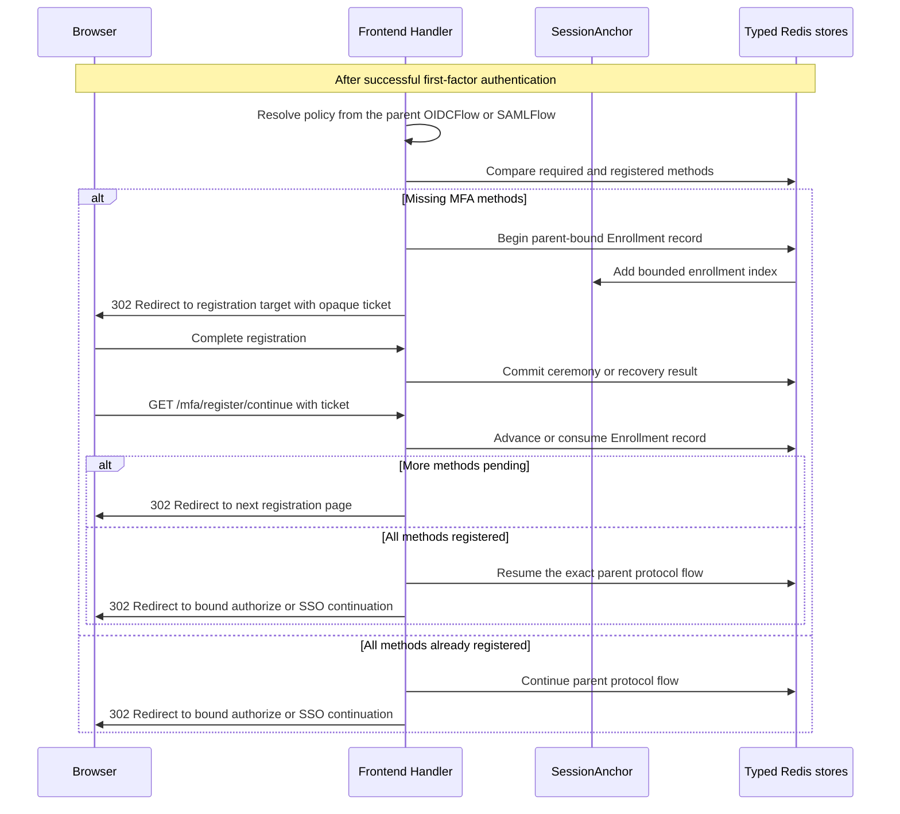
```mermaid
sequenceDiagram
    participant B as Browser
    participant F as Frontend Handler
    participant A as SessionAnchor
    participant R as Typed Redis stores
    Note over B, R: After successful first-factor authentication
    F ->> F: Resolve policy from the parent OIDCFlow or SAMLFlow
    F ->> R: Compare required and registered methods
    alt Missing MFA methods
        F ->> R: Begin parent-bound Enrollment record
        R ->> A: Add bounded enrollment index
        F ->> B: 302 Redirect to registration target with opaque ticket
        B ->> F: Complete registration
        F ->> R: Commit ceremony or recovery result
        B ->> F: GET /mfa/register/continue with ticket
        F ->> R: Advance or consume Enrollment record
        alt More methods pending
            F ->> B: 302 Redirect to next registration page
        else All methods registered
            F ->> R: Resume the exact parent protocol flow
            F ->> B: 302 Redirect to bound authorize or SSO continuation
        end
    else All methods already registered
        F ->> R: Continue parent protocol flow
        F ->> B: 302 Redirect to bound authorize or SSO continuation
    end
```

### Endpoints

| Endpoint                              | Method | Description                                                      |
|---------------------------------------|--------|------------------------------------------------------------------|
| `/mfa/register/continue`              | GET    | Advances to the next required MFA registration or completes flow |
| `/mfa/register/continue/:languageTag` | GET    | Same, with language override                                     |
| `/mfa/register/cancel`                | GET    | Cancels the forced registration and logs the user out            |
| `/mfa/register/cancel/:languageTag`   | GET    | Same, with language override                                     |

### Behavior Details

- **Sequential registration**: If multiple methods are required, the typed `EnrollmentRecord` owns the bounded pending
  method list and the parent-flow binding. `/mfa/register/continue` advances that record and redirects to the next
  registration target.
- **Cancel path**: The user can cancel via `/mfa/register/cancel`; the enrollment and parent relationship are
  terminalized without consulting browser-carried business state.
- **UI indicators**: During the forced-registration flow, the registration pages display an informational banner
  explaining that the application requires the MFA method, along with a cancel button.
- **Recovery codes detection**: Registered methods are resolved through the selected backend affinity and typed
  canonical identity. There is no browser-session flag that can assert registration.
- **Template state**: Registration pages are rendered from the validated enrollment selection and its typed parent
  binding.
- **Cleanup**: Terminal enrollment operations use revision checks and remove the anchor index. Full browser-session
  revocation deletes every explicitly indexed current-v1 child after the anchor tombstone is published.

### Configuration Field Reference

| Field         | Type       | Default | Description                                                                                  |
|---------------|------------|---------|----------------------------------------------------------------------------------------------|
| `require_mfa` | `[]string` | `[]`    | MFA methods the user must have registered (`totp`, `webauthn`, `recovery_codes`), per client |

## 4. Core Components & Logic

### 4.1 IdP Core (`server/idp/`)

The `NauthilusIdP` struct is the central orchestrator. It holds references to:

- **Dependencies**: For accessing configuration and logging.
- **Key Manager**: Handles OIDC signing keys, supporting both static configuration and automatic rotation.
- **Token Storage**: The Redis interface for session management.

Key Methods:

- `Authenticate`: Wraps the core `AuthState` logic to provide a simplified interface for protocol handlers.
- `IssueTokens`: Generates ID tokens and Access tokens. It performs **Claim Mapping** by taking raw backend attributes
  and transforming them according to the client's configuration (e.g., mapping LDAP groups to the `groups` claim).
- `ValidateToken`: Decodes and verifies the signature of an access token.

### 4.2 Frontend & MFA Self-Service

The `FrontendHandler` uses **HTMX** to provide a single-page-application (SPA) feel while keeping logic on the server.

- **OIDC Authorization Code Flow**: The handler manages the login redirect, session establishment, and code generation.
  It supports **Delayed Response** by hiding authentication failures until after the MFA step. If `/login` is called
  without a protocol-specific context, it redirects to the MFA portal after successful authentication.
- **Device Code Flow MFA**: The user code is atomically claimed, and a typed OIDC device-code flow binds its digest,
  device code, client, scopes, and parent session. Login, assurance, claims hydration, consent, and terminal device CAS
  use that server-side state only.
- **Multi-Factor Authentication (MFA)**:
    - **TOTP**: Uses the `otp` package for generation and validation. Secrets are stored in the backend (LDAP or Lua).
      Verification is integrated into the login flow (`/login/totp`).
    - **WebAuthn**: Implements the FIDO2 standard. Registration and authentication flows are handled via
      `/webauthn/register` and `/webauthn/login`.
- **Step-up Authentication**: Security-sensitive actions use an indexed `StepUpRecord` and the assurance embedded in
  the `SessionAnchor`. The record binds scope, level, supported method, parent flow or self-service operation, and
  expected revision.

### 4.3 Redis Storage & Key Schema

Browser-flow and token state is transient and stored in Redis, but the ownership models are deliberately separate.

| Record family | Ownership | Purpose |
|:---|:---|:---|
| `SessionAnchor` | Canonical browser handle | Identity, backend affinity, assurance, expiry, and bounded child indexes |
| `OIDCFlow`, `SAMLFlow` | Anchor plus flow handle | Validated protocol request and lifecycle state |
| `EnrollmentRecord`, `StepUpRecord` | Anchor plus operation handle | Required registration and assurance operations |
| WebAuthn ceremony, TOTP recovery | Anchor plus operation handle | Single-use challenge and recovery state |
| `ConsentGrant` | Identity plus OIDC client | Remembered, scope-bounded consent |
| `LogoutIndex` | Canonical browser handle | Bounded issued-client inventory for logout fanout |
| Authorization code and refresh family | Protocol storage | Cookie-free token exchange and rotation |

Repository keys are derived from owner and typed references; handlers do not assemble or scan legacy browser-session
keyspaces.

## 5. Observability & Debugging

### Metrics (Prometheus)

- `idp_logins_total`: Track success/failure of logins.
- `idp_tokens_issued_total`: Monitor how many tokens are issued per client.
- `idp_mfa_operations_total`: Track registration and deactivation of TOTP/WebAuthn.

### Tracing (OpenTelemetry)

Spans are created for:

- Protocol requests (OIDC Authorize/Token).
- Backend authentication calls.
- JWT signing operations.

### Debugging

Enable the `idp` debug module in the configuration to see detailed logs of the internal state transitions and protocol
interactions:

```yaml
observability:
  log:
    debug_modules:
      - idp
```

## 6. Implementation Details: Claim Mapping

Nauthilus supports dynamic claim mapping. ID token and access token claims are configured separately per client, using
the same mapping schema:

```yaml
# nauthilus.yaml example
identity:
  oidc:
    clients:
      - client_id: my-app
        id_token_claims:
            mappings:
                -   claim: "email"
                    attribute: "mail"         # Map LDAP 'mail' to OIDC 'email'
                    type: "string"
                -   claim: "groups"
                    from: "groups"                   # Use resolved groups from AuthState
                    type: "string_array"
        access_token_claims:
            mappings:
                -   claim: "billing.roles"
                    attribute: "roles"
                    type: "string_array"
```

The mapping logic handles:

- **Direct mapping**: String attributes (e.g., `email`, `name`, `preferred_username`).
- **Arrays**: Multi-valued attributes like `groups`.
- **Custom Claims**: Any claim name can be mapped from a backend attribute.
- **Complex Types**: Booleans (e.g., `email_verified`) and structured objects (e.g., `address`).
- **Default types**: If `type` is omitted, the claim's default type (standard or custom scope) is used when available.

Mapping source options:

- `attribute`: read claim values from backend attributes.
- `from`: read built-in runtime sources (`groups`, `group_dns`).

When groups are enabled in LDAP/Lua backends, Nauthilus stores memberships as dedicated AuthState fields (`groups`,
`group_dns`). Claim mappings can consume them via `from: "groups"` and `from: "group_dns"`.

Role claims are mapped from backend attributes directly (for example LDAP `roles`) using `attribute: "roles"`.

### 6.1 Scope-based Claim Filtering

The IdP automatically filters claims based on the scopes requested by the client. Standard OIDC scopes are supported:

- **`profile`**: Includes `name`, `family_name`, `given_name`, `middle_name`, `nickname`, `preferred_username`,
  `profile`, `picture`, `website`, `gender`, `birthdate`, `zoneinfo`, `locale`, and `updated_at`.
- **`email`**: Includes `email` and `email_verified`.
- **`address`**: Includes `address`.
- **`phone`**: Includes `phone_number` and `phone_number_verified`.
- **`groups`**: Includes `groups`.

If a client requests specific scopes, only the claims associated with those scopes (and any requested custom scopes)
will be included in the ID token and access token claim sets. If no specific scopes are requested (legacy behavior),
all configured mappings for the client are included.

### 6.2 Custom Scopes

The IdP supports custom scopes. These are defined globally and can group one or
more custom claims:

```yaml
identity:
  oidc:
    custom_scopes:
      - name: "nauthilus"
        description: "Special access scope"
        claims:
          - name: "custom_claim_1"
            type: "string"
          - name: "custom_claim_2"
            type: "string"
```

Clients can optionally define `custom_scopes` as an override layer:

```yaml
identity:
  oidc:
    clients:
      - client_id: "my-client"
        custom_scopes:
          - name: "nauthilus"
            description: "Client-specific nauthilus scope"
            claims:
              - name: "custom_claim_3"
                type: "string"
```

Merge behavior is deterministic:

- Global scopes from `identity.oidc.custom_scopes` are the base.
- Client scopes from `identity.oidc.clients[].custom_scopes` are applied on top.
- If a scope name matches, the client scope fully replaces the global scope definition.
- Client-only scope names are appended.
- OIDC Discovery (`scopes_supported`) remains global and is not customized per client.

To use these, the client must have a mapping for the claim names (in `id_token_claims` and/or `access_token_claims`):

```yaml
identity:
  oidc:
    clients:
      - client_id: "my-client"
        id_token_claims:
            mappings:
                -   claim: "custom_claim_1"
                    attribute: "someBackendAttribute"
                    type: "string"
                -   claim: "custom_claim_2"
                    attribute: "anotherBackendAttribute"
                    type: "string"
```

### 6.3 Token Lifetime Configuration

The lifetime of access tokens and refresh tokens can be configured per client:

```yaml
identity:
  oidc:
    revoke_refresh_token: true
    clients:
      - client_id: my-app
        access_token_lifetime: 1h
        refresh_token_lifetime: 30d
        revoke_refresh_token: false
```

- **`access_token_lifetime`**: Duration of validity for access tokens and ID tokens (default: 1h).
- **`refresh_token_lifetime`**: Duration of validity for refresh tokens (default: 30d). Refresh tokens are only issued
  if the `offline_access` scope is requested.
- **`revoke_refresh_token`**: Enables one-time-use refresh token rotation (default: `true`). When set to `false`,
  Nauthilus keeps the same refresh token valid across refresh requests and omits `refresh_token` from refresh responses,
  which is useful for clients that need stable refresh token reuse semantics.

### 6.4 Implied Scopes (Compatibility)

For compatibility scenarios, clients can define `implied_scopes`. These scopes are added to the effective scope set even
when they are not explicitly requested by the incoming authorization request.

```yaml
identity:
  oidc:
    clients:
      - client_id: "opencloud-desktop"
        scopes:
          - openid
          - profile
          - email
          - offline_access
          - roles
        implied_scopes:
          - offline_access
          - roles
```

Behavior:

- Requested scopes are filtered against the configured `scopes` allow list.
- `implied_scopes` are appended afterward in stable order and deduplicated.
- Implied scopes not present in the client's `scopes` allow list are ignored.
- The resulting effective scope set is used for consent evaluation, claim filtering, and token issuance.

### 6.5 SAML Attribute Mapping

Unlike OIDC, which uses a per-client mapping configuration, the SAML 2.0 implementation in Nauthilus currently includes
all attributes retrieved from the user backend directly into the SAML assertion.

The attributes included are determined by the backend configuration (e.g., the `ldap.search.mapping` section). Each
attribute from the backend becomes a `<saml:Attribute>` in the assertion, with the backend attribute name as the
`Name` and the first value as the `AttributeValue`.

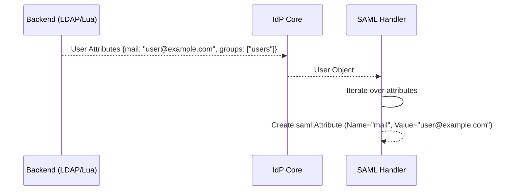
```mermaid
sequenceDiagram
    participant B as Backend (LDAP/Lua)
    participant I as IdP Core
    participant S as SAML Handler
    B -->> I: User Attributes {mail: "user@example.com", groups: ["users"]}
    I -->> S: User Object
    S -> S: Iterate over attributes
    S -->> S: Create saml:Attribute (Name="mail", Value="user@example.com")
```

## 7. Backend & LDAP Interaction

The IdP core interacts with user backends (LDAP or Lua) through the `BackendManager` interface. This abstraction ensures
that protocol handlers remain independent of the underlying storage technology.

### 7.1 Authentication Flow

1. **User Lookup**: The system performs an LDAP search using the configured `user_filter` to find the user's
   Distinguished Name (DN) and retrieve basic attributes (e.g., display name, unique ID).
2. **Credential Verification**:
    - **Password**: A second connection attempt (LDAP Bind) is performed using the user's DN and the provided password.
    - **MFA (TOTP)**: If password authentication succeeds and TOTP is enabled, the system retrieves the encrypted shared
      secret from the attribute defined in `totp_secret_field`.
    - **MFA (WebAuthn)**: If the user has WebAuthn credentials registered, the system performs a FIDO2 assertion (
      Login). Nauthilus supports multiple security keys.
3. **Delayed Response**: If enabled, the system will always proceed to the MFA step (TOTP or WebAuthn) even if the
   password was incorrect, to prevent username enumeration and credential validation by attackers.

### 7.2 MFA Storage in LDAP

Nauthilus stores second-factor metadata directly in the user's LDAP entry or in child entries, avoiding the need for a
separate database.

- **TOTP**: The shared secret is stored as a plain string in a single attribute (e.g., `nauthilusTotpSecret`).
- **WebAuthn (FIDO2)**: Nauthilus supports two modes of LDAP storage:
    1. **JSON Mode (Recommended)**: Multiple credentials are stored as serialized JSON strings in a multi-valued
       attribute (e.g., `nauthilusFido2Credential`). This is the most flexible approach and easily supports multiple
       devices per user.
        - During the login ceremony, Nauthilus verifies the signature and checks that the `SignCount` provided by the
          device is greater than the one stored in the backend.
        - After a successful login, Nauthilus automatically updates the `SignCount` in the backend (LDAP or Lua) to
          prevent replay attacks and ensure compliance with the WebAuthn specification.
    2. **Individual Attributes**: Credential details (ID, Public Key, Sign Count, etc.) are mapped to individual LDAP
       attributes.

### 7.3 Dynamic Claim Retrieval

During OIDC token issuance or SAML assertion generation, the IdP performs a "Profile Refresh" by querying the backend
for all attributes requested by the client mapping.

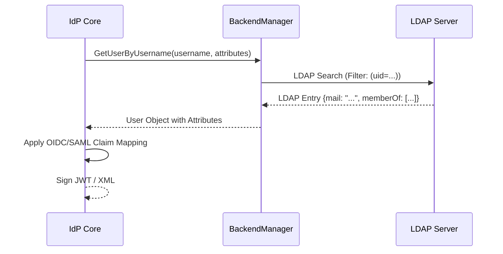
```mermaid
sequenceDiagram
    participant I as IdP Core
    participant B as BackendManager
    participant L as LDAP Server
    I ->> B: GetUserByUsername(username, attributes)
    B ->> L: LDAP Search (Filter: (uid=...))
    L -->> B: LDAP Entry {mail: "...", memberOf: [...]}
    B -->> I: User Object with Attributes
    I ->> I: Apply OIDC/SAML Claim Mapping
    I -->> I: Sign JWT / XML
```

### 7.4 Configuration Example (LDAP)

To enable full IdP support with LDAP, ensure your `nauthilus.yaml` includes the relevant mappings. Below is an example
using the recommended JSON mode for WebAuthn. Optional `*_object_class` settings tell Nauthilus which `objectClass` to
auto-add for MFA/WebAuthn writes. If these settings are omitted, the object classes must already exist on the user
entries.

```yaml
auth:
  backends:
    ldap:
      search:
        - protocol: ["oidc", "saml"]
          base_dn: "ou=users,dc=example,dc=com"
          filter:
              user: "(uid=%{username})"
          mapping:
            account_field: "uid"
            display_name_field: "cn"
            totp_secret_field: "nauthilusTotpSecret"
            totp_object_class: "nauthilusMfaAccount"
            # JSON mode: Use the field that stores all credentials
            webauthn_credential_field: "nauthilusFido2Credential"
            webauthn_object_class: "nauthilusFido2Account"
          groups:
              # member_of | search | hybrid
              strategy: "hybrid"
              # Used by member_of and hybrid
              attribute: "memberOf"
              # Used by search and hybrid (defaults shown)
              base_dn: "ou=groups,dc=example,dc=com"
              scope: "sub"
              # Macros use Nauthilus syntax (LDAP-escaped automatically):
              # %{user_dn}, %{account}, %{username}, ...
          filter: "(|(member=%{user_dn})(uniqueMember=%{user_dn})(memberUid=%{account}))"
          name_attribute: "cn"
          recursive: true
          max_depth: 4
```

### 7.5 FIDO2 LDAP Schema & LDIF Examples

For a clean integration, Nauthilus provides a dedicated LDAP schema.

#### Adding the Schema (olc / cn=config)

Save the following as `nauthilus.ldif` and import it into your LDAP server:

```ldif
dn: cn=nauthilus,cn=schema,cn=config
objectClass: olcSchemaConfig
cn: nauthilus
olcAttributeTypes: ( 1.3.6.1.4.1.31612.1.5.1.1 NAME 'nauthilusFido2Credential'
  DESC 'Serialized WebAuthn credential (JSON)'
  EQUALITY caseIgnoreMatch
  SUBSTR caseIgnoreSubstringsMatch
  SYNTAX 1.3.6.1.4.1.1466.115.121.1.15 )
olcAttributeTypes: ( 1.3.6.1.4.1.31612.1.5.1.2 NAME 'nauthilusTotpRecoveryCode'
  DESC 'One-time use recovery codes for TOTP'
  EQUALITY caseIgnoreMatch
  SUBSTR caseIgnoreSubstringsMatch
  SYNTAX 1.3.6.1.4.1.1466.115.121.1.15 )
olcObjectClasses: ( 1.3.6.1.4.1.31612.1.5.2.1 NAME 'nauthilusFido2Account'
  DESC 'Auxiliary object class for FIDO2 WebAuthn credentials'
  SUP top
  AUXILIARY
  MAY ( nauthilusFido2Credential ) )
olcObjectClasses: ( 1.3.6.1.4.1.31612.1.5.2.2 NAME 'nauthilusMfaAccount'
  DESC 'Auxiliary object class for MFA settings'
  SUP top
  AUXILIARY
  MAY ( nauthilusTotpRecoveryCode ) )
```

#### Multi-Device Support in LDAP

To support multiple FIDO2 devices for a single user, simply add multiple values to the `nauthilusFido2Credential`
attribute. Each value contains a self-contained JSON representation of a device.

**Example user entry with two devices:**

```ldif
dn: uid=jdoe,ou=users,dc=example,dc=com
objectClass: inetOrgPerson
objectClass: nauthilusFido2Account
uid: jdoe
cn: John Doe
sn: Doe
nauthilusFido2Credential: {"credentialID":"abc...","publicKey":"def...","signCount":123,...}
nauthilusFido2Credential: {"credentialID":"xyz...","publicKey":"ghi...","signCount":456,...}
```

### 7.6 TOTP Backup / Recovery Codes

Nauthilus allows users to generate a set of one-time use recovery codes. These codes can be used instead of a standard
TOTP code during the 2FA phase.

- **Generation**: Users can generate a new set (default 10 codes) in the 2FA settings. Generating new codes invalidates
  all previous ones.
- **Storage**: Codes are stored as plain strings in a multi-valued LDAP attribute (e.g., `nauthilusTotpRecoveryCode`) or
  via the Lua backend.
- **Consumption**: When a recovery code is used, it is immediately and permanently removed from the backend.
- **Validation**: The validation logic (`server/core/totp.go`) checks the user's recovery codes before attempting
  standard TOTP verification.

**Configuration Example (LDAP):**

```yaml
auth:
  backends:
    ldap:
      search:
        - protocol: ["oidc", "saml"]
          mapping:
            totp_recovery_field: "nauthilusTotpRecoveryCode"
            totp_recovery_object_class: "nauthilusMfaAccount"
```

## 8. Token Endpoint Client Authentication and Client Credentials Grant

OIDC token requests have two separate layers:

1. **Client authentication** proves which configured OIDC client is calling the endpoint.
2. **Grant processing** handles the requested `grant_type` after the client has been authenticated.

Nauthilus authenticates the client at `/oidc/token` before dispatching by `grant_type`. Therefore
`client_secret_basic`, `client_secret_post`, `private_key_jwt`, and `none` are token endpoint client authentication
methods. They are not specific to the Client Credentials Grant. The same authentication layer is used before
`authorization_code`, `refresh_token`, `client_credentials`, and device-code token handling.

The Client Credentials Grant (RFC 6749 §4.4) is one grant handled after successful client authentication. It allows
machine-to-machine (M2M) authentication where the client itself is the resource owner. Unlike the Authorization Code
Grant, no user interaction is involved and only an access token is returned (no ID token, no refresh token).

### 8.1 Architecture Overview

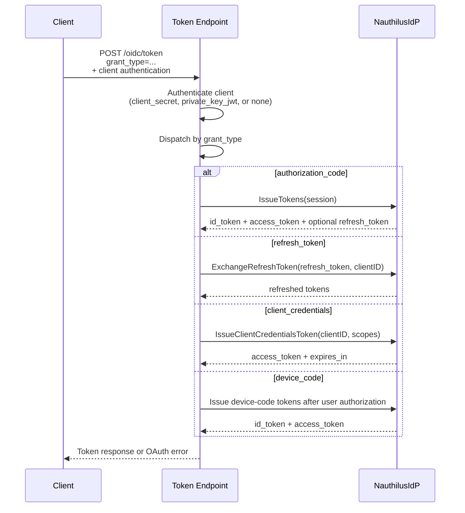
```mermaid
sequenceDiagram
    participant C as Client
    participant T as Token Endpoint
    participant I as NauthilusIdP

    C ->> T: POST /oidc/token<br/>grant_type=...<br/>+ client authentication
    T ->> T: Authenticate client<br/>(client_secret, private_key_jwt, or none)
    T ->> T: Dispatch by grant_type
    alt authorization_code
        T ->> I: IssueTokens(session)
        I -->> T: id_token + access_token + optional refresh_token
    else refresh_token
        T ->> I: ExchangeRefreshToken(refresh_token, clientID)
        I -->> T: refreshed tokens
    else client_credentials
        T ->> I: IssueClientCredentialsToken(clientID, scopes)
        I -->> T: access_token + expires_in
    else device_code
        T ->> I: Issue device-code tokens after user authorization
        I -->> T: id_token + access_token
    end
    T -->> C: Token response or OAuth error
```

### 8.2 Signing Abstraction

Token signing uses an OOP abstraction (`server/idp/signing`) that supports multiple algorithms via the `Signer` and
`Verifier` interfaces. Token issuance and `private_key_jwt` client assertion verification share this abstraction, but
they use different keys and directions: Nauthilus signs issued tokens with its IdP signing key, while it verifies client
assertions with each client's configured public key.

**Supported algorithms:**

| Algorithm | Type    | Status    | Use Case                           |
|-----------|---------|-----------|------------------------------------|
| RS256     | RSA     | Mandatory | Server-side token signing, default |
| EdDSA     | Ed25519 | Optional  | Client assertion verification      |

**Key interfaces:**

```go
// Signer signs JWT tokens.
type Signer interface {
    Sign(claims jwt.MapClaims) (string, error)
    Algorithm() string
    KeyID() string
    PublicKey() crypto.PublicKey
}

// Verifier verifies JWT tokens.
type Verifier interface {
    Verify(tokenString string) (jwt.MapClaims, error)
    Algorithm() string
}
```

The `MultiVerifier` tries multiple verifiers in order, enabling key rotation and multi-algorithm support.

### 8.3 Client Authentication Methods

Client authentication is abstracted via the `ClientAuthenticator` interface (`server/idp/clientauth`):

```go
type ClientAuthenticator interface {
    Authenticate(request *AuthRequest) error
    Method() string
}
```

#### 8.3.1 client_secret_basic / client_secret_post

The client sends its `client_id` and `client_secret` either via HTTP Basic Authentication or as POST form parameters.
The examples below use `client_credentials`, but the same authentication envelope is valid for other token endpoint
grants supported by the configured client.

```bash
# Basic Auth
curl -X POST https://issuer.example.com/oidc/token \
  -u "my-client:my-secret" \
  -d "grant_type=client_credentials" \
  -d "scope=api.read api.write"

# POST body
curl -X POST https://issuer.example.com/oidc/token \
  -d "grant_type=client_credentials" \
  -d "client_id=my-client" \
  -d "client_secret=my-secret" \
  -d "scope=api.read api.write"
```

#### 8.3.2 private_key_jwt (RFC 7523)

The client signs a JWT assertion with its private key and sends it as `client_assertion`. Nauthilus verifies the
assertion using the client's pre-registered public key before it processes the requested grant. This method does not use
mTLS and does not require a shared client secret to be stored by the server.

**JWT assertion requirements (per RFC 7523):**

| Claim | Value                                                                                         |
|-------|-----------------------------------------------------------------------------------------------|
| `iss` | Must match the `client_id`                                                                    |
| `sub` | Must match the `client_id`                                                                    |
| `aud` | Must be the endpoint URL that receives the assertion (`/oidc/token` or `/oidc/introspect`)    |
| `exp` | Expiration time; assertions should be short-lived, for example one to five minutes            |
| `jti` | Unique assertion identifier; required for one-time replay protection                          |

Nauthilus validates the assertion signature, `iss`, `sub`, `aud`, `exp`, `iat` and `nbf` when present, and `jti`. Client
assertions are one-time use within their validity window. Reusing the same `(client_id, audience, jti)` tuple fails as
`invalid_client`; a token-endpoint assertion and an introspection-endpoint assertion remain independent because the
endpoint audience is part of the replay scope. Replay markers are stored in Redis under the configured Redis prefix with
hashed keys, so raw client identifiers, endpoint URLs, and `jti` values are not embedded in Redis key names.

Assertion replay protection fails closed. If Redis is unavailable or the replay marker cannot be written, Nauthilus
rejects `private_key_jwt` client authentication with `invalid_client`. Assertions must have a short lifetime: the fixed
maximum is five minutes, with a 30 second clock-skew allowance. If `iat` is omitted, the remaining `exp` lifetime must
still fit within that bound.

`private_key_jwt` is a client authentication method, not a grant type. It is independent from PKCE; public-client PKCE
requirements still apply wherever Nauthilus classifies the client as public.

```bash
curl -X POST https://issuer.example.com/oidc/token \
  -d "grant_type=authorization_code" \
  -d "code=SplxlOBeZQQYbYS6WxSbIA" \
  -d "redirect_uri=https://app.example.com/callback" \
  -d "client_id=my-client" \
  -d "client_assertion_type=urn:ietf:params:oauth:client-assertion-type:jwt-bearer" \
  -d "client_assertion=eyJhbGciOiJSUzI1NiIs..."
```

For M2M clients the same authentication method can be used with the Client Credentials Grant:

```bash
curl -X POST https://issuer.example.com/oidc/token \
  -d "grant_type=client_credentials" \
  -d "client_id=m2m-service-pki" \
  -d "client_assertion_type=urn:ietf:params:oauth:client-assertion-type:jwt-bearer" \
  -d "client_assertion=eyJhbGciOiJSUzI1NiIs..." \
  -d "scope=api.read"
```

Client-credentials access tokens issued by Nauthilus are resource-bound to the protected backchannel API. JWT access
tokens carry `token_type=access_token` and `aud=nauthilus:backchannel`; opaque access tokens produce the same claims
after validation. Backchannel bearer authentication rejects tokens that do not carry that purpose and audience.
The `openid` scope is not valid for `client_credentials`; requests that include it fail with `invalid_scope` because
service tokens do not represent an end-user identity and cannot receive ID tokens or UserInfo claims.

### 8.4 Configuration

#### Client with client_secret authentication for client_credentials

```yaml
oidc:
  clients:
    - client_id: "m2m-service"
      client_secret: "super-secret-value"
      grant_types:
        - client_credentials
      scopes:
        - api.read
        - api.write
      access_token_lifetime: 1h
      token_endpoint_auth_method: client_secret_basic
```

#### Authorization Code client with private_key_jwt authentication (RS256)

```yaml
oidc:
  clients:
    - client_id: "web-app-pki"
      grant_types:
        - authorization_code
        - refresh_token
      redirect_uris:
        - "https://app.example.com/callback"
      scopes:
        - openid
        - profile
        - email
      require_pkce: true
      access_token_lifetime: 1h
      token_endpoint_auth_method: private_key_jwt
      client_public_key_algorithm: RS256
      client_public_key: |
        -----BEGIN PUBLIC KEY-----
        MIIBIjANBgkqhkiG9w0BAQEFAAOCAQ8A...
        -----END PUBLIC KEY-----
```

#### Client Credentials client with private_key_jwt authentication (EdDSA / Ed25519)

```yaml
oidc:
  clients:
    - client_id: "m2m-service-eddsa"
      grant_types:
        - client_credentials
      scopes:
        - api.read
      access_token_lifetime: 1h
      token_endpoint_auth_method: private_key_jwt
      client_public_key_algorithm: EdDSA
      client_public_key_file: /etc/nauthilus/keys/client-ed25519.pub
```

#### Configuration fields reference

| Field                         | Type       | Default                | Description                                                               |
|-------------------------------|------------|------------------------|---------------------------------------------------------------------------|
| `grant_types`                 | `[]string` | `[authorization_code]` | Allowed grant types for this client                                       |
| `token_endpoint_auth_method`  | `string`   | (any secret method)    | `client_secret_basic`, `client_secret_post`, `private_key_jwt`, or `none` |
| `require_pkce`                | `bool`     | `false`                | Require PKCE with `S256`; always required for public clients              |
| `client_public_key`           | `string`   | —                      | PEM-encoded public key (inline) for `private_key_jwt`                     |
| `client_public_key_file`      | `string`   | —                      | Path to PEM file containing the public key                                |
| `client_public_key_algorithm` | `string`   | `RS256`                | Algorithm for the client's public key (`RS256` or `EdDSA`)                |

### 8.5 Token Response

The Client Credentials Grant returns only an access token (per RFC 6749 §4.4.3):

```json
{
  "access_token": "eyJhbGciOiJSUzI1NiIs...",
  "token_type": "Bearer",
  "expires_in": 3600
}
```

No `id_token` or `refresh_token` is included in the response.

### 8.6 Package Structure

```
server/idp/
├── signing/
│   ├── signer.go           # Signer/Verifier interfaces, RS256 + EdDSA implementations
│   └── signer_test.go      # Unit tests for all signing/verification paths
├── clientauth/
│   ├── authenticator.go    # ClientAuthenticator interface, ClientSecret + PrivateKeyJWT
│   └── authenticator_test.go # Unit tests for all authentication methods
└── nauthilus_idp.go         # IssueClientCredentialsToken method
```

## 9. Device Authorization Grant (RFC 8628)

The Device Authorization Grant (also known as "Device Code Flow") enables OAuth 2.0 authorization on input-constrained
devices that cannot use a browser directly — such as CLI tools, smart TVs, IoT devices, or headless servers.

### 9.1 Overview

The flow delegates user authentication to a separate device with a full browser. The input-constrained device displays a
short user code and a verification URL. The user opens that URL on another device (e.g., smartphone or laptop), enters
the code, and authenticates. Meanwhile, the original device polls the token endpoint until authorization is complete.

**Key benefits:**

- No credential entry on the constrained device itself
- MFA-compatible (authentication happens in a full browser)
- Ideal for CLI-based OAuth2 authentication (e.g., `nauthilus-client`)
- Enables XOAUTH2/OAUTHBEARER for mail clients without embedded browsers

### 9.2 Signal Flow

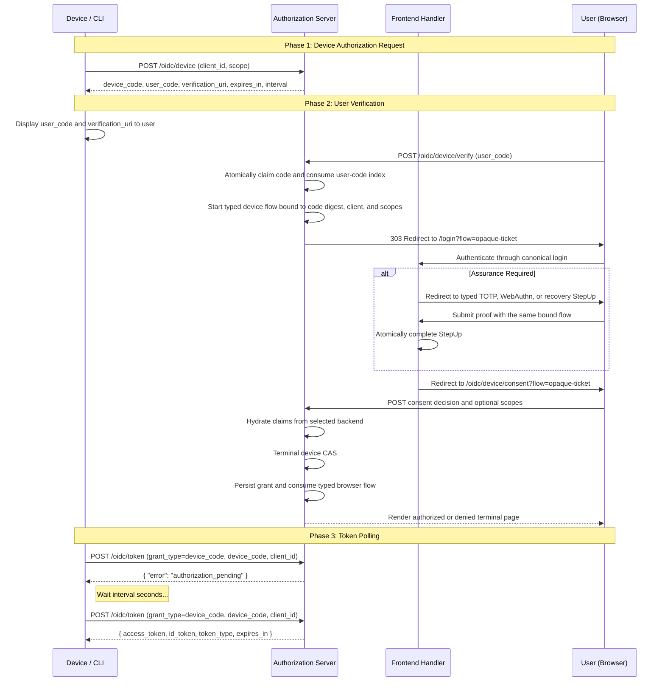
```mermaid
sequenceDiagram
    participant D as Device / CLI
    participant AS as Authorization Server
    participant F as Frontend Handler
    participant U as User (Browser)
    Note over D, U: Phase 1: Device Authorization Request
    D ->> AS: POST /oidc/device (client_id, scope)
    AS -->> D: device_code, user_code, verification_uri, expires_in, interval
    Note over D, U: Phase 2: User Verification
    D ->> D: Display user_code and verification_uri to user
    U ->> AS: POST /oidc/device/verify (user_code)
    AS ->> AS: Atomically claim code and consume user-code index
    AS ->> AS: Start typed device flow bound to code digest, client, and scopes
    AS ->> U: 303 Redirect to /login?flow=opaque-ticket
    U ->> F: Authenticate through canonical login
    alt Assurance Required
        F ->> U: Redirect to typed TOTP, WebAuthn, or recovery StepUp
        U ->> F: Submit proof with the same bound flow
        F ->> F: Atomically complete StepUp
    end
    F ->> U: Redirect to /oidc/device/consent?flow=opaque-ticket
    U ->> AS: POST consent decision and optional scopes
    AS ->> AS: Hydrate claims from selected backend
    AS ->> AS: Terminal device CAS
    AS ->> AS: Persist grant and consume typed browser flow
    AS -->> U: Render authorized or denied terminal page
    Note over D, U: Phase 3: Token Polling
    D ->> AS: POST /oidc/token (grant_type=device_code, device_code, client_id)
    AS -->> D: { "error": "authorization_pending" }
    Note right of D: Wait interval seconds...
    D ->> AS: POST /oidc/token (grant_type=device_code, device_code, client_id)
    AS -->> D: { access_token, id_token, token_type, expires_in }
```

### 9.3 Endpoints

#### 9.3.1 Device Authorization Endpoint

**`POST /oidc/device`**

The device initiates the flow by requesting a device code and user code.

**Request parameters:**

| Parameter   | Required | Description                    |
|-------------|----------|--------------------------------|
| `client_id` | Yes      | The registered client ID       |
| `scope`     | No       | Space-separated list of scopes |

**Response (200 OK):**

```json
{
    "device_code": "2jGkLr1YKz8mN4pQwXvB...",
    "user_code": "ABCD-EFGH",
    "verification_uri": "https://issuer.example.com/oidc/device/verify",
    "expires_in": 600,
    "interval": 5
}
```

**Error responses:**

| HTTP Status | Error Code            | Condition                                     |
|-------------|-----------------------|-----------------------------------------------|
| 400         | `invalid_request`     | Missing `client_id`                           |
| 401         | `invalid_client`      | Unknown client                                |
| 400         | `unauthorized_client` | Client does not have `device_code` grant type |

#### 9.3.2 Device Verification Endpoint

**`POST /oidc/device/verify`**

The user submits only the displayed user code. The canonical device handler claims that code exactly once and then
redirects to the shared canonical login flow. Credentials are never accepted by the device-code entry endpoint.

**Request parameters:**

| Parameter   | Required | Description                           |
|-------------|----------|---------------------------------------|
| `user_code` | Yes      | The user code displayed by the device |

**Behavior:**

The claim operation removes the user-code index and locks the pending device request in one Redis transaction. The
typed browser flow retains only a non-reversible user-code digest and the validated device/client/scope binding. The
shared login and MFA policy then establish identity and assurance before device consent can be loaded.

**Error responses:**

| HTTP Status | Error Code        | Condition                    |
|-------------|-------------------|------------------------------|
| 400         | `invalid_request` | Missing required parameters  |
| 400         | `invalid_grant`   | Invalid or expired user code |
| 400         | `expired_token`   | Device code has expired      |
| 409         | conflict          | Claimed, replayed, or mismatched code |

**Security note:** The user code is normalized (uppercased, hyphens/spaces removed) before lookup, so users can enter
it in any format (e.g., `abcd-efgh`, `ABCDEFGH`, or `ABCD EFGH`).

#### 9.3.3 Device Consent Endpoint

**`GET /oidc/device/consent`**

Renders the consent page for the device code flow. The page displays the client name and requested scopes, allowing
the user to accept or deny the authorization.

**`POST /oidc/device/consent`**

Processes the bound user's consent decision. On acceptance, optional scopes may only narrow the original scope set;
claims are hydrated through the selected backend and the terminal device CAS publishes `authorized`. On denial, the
same terminal CAS publishes `denied`. Replay is rejected.

**Request parameters:**

| Parameter        | Required | Description                                      |
|------------------|----------|--------------------------------------------------|
| `submit`         | Yes      | `allow` or `deny`                                |
| `optional_scope` | No       | Repeated checked optional scopes; cannot expand |

Remembered consent is a typed `ConsentGrant` bound to identity reference, client ID, normalized scopes, grant time,
and grant expiry. It is not browser-session data.

#### 9.3.4 Token Endpoint (Device Code Grant)

**`POST /oidc/token`**

`GET /oidc/token` is optional and disabled by default. Enable only when needed via:

```yaml
identity:
    oidc:
        token_endpoint_allow_get: true
```

The device polls this endpoint until the user completes authorization.

**Request parameters:**

| Parameter     | Required | Description                                            |
|---------------|----------|--------------------------------------------------------|
| `grant_type`  | Yes      | Must be `urn:ietf:params:oauth:grant-type:device_code` |
| `device_code` | Yes      | The device code from the authorization response        |
| `client_id`   | Yes      | The registered client ID                               |

**Polling responses (per RFC 8628 §3.5):**

| HTTP Status | Error Code              | Meaning                                  |
|-------------|-------------------------|------------------------------------------|
| 400         | `authorization_pending` | User has not yet completed authorization |
| 400         | `slow_down`             | Client is polling too frequently         |
| 400         | `expired_token`         | Device code has expired                  |
| 400         | `access_denied`         | User denied the authorization request    |

**Success response (200 OK):**

```json
{
    "access_token": "eyJhbGciOiJSUzI1NiIs...",
    "token_type": "Bearer",
    "expires_in": 3600,
    "id_token": "eyJhbGciOiJSUzI1NiIs...",
    "refresh_token": "na_rt_..."
}
```

The `id_token` is included when `openid` is in the requested scopes. The `refresh_token` is included when
`offline_access` is in the requested scopes. If `revoke_refresh_token` is disabled, refresh responses reuse the
existing refresh token and therefore do not return a new `refresh_token`.

### 9.4 Configuration

#### Client configuration for device code flow

```yaml
oidc:
    clients:
        -   client_id: "cli-tool"
            client_secret: "cli-secret"
            grant_types:
                - urn:ietf:params:oauth:grant-type:device_code
            scopes:
                - openid
                - email
                - offline_access
            redirect_uris: [ ]
            access_token_lifetime: 1h
```

#### Global device code settings

```yaml
oidc:
    device_code_expiry: 10m              # How long a device code remains valid (default: 10m)
    device_code_polling_interval: 5      # Minimum polling interval in seconds (default: 5)
    device_code_user_code_length: 8      # Length of the user code characters (default: 8)
```

#### Configuration fields reference

| Field                          | Type       | Default | Description                                     |
|--------------------------------|------------|---------|-------------------------------------------------|
| `device_code_expiry`           | `duration` | `10m`   | TTL for device codes in Redis                   |
| `device_code_polling_interval` | `int`      | `5`     | Minimum seconds between client polling attempts |
| `device_code_user_code_length` | `int`      | `8`     | Number of characters in the generated user code |

### 9.5 Discovery

The device authorization endpoint is advertised in the OpenID Connect Discovery document:

```json
{
    "device_authorization_endpoint": "https://issuer.example.com/oidc/device",
    "response_types_supported": ["code"],
    "grant_types_supported": [
        "authorization_code",
        "refresh_token",
        "client_credentials",
        "urn:ietf:params:oauth:grant-type:device_code"
    ]
}
```

### 9.6 Security Considerations

- **User code charset:** Uses uppercase letters excluding visually ambiguous characters (O, I, L) and digits (0, 1) to
  reduce user input errors.
- **Polling rate limiting:** The `slow_down` error is returned when a client polls faster than the configured interval,
  per RFC 8628 §3.5.
- **One-time use:** The user-code index is consumed when the browser claims it; the device record then permits only one
  terminal pending-and-locked to authorized-or-denied CAS, and successful token polling consumes the result.
- **Encryption at rest:** Device code data in Redis is encrypted using the configured Redis security manager
  (ChaCha20-Poly1305 when an encryption secret is set).
- **Expiration:** Device codes automatically expire in Redis after the configured TTL.
- **Authentication on verification:** Verification redirects into the canonical login flow. The device entry endpoint
  itself accepts no credentials.
- **MFA enforcement:** When a user has MFA configured (TOTP or WebAuthn), the device code verification endpoint enforces
  MFA before authorizing the device. The MFA flow reuses the shared login infrastructure, ensuring consistent security
  policies across all grant types.
- **Consent enforcement:** The device code flow enforces user consent unless the client has `skip_consent` configured.
  Remembered decisions are scope-bounded typed grants, not browser cookie fields.

### 9.7 Package Structure

```
server/core/cookie/
├── envelope.go                # Authenticated opaque v1 browser envelope
├── canonical_middleware.go    # Protocol-entry and continuation checkpoints
├── runtime.go                 # SessionAnchor lifecycle and tombstone-first revocation
├── login_completion.go        # Identity publication and handle rotation
└── step_up_completion.go      # Revision-bound assurance completion
server/sessionstate/
├── contracts.go               # SessionAnchor and typed child record contracts
├── redis_store.go             # Atomic indexed commits, consumes, and revocation
├── consent_grant.go           # Identity-client-scope-bound remembered consent
└── keyspace.go                # Fixed current-v1 owner keyspace
server/idp/
├── device_code.go             # Atomic user-code claim and terminal device CAS
└── redis_storage.go           # Authorization-code and token-family storage
server/idp/flow/
├── state.go                   # Protocol-neutral state and canonical metadata bindings
├── typed_store.go             # Typed OIDC/SAML persistence and atomic consume
├── protocol_aggregate.go      # Parent-flow load and transition composition
├── controller.go              # Policy-controlled lifecycle transitions
├── policy.go                  # Allowed transitions per flow type
└── transition_audit.go        # Audit logging for state changes
server/handler/frontend/idp/
├── canonical_runtime.go       # Canonical runtime composition
├── frontend.go                # Canonical frontend route registrar and login UI
├── canonical_oidc_authorization.go # Authorize, consent, code issuance, and tracking
├── canonical_oidc_device.go   # Device verification, consent, claims, and terminal publish
├── canonical_saml.go          # SSO request binding, assertion, and single-use completion
├── canonical_mfa_selection.go # Parent-bound assurance selection
├── canonical_totp*.go         # TOTP verification and enrollment
├── canonical_webauthn*.go     # WebAuthn ceremonies and enrollment
├── canonical_recovery*.go     # Recovery verification and enrollment
├── canonical_self_service.go  # Authenticated self-service operations
├── oidc.go                    # Sole OIDC registrar plus cookie-free backchannels and logout fanout
└── saml.go                    # Sole SAML registrar, metadata, and canonical SLO
```
